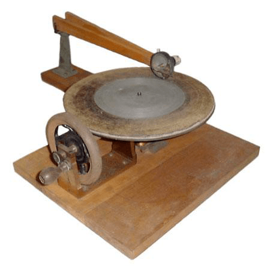
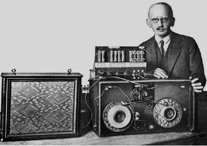

# 1.1 音频基础

**数字音频技术（DAT [Digital Audio Tech]）** 是当代计算机音像学的基础综合科学。其代指一系列，以 **电-力-声类比（Electrical-Mechanical-Acoustic Analogy）** 、 **心理声学模型（Psychoacoustics Model）** 等数学工具对声音进行记录、转换、存储、编解为可由挂载数字音频设备处理、播放、操作的数据，的方法论。它是一门包含了 **心理声学（Psychoacoustics）** 、 **电声学（Electroacoustics）** 、 **数字信号处理（DSP [Digital Signal Processing]）** 等领域知识的复合学科。

## **早期的探索与积累**

人类对声音的探索从诞生伊始就伴随着文化和科技的发展，贯穿于历史长河之中。但以可持续化存储保存为目的，并系统性的总结为科学体系，还要从 **音频录制（Audio Recording）** 技术的出现开始，一直持续至今。由于历史跨度和分界相对明显，学界公认采用以音频存储介质的更替，来作为不同时代的划分。依此，当下总共经历了 4 个大的时期：

- **唱筒时代【物理介质】**（The Phonograph era，1877 ～ 1925）
- **唱片时代【物理介质】**（The Gramophone era，1925 ～ 1945）
- **磁带时代【磁力介质】**（The Magnetic era，1945 ～ 1975）
- **数字处理时代**（The Digital era，1975 ～ Present）

## **唱筒时代（物理介质）**

1857 年，由法国科学家 **斯科特· 德· 马丁维尔（Scott de Martinville）** 发明声波记振仪，实现了将自然界中物理声音保存到留声媒介上，使人们首次完成了对声音信号的长时间保存。开启了物理媒介时代。当时声波记振仪的主要应用是用来辅助声学研究，通过仪器虽然能够绘制被录制声音的声波线，却无法再将声波线还原为音频回放。不过，这样的探索却为了后续提供了前置物理基础。

<figure>
   
    <figcaption>
      
图 1.1.1-1 声波记振仪记录的首个音频振幅信号

   </figcaption>
</figure>

在 1877年，托马斯·爱迪生基于声波记振仪原理，和与贝尔竞争发明电话过程中的启发，发明了第一台 **留声机（Phonograph）** 。逆向思维解决了回放的问题。

留声机通过类似声波记振仪的运行方式，通过摆动式金属唱针，将录制的音频刻画在配套裹有锡箔纸的金属圆桶上。通过收音喇叭录制声音的同时，转动手摇把，推动锡纸移动，来记录保存声音到桶上对应螺纹声波线里。因此，回放时，只需要将录制用的金属探针更换为轻压弹簧探针后，从开始录制位置，手摇转动把推动锡箔纸，按录制方向旋转推移，就能够得到保存的音频回放了。不过第一代原型机，存在留声时间短，且音量不足，声音不清晰的问题。因此，在 1897 年发布的第二代留声机中，爱迪生使用了蜡筒代替了锡箔纸，让录制变为了可重复的过程。并通过增加了发条传动机制，剔除了人为摇动传动杆不匀速，引入的失真问题。二代在扩音器上使用了耳蜗结构大喇叭，物理提高了收扩音效果。

即便如此，二代留声机也因为无法复制拷贝留音，而最终以无法普及的失败告终。

这让人们逐渐意识到，单纯的录制，是无法满足人们对音频的需求的。人们开始寻找一种能够便于拷贝，且能高质量保存声音的手段。

## **唱片时代（物理介质）**

其实早在初代留声机蓬勃发展的后几年，唱片就已经开始流传了。1887 年德裔美国工程师艾米利·伯林纳，发明了 **圆盘式留声机（Gramophone）** 和 **唱片（Gramophone Record）** 。但是由于早期唱片先是面临了复刻问题，后虽然通过涂蜡锌板和镀金母版解决了量产问题，可却因为成本问题并不能被大众接受。直到 1891 年，伯林纳发现通过虫胶作为原材料，能达到和植物橡胶等同的保存水平，并具有高可塑性的特点，才最终解决了量产和成本问题。

<figure>
   
    <figcaption>
      
图 1.1.1-2 首个手摇式圆盘唱片机（Gramophone）

   </figcaption>
</figure>

于是，1893年，伯林纳和其合作伙伴共同于美国、英国、德国，先后成立了 **留声机公司（Gramophone Company）** ，制作销售圆盘式留声机并灌录唱片。这就是后来业界顶顶大名（中古黑胶铁烧）的 RCA、EMI（Electric&Musical Industries Ltd.）、DG 公司的前身。从此正式开启了与唱筒留声机的竞争。

<figure>
   
    <figcaption>
      
图 1.1.1-3 早期黑胶唱片（Gramophone/Vinyl Record）示意图

   </figcaption>
</figure>

直到 1929 年，随着爱迪生停止了最后一条唱筒生产线，唱片类型留声机因其高效、高保真（在当时看来）、高性价比和高量产的特性，彻底的击败了唱筒时代。

但看似已然立于不败之地的唱片，也仍然存在各种各样的问题。其中最致命的莫过于，唱片本身保存所需要占用的物理空间，有些过大了。换一种更为科学的表述就是，唱片本身的物理信息密度仍然不够小。这便是它的阿喀琉斯之踵。

## **磁带时代（磁力介质）**

20世纪30年代，德国“法尔本”和“无线电信”两家公司的工程师们发明了一种有氧化铁涂层的塑料带，创造出了 **磁带（Magnetic Type）** 的雏形。但由于三氧化二铁本身化学特性，使得录制的声音因材质均匀程度偏差导致了部分失真问题，而无法与唱片抗衡。直到1947年，美国人马文·卡姆拉斯对原有的三氧化二铁磁带进行了改善。卡姆拉斯采用了一个完整的磁性线圈来代替录制磁头，使用一根钢丝（后来工程优化成为了磁针）嵌入到磁线圈中。利用空气作为缓冲，以磁场频震间接录制音频，从而保证了线圈磁力不会干扰到信号的录制。这使得磁带记录所得音频数据，较改进之前的响度有了4倍左右的提升。不过，随之而来的是复杂工艺带来的成本问题。

<figure>
   
    <figcaption>
      
图 1.1.1-4 早期磁带机（Tape Drive）示意图（糟糕的大小）

   </figcaption>
</figure>

这个邻人绝望的情况，直到1963年，才由来自飞利浦公司的荷兰工程师 **劳德维克·卢·奥滕斯（Lou Ottens）** 解决。奥滕斯受到了 RCA 的 **“音频盒子”（Sound Tape Cartridge）** 启发，通过缩减存储时长和采用多年迭代而来的更先进磁性塑料软带材质，推出了 **卡式磁带（Cassette Tape）** 。极大的缩减了磁带保存音频的空间体积，使得一般客户有了更大的意愿来使用这种便携的音频存储媒介。

<figure>
   
    <figcaption>
      
图 1.1.1-5 卡式磁带（Cassette Type）示意图

   </figcaption>
</figure>

而随着 1964 年，察觉到卡式磁带革命性成果的飞利浦，乘势而为的推出了可自由录音的便携式磁带录音机后，由黑胶唱片所主导的最后一片大众音频阵地，也正式宣告被磁带所取代。

值得庆幸的是，因为黑胶唱片的物理录入和存储特性，使得它再音质还原上，能够较好的稳定保存录制时的音轨特征。从而让众多高质量唱片公司仍然愿意为新颖的歌手专辑，推出黑胶介质。让黑胶唱片在音乐发烧友等群体中，延续了较高的认同，从而避免了像唱筒一般，被彻底淘汰的命运。

之后，磁带登临主流，在 19世纪 70 年代至 80 年代间，得到了快速发展。以索尼（Sony）Walkman 系列为代表，造就了集磁带和便携随身听技术于一身的全世界范围的风靡。

但是，好景不长。数字时代随着 CD 进入大众视野，在短期内极大的抢占了原磁带的消费级音频市场。

## **数字处理时代**

值得一提的是，磁带虽然淡出了主流视线，但是因为其本身的可靠存储特性，仍然被拥有大量数据的团体和公司，作为最为可靠的数据备份方式而使用着。这让磁带仍然在纯粹的数据持续化存储方面，保有了巨大活力。大公司往往也不吝惜对此投入，例如 2015 年 IBM 和富士影视（Fuji Film）就共同研发推出了高达 220TB 存储量的单盒存储磁带，其成本仅为同类型硬盘十五分之一。

近几年，磁带存储保有存储量发展，也仍然保持了每年越 32%~37% 的增速，成为了在摩尔定律逐步失效背景下，仍然满足摩尔定律，并久经考验的信息存储技术。
可见，未来随着大数据模型和各种存储骤增的前提下，长效存储的磁带，短时间内必然是不会退出历史舞台的。

其实，到这里我们能够发现，音频的数字时代似乎并不是一种标的于存储媒介的物理类型的一种分类。数字时代音频，更多的是对音频本身的保存方式抽象手段，进行的一种分代。即介质本身，已经不在被认为是区分时代差异的关键点，而各类压缩算法的突破，则成为了真正的关键。

在 CD 时代伊始，音频的格式就从传统的纯物理记录方式，演变成了调制解调（PCM）配合格式压缩存储的处理过程。这正是数字时代和以往传统时代相比，最为显著的特征。

因此，想要理解并处理音频，首先就需要了解如何简单衡量音频。

[ref]: References_1.md