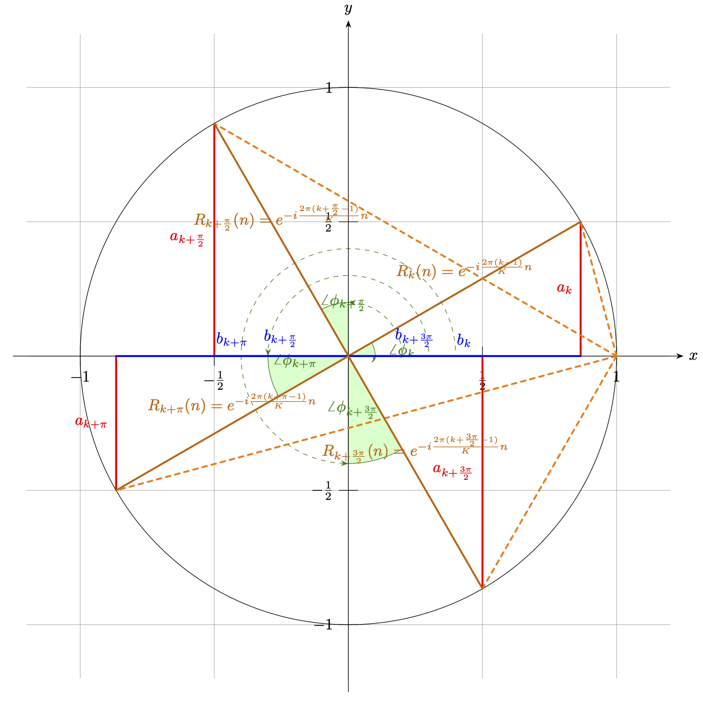
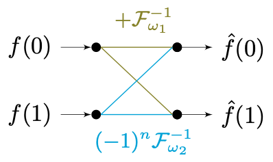
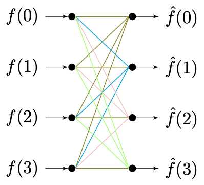
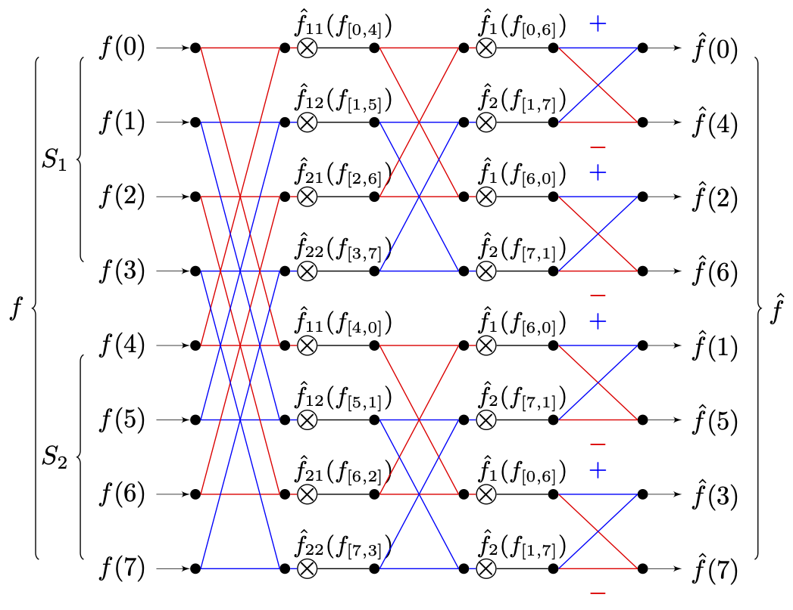
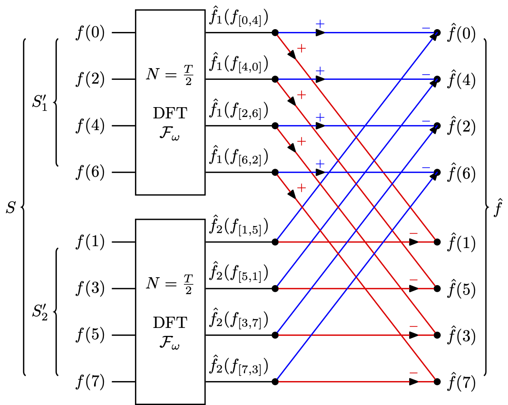
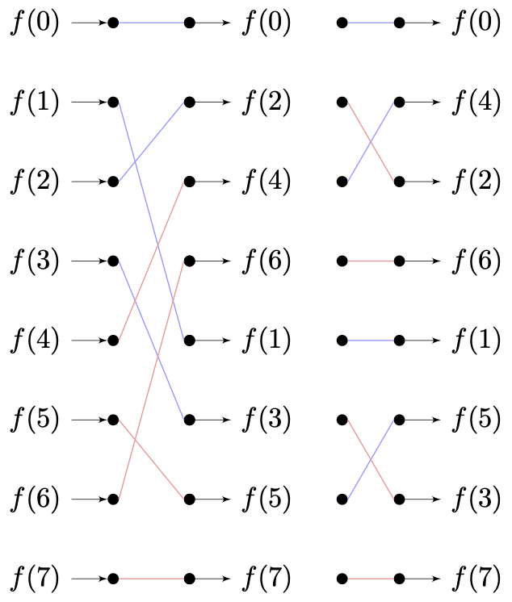
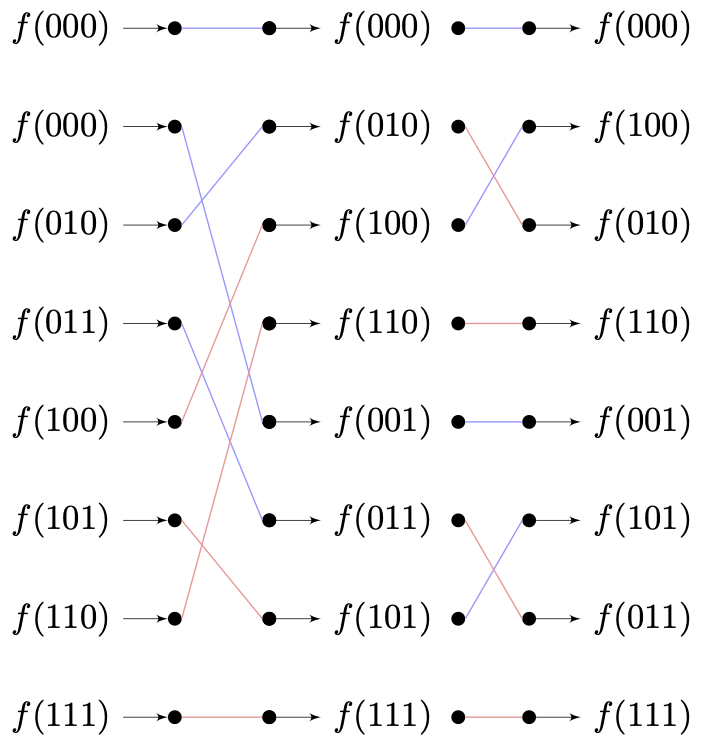

# 1.1.3 快速傅立叶（FFT [Fast Fourier Transform]）

**快速傅立叶是对离散傅立叶的数学逼近。其旨在通过有限点的分布拟合，快速逼近离散傅立叶变换结果。**

快速傅立叶变换最早由 **高斯（Carl Friedrich Gauss，1777 - 1855）** 为了解决天文学中有关于智神星（Pallas）和婚神星（Juno）的位姿计算问题，而在 1805 年提出的 [\[8\]][ref] [\[9\]][ref] 。不过由于种种意料之外的因素，让该论文并没有被及时的发表。因此，论文在当时也没有获得太多的关注。直到计算机开始兴起，有关傅里叶变换等算法的更为低时间复杂度的要求变的迫切，才让后续研究者们又一次察觉到了这一篇文献（以及包括 19 世纪中叶和 20 世纪初的旁类研究）的贡献 [\[9\]][ref] 。

1965 年，来自 IBM 普林斯通实验室的 **詹姆士·库利（James Cooley）** 和来自普林斯通大学的 **约翰·图奇（John Tukey）** 教授，联合发表了基于快速傅里叶变换的机器实现 [\[10\]][ref] ，首次将该算法迁移到了计算机上。他们的研究提出了，通过采用分治法的思想来减少变换所需步数。这成功的使得，多维信号分析所用的傅立叶算法的时间复杂度算法，降至 。促进了数字信号处理（DSP）和计算机图形学的技术更新 [\[11\]][ref] 。所以，为纪念两位的贡献，**这套程序化的快速傅里叶变换（FFT [Fast Fourier Transform]）方法论** ，被称为 **库利-图奇算法（Cooley-Tukey Algorithm）** 。**库利-图奇算法目标是一维信号**，不过高维信号是可以被拆解为低维信号的向量积的，因此 **并不影响其泛化** 。

在库利-图奇算法提出的时候，分治法已经被广泛的用来做计算机数组求最大值（Max）和排序（Sort）的处理当中。虽然离散的数组和周期信号之间，在信息密度和特征上存在较大差异。但如果考虑到周期信号沿传播维度重复，和傅里叶变换傅里叶基的特征，会发现：

如果将一维信号离散傅里叶变换的有限基底函数族 $$\mathcal {F}_{\omega}$$ 构成的傅里叶基看作最小元，那么对其在时域上进行分组重排，也是可行的。从而使信号的一组基底函数基，能够以树状结构分类，并拆解特征表示原信号函数。

这就是库利-图奇算法的关键，在后续的算法的演进过程中逐步被提炼，形成了时域抽取这一核心概念 [\[11\]][ref] 。

## **时域抽取（DIT [Decimation-in-Time]）**

**时域抽取（DIT [Decimation-in-Time]）是从时域（TD [Time Domain]）对一维信号进行可逆解构的一种数学工具。** 它的工作流包含有两个阶段：

**分组离散傅立叶（Grouped DFT）** 和 **旋转因子转换（Rotation Factor Convert）**

<br>

## **时域抽取 - 分组离散傅立叶（Grouped DFT）**

**分组离散傅立叶（Grouped DFT）** 是指，在信号的单个周期 $$T$$ 内，以等间距有限次取  个原始离散采样后。将周期内所有采样点信息以 $$step =\tfrac {T}{K} = N$$ 的步长等分，得到 $$K$$ 组顺序连续的子采样分组，依照组别记为样本子集 $$[S_1,S_2,\ ...\ , S_K]$$ 。每组子集都有 $$S_k \in [f_k((k-1) \cdot N),\ f_k(k \cdot N))$$ 的样本取样区间。

此时，记组内索引为 $$n$$ ，有 $$n \in [1,\ N]$$ 。按照顺序从各组中，取组内索引位置为 $$n$$ 的元素，组成包含数据量为 $$\mathcal {F}_{\omega_n}$$ 的基底函数 $$\mathcal {F}_{\omega_n}$$ 的波峰数组。可以逐个拟合，得到一组当前一维信号的有限基底函数族 $$\mathcal {F}_{\omega} = [\mathcal {F}_{\omega_1}, \mathcal {F}_{\omega_2},\ ...\ ,\mathcal {F}_{\omega_N}]$$ ，记为当前解的最小傅立叶基。根据一维离散傅立叶变换有：

$$
{\displaystyle 
 \begin{aligned}
   \mathcal {F}_{\omega} = [\mathcal {F}_{\omega_1},\mathcal {F}_{\omega_2},& \ ...\ ,\mathcal {F}_{\omega_N}] \quad \quad T = NK \\
   \hat{f}(\omega) = \sum_{t = 0}^{T} f(t) \cdot e^{-i \omega t}  \ \ \ \ \ &\Leftrightarrow \ \ \ \ \ 
   f(t) = \frac{1}{K} \sum_{\omega_0}^{\omega_N} \hat{f}(\omega) \cdot \mathcal {F}_{\omega}(t) \\
 \end{aligned}
}
$$

又因 $${\omega_n} = \tfrac{2\pi n}{T}$$ ，强度系数 $$\hat{f}(\omega)$$ 与 $$f(t)$$ 的关系，可以被转换为 $$\hat{f}(n)$$ 与 $$f(t)$$ 的关系：

$$
{\displaystyle 
 \begin{aligned}
   \hat{f}(\omega) = \sum_{t = 0}^{T} f(t) \cdot e^{-i \omega t} &\rightarrow \hat{f}(n)  =\sum_{t = 0}^{T} f(t) \cdot e^{-i \tfrac{2\pi n}{T} t } \\
   f(t) = \frac{1}{N} \sum_{\omega_0}^{\omega_{N}} \hat{f}(\omega) \cdot \mathcal {F}_{\omega}(t)  &\rightarrow f(t) = \frac{1}{N} \sum_{n=1}^{N} \hat{f}(n) \cdot \mathcal {F}_{\omega}(t) \\
   \hat{f}(n)  =\sum_{t = 0}^{T} f(t) \cdot e^{-i \tfrac{2\pi n}{T} t }  \quad \quad &\Leftrightarrow \quad \quad
   f(t) = \frac{1}{N} \sum_{n=1}^{N} \hat{f}(n) \cdot \mathcal {F}_{\omega}(t)
 \end{aligned}
}
$$

带入 $$K$$ 分组情况（ $$T = NK$$ ），上式可化为：

$$
{\displaystyle 
 \begin{aligned}
   \hat{f}(n)  =\sum_{k=1}^{K}\sum_{(k-1)N}^{t = kN-1} f(t) \cdot e^{-i \tfrac{2\pi n}{T} t }  \quad \quad &\Leftrightarrow \quad \quad
   f(t) = \frac{1}{N} \sum_{n=1}^{N} \hat{f}(n) \cdot \mathcal {F}_{\omega}(t)
 \end{aligned}
}
$$

即强度系数 $$\hat{f}(n)$$ 存在展开式：

$$
{\displaystyle 
 \begin{aligned}
   \hat{f}(n)  &= \sum_{k=1}^{K}\sum_{(k-1)N}^{t = kN-1} f(t) \cdot e^{-i \tfrac{2\pi n}{T} t } \\
               &= \sum_{t=0}^{N-1} f(t) \cdot e^{-i \tfrac{2\pi t}{T} \cdot n } 
                     + \sum_{t=N}^{2N-1} f(t) \cdot e^{-i \tfrac{2\pi t}{T} \cdot n } 
                     + \ ...\ 
                     + \sum_{(K-1)N}^{t=KN-1} f(t) \cdot e^{-i \tfrac{2\pi t}{T} \cdot n } \\
               &= \sum_{t=0}^{N-1} f(t) \cdot e^{-i \tfrac{2\pi t}{T} \cdot n } 
                     + \sum_{t=0}^{N-1} f(t+N) \cdot e^{-i \tfrac{2\pi (t+N)}{T} \cdot n } 
                     + \ ...\ 
                     + \sum_{t=0}^{N-1} f(t + (K-1)N) \cdot e^{-i \tfrac{2\pi (t + (K-1)N)}{T} \cdot n } \\
               &= \sum_{k=1}^{K} \sum_{t=0}^{N-1} f(t+ (k-1)N) \cdot e^{-i \tfrac{2\pi t}{T} n } \cdot e^{-i \tfrac{2\pi (k-1)}{K} n } \\
 \end{aligned}
}
$$

**要点就出现在这里**，此时，由于有限基底函数族 $$\mathcal {F}_{\omega} = [\mathcal {F}_{\omega_1}, \mathcal {F}_{\omega_2},\ ...\ ,\mathcal {F}_{\omega_N}]$$ 的拟合样本选取自各个分组的对应角标数据，则显然任意 $$\mathcal {F}_{\omega_i}$$ 的周期都有 $$T_i = \tfrac{2\pi n}{\omega_i} \geq N$$ 且必然有 $$T_i \mod N = 0$$ 。因此，强度系数 $$\hat{f}(n)$$ 关于 $$k$$ 的展开式能进一步精简为：

$$
{\displaystyle 
 \begin{aligned}
   \hat{f}(n)  &= \sum_{k=1}^{K} (\sum_{t=0}^{N-1} f(t+ (k-1)N) \cdot e^{-i \tfrac{2\pi t}{T} n }) \cdot e^{-i \tfrac{2\pi (k-1)}{K} n } \\
               &= \sum_{k=1}^{K} e^{-i \tfrac{2\pi (k-1)}{K} n } \cdot [\sum_{(k-1)N}^{kN-1} \vert_t \ f(t) \cdot  \mathcal {F}_{\omega}^{-1}(tn) \quad ] \\
 \end{aligned}
}
$$

记 $$\hat{f}_k(n) =\sum_{(k-1)N}^{kN-1} \vert_t \ f(t) \cdot  \mathcal {F}_{\omega}^{-1}(tn)$$ ，则 $$\hat{f}_k(n)$$ 即为分组样本子集 $$[S_1,S_2,\ ...\ , S_K]$$ 在自己的分组样本区间 $$S_k \in [f_k((k-1) \cdot N),\ f_k(k \cdot N))$$ 内，进行离散傅里叶变换的分组强度系数结果。而 $$e^{-i \tfrac{2\pi (k-1)}{K} n }$$ 在样本顺序 $$n$$ 给定时，只与所处分组的组序 $$k$$ 有关，且本身在三角函数空间表现为 $$n(k-1)$$ 的角度固定值，所以我们记其为旋转因子（Rotation Factor） $$R_k(n) = e^{-i \tfrac{2\pi (k-1)}{K} n }$$ 。

将 $$\hat{f}_k(n)$$ 、 $$R_k(n)$$ 带入 $$\hat{f}(n)$$ ，则 $$\hat{f}(n)$$ 最终表现为：

$$
{\displaystyle 
 \begin{aligned}
   R_1(n) & = 1 \\
   \hat{f}(n)  &= \sum_{k=1}^{K} R_k(n) \cdot \hat{f}_k(n) = R_1(n) \cdot \hat{f}_1(n) +  R_2(n) \cdot \hat{f}_2(n) + \ ...\ + R_K(n) \cdot \hat{f}_K(n) \\
   \hat{f}(n)  &= \hat{f}_1(n) +  R_2(n) \cdot \hat{f}_2(n) + \ ...\ + R_K(n) \cdot \hat{f}_K(n)  \\
 \end{aligned}
}
$$

**上式就是时域抽取（DIT）有关分组离散傅立叶（Grouped DFT）的通用完整过程**。单从公式来看，由于切割了样本集，我们只能通过分组离散傅立叶（Grouped DFT）直接求得原一维信号前 $$N$$ 个信号量的傅里叶解。反而因为样本不足的问题，无法直接求得剩余的 $$(K-1)N$$ 个信号量。

>那么我们大费周章的这么做有什么用处呢？原因就在于旋转因子间是存在关系的。

## **时域抽取 - 旋转因子转换（Rotation Factor Convert）**

这个问题，需要从复变函数的三角函数特性来回答。记 $$R_k(n)$$ 变换到三角函数域，其实部为 $$a_k$$ ，虚部为 $$b_k$$ 。则 $$R_k(n)$$ 可以表示为：

$$
{\displaystyle 
 \begin{aligned}
   R_k(n) &= e^{-i \tfrac{2\pi (k-1)}{K} n } \\
          &= a_k \cdot cos(\tfrac{2\pi (k-1)}{K} n) + i \cdot b_k \cdot sin(\tfrac{2\pi (k-1)}{K} n) \ dt \\
 \end{aligned}
}
$$

依此，取 $$a_k$$ 为 $$y$$ 轴、 $$b_k$$ 为 $$x$$ 轴。我们假设分组 $$K = 2^m$$ ，信号周期 $$T = 2 \pi \cdot M$$ 且 $$T \mod 2\pi = 0$$ ，有此时步长 $$N = \tfrac{\pi}{2^{m-1}} \cdot M$$ 。为便于说明，我们取 $$M = 1$$ ， $$m = 1$$ ，且 $$n = \tfrac{\pi}{6} = \angle 30^\circ$$ 来进行绘制。实际上 $$n$$ 只能取 $$[1, \ N]$$ 的整数，但那样会不便于图示，这里取固定角并不影响后续结论。则 $$R_k(n)$$ 在 $$a_kb_k$$ 构成的平面坐标系上有如下取值范围：

<center>
<figure>
   
   <figcaption>
      <p>图 1.1.3-1 旋转因子的三角函数系取值演示</p>
   </figcaption>
</figure>
</center>

在图像表示下 $$R_k(n)$$ 的特性更易察觉，当分组 $$K = 2^m$$ 且 $$m \geq 1$$ 取整时, 单个 $$2\pi$$ 周期内，以 $$N = \tfrac{2\pi}{K}$$ 可以分为 $$2^{m-1}$$ 组。每组分组都包涵两个子样本集 $$[S_k\ ,S_{k+2^{m-1}}]$$ ，此时，这两个字样本集旋转因子原点对称，有 $$R_k(n) = -R_k(n+\pi) \quad n \in [\tfrac{2\pi (k-1)}{K}, \ \tfrac{2\pi k}{K}]$$ 。而对于信号 $$M > 1$$ 时，间隔为 $$2\pi$$ 的分组有 $$2^M$$ 组，且旋转因子取值相同，即 $$R_k(n) = R_{k+2\pi \cdot M}(n)$$ 。

如果我们取 $$K = 2$$ ，即 $$m = 1$$ ，对整体信号的 $$T$$ 个样本分为两组，两组原点对称有：

$$
{\displaystyle 
 \begin{aligned}
   \hat{f}(n)      &= \hat{f}_1(n) +  e^{-i \pi n} \cdot \hat{f}_2(n) \quad \ = \hat{f}_1(n) +  R_2(n) \cdot \hat{f}_2(n)  \\
   \hat{f}(n+\pi)  &= \hat{f}_1(n) +  e^{-i \pi (n+\pi)} \cdot \hat{f}_2(n)   = \hat{f}_1(n) -  R_2(n) \cdot \hat{f}_2(n)  \\
 \end{aligned}
}
$$

如果我们取 $$K = 4$$ ，即 $$m = 2$$ ，对整体信号的 $$T$$ 个样本分为四组，间隔两两原点对称，即相邻组间实虚轴反转，有：

$$
{\displaystyle 
 \begin{aligned}
   R_k(n+\tfrac{\pi}{2}) = [(k-1)\%2] \cdot (-1)^{k-1} \cdot R_k(n) + [(k-1)\%2 + 1] \cdot(-i)^{k-1} \cdot R_k(n) \\
 \end{aligned}
}
$$

则 $$\hat{f}(n)$$ 有 $$n \in [0, \ \tfrac{\pi}{2}]$$ 范围的表达式：

$$
{\displaystyle 
 \begin{aligned}
   \hat{f}(n)                &= \hat{f}_1(n) + \ R_2(n) \cdot \hat{f}_2(n) + \ R_3(n) \cdot \hat{f}_3(n) +  \ R_4(n) \cdot \hat{f}_4(n)  \\
   \hat{f}(n+\tfrac{\pi}{2}) &= \hat{f}_1(n) - i R_2(n) \cdot \hat{f}_2(n) - \ R_3(n) \cdot \hat{f}_3(n) +  i R_4(n) \cdot \hat{f}_4(n)  \\
   \hat{f}(n+\pi)            &= \hat{f}_1(n) - \ R_2(n) \cdot \hat{f}_2(n) + \ R_3(n) \cdot \hat{f}_3(n) -  \ R_4(n) \cdot \hat{f}_4(n)  \\
   \hat{f}(n+\tfrac{3\pi}{2})&= \hat{f}_1(n) + i R_2(n) \cdot \hat{f}_2(n) - \ R_3(n) \cdot \hat{f}_3(n) -  i R_4(n) \cdot \hat{f}_4(n)  \\
 \end{aligned}
}
$$

不论上述哪一种分组方法，我们都可以将求解范围从有限子集 $$S_k$$ 中 $$n \in [\tfrac{2\pi (k-1)}{K}, \ \tfrac{2\pi k}{K}]$$ 的离散傅立叶结果，拓展到完整信号周期 $$T$$ 。而只需要求任意一有限子集 $$S_k$$ 的傅立叶基即可。

根据 $$K = 2^m$$ 的不同取值，时域抽取（DIT）过程的时间复杂度，通过计算分片耗时，能够简单得到为 $$O(\tfrac{K-1}{K}n \cdot log_{2^m}n) = O(\tfrac{K-1}{K \cdot 2^{m-1} }n \cdot log_2n)$$ 。

显然，$$O|_{K=2} =O(\tfrac{1}{2}n \cdot log_2n)$$ 、 $$O|_{K=4} =O(\tfrac{3}{8}n \cdot log_2n)$$ 虽然分组间耗时差异不大，但相较于直接对一维信号使用离散傅里叶变换（DFT）的 $$O(n^2)$$ 耗时来说，直接减少了一个数量级。这即是快速傅立叶的 “快”。

对于 $$K$$ 取不同值时的时域抽取（DIT），为了做区分，根据 $$K$$ 值的不同被分别称为 **双模时域抽取（Radix-2 DIT）** 和 **四模时域抽取（Radix-4 DIT）** 。同理，我们将 $$K = 2$$ 时的库利-图奇算法称为 **双模快速傅里叶变换（Radix-2 FFT）**，将 $$K = 4$$ 时的库利-图奇算法称为 **四模快速傅里叶变换（Radix-4 FFT）**。两者差异如上，主要即是在划分导致推算上的不同。

至于为什么快速傅里叶变换又被称为蝴蝶法这点。则和经过时域抽取（DIT）处理后，有限基底函数族 $$\mathcal {F}_{\omega} = [\mathcal {F}_{\omega_1}, \mathcal {F}_{\omega_2},\ ...\ ,\mathcal {F}_{\omega_N}]$$ 的对应强度系数 $$\hat{f}(\omega)$$ 与分组 $$\hat{f}_k(n)$$ 的换算方式有关。

## **处理单元最小化 - 交叉求值与“蝴蝶”的由来**

以 **双模快速傅里叶变换（Radix-2 FFT）** 为例。在最简情况下，当样本取 $$T = 2$$ ，有 $$K = 2$$ 且 $$N = 1$$ ，基底函数族 $$\mathcal {F}_{\omega} = [\mathcal {F}_{\omega_1}, \mathcal {F}_{\omega_2}]$$ ，此时：

 $$
 {\displaystyle 
 \begin{aligned}
   \because \hat{f}_k(n) &=\sum_{(k-1)N}^{kN-1} \vert_t \ f(t) \cdot  \mathcal {F}_{\omega}^{-1}(tn) \\
   \therefore \hat{f}(n) &=\quad \quad \hat{f}_1(n)\quad \ +\ (-1)^n \cdot R_2(n) \cdot \hat{f}_2(n)  \\
              &= \mathcal {F}_{\omega_1}^{-1}(n) \cdot f(0) + \quad \ \mathcal {F}_{\omega_2}^{-1}(n) \cdot f(1)  \\
              &= \quad \quad \ f(0) \ \quad +\  (-1)^n \cdot \mathcal {F}_{\omega_2}^{-1}(n) \cdot f(1)  \\
 \end{aligned}
}
$$

显然，对于足够小的样本，其库利-图奇解的旋转因子 $$R_k(n)$$ ，就是它所对应的傅里叶基函数与转置因子的乘机，即：

$$
R_k(n) = (-1)^n \cdot \mathcal {F}_{\omega_2}^{-1}(n) \quad , k|n \in int[0,1]
$$

**我们在傅里叶变换章节开始时提到过，傅里叶变换从空间投影变换角度，可以表示为：**

$$
{\displaystyle 
 \begin{aligned}
   N \cdot F = {\mathcal {F}_{\omega}}^T \cdot \mathcal {F}   = 
{\begin{bmatrix} 
   \mathcal {F}_{\omega_1}    \\
   \mathcal {F}_{\omega_2}    \\
   \vdots  \\
   \mathcal {F}_{\omega_n}
\end{bmatrix}} \cdot [\hat{f}_1,\hat{f}_2,\ ...\  ,\hat{f}_n]
   \\
 \end{aligned}
}
$$

那么，**在引入了转置因子的情况下**，原信号 $$f(n)$$ 与 $$\hat{f}(n)$$ 的关系就可以被写为：

$$
{\displaystyle 
 \begin{aligned}
    {
      \begin{bmatrix} 
        f(0)    \\
        f(1)
      \end{bmatrix}
    }   = 
    {
      \begin{bmatrix} 
        1 \quad , +\mathcal{F}_{\omega_2}    \\
        1 \quad , -\mathcal{F}_{\omega_2}
      \end{bmatrix}
    } \cdot {
      \begin{bmatrix} 
        \hat{f}(0)    \\
        \hat{f}(1)
      \end{bmatrix}
    }   = 
    {
      \begin{bmatrix} 
        1 \quad , & +1    \\
        1 \quad , & -1
      \end{bmatrix}
    } \cdot [\mathcal{F}_{\omega_1}, \mathcal{F}_{\omega_2}] \cdot
    {
      \begin{bmatrix} 
        \hat{f}(0)    \\
        \hat{f}(1)
      \end{bmatrix}
    }
   \\
 \end{aligned}
}
$$

而这个过程如果换到拓扑图表示，就是大名鼎鼎的 **“蝴蝶”** 流造型了 **（注意，颜色表示转子输出方向）** ：

<center>
<figure>
   
</figure>
</center>

同理，当采用 **四模快速傅里叶变换（Radix-4 FFT）** 时，有在最简情况下样本取 $$T = 4$$ 。有 $$K = 4$$ 且 $$N = 1$$ ，基底函数族 $$\mathcal {F}_{\omega} = [\mathcal {F}_{\omega_1}, \mathcal {F}_{\omega_2}, \mathcal {F}_{\omega_3}, \mathcal {F}_{\omega_4}]$$ 。省略同质的推导过程，有原信号 $$f(n)$$ 与 $$\hat{f}(n)$$ 的关系：

$$
{\displaystyle 
 \begin{aligned}
    {
      \begin{bmatrix} 
        f(0)    \\
        f(1)    \\
        f(2)    \\
        f(3)
      \end{bmatrix}
    }   = 
    {
      \begin{bmatrix} 
        1 ,&    &1,&    &1,&    &1     \\
        1 ,&   -&i,&   -&1,&    &i     \\
        1 ,&   -&1,&    &1,&   -&1     \\
        1 ,&    &i,&   -&1,&   -&i
      \end{bmatrix}
    } \cdot [\mathcal {F}_{\omega_1}, \mathcal {F}_{\omega_2}, \mathcal {F}_{\omega_3}, \mathcal {F}_{\omega_4}] \cdot
    {
      \begin{bmatrix} 
        \hat{f}(0)    \\
        \hat{f}(1)    \\
        \hat{f}(2)    \\
        \hat{f}(3)
      \end{bmatrix}
    }
   \\
 \end{aligned}
}
$$

四模的 **“蝴蝶”** 流造型如下 **（注意，颜色表示前级数据来源）** ：

<center>
<figure>
   
</figure>
</center>

**可见，单元的最小化抽象是通用的方法论。** 对于多样本情况，只需要层层分解组装即可完成整体的快速处理。由于时间差异并不明显，但转置矩阵复杂度差异较大，因此我们一般选择 **双模（Radix-2）** 简化整体处理过程。

## **分批处理层级树 - 单元组装与完整流水线**

和简单情况不一样的是，更多的样本采样使得我们没办法通过一次计算就得到最终结果。而在之前的推导过程中我们提到，对于不同子样本集抽参求解 $$\hat{f}_k(n)$$ 的过程，其本质也是一个傅里叶变换，只不过在解构过程中被我们以整体进行了代指换元。因此，随着 $$T = 2^l$$ 与 $$K = 2^m$$ 的变化，对信号处理的层数 $$Layer$$ 也会产生变更有：

$$
Layer = \log_{K}(T) = \frac{l}{m}
$$

假设样本取 $$T = 4$$ ，有 $$K = 2$$ ，则 $$N = 2$$ ，此时所需层数为 $$Layer = 2$$ 。根据其上我们的分析可知，存在整合后的基底函数族为：

 $$
 \mathcal{F}_{\omega} = [\mathcal{F}_{\omega_1}, \mathcal{F}_{\omega_2}] = [\mathcal{F}_{\omega_{11}}, \mathcal{F}_{\omega_{12}}, \mathcal{F}_{\omega_{21}}, \mathcal{F}_{\omega_{22}}]
 $$

使得原信号 $$f(n)$$ 与 $$\hat{f}(n)$$ 的关系为：

$$
{\displaystyle 
 \begin{aligned}
   \because \hat{f}_k(n) &=\sum_{(k-1)N}^{kN-1} \vert_t \ f(t) \cdot  \mathcal{F}_{\omega}^{-1}(tn) \quad \quad \quad \quad \quad \quad
                          mark: R_i(n) \cdot \mathcal{F}_{\omega_{ij}}^{-1}(n) = R_{ij}(n)  \vert_{(T=4,K=2)} \\
   \therefore \hat{f}_1(n) &= \ \mathcal{F}_{\omega_{11}}^{-1}(n) \cdot f_1(0) \quad +\  (-1)^n \cdot \mathcal{F}_{\omega_{12}}^{-1}(n) \cdot f_1(1) \\
                           &= \quad \quad \quad f(0) \quad \quad \ +\  (-1)^n \cdot \mathcal{F}_{\omega_{12}}^{-1}(n) \cdot f(2) =\quad DFT(f_1(n)) \\
              \hat{f}_2(n) &= \ \mathcal{F}_{\omega_{21}}^{-1}(n) \cdot f_2(0) \quad +\  (-1)^n \cdot \mathcal{F}_{\omega_{22}}^{-1}(n) \cdot f_2(1) \\
                           &= \quad \quad \quad f(1) \quad \quad \ +\  (-1)^n \cdot \mathcal{F}_{\omega_{22}}^{-1}(n) \cdot f(3) =\quad DFT(f_2(n)) \\
   \therefore \hat{f}(n)   &= [\quad \quad \quad \quad \quad \quad \quad \quad \quad \hat{f}_1(n) \quad \quad \quad \quad \quad \quad \quad \quad \quad \quad \quad +
                              \quad \quad \quad \quad \ (-1)^n \cdot R_2(n) \cdot \hat{f}_2(n)\quad \quad \quad \quad \ ]\vert_{(T=8,K=2)}  \\
                           &= \quad \quad \quad \quad \quad \quad \quad \ R_1(n) \cdot DFT(f_1(n))\ \quad \quad \quad \quad \quad \quad \quad +
                              \quad \quad \quad \quad \ (-1)^n \cdot R_2(n) \cdot DFT(f_2(n)) \\
                           &= \ R_1(n) \cdot \mathcal{F}_{\omega_{11}}^{-1}(n) \cdot f(0) \ +
                              \ (-1)^n \cdot R_1(n) \cdot \mathcal{F}_{\omega_{12}}^{-1}(n) \cdot f(2) \ + 
                              \ (-1)^n \cdot R_2(n) \cdot f(1) \ +
                              \ R_2(n) \cdot \mathcal{F}_{\omega_{22}}^{-1}(n) \cdot f(3)   \\
                           &= \quad \quad \ R_{11}(n) \cdot f(0)\quad \quad +
                              \quad \quad \ (-1)^n \cdot R_{12}(n)\cdot f(2) \quad \quad + 
                              \ (-1)^n \cdot R_{21}(n) \cdot f(1) +
                              \quad \quad \  R_{22}(n)\cdot f(3)   \\
 \end{aligned}
}
$$

同理，当 $$T = 8$$ ，有 $$K = 2$$ ，则 $$N = 4$$ ，此时所需层数为 $$Layer = 3$$ 。存在整合后的基底函数族：

 $$
 {\displaystyle 
 \begin{aligned}
   \mathcal{F}_{\omega} &= [\mathcal{F}_{\omega_1}, \mathcal{F}_{\omega_2}]  \\
                           &= [\mathcal{F}_{\omega_{11}}, \mathcal{F}_{\omega_{12}}, 
                               \mathcal{F}_{\omega_{21}}, \mathcal{F}_{\omega_{22}}] \\
                           &= [\mathcal{F}_{\omega_{111}}, \mathcal{F}_{\omega_{112}}, 
                               \mathcal{F}_{\omega_{121}}, \mathcal{F}_{\omega_{122}}, 
                               \mathcal{F}_{\omega_{211}}, \mathcal{F}_{\omega_{212}}, 
                               \mathcal{F}_{\omega_{221}}, \mathcal{F}_{\omega_{222}}]   \\
 \end{aligned}
}
$$

使得原信号 $$f(n)$$ 与 $$\hat{f}(n)$$ 的关系为 **（省略同质化过程）** ：

$$
{\displaystyle 
 \begin{aligned}
   \hat{f}(n)  =& \ R_{11}(n) \cdot \hat{f}_{11}(n) \vert_{0,4} \quad \quad +
                  \quad \quad \ (-1)^n \cdot R_{12}(n)\cdot \hat{f}_{12}(n) \vert_{1,5} \quad \quad + 
                  \ (-1)^n \cdot R_{21}(n) \cdot \hat{f}_{21}(1) \vert_{2,6} +
                  \quad \quad \  R_{22}(n)\cdot \hat{f}_{22}(3) \vert_{3,7}   \\
               =& [ R_{111}(n) \cdot f(0)\  +
                  \ (-1)^n \cdot R_{112}(n) \cdot f(4)  +
                  \ R_{221}(n) \cdot f(2)  +
                  \ (-1)^n \cdot R_{222}(n) \cdot f(6) ]_{f_{even}} \quad + \\
                & [ R_{121}(n) \cdot f(1)\  +
                  \ (-1)^n \cdot R_{122}(n) \cdot f(5)  +
                  \ R_{321}(n) \cdot f(3)  +
                  \ (-1)^n \cdot R_{322}(n) \cdot f(7) ]_{f_{odds}} \\
 \end{aligned}
}
$$

此时的“蝴蝶”流造型，**就要复杂一些了** ：

<center>
<figure>
   
</figure>
</center>

从图上可知，每层都可以被分割为 $$2^{l_a - 1}$$ 个蝶形单元，其中 $$l_a$$ 为当前层级。而完整的计算，则需要历经共计 $$2^{l/m} - 1$$ 个单元才能完成。

如果我们开始就对总样本集 $$S$$ ，按照奇偶样本分为 $$S_1^{\prime} = [f(0),\ f(2),\ f(4) ,\ f(6)]$$ 和 $$S_2^{\prime} = [f(1),\ f(3),\ f(5) ,\ f(7)]$$ 这两个子集。使单一分组求单一解，来方便分离的离散傅里叶变换调用。那么整个蝴蝶图就变成如下样子了 **（同色线表示相同流向）** ：

<center>
<figure>
   
</figure>
</center>

结果同样一致，可见奇偶分割实质上是一个以 $$K = 2$$ 为步长的抽样再迭代计算的过程。这点也能够从 $$K = 4$$ 时，四模对原数据取样 $$T = 8$$ 会使 $$f(n)$$ 被分为：

$$
{\displaystyle 
 \begin{aligned}
   \hat{f}(n)  =& [ R_{11}(n) \cdot f(0)\  + \ (-1)^n \cdot R_{12}(n) \cdot f(4) ]_{f_{1/4}} \quad + \\
                & [ R_{21}(n) \cdot f(1)\  + \ (-1)^n \cdot R_{22}(n) \cdot f(5) ]_{f_{2/4}} \quad + \\
                & [ R_{31}(n) \cdot f(2)\  + \ (-1)^n \cdot R_{32}(n) \cdot f(6) ]_{f_{3/4}} \quad + \\
                & [ R_{41}(n) \cdot f(3)\  + \ (-1)^n \cdot R_{42}(n) \cdot f(7) ]_{f_{4/4}} \\
 \end{aligned}
}
$$

的情况，得到间接的阐明。

因此，我们可以通过封装固定 $$K$$ 时的最小蝶形单元，采用递归的方式来计算 $$f(n)$$ 与 $$\hat{f}(n)$$ 的相互转换。分组的产生，是由顺序输入在算法作用下经过每层的蝶形单元处理后，导致的必然结果。是一个自然而然的过程而并非强行去做的设定，切勿本末倒置。

>而我们期望的是有序的输出，这也就产生了对输入进行排序的要求。

## **基于数据的优化 - 位反转（Bit Reversal）输入索引重排**

经过前面的一系列分析，不难归纳得到：最终算法的输出顺序，是原序列经过 $$Layer - 1$$ 层反转的结果。即每个蝶形单元，会反转当前对应字样本周期跨度的一半。

还是采用当 $$T = 8$$ ，有 $$K = 2$$ 时的情形。我们将所有的处理过程排除，以原样本数据序列角标的传递过程来标记处理流，则有：

<center>
<figure>
   
</figure>
</center>

当代计算机采用的二进制计数，我们将上述样本角标 **采用二进制表示** ，有：

<center>
<figure>
   
</figure>
</center>

这一现象即被称为 **位反转（Bit Reversal）**。我们可以利用这一特点，**在工程运算过程中每个蝶形单元的数据装配处，以顺序序列对应位反转的角标来取用输入数据，从而保证迭代运算结果的顺序。**

## **一维快速傅立叶变换（1D-FFT）的 C 语言实现**
现在，万事俱备。可以进行代码实现了。先用伪码缕清算法程序化思路：

```C++
/**
 * 1D-FFT [Fast Fourier Transform]
 * [How to Use]
 *   <case:>
 *     Fo[T] = {...};
 *     Fn[T] = {};
 *     fft_1d(&Fo, &Fn, T);
 * [logistic]
 * {
 *   result = []; // as byte array
 *   // do Bit-Reversal
 *   Fo_sorted = bit_reversal(Fn, Fn, T);
 *   // do DIT:
 *   for (int layer_at_ = 0; layer_at_ < max_layer; layer_at_++) {
 *     layer_step_ = 2 ^ layer_at;
 *     // do Butterfly (each layer):
 *     for (int slice_idx_ = 0; slice_idx_ * 2 * step_ < size_; slice_idx_++) {
 *       for (int inner_idx_ = 0; inner_idx_ < step_; inner_idx_++) {
 *          Rotator Rn = complex_from_angle(PI * inner_idx_ / layer_step_)
 *          then Calculate Cross(Butterfly-2x2 Matrix):
 *              slice_out_[inner_idx_] = {
 *                  slice_data_[inner_idx_] + slice_data_[inner_idx_ + step_] * R_
 *              };
 *              slice_out_[inner_idx_ + step_] = {
 *                  slice_data_[inner_idx_] - slice_data_[inner_idx_ + step_] * R_
 *              };
 *       }
 *       layer_out_[slice_idx_] = slice_out_;
 *     }
 *   }
 *   return result;
 * }
 * @param Fo Original Function input array
 *           (already sampled by T as count-of-time-slice)
 * @param Fn Fourier Basis
 *           (already sampled by N as count-of-frequency-slice)
 * @param T  Periodic of Fo, Number of Time Slice,
 *           (also as Number of Frequency Slice for FFT)
 */
```

依然，快速傅立叶变换也需要有逆变换（IDFT [Inverse Fast Fourier Transform]），来帮我们进行数据还原：

```C++
/**
 * 1D-IFFT [Inverse Fast Fourier Transform]
 * [How to Use]
 *   <case:>
 *     Fo[T] = {};
 *     Fn[T] = {...};
 *     fft_1d(&Fo, &Fn, T);
 * [logistic]
 * {
 *   result = []; // as byte array
 *   // do Bit-Reversal
 *   Fo_sorted = bit_reversal(Fn, Fn, T) / T; dont forget divide N(num equal T)  [<= key]
 *   // do DIT:
 *   for (int layer_at_ = 0; layer_at_ < max_layer; layer_at_++) {
 *     layer_step_ = 2 ^ layer_at;
 *     // do Inverse Butterfly (each layer):
 *     for (int slice_idx_ = 0; slice_idx_ * 2 * step_ < size_; slice_idx_++) {
 *       for (int inner_idx_ = 0; inner_idx_ < step_; inner_idx_++) {
 *          Rotator Rn = complex_from_angle(-i * PI * inner_idx_ / layer_step_)  [<= key]
 *          then Calculate Cross(Butterfly-2x2 Matrix):
 *              slice_out_[inner_idx_] = {
 *                  slice_data_[inner_idx_] + slice_data_[inner_idx_ + step_] * R_
 *              };
 *              slice_out_[inner_idx_ + step_] = {
 *                  slice_data_[inner_idx_] - slice_data_[inner_idx_ + step_] * R_
 *              };
 *       }
 *       layer_out_[slice_idx_] = slice_out_;
 *     }
 *   }
 *   return result;
 * }
 * @param Fo Original Function input array
 *           (already sampled by T as count-of-time-slice)
 * @param Fn Fourier Basis
 *           (already sampled by N as count-of-frequency-slice)
 * @param T  Periodic of Fo, Number of Time Slice,
 *           (also as Number of Frequency Slice for FFT)
 */
```

到此，快速傅里叶变换的 **工程优势** 就体现出来了。从上面的工作流可以看出，FFT 和 IFFT 唯一的实现上的不同的地方，就在于两点：

-	**分片计算均值** ，这个是傅里叶变换的通性；
- **旋转因子互逆** ，转换三角函数时的对称性；

这正是我们在之前推倒时，双模快速傅里叶变换（Radix-2 FFT）所利用的最为显著的特征。而其他部分的计算，则可以用相同的流水线进行统一。

所以，**一维双模快速傅里叶变换（1D Radix-2 FFT）的工程化** ，并没有想象中的复杂：

```C++
#include "stdio.h"
#include "math.h"

#define PI 3.1415926f

typedef struct Complex {
    double re_;
    double im_;

    Complex operator+(const Complex &b_) const {
        Complex result_;
        result_.re_ = re_ + b_.re_;
        result_.im_ = im_ + b_.im_;
        return result_;
    }

    Complex operator-(const Complex &b_) const {
        Complex result_;
        result_.re_ = re_ - b_.re_;
        result_.im_ = im_ - b_.im_;
        return result_;
    }

    Complex operator*(const Complex &b_) const {
        Complex result_;
        result_.re_ = re_ * b_.re_ - im_ * b_.im_;
        result_.im_ = re_ * b_.im_ + im_ * b_.re_;
        return result_;
    }

} Rotator, FBasis;

void digital_convert(double *digital_, Complex *complex_, size_t size_, bool inverse = false) {
    if (!inverse) {
        for (int i = 0; i < size_; i++) {
            complex_[i] = {digital_[i], 0};
        }
    } else {
        for (int i = 0; i < size_; i++) {
            digital_[i] = complex_[i].re_ / size_;
        }
    }
}

void bit_reversal(Complex *input_, FBasis *result_, size_t size_, bool inverse = false) {
    for (int i = 0; i < size_; i++) {
        int k = i, j = 0;
        double level_ = (log(size_) / log(2));
        while ((level_--) > 0) {
            j = j << 1;
            j |= (k & 1);
            k = k >> 1;
        }
        if (j > i) {
            Complex temp = input_[i];
            result_[i] = input_[j];
            result_[j] = temp;
        }
    }
}

void butterfly(Complex *target_, int step_, int slice_idx_, bool inverse = false) {
    int start_at_ = slice_idx_ * 2 * step_;
    for (int inner_idx_ = 0; inner_idx_ < step_; inner_idx_++) {
        Rotator R_ = {
            cos(2 * PI * inner_idx_ / (2.0f * step_)),
            (inverse ? -1 : +1) * sin(2 * PI * inner_idx_ / (2.0f * step_))
        };
        // printf("R_ at %i :: %f + i %f \n", inner_idx_, R_.re_, R_.im_);
        Complex temp_t_ = target_[start_at_ + inner_idx_];
        Complex temp_b_ = target_[start_at_ + inner_idx_ + step_] * R_;
        target_[start_at_ + inner_idx_] = temp_t_ + temp_b_;
        target_[start_at_ + inner_idx_ + step_] = temp_t_ - temp_b_;
    }
}

void fft_1d(double *Fo, FBasis *Fn, size_t size_) {
    digital_convert(Fo, Fn, size_);
    bit_reversal(Fn, Fn, size_);
    for (int layer_at_ = 0; layer_at_ < log(size_) / log(2); layer_at_++) {
        int step_ = 1 << layer_at_;
        for (int slice_idx_ = 0; slice_idx_ * 2 * step_ < size_; slice_idx_++) {
            butterfly(Fn, step_, slice_idx_);
        }
    }
}

void ifft_1d(double *Fo, FBasis *Fn, size_t size_) {
    bit_reversal(Fn, Fn, size_);
    for (int layer_at_ = 0; layer_at_ < log(size_) / log(2); layer_at_++) {
        int step_ = 1 << layer_at_;
        for (int slice_idx_ = 0; slice_idx_ * 2 * step_ < size_; slice_idx_++) {
            butterfly(Fn, step_, slice_idx_, true);
        }
    }
    digital_convert(Fo, Fn, size_, true);
}
```

写完后简单测试一下：

```C++
int main(void) {
    FBasis Fn[8] = {};
    double Fo[8] = {0, 1, 2, 3, 4, 5, 6, 7};
    double iFo[8] = {};
    size_t T = sizeof(Fo) / sizeof(double);
    size_t N = sizeof(Fn) / sizeof(FBasis);
    printf("\n Original_data: \n");
    for (int t = 0; t < T; ++t) {
        printf("%f  ", Fo[t]);
    }

    printf("\n FFT_result: \n");
    fft_1d(Fo, Fn, T);
    for (int n = 0; n < N; ++n) {
        printf("%f + i %f \n", Fn[n].re_, Fn[n].im_);
    }

    printf("\n IFFT_result: \n");
    ifft_1d(iFo, Fn, T);
    for (int t = 0; t < T; ++t) {
        printf("%f  ", iFo[t]);
    }

    return 0;
}
```

得到结果和标准基本相同：

```
 Original_data: 
0.000000  1.000000  2.000000  3.000000  4.000000  5.000000  6.000000  7.000000  

 FFT_result: 
28.000000 + i 0.000000 
-4.000001 + i -9.656855 
-4.000000 + i -4.000000 
-4.000000 + i -1.656854 
-4.000000 + i 0.000000 
-4.000000 + i 1.656855 
-4.000000 + i 4.000000 
-3.999999 + i 9.656854 

 IFFT_result: 
0.000000  1.000000  2.000000  3.000000  4.000000  5.000000  6.000000  7.000000
```

运行结束。

至此，快速傅立叶变换的简单工程化基本完毕。


[ref]: References_1.md 