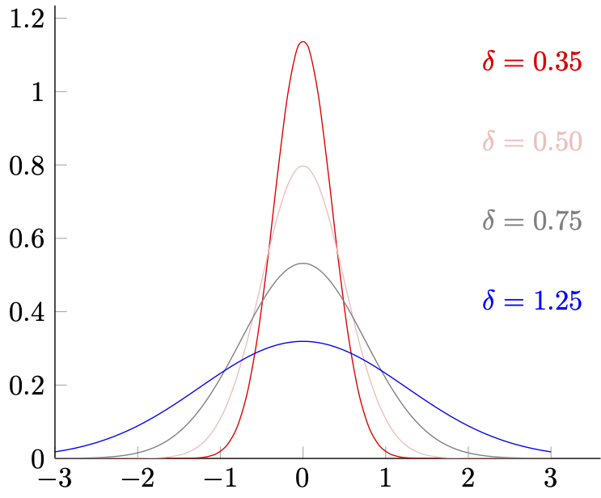
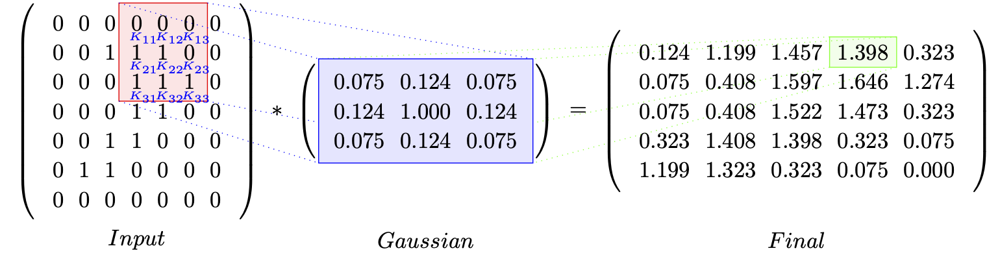

# 1.2.1 高斯滤波（Gauss Filter）

高斯滤波是我们最常用的一种滤波器。

想要理解高斯滤波的作用，首先需要回顾一下 **高斯分布（Gaussian Distribution）** ，即 **正态分布（Normal Distribution）** 的数学特征。高斯分布公式 ：

$$
f(x,\mu) = \frac{1}{\sqrt{2\pi} \cdot \delta} e ^{-\tfrac{(x-\mu)^2}{2 \cdot \delta^2}}
$$

其在 $$x$$ 为一维时的平面的对应分布如下：

<center>
<figure>
   
    <figcaption>
      <p>图 1.2.1-1 一维正态分布示意图</p>
   </figcaption>
</figure>
</center>

从图像可见，高斯分布的 $$\mu$$ 决定了分部的中心，而 $$\delta$$ 决定了形变的剧烈程度。而线下曲线面积，则代表了对应区间段内的取值发生概率。从离散角度则指 $$x \in int[x_c-\tfrac{n}2, x_c+\tfrac{n}2]$$ 范围内，有 $$x = x_c$$ 的取值概率为 $$f(x_c)$$ 。

记原信号为 $$S(x)$$ 。以 $$\vert target \vert_1$$ 表示归一化操作，则 $$\vert {\sum}_{x_c -n/2}^{x_c+n/2}(f(x) \cdot S(x)) \vert_1$$ 代表在当前给定 $$(\delta, \mu)$$ 的高斯分布 $$f(x, \mu)$$ 下，考虑 $$x = x_c$$ 时左右相邻含 $$x_c$$ 在内共 $$n$$ 个节点取值情况的 $$S(x_c)$$ 的概率均值。我们记 $$x_c$$ 为中心点，数据采样数为 $$T$$ ，有：

$$
{\displaystyle 
 \begin{aligned}
   x_c \in &int [\tfrac{n}{2}, T-\tfrac{n}{2}], \quad n \in int_{odds} \\
   \\
   F_n(x_c) &= \vert {\sum}_{x_c -n/2}^{x_c+n/2}(f(x, x_c) \cdot S(x)) \vert_1 \\
 \end{aligned}
}
$$

上式中，$$F_n(x_c)$$  即为一维情况下的 $$n$$ 步滑动窗口，也可以称为 $$n \times 1$$ 卷积核。通过沿信号的数据顺序，滑动 $$F_n(x_c)$$ 求取原值 $$x_c$$ 替换值的操作。我们可以在一定程度上利用分布的概率关系，以调整 $$\delta$$ 取值的方式来影响核内相邻数据的波动性，进而影响整体波动性达到滤波目的。 **取 $$\delta$$ 越小，波动性越强越激烈，图片越尖锐；反之 $$\delta$$ 越大，波动性越弱越平缓，图片越模糊。** 

一维信号早期常用这种手段来一定程度的进行降噪（现今已被优秀和复杂的多的算法替换了）。而二维信号，即图片，在我们之前讲解傅里叶变化时以提到过，和一维主要差别是在维度上。所以当我们记数据采样数为 $$(W \times H)$$ ，有将 $$x$$ 换为向量 $$\vec{x} = (x,y)$$ 表示：

$$
{\displaystyle 
 \begin{aligned}
   x_c \in &int [\tfrac{n}{2}, W-\tfrac{n}{2}], \quad y_c \in int [\tfrac{n}{2}, H-\tfrac{n}{2}]  \quad n \in int_{odds} \\
   \\
   F_n(\vec{x_c}) &= F_n(x_c, y_c) =\vert {\sum}_{y_c -n/2}^{y_c+n/2}{\sum}_{x_c -n/2}^{x_c+n/2}(f(\vec{x}, \vec{x_c}) \cdot S(\vec{x})) \vert_1 \\
 \end{aligned}
}
$$

则 $$F_n(\vec{x_c})$$ 即为二维情况下的 $$n \times n$$ 高斯滤波卷积核。同理，更多维情况只需要扩展参数 $$\vec{x}$$ 的向量空间即可。

可是看上去，目前的公式算不上简单。但真的是这样吗？

假设 $$n = 3$$ 那么 $$3 \times 3$$ 高斯滤波卷积核，实际描述的是 $$\vec{x_c}$$ 点周围单位距离内，相邻含 $$\vec{x_c}$$ 在内共 $$9$$ 个节点的波动关系，有：

$$
{\displaystyle 
 \begin{aligned}
    F_n(\vec{x_c}) &= \vert \sum_{xy} S_{xy} \cdot f ( (x_c,y_c) - 
    {
      \begin{bmatrix} 
        (-1,     -1) ,&  \quad  (\quad 0,     -1)   ,&  \quad  (\quad 1,     -1)       \\
        (-1,\quad 0) ,&  \quad  (\quad 0,\quad 0)   ,&  \quad  (\quad 1,\quad 0)       \\
        (-1,\quad 1) ,&  \quad  (\quad 0,\quad 1)   ,&  \quad  (\quad 1,\quad 1)
      \end{bmatrix}
    }) \vert_1 \\
    &= \vert \sum_{xy}S_{xy} \cdot f ( \vec{x_c} - \vec{N_{3 \times 3}} ) \vert_1  \\
 \end{aligned}
}
$$

一般情况，我们不会在单批（single batch）数据处理时，改变 $$\delta$$ 的取值。假设 $$\delta$$ 为标准正态分布取值 $$\delta=1$$ ，那么 $$f(\vec{x},\vec{\mu})$$ 有：

$$
f(\vec{x},\vec{\mu}) = \frac{1}{\sqrt{2\pi}} e ^{-\tfrac{1}{2}(\vec{x}-\vec{\mu})^2}
$$

显然， $$f(\vec{x},\vec{\mu})$$ 在 $$\delta$$ 取固定值的情况下，只和 $$(\vec{x}-\vec{\mu})$$ 的计算有关。而由于我们取 $$\vec{\mu} = \vec{x_c}$$ ，在 $$(\vec{x}-\vec{\mu})$$ 的计算中：

$$
\sum(\vec{x}-\vec{\mu})  = \sum(\vec{x}-\vec{x_c}) = \vec{N_{3 \times 3}}
$$

正好消除了变化的 $$\vec{x}$$ 的部分，因此 $$F_n(\vec{x_c})$$ 可以被化简为：

$$
{\displaystyle 
 \begin{aligned}
    F_n(\vec{x_c}) 
    &= \vert \sum_{xy}S_{xy} \cdot f ( \vec{x_c} - \vec{N_{3 \times 3}} ) \vert_1 
     = \vert \sum_{xy}S_{xy} \cdot f (\vec{N_{3 \times 3}} ) \vert_1  \\
    &= \sum_{xy}S_{xy} \cdot \vert ( \frac{1}{\sqrt{2\pi}} e ^{-\tfrac{1}{2}(\Delta x^2+\Delta y^2)}  )_{xy} \vert_1  \\
    &= \sum_{xy}S_{xy} \cdot \vert
    {
      \begin{bmatrix} 
        0.075 ,&  \quad  0.124   ,&  \quad  0.075      \\
        0.124 ,&  \quad  1.000   ,&  \quad  0.124      \\
        0.075 ,&  \quad  0.124   ,&  \quad  0.075
      \end{bmatrix}
    } \vert_1 \\
 \end{aligned}
}
$$

我们只需要依次计算卷积核范围内的点，对应信号值与概率相乘之和即可，即：

$$
{\displaystyle 
 \begin{aligned}
    F_n(\vec{x_c})  
     = \vert
      & 0.075 \cdot S_{(x_c-1,y_c-1)} + 0.124 \cdot S_{(x_c,y_c-1)}\ + 0.075 \cdot S_{(x_c+1,y_c-1)} \ + \\
      & 0.124 \cdot S_{(x_c-1,y_c  )}\quad  + 1.000 \cdot S_{(x_c,y_c)}\quad  + 0.124 \cdot S_{(x_c+1,y_c)}  \quad \ + \\
      & 0.075 \cdot S_{(x_c-1,y_c-1)} + 0.124 \cdot S_{(x_c,y_c+1)}\ + 0.075 \cdot S_{(x_c+1,y_c+1)} 
     \vert_1 \\
 \end{aligned}
}
$$

为了保证输入输出数据一致。根据卷积核的大小，我们还需要在数据的外围补充一圈空值，以保证感受野等大数据源。如果当前需要处理的数据为 $$(W \times H) = (5 \times 5)$$ ，即总共 $$25$$ 个像素的单通道灰度图。经过 $$n \times n = 3 \times 3$$ 大小的高斯卷积核处理后，有如下结果：

<br>

<center>
<figure>
   
</figure>
</center>

<br>

不难发现上面的 **求值过大** ，这是因为我们 **并没有** 使用 $$\delta = 1.0$$ 时归一化后的高斯算子：

$$
{\displaystyle 
 \begin{aligned}
    f(\vec{N_{3 \times 3}}) 
    &= \vert {
      \begin{bmatrix} 
        0.075 ,&  \quad  0.124   ,&  \quad  0.075      \\
        0.124 ,&  \quad  1.000   ,&  \quad  0.124      \\
        0.075 ,&  \quad  0.124   ,&  \quad  0.075
      \end{bmatrix}
    } \vert_1 
    = {
      \begin{bmatrix} 
        0.042 ,&  \quad  0.069   ,&  \quad  0.042      \\
        0.069 ,&  \quad  0.557   ,&  \quad  0.069      \\
        0.042 ,&  \quad  0.069   ,&  \quad  0.042
      \end{bmatrix}
    } \\
 \end{aligned}
}
$$

当然，也可以直接除以 $$f(\vec{N_{3 \times 3}})$$ 矩阵的秩，即 $$\vert f(\vec{N_{3 \times 3}}) \vert_{\delta = 1.0} = 1.796$$ ，作用在最终结果上。完成这一步后，整个高斯滤波单元才真正封装完毕。

对一张 $$(W \times H)$$ 的图片，单次标准高斯滤波需要经过 $$O(N) =((W-(n-2)) \times (H-(n-2)) \times 8) $$ 次加法运算，外加单独进行的一次 $$n \times n$$ 卷积核大小的 $$f(\vec{x},\vec{\mu})$$ 归一化概率计算。而通过计算 $$f(\vec{x},\vec{\mu})$$ 得到的 $$f(\vec{N_{3 \times 3}})$$ ，在 $$\delta$$ 发生改变前都可以无限复用。因此，算法非常快捷。

## **高斯滤波的简易 GLSL 渲染程序片**

现在，我们可以依据理论来做 GPU 的动态管线程序片封装了。

首先，我们需要定义 **顶点程序片（Vertex Shader）** 。通过该程序片指定 GPU 的绘制区域，以及纹理与物体的点位映射。由于我们是对整个视窗界面进行处理，所以可以采用对传入的顶点数据进行坐标变换的方式，来求得顶点映射的纹理坐标，减少少量数据通信：

```glsl
attribute vec3 position;

varying vec4 fs_position;
varying vec2 fs_texcoord;

void main()
{
    fs_position = vec4(position.x, position.y, position.z, 1.0);
    fs_texcoord = (position.xy + vec2(1.0, 1.0)) / 2.0;
    gl_Position = fs_position;
}
```

没有太多操作，因为关键的部分在 **像素程序片（Pixel Shader/Fragment Shader）** 上：

```glsl
precision mediump float;

varying vec4 fs_position;
varying vec2 fs_texcoord;

uniform vec2 pixel_bias;
uniform mat3 gaussian_matrix;
uniform sampler2D target_texture;

void main()
{
    vec3 output_;
    for (int i = 0; i < 3; i++) {
        for (int j = 0; j < 3; j++) {
            vec2 bias = vec2(i-1, j-1) * pixel_bias;
            output_ += texture2D(target_texture, fs_texcoord.xy + bias).rgb * gaussian_matrix[i][j];
        }
    }
    gl_FragColor = vec4(output_, 1.0);
}
```

完成对算法求和过程的迁移。传入的 **高斯算子 gaussian_matrix** 和 **相邻像素归一化的偏移距离 pixel_bias** 的操作，只需要在执行前由 CPU 计算一次即可。由于采用 Web 展示，此处方法以 JavaScript 语法实现：

```js
function pixel_bias(width, height) {
    return new Float32Array([
        1.0 / width, 1.0 / height
    ]);
}

function calculate_gaussian_kernel(step, delta) {
    let n = step * 2 + 1;
    let kernel = new Float32Array(n * n);
    let factor_1 = 1.0 / (Math.sqrt(2.0 * Math.PI) * delta);
    let factor_2 = 1.0 / (2.0 * delta * delta);

    let normalize_div = 0;
    for (let i = 0; i < n; i++) {
        for (let j = 0; j < n; j++) {
            let diff = Math.pow(i - step, 2) + Math.pow(j - step, 2);
            kernel[j + n * i] = factor_1 * Math.exp(-diff * factor_2);
            normalize_div += kernel[i];
        }
    }
    for (let i = 0; i < kernel.length; i++) {
        kernel[i] /= normalize_div;
    }
    return kernel;
}
```

至此，一个简单但实用的高斯滤波器就完成了。除了上述这种使用卷积核大小一对一采样的方式外，采用单一方向的高斯滤波滑动窗口，如 $$\vec{v}_{n \times 1} = (v_x, v_y)_{orient}$$ ，也是一种减少采样数量，从而提高运算效率的方式。但由于只有指定方向的颜色关系参与了运算，单一方向高斯滤波，或者说更为通用的是近乎所有单一方向的滤波器，对数据处理后的结果，都只会表现为固定方向的过滤效果。这会使画面显得有些割裂，因此建议慎重使用。

而如果要求在保证滤波效果的同时，还能精简运算。那么我们就需更为快捷且采样更少的高斯单元了。

## **高斯滤波的线性插值采加速**

一种通用的方式，就是在采样时引入 **线性插值（Linear Sampling）** ，减少采样次数。我们用 $$W$$ 代表高斯算子，用 $$W_{ij} =w(\vec{x})$$ 代表高斯算子在 $$\vec{x}$$ 所处 $$\vec{N_{3 \times 3}}$$ 中位置的对应 $$f_{ij} ( \vec{N_{3 \times 3}})$$ 值，用 $$s(\vec{x})$$ 代表 $$\vec{x}$$ 在图片中的像素值。则对于采样 $$3 \times 3$$ 的 $$\vec{N_{3 \times 3}}$$ 来说，由差值公式：

$$
{\displaystyle 
 \begin{aligned}
    s_{dst}(\vec{x_1},\vec{x_2}) &= \frac{s_{src}(\vec{x_1}) \cdot w_{src}(\vec{x_1}) + s_{src}(\vec{x_2}) \cdot w_{src}(\vec{x_2})}{w_{src}(\vec{x_1}) + w_{src}(\vec{x_2})} \\
 \end{aligned}
}
$$

可知，$$9$$ 次采样能够两两差值，从而减少到只需 $$5$$ 次实际的纹理数据读。卷积核的采样位置，取四角记为 $$[C_1, C_2, C_3, C_4] =[S_{(x_c-1,y_c-1)} , S_{(x_c-1,y_c+1)}, S_{(x_c+1,y_c-1)}, S_{(x_c+1,y_c+1)}]$$ 和中心 $$C_0 = S_{(x_c,y_c)}$$ ，如下：

$$
{\displaystyle 
 \begin{aligned}
    Sample_{xy} \cdot 
    {
      \begin{bmatrix} 
        1 ,&  \quad  0   ,&  \quad  1      \\
        0 ,&  \quad  1   ,&  \quad  0      \\
        1 ,&  \quad  0   ,&  \quad  1
      \end{bmatrix}
    }  = {
      \begin{bmatrix} 
        C_1  &  \quad  &  \quad  C_2      \\
           &  \quad  C_0        \\
        C_3  &  \quad  &  \quad  C_4
      \end{bmatrix}
    } \\
 \end{aligned}
}
$$

则 $$F_n(\vec{x_c})$$ 就可以表示为：

$$
{\displaystyle 
 \begin{aligned}
    F_n(\vec{x_c})  
     =& W_{00} \cdot C_1    \ + W_{01} \cdot C_{12}  \ + W_{02} \cdot C_{2} \ \ + \\
      & W_{10} \cdot C_{13}   + W_{11} \cdot C_{0} \ \ + W_{12} \cdot C_{24} \ + \\
      & W_{20} \cdot C_3    \ + W_{21} \cdot C_{34}  \ + W_{22} \cdot C_{4}  \\
     =& W_{00} \cdot C_1    \ + W_{01} \cdot \tfrac{W_{00} \cdot C_1 + W_{02} \cdot C_2}{W_{00} + W_{02} } \ \ + \\
      & W_{02} \cdot C_{2}  \ + W_{10} \cdot \tfrac{W_{00} \cdot C_1 + W_{20} \cdot C_3}{W_{00} + W_{20} } \ \ + \\
      & W_{11} \cdot C_{0}  \ + W_{12} \cdot \tfrac{W_{02} \cdot C_2 + W_{22} \cdot C_4}{W_{02} + W_{22} } \ \ + \\
      & W_{20} \cdot C_{3}  \ + W_{21} \cdot \tfrac{W_{20} \cdot C_3 + W_{22} \cdot C_4}{W_{20} + W_{22} } \ \ + \\
      & W_{22} \cdot C_{4}  \\
     =& (W_{00}\ +\ \tfrac{W_{00} \cdot W_{01}}{W_{00}\ +\ W_{02}} + \tfrac{W_{00} \cdot W_{10}}{W_{00}\ +\ W_{20}})\cdot C_1 \ + \\
      & (W_{02}\ +\ \tfrac{W_{02} \cdot W_{01}}{W_{00}\ +\ W_{02}} + \tfrac{W_{02} \cdot W_{12}}{W_{02}\ +\ W_{22}})\cdot C_2 \ + \\
      & (W_{20}\ +\ \tfrac{W_{20} \cdot W_{10}}{W_{00}\ +\ W_{20}} + \tfrac{W_{20} \cdot W_{21}}{W_{20}\ +\ W_{22}})\cdot C_3 \ + \\
      & (W_{22}\ +\ \tfrac{W_{22} \cdot W_{12}}{W_{02}\ +\ W_{22}} + \tfrac{W_{22} \cdot W_{21}}{W_{20}\ +\ W_{22}})\cdot C_4 \ + \\
      & W_{11} \cdot C_{0}  \\
 \end{aligned}
}
$$

看上去很复杂，但取中心点的二维高斯分布，其 $$f_{ij} (\vec{N_{3 \times 3}} )$$ 的值是随 $$\vec{x_c}$$ 中心对称的，有：

$$
{\displaystyle 
 \begin{aligned}
    W_0 &= [W_{11}] \\
    W_1 &= [W_{01} = W_{10} = W_{12} = W_{21}] \\
    W_2 &= [W_{00} = W_{02} = W_{20} = W_{22}] \\
 \end{aligned}
}
$$
	
带入到线性插值 $$F_n(\vec{x_c})$$ 表达式，则：

$$
{\displaystyle 
 \begin{aligned}
    F_n(\vec{x_c})  
     =&  W_0 \cdot C_0 +[(W_1\ +\ W_2)\cdot (C_1 \ + C_2 \ + C_3 \ + C_4 \ )] \\
 \end{aligned}
}
$$

当取 $$\delta = 1.0$$ 时，三值得到固定的归一化取值 $$[W_0,W_1,W_2] = [0.557,\ 0.069,\ 0.042]$$ ，而 $$F_n(\vec{x_c})$$ 的表达式就只和采样相关了：

$$
{\displaystyle 
 \begin{aligned}
    F_n(\vec{x_c}) =  0.557 \cdot C_0\ +\ 0.111 \cdot (C_1 \ + C_2 \ + C_3 \ + C_4 \ ) \\
 \end{aligned}
}
$$

所以，插值采样的高斯滤波非常精简。**只需要略微调整像素程序片（Pixel Shader/Fragment Shader）的实现，而不需要对其他处理进行改动，就能完成改造**：

```glsl
precision mediump float;

varying vec4 fs_position;
varying vec2 fs_texcoord;

uniform vec2 pixel_bias;
uniform mat3 gaussian_matrix;
uniform sampler2D target_texture;

void main()
{
    float gauss_factor = gaussian_matrix[0][0]+gaussian_matrix[0][1];
    vec3 output_;
    output_ += texture2D(target_texture, fs_texcoord.xy ).rgb * gaussian_matrix[1][1];
    output_ += texture2D(target_texture, fs_texcoord.xy + vec2(-1, -1) * pixel_bias).rgb * gauss_factor;
    output_ += texture2D(target_texture, fs_texcoord.xy + vec2(-1, +1) * pixel_bias).rgb * gauss_factor;
    output_ += texture2D(target_texture, fs_texcoord.xy + vec2(+1, -1) * pixel_bias).rgb * gauss_factor;
    output_ += texture2D(target_texture, fs_texcoord.xy + vec2(+1, +1) * pixel_bias).rgb * gauss_factor;
    gl_FragColor = vec4(output_, 1.0);
}
```

加速后的高斯滤波单元，对一张 $$(W \times H)$$ 图片的处理的理论耗时，减少到了原耗时的 $$0.625 \cdot O(N)$$ 。采样数也同比减少了 $$37.5\%$$ 。效果上和直算相比，**几乎无差别**。

## **高斯滤波的局限性**

由于高斯滤波的通用卷积核是 **各向同性（Isotropic）** 的，在核范围内的各方向向量与中心点的方差，仅和向量终点与核中心点的相对距离有关。因此，高斯滤波并不是没有弊端的。

我们仍然选择 $$\mu = \vec{x_c}$$ 为核中心，假设核范围内有不包含 $$\vec{x_c}$$ 在内的，总计为 $$N$$ 的 $$n$$ 维向量 $$\vec{x} = (x_1,x_2,\ ...\ ,x_n) \in \mathbb{R}^n$$ 的采样数据 $$S_N = \{ S_{\vec{x_1}} , S_{\vec{x_2}},\ ...\ , S_{\vec{x_N}}  \}$$ 。将高斯滤波卷积核的离散程度，以非概率密度 **协方差矩阵（Covariance Matrix）** 的 $$M_{cov}(\vec{x})$$ 形式表示，记 $$I$$ 为单位对角矩阵，有：

$$
{\displaystyle 
 \begin{aligned}
    M_{cov}(\vec{x})
    &= \tfrac{1}{N} \sum_{i = 1}^{N} S_{\vec{x_i}} \cdot 
    {
      \begin{bmatrix} 
        (x_1-x_{c1})^2 &  \quad     &  \quad     &  \quad   \\
         &  \quad  (x_2-x_{c2})^2   &  \quad    &  \quad    \\
         &  \quad     &  \quad  ... &  \quad\\
         &  \quad     &  \quad  &  \quad  (x_n-x_{cn})^2
      \end{bmatrix}
    }  \\
    &= \sum \Delta x^2 \cdot I  \in \mathbb{R}^{n \times n} \\
 \end{aligned}
}
$$

多维高斯的协方差矩阵，只有对角线的 **方差（Variance）存在非 $$0$$ 取值** ，而衡量参数交叠影响的 **协方差（Covariance）皆为 $$0$$ 值** 。所以，高斯滤波没有考虑维度方位信息带来的数据间的差异，每一个维度仅对自身属性产生影响。因此，**高斯核总是中心对称** 。

这一特征体现在二维信号的处理上时，就表现为经过高斯滤波处理的图片，轮廓细节会有所丢失（物体更不容易分辨，而非单纯颜色变得规整）。同时，**也更容易因为算法导致的频率扰动，产生高频变化规律缺失，像素朝核的外边缘等量的分散运动而出现摩尔纹（Moire Pattern）** 。毕竟图片的高频部分，才是保存轮廓信息的关键。但高斯滤波本质上却是全通量的概率权重控制。

那么有没有能够在一定程度上，既保留高频细节的同时，又能够相对独立的处理低频波动的算法呢？
>考虑到 **各向异性（Anisotropic）** 的方向特征，或许构建一个各向异性卷积核，就能满足要求。


[ref]: References_1.md