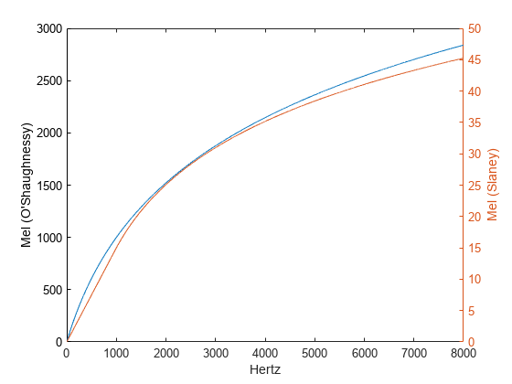
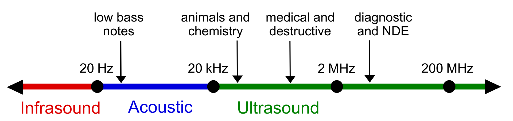
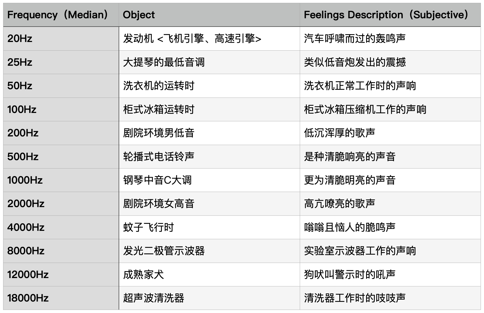

# 1.3.1 音高（Pitch）

**音高（Pitch）** 是代表声音振动频率高低的 **主观感知量（Subjective Perceptions）**，是映射自对应声波频率纯客观物理量的心里声学概念。有时，我们会用 音调/声调（Tone）代指音高的工程名称，这其实不够准确。若发生这种情况，我们就 **不能** 将代指音高的音调，与乐理中关联音阶（Octave）的音调（Tone）等同。两者存在换算但并不是一个概念。

即，**音高（Pitch）不是音调/声调（Tone），更不是音阶（Octave）**。
	
## **美（Mel [Melodies]）& 美体系（Mel Scale）**

音高的单位是 **美（Mel [Melodies]）**，这是一个主观标定的单位。以 美（Mel）单位来衡量音高的系统，被称为 **美体系（Mel Scale）**。该体系来自于美国心理学家 **史丹利·史密斯·史蒂文斯（Stanley Smith Stevens，1906-1973）** 于 1963 年进行的有关心理声学定量的研究 [\[4\]][ref] 。所以， **不属于** 当前 **国际通用的计量体系单位（SI Unit [International System of Units]）**。

不过，凭借 **美体系（Mel Scale）** 在人耳感知上相对生理准确的量化，和本身在出发点设定上存在和频率（Frequency）之间的 **直接函数映射**。所以，美（Mel）常被选定为统一单位，在声学工程上作基础标的。记美体系音高为 $$P_m$$ ，频率为 $$F$$ ，有 1963 的早期换算（现已废弃）：

$$
{\displaystyle 
 \begin{aligned}
   P_m &= 2595 \cdot \log_{10} \left(F \right) \\
 \end{aligned}
}
$$

这是以 1000 Hz 响度为 40 dB（声压级）的纯音（即只包含一个频率）为 1000 Mel ，来测算拟合得到的经验公式。受限于检测设备，会存在一定的误差。

因此，该公式对应拟合方式，在随后的 1968、1976、1990 年，分别经历了三次较大程度的重测。而现在我们采用的主要有 **两套转换标准**。

一个是由 **道格拉斯·奥肖内西（Douglas O'Shaughnessy）** 在 1976 年修订的 1000Hz 基准（1000 mel）按 700Hz 分割转换标准 [\[5\]][ref] ，被称为 **奥肖内西美体系（O'Shaughnessy's Mel Scale）** ：

$$
{\displaystyle 
 \begin{aligned}
   P_m &= 2595 \cdot \log_{10} \left(1 + \frac{F}{700} \right) \\
 \end{aligned}
}
$$

另一个则是 1999 年由 MATLAB 主导的修订结果 [\[6\]][ref] ，被称为 **斯莱尼美体系（Slaney's Mel Scale）**。这也是 librosa 库采用的算法，有：

$$
{\displaystyle 
 \begin{aligned}
   P_m
   &= \begin{cases}
     \frac{3F}{200} &, \ F < 1000 \ Hz \\
     15 + 27 \cdot \log_{6.4} \left( \frac{F}{1000} \right) &, \ F \ge 1000 \ Hz 
   \end{cases} \\
 \end{aligned}
}
$$

两者差异，如下图：

<figure>
   
    <figcaption>
      
图 1.3.1-1 两种美体系（Mel Scale）差异对比（0-8000 Hz）示意图

   </figcaption>
</figure>

相对来说，在不存在体系换算的条件下，会优先选择 奥肖内西 转换公式。而当存在系统换算，尤其是涉及 librosa 库时，建议优先以统一体系为要求，采用相同体系的转换公式。

需要注意的是，美体系都是对单一频率纯声的转换。而什么是频率呢？

## **频率（Frequency）**

**频率（Frequency）** 是指声音对应机械波属性的源振动频率。是声音三要素中唯一的纯客观物理量。当然，一般我们所称的声音的频率，都是指可被感知的声音频率，即前文提到的 **狭义声波（Narrow Acoustic Wave）** 范围的 **可听频率（AF [Audible Frequency]）**。

频率的单位是 **赫兹（Hz [Hertz]）**，表示单位时间一秒内，振源发生完整周期性往复运动的次数，即 $$10 Hz = 10/s$$ 。假设存在波长为 $$\lambda$$ ，波速为 $$c$$ 的波，有相应周期为 $$T$$ ，频率为 $$F$$ ，则：

$$
{\displaystyle 
 \begin{aligned}
   F &= \frac{1}{T} \quad ,\quad c = \lambda F \\
 \end{aligned}
}
$$

在标准大气压的理想空气介质中，人类能够听见并识别大约 20Hz～20000Hz 频率范围的声波。**有 AF 属于 20Hz～20000Hz。**

以此为基准， **频率小于 20Hz** 范围的声波，被我们称为 **次声波（Infrasound）**。而 **频率大于 20000Hz** 范围的声波，被我们称为 **超声波（Ultrasound）**。次声波和超声波都是相对于人而言的 **单阈范围域**。

<figure>
   
    <figcaption>
      
图 1.3.1-1 三类声波范围示意图（蓝色指狭义声波） <a href="References_1.md">[2]</a>

   </figcaption>
</figure>

即然被归为声音三要素，就表示人对不同频率声音的听感有不少差异。在假设其它影响量不变的理想情况下，本书查阅了一些基于日常关联心理声学测量的结果，汇总如下表以供参考：

<figure>
   
</figure>

从上表可知，以听感角度考虑会十分的主观。但请不要忘记，频率本身是客观的。上述统计中采用的，是由选定样本声音中，所包含的所有频率声波的 **复合频率中值（Median）**。自然界中大部分声音 **并非** 由 **单一** 频率波构成。这也是产生不同音色（Timbre）的原因之一。

观察例举的统计结果，会发现直觉上非常吵闹的声音，如飞机发动机的声音，其频率并不一定高。而一些我们生活中感觉难以察觉的声音，如蚊子飞行声，却不一定低频。

显然，**频率并不能代表声音的高低**。我们还需要其它参数表示，那就是 **响度（Loudness）**。

[ref]: References_1.md