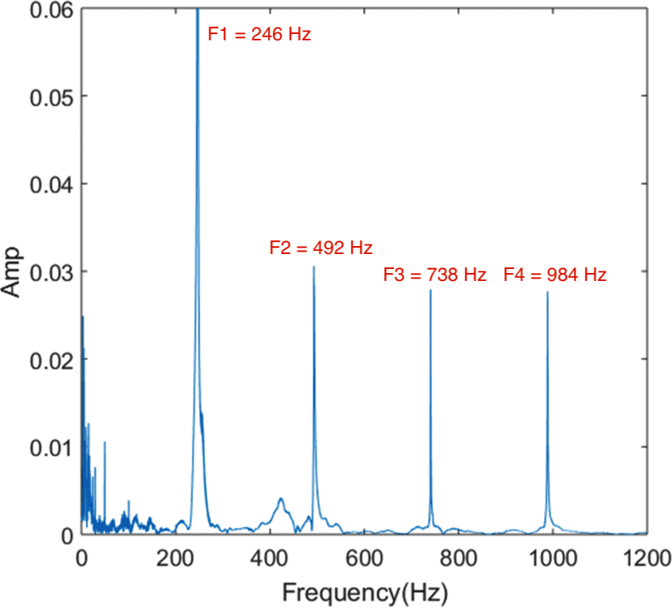

# 1.3.3 音色（Timbre）

**音色（Timbre）** ，是指声音的主观成色。本身更偏向于乐理而非工程。

注意一个关键的理解偏差：**音色不是音质！** 心理声学（Psychoacoustics）有时称其为 **音调色（Tone Color）** 或 **音调质（Tone Quality）** ，转译到中文若用音质来代替，实则是不准确的。**音质（Sound Quality），是由信噪比（SNR [Signal to Noise Ratio]）决定的工程量** ，后面章节会有介绍。之所以强调，是因为该点非常容易造成初学者混淆，从而提高学习门槛。

如果说音高（Pitch）和响度（Loudness）都是单一影响参数的代称，那么音色则是一种 **复合影响因子** 带来的，基于传统声乐经验和历史因素，对体感的 **弱标准化** 规定描述。也就是说，音色是三要素中，最为主观的一个了。

而不同的音色到底有何种区别呢？这需要从音色本质说起。

## **音色的频率链（Frequency Series）/ 谐波链（Harmonic Series）**

考虑一个来自 ISO 16 标准音阶（Octave）的 **纯音 A4（乐理 la，440 Hz）** ，理想情况是 **只有一个** 频率，即 440Hz 的。但是，实际生活中，假设完美调校的钢琴和其他乐器，演奏的 A4 虽然能够听出来是对应音调，但也能明显可区分来自于不同乐器。甚至不同品牌厂家的同一种乐器，演奏同一音调时，也会有不同听感。

这种似是而非、若即若离的情况，是怎么一回事呢？想要回答这个问题，需要解释两个方面：“似是”的一面，和“若离”的一面。

我们知道，声音都是复合的一组频率。因此，从声波物理性出发：

- 将决定声音基准音调的单一频率，称为 **基波（Fundamental）** ；
- 将决定声音本身特征的衍生频率，称为 **谐波（Harmonic）** ；

“似是”来自于相同的基波，**基波决定音调（Note）** ，即标志着声音本身的指向。“若离”来自于 **谐波** ，这是决定一个 **声音具体特征** 的主要因素。不同声源弹奏同一 **乐理音调（Music Note）** 时，相同音调理想情况下，基波都是完全一致的。而组成声音的所有谐波差异，才导致了不同听感。

一般的，我们将由 **一个基波（Single Fundamental）** 和 **一组谐波（Multi Harmonics）** 共同叠加而成的声音，为 **复合音（Complex Sounds）** 。

如下图，就是来自于ISO 16 标准音阶（Octave）调音的，单一音调 B3 在实际某钢琴上的表现。此钢琴 B3 复合音的组成中，最左侧蜂刺状 246Hz 频率位置 即为 B3 基波，而基波右侧其余蜂刺位则为该复合音谐波。

<figure>
   
    <figcaption>
      
图 1.3.3-1 某钢琴标准 B3 调音的频率响度特征（响度归一化） <a href="References_1.md">[8]</a>

   </figcaption>
</figure>

而一个复合音中，从低频到高频所有纯音的频率，所构成的数组，就是 **频率链（Frequency Series）/ 谐波链（Harmonic Series）** 。即从 **工程角度** 所理解的，声音的 **音色（Timbre）** 。

由此，我们可知基波、谐波、音色三者的关系了。

## **基波（Fundamental）**

**基波（Fundamental）** ，也称为 **第一谐波（First Harmonic）** ，指感观音色对应某指定 **基准纯音（Standard Pure Tone）** 的频率。基波决定某标准音阶在器乐设备上的准确性。 **同一规范（如 A440）下，调校准确的各类声音设备，基波频率完全相等。**

基波和频率间的换算为：

$$
{\displaystyle 
 \begin{aligned}
   Note(n) = \left( ^{12}\sqrt{2} \right)^{n - 9} \times 440 Hz \\
 \end{aligned}
}
$$

其中，
以 $$n$$ 表示 **当前音名（Names）距离 C4 的音序（Sequence）** ；
而 440Hz 即 A4 标定值，A4 与 **C4 标准键（Standard Key）** 的音序为 +9 ；

而同样的，当我们已知对应基波的频率，则可以计算出它与 C4 的音序，从而反向查表得到它在乐理上的音调。记目标基波频率为 $$F(n)$$ ，则：

$$
{\displaystyle 
 \begin{aligned}
   n = 12 \ \log_2\left( \frac{F(n)}{440\ Hz} \right)+9\\
 \end{aligned}
}
$$

此公式，即为工程上常用的 **A440 频率音序公式（Frequency Sequence Formula）** 。

## **谐波（Harmonic）**

**谐波（Harmonic）** 指自指定基波以 **整数倍频率** 衍生的纯音声波。基波衍生的谐波一般不会仅有一个。假设基波位于谐波链（Harmonic Series）的第一位，有 $$i = 1$$ ，频率为 $$F(n) = F_1$$ 。则位于顺序第 $$i$$ 位的谐波频率 $$F(i)$$ 有：

$$
{\displaystyle 
 \begin{aligned}
   F(i) =  i \times F_1 \\
 \end{aligned}
}
$$

所以，仍然以之前的 **钢琴 B3** 为例，有：

<figure>
   
    <figcaption>
      
图 1.3.3-2 某钢琴标准 B3 调音的谐波链（响度归一化）示意图 <a href="References_1.md">[8]</a>

   </figcaption>
</figure>

可见，决定整个谐波链的关键，就在于第一谐波，也就是基波上。而在基波响度相同的情况下，产生的第二、第三、... 、第 i 谐波，其 **数目** 和 **各自的响度** ，才确定了声源特色。

至此，声音三要素与工程量映射，就解释清楚了。

[ref]: References_1.md