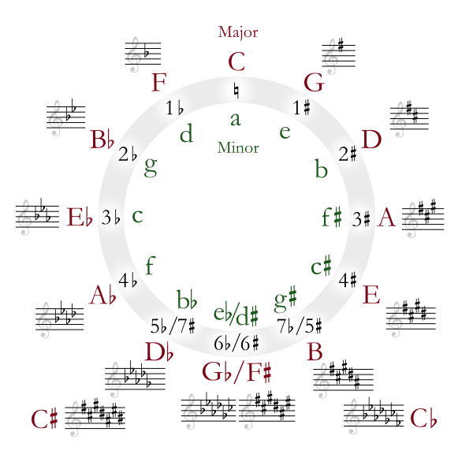
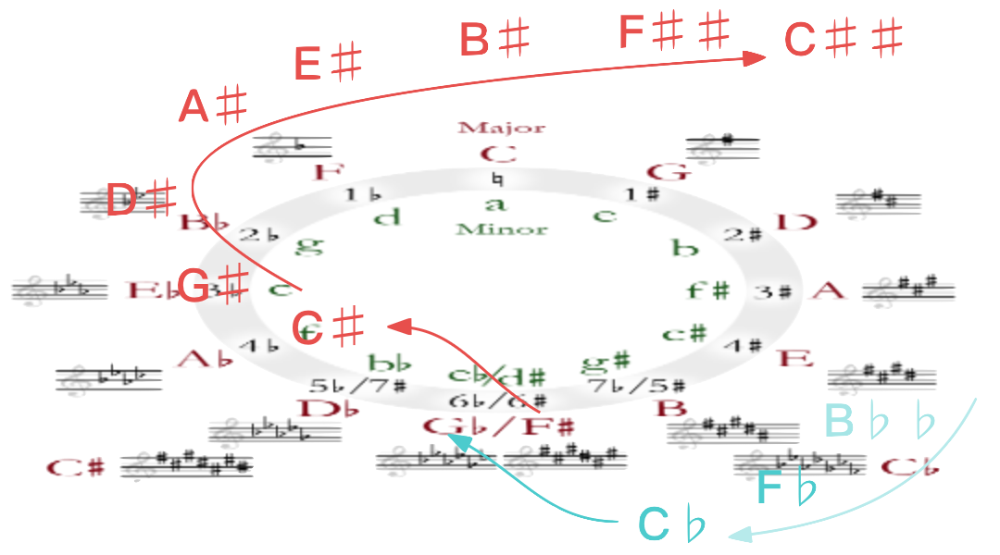

# 1.4.1 乐理：音调（Notes）& 五度圈（Circle of Fifths）

在声音三要素开始的部分，我们已经简单介绍了一些乐理基础概念。而乐理对声音的描述，都是基于 **音调（Note）** 为出发点的。通过音调指向基音，建立主观参考系下的客观不变量，从而构造统一的联系。结合 **系统的** 记录方式，完成对一定时间段下，音乐的保存。

所以，**乐谱（Musical Notation）** 就是一种，以手动编排抄录的方式，进行声音持续化存储的早期人工手段。而 **乐理音调（Music Note）**，以下我们简称为 **音调（Note）**，就是一种粗粒度（相对于数字时代编码调制而言）的固定采样。

依旧采用 **八度音（Octave）的音阶体系**，首先需要建立乐理（艺术）心理（感观）转换。

## **音调（Notes）的 音程尺度描述（ISN [Interval Scale Name]）**

这个我们已经介绍过。 **八度音阶（Octave）** 以钢琴音级为 4 时为准，包括音名、半音在内，共有 12 个，即 C、C♯/D♭、D、D♯/E♭、E、F、F♯/G♭、G、G♯/A♭、A、A♯/B♭、B 。为方便说明，我们补充下一级的 C5 到表中，有：

<table style="width:90%; border-collapse: collapse;">
  <tr style="background-color: #d5d5d5; text-align: center; vertical-align: middle;">
    <th style="border: 1px solid #ddd; border-bottom: 1px solid #000; padding: 5px; text-align: center; vertical-align: middle;">C</th>
    <th style="border: 1px solid #ddd; border-bottom: 1px solid #000; padding: 5px; text-align: center; vertical-align: middle;">C♯ D♭</th>
    <th style="border: 1px solid #ddd; border-bottom: 1px solid #000; padding: 5px; text-align: center; vertical-align: middle;">D</th>
    <th style="border: 1px solid #ddd; border-bottom: 1px solid #000; padding: 5px; text-align: center; vertical-align: middle;">D♯ E♭</th>
    <th style="border: 1px solid #ddd; border-bottom: 1px solid #000; padding: 5px; text-align: center; vertical-align: middle;">E</th>
    <th style="border: 1px solid #ddd; border-bottom: 1px solid #000; padding: 5px; text-align: center; vertical-align: middle;">F</th>
    <th style="border: 1px solid #ddd; border-bottom: 1px solid #000; padding: 5px; text-align: center; vertical-align: middle;">F♯ G♭</th>
    <th style="border: 1px solid #ddd; border-bottom: 1px solid #000; padding: 5px; text-align: center; vertical-align: middle;">G</th>
    <th style="border: 1px solid #ddd; border-bottom: 1px solid #000; padding: 5px; text-align: center; vertical-align: middle;">G♯ A♭</th>
    <th style="border: 1px solid #ddd; border-bottom: 1px solid #000; padding: 5px; text-align: center; vertical-align: middle;">A</th>
    <th style="border: 1px solid #ddd; border-bottom: 1px solid #000; padding: 5px; text-align: center; vertical-align: middle;">A♯ B♭</th>
    <th style="border: 1px solid #ddd; border-bottom: 1px solid #000; padding: 5px; text-align: center; vertical-align: middle;">B</th>
    <th style="border: 1px solid #ddd; border-bottom: 1px solid #000; padding: 5px; text-align: center; vertical-align: middle;">C5</th>
  </tr>
  <tr style="background-color: #ffd84b; text-align: center; vertical-align: middle;">
    <td style="border: 1px solid #ddd; padding: 5px;">261.63 (0)</td>
    <td style="border: 1px solid #ddd; padding: 5px;">277.18 (+1)</td>
    <td style="border: 1px solid #ddd; padding: 5px;">293.66 (+2)</td>
    <td style="border: 1px solid #ddd; padding: 5px;">311.13 (+3)</td>
    <td style="border: 1px solid #ddd; padding: 5px;">329.63 (+4)</td>
    <td style="border: 1px solid #ddd; padding: 5px;">349.23 (+5)</td>
    <td style="border: 1px solid #ddd; padding: 5px;">369.99 (+6)</td>
    <td style="border: 1px solid #ddd; padding: 5px;">392.00 (+7)</td>
    <td style="border: 1px solid #ddd; padding: 5px;">415.30 (+8)</td>
    <td style="border: 1px solid #ddd; padding: 5px;">440.00 (+9)</td>
    <td style="border: 1px solid #ddd; padding: 5px;">466.16 (+10)</td>
    <td style="border: 1px solid #ddd; padding: 5px;">493.88 (+11)</td>
    <td style="border: 1px solid #ddd; padding: 5px;">523.25 (+12)</td>
  </tr>
</table>

 

明明是 八度音，却有包扩 C5 在内的 13 个音调。尺度不一太尴尬了，怎么办呢？

音乐艺术先贤们也遇到了同样的问题。于是，根据 **两两相邻音调间的音程（Interval）**，在同音级下，有了不同的 **音程尺度描述（ISN [Interval Scale Name]）**。正好作为转换起点。

在 C4 所在第 4 音级取 ISN。所有音调与 C4 相比音程为：

<table style="width:90%; border-collapse: collapse;">
  <tr style="background-color: #d5d5d5; text-align: center; vertical-align: middle;">
    <th style="border: 1px solid #ddd; border-right: 1px solid #000; border-bottom: 1px solid #000; padding: 5px; width: 120px">Notes</th>
    <th style="border: 1px solid #ddd; border-bottom: 1px solid #000; padding: 5px; text-align: center; vertical-align: middle;">Frequency（Sequence）</th>
    <th style="border: 1px solid #ddd; border-bottom: 1px solid #000; padding: 5px; text-align: center; vertical-align: middle;">Interval Scale Name</th>
    <th style="border: 1px solid #ddd; border-bottom: 1px solid #000; padding: 5px; text-align: center; vertical-align: middle;">Interval as Notes</th>
  </tr>
  <tr style="background-color: #ffd84b; text-align: center; vertical-align: middle;">
    <th style="border: 1px solid #ddd; border-right: 1px solid #000; padding: 5px; background-color: #d5d5d5;">C4</th>
    <td style="border: 1px solid #ddd; padding: 5px;">261.63 (0)</td>
    <td style="border: 1px solid #ddd; padding: 5px; background-color: #f1711f;">纯一度（P1 [Perfect Unison]）</td>
    <td style="border: 1px solid #ddd; padding: 5px;">0</td>
  </tr>
  <tr style="background-color: #ffd84b; text-align: center; vertical-align: middle;">
    <th style="border: 1px solid #ddd; border-right: 1px solid #000; padding: 5px; background-color: #d5d5d5;">C♯/D♭</th>
    <td style="border: 1px solid #ddd; padding: 5px;">277.18 (+1)</td>
    <td style="border: 1px solid #ddd; padding: 5px;">小二度（m2 [Minor Second]）</td>
    <td style="border: 1px solid #ddd; padding: 5px;">0.5</td>
  </tr>
  <tr style="background-color: #ffd84b; text-align: center; vertical-align: middle;">
    <th style="border: 1px solid #ddd; border-right: 1px solid #000; padding: 5px; background-color: #d5d5d5;">D</th>
    <td style="border: 1px solid #ddd; padding: 5px;">293.66 (+2)</td>
    <td style="border: 1px solid #ddd; padding: 5px;">大二度（M2 [Major Second]）</td>
    <td style="border: 1px solid #ddd; padding: 5px;">1</td>
  </tr>
  <tr style="background-color: #ffd84b; text-align: center; vertical-align: middle;">
    <th style="border: 1px solid #ddd; border-right: 1px solid #000; padding: 5px; background-color: #d5d5d5;">D♯/E♭</th>
    <td style="border: 1px solid #ddd; padding: 5px;">311.13 (+3)</td>
    <td style="border: 1px solid #ddd; padding: 5px;">小三度（m3 [Minor Third]）</td>
    <td style="border: 1px solid #ddd; padding: 5px;">1.5</td>
  </tr>
  <tr style="background-color: #ffd84b; text-align: center; vertical-align: middle;">
    <th style="border: 1px solid #ddd; border-right: 1px solid #000; padding: 5px; background-color: #d5d5d5;">E</th>
    <td style="border: 1px solid #ddd; padding: 5px;">329.63 (+4)</td>
    <td style="border: 1px solid #ddd; padding: 5px;">大三度（M3 [Major Third]）</td>
    <td style="border: 1px solid #ddd; padding: 5px;">2</td>
  </tr>
  <tr style="background-color: #ffd84b; text-align: center; vertical-align: middle;">
    <th style="border: 1px solid #ddd; border-right: 1px solid #000; padding: 5px; background-color: #d5d5d5;">F</th>
    <td style="border: 1px solid #ddd; padding: 5px;">349.23 (+5)</td>
    <td style="border: 1px solid #ddd; padding: 5px; background-color: #f1711f;">纯四度（P4 [Perfect Fourth]）</td>
    <td style="border: 1px solid #ddd; padding: 5px;">2.5</td>
  </tr>
  <tr style="background-color: #ffd84b; text-align: center; vertical-align: middle;">
    <th style="border: 1px solid #ddd; border-right: 1px solid #000; padding: 5px; background-color: #d5d5d5;">F♯/G♭</th>
    <td style="border: 1px solid #ddd; padding: 5px;">369.99 (+6)</td>
    <td style="border: 1px solid #ddd; padding: 5px; background-color: #fd96c8;">增四度（A4）/减五度（d5）</td>
    <td style="border: 1px solid #ddd; padding: 5px;">3</td>
  </tr>
  <tr style="background-color: #ffd84b; text-align: center; vertical-align: middle;">
    <th style="border: 1px solid #ddd; border-right: 1px solid #000; padding: 5px; background-color: #d5d5d5;">G</th>
    <td style="border: 1px solid #ddd; padding: 5px;">392.00 (+7)</td>
    <td style="border: 1px solid #ddd; padding: 5px; background-color: #f1711f;">纯五度（P5 [Perfect Fifth]）</td>
    <td style="border: 1px solid #ddd; padding: 5px;">3.5</td>
  </tr>
  <tr style="background-color: #ffd84b; text-align: center; vertical-align: middle;">
    <th style="border: 1px solid #ddd; border-right: 1px solid #000; padding: 5px; background-color: #d5d5d5;">G♯/A♭</th>
    <td style="border: 1px solid #ddd; padding: 5px;">415.30 (+8)</td>
    <td style="border: 1px solid #ddd; padding: 5px;">小六度（m6 [Minor Sixth]）</td>
    <td style="border: 1px solid #ddd; padding: 5px;">4</td>
  </tr>
  <tr style="background-color: #ffd84b; text-align: center; vertical-align: middle;">
    <th style="border: 1px solid #ddd; border-right: 1px solid #000; padding: 5px; background-color: #d5d5d5;">A</th>
    <td style="border: 1px solid #ddd; padding: 5px;">440.00 (+9)</td>
    <td style="border: 1px solid #ddd; padding: 5px;">大六度（M6 [Major Sixth]）</td>
    <td style="border: 1px solid #ddd; padding: 5px;">4.5</td>
  </tr>
  <tr style="background-color: #ffd84b; text-align: center; vertical-align: middle;">
    <th style="border: 1px solid #ddd; border-right: 1px solid #000; padding: 5px; background-color: #d5d5d5;">A♯/B♭</th>
    <td style="border: 1px solid #ddd; padding: 5px;">466.16 (+10)</td>
    <td style="border: 1px solid #ddd; padding: 5px;">小七度（m7 [Minor Seventh]）</td>
    <td style="border: 1px solid #ddd; padding: 5px;">5</td>
  </tr>
  <tr style="background-color: #ffd84b; text-align: center; vertical-align: middle;">
    <th style="border: 1px solid #ddd; border-right: 1px solid #000; padding: 5px; background-color: #d5d5d5;">B</th>
    <td style="border: 1px solid #ddd; padding: 5px;">493.88 (+11)</td>
    <td style="border: 1px solid #ddd; padding: 5px;">大七度（M7 [Major Seventh]）</td>
    <td style="border: 1px solid #ddd; padding: 5px;">5.5</td>
  </tr>
  <tr style="background-color: #ffd84b; text-align: center; vertical-align: middle;">
    <th style="border: 1px solid #ddd; border-right: 1px solid #000; padding: 5px; background-color: #d5d5d5;">C5</th>
    <td style="border: 1px solid #ddd; padding: 5px;">523.25 (+12)</td>
    <td style="border: 1px solid #ddd; padding: 5px; background-color: #f1711f;">纯八度（P8 [Perfect Octave]）</td>
    <td style="border: 1px solid #ddd; padding: 5px;">6</td>
  </tr>
</table>

 

表内抽象的音程名中，出现了一些 **非精确量词（Inaccurate Quantifiers）** 被使用其中。确切的来说，基础量词有五种，由小到大分别是（注意简写时的 **大小写区分** ）：

<b>
减（d [Diminished]）
 
小（m [Minor]）、纯（P [Perfect]）、大（M [Major]）
 
增（A [Augmented]）
</b>

 

上述量词怎么来的呢？直接意义上，这是两套体系。一套基于 **相对音程**，一套基于 **绝对音程**。简单来说，取整数 $$k \in \mathbb{Z}$$ 表示通用数字级。则

**绝对音程（n.AI [Absolute Interval]）**，采用 **减（d [Diminished]）** 、 **增（A [Augmented]）**，是取用第 4 级的纯一度（P1）就是 C4 261.63 Hz 作为原点。记原点音调音序为 $$n_{ori}$$ ，目标音调音序为 $$n_{tag}$$ ，有：

- **减 k 度（dk [Diminished k]）**，意味着 $$\Delta n = n_{tag} - n_{ori} = 2(k - 2)$$ ；
- **增 k 度（Ak [Augmented k]）**，意味着 $$\Delta n = n_{tag} - n_{ori}= 2(k - 0.5)$$ ；

**相对音程（n.RI [Relative Interval]）**，采用 **小（m [Minor]）** 、 **纯（P [Perfect]）** 、 **大（M [Major]）**，是一种差值概念。记被比较的音调音序为 $$n_{com}$$ ，而目标音调音序为 $$n_{tag}$$ ，有：

- **小 k 度（mk [Minor k]）**，指 $$\Delta n = ({n_{tag} - n_{com}})\%12 \in \{1,\ 3,\ 8,\ 10 \}$$ 时对应 $$k\in \{2,\ 3,\ 6,\ 7 \}$$ ；
- **纯 k 度（Pk [Perfect k]）**，指 $$\Delta n = ({n_{tag} - n_{com}})\%12 \in \{0,\ 5,\ 7,\ 12 \}$$ 时对应 $$k\in \{1,\ 4,\ 5,\ 8 \}$$ ；
- **大 k 度（Mk [Major k]）**，指 $$\Delta n = ({n_{tag} - n_{com}})\%12 \in \{2,\ 4,\ 9,\ 11 \}$$ 时对应 $$k\in \{2,\ 3,\ 6,\ 7 \}$$ ；

而在 所有音调与 C4 相比的音程表 中，之所以出现了 **F♯/G♭** 用绝对音程（Absolute Interval）与 A440 440 Hz 相比，其它采用相对音程（Relative Interval）与 C4 261.63 Hz 相比的原因，正是在 $$\Delta n = n_{tag} - n_{com} = 6$$ 时，用相对音程的 小（m）、纯（P）、大（M） **无法描述** 该音程。所以，**不得已** 才借用了绝对音程的 增（A）、减（d） 描述法。

现在，我们已知同音级下的音程表示了。不过实际使用中，往往会出现两个参与计算的音调是跨级的情况。虽然两方法都适用于跨越多音级（跨级）的音程计算，但 绝对音程（n.AI）和 相对音程（n.RI）在对此的表达上，还是存在较大差异的。

## **绝对音程（n.AI）的 跨级计算**

**绝对音程（n.AI）** 因为存在原点而且不区分范围，因此可以在单一方向上持续增，或持续减。不过因为往低频方向持续运动，会可能有负值。

所以，除 $$\Delta n = 6$$ 情况外，我们一般只用它来像高频方向计数。而这种处理使得以 **n.AI 公式计算出来是多少 k ，就应该称为增减多少 k 度（AK/dK）**。

例如，
- 从 D4->C6 的音序差 $$\Delta n = 24 - 2 = 2 \times 11   \rightarrow k=13$$ ，为 **减十三度（d13）** ；
- 从 D4->F6 的音序差 $$\Delta n = 29 - 2 = 2 \times 13.5 \rightarrow k=14$$ ，为 **增十四度（A14）** ；
- 从 C4->F6♯/G6♭ 的音序差 $$\Delta n = 30 - 0 = 2 \times 15 \rightarrow k=17$$ ，为 **减十七度（d17）** ；

## **相对音程（n.RI）的 跨级计算**

**相对音程（n.RI）** 的跨级计算就要麻烦一些。这个麻烦主要体现在相对音程的音程尺度描述（ISN）在带上 $$\Delta n = 6$$ 从绝对音程中借用的 增四度（A4）/减五度（d5）后，也仅有 13 个。

所以，在跨级描述上，相对音程情况需要引入其它的量词用以记录级数差。一个简单的方法就是 **在公式基础上，根据跨越的级数，在称为中增加 级数 x 七度 的大小**。

例如，
- 从 D4->C6 的音序差 $$\Delta n = (24 - 2)\%12 = 10 \rightarrow k= 7 \left(+ 7 \times 1 \right)$$ ，为 **小十四度（m14）** ；
- 从 D4->F6 的音序差 $$\Delta n = (29 - 2)\%12 =  3 \rightarrow k= 3 \left(+ 7 \times 2 \right)$$ ，为 **小十七度（m17）** ；

但当 $$\Delta n = 6m, \ m \in \mathbb{Z}$$ 时， **借用** 的 增四度（A4）/减五度（d5） **又不能** 换回绝对音程来重新计算，该怎么办呢？

**相对音程针对这种情况，引入了 倍数（Multiples）来辅助标记。即 m倍增/m倍减。** 

例如，
- 从 C4->F6♯/G6♭的音序差 $$\Delta n = (30 - 0)\%12 = 6 \rightarrow A4/d5 \left(\times 2 \right)$$ ，有 $$m = 2$$ 的值，称为 **二倍增四度（AAA4）/二倍减五度（ddd5）**。即多出来的倍数 $$m = 2$$ ，就代表着需要 **多写** 几个 增（A）或 减（d）。

至此，结合 $$\Delta n = 6$$ 时的倍数描述 和 “±7” 度法，我们就能够从乐理（艺术）上形容跨多音级（Steps）的相对音程了。

 

不过，这样的算法要求我们知道当前音调的音序。但因为一般情况下，乐谱中采用的都是确认 **大/小调 主音（Keytone）** 后，对包含音调距离主音音程的符号化记录。所以， **必须要能获取主音的音序才能相对计算出，乐谱中的实际乐符的音程，进而推得音序和标的频率**。

## **大/小调（Major Scale/Minor Scale）**

什么是大/小调？**大/小调（Major Scale/Minor Scale）** 是古典音乐中，对一组参与演奏音调韵律的总结。**不同 大/小调所采用的音调是不同的。** 这里有相当多的乐理（艺术）细分，为了便于说明，除非特别声明，否则都认为 **未指明类型的** 大/小调 皆属于 **自然音阶（Diatonic Scale）**。

其中 **大/小调 中的 大/小**，虽同名于 **相对音程 的 大/小**，但两者却 **并不是一个概念**。大/小调 对大/小 的定义，并不是指音程差，而是指组成 大/小调 的自然音阶（Diatonic Scale）中 **包含的一系列古典音调（Classical Tone）**。

例如，C 大调（Major C）的主音（Keytone）就是 C4 261.63 Hz 。但总共包含：

$$
C4 \rightarrow D4 \rightarrow E4 \rightarrow F4 \rightarrow G4 \rightarrow A4 \rightarrow B4
$$

所以，如果直接算。 **从乐谱到我们可以使用的音程尺度名称间，还需要进行一次大/小调到实际音调组间的转换。**

之后，才能够利用相对音程公式，完成快速反向计算来得到换算音序值。再用得到的音序值，查询基音频率。

因此，必须要依赖于 **快速确定 大/小调** 的手段。该手段就是 **五度圈查询法**。

## **五度圈（Circle of Fifths）查寻法**

回到音乐（艺术）史早期，人们制定了诸如：古典五律、十二平均律等非精确度量衡。而在 **十二平均律（12-TET [12-Tone Equal Temperament]）** 中，将属于自然音阶（Diatonic Scale）的自然大调（Major Scale）第 4 音级 C–D–E–F–G–A–B 取为标准（此处取现代声学标准，明朝皇族世子朱载堉发明时，近代物理才刚起步，还未有机械波概念，所以仍是依赖于古筝琴律），而对 C-B（12-TET 采用的实际是 **等效到同间隔的 C-F** ） 间音调进行了 **比例分割**。

此举启发了人们对古典五律的划分，从而有了 **自然大调（Major Scale）**，即 C大调， **的五度圈（Circle of Fifths）查寻法**。这是一种将上文 12 音调以圆圈的形式串联的表示方式。当然，人们创造出该方法的时候，是凭借着历史经验总结而来的。不得令人感叹其中的智慧。

有速查图如下：

<figure>
   
    <figcaption>
      
图 1-11 五度圈音调表示意图 <a href="References_1.md">[9]</a>

   </figcaption>
</figure>

此即为最早且被应用至今（如吉他等）的快速跨级查表法。

图中，**大写字母代表自然大调（Major）**， **小写字母代表自然小调（Minor）**。 **音调（Note）所带的升降号（ $$\sharp/\flat$$ ）**，在音乐（艺术）中，被称作 **调号（Key Signatures）**。

以此为出发点，转换到同音级处理。就有， **同圈层** 的音调，相邻两个音调间的音程（Interval），顺时针时差值为 $$\Delta n = ({n_{tag} - n_{com}}) = 7 \rightarrow k=5$$ 纯五度（P5），逆时针时为 $$\Delta n = ({n_{tag} - n_{com}}) = 5 \rightarrow k=4$$ 纯四度（P4）。称为 **相邻调（Adjacent Key）**。

五度圈中位于 **同位置内外圈** 的大小调，两者间的 **主音（Keytone）** 音程为 **小三度（m3）**，且 **主音调号（Key Signatures）相同**。称为关系调（Relative Key）。

当我们从内圈向外查找，有音程：
- a->C（如 A4->C5）有 $$\Delta n = (12 - 9)\%12 = 3(+0) \rightarrow k=3$$ ，为 **小三度（m3）** ；
- d->C（如 D4->C5）有 $$\Delta n = (12 - 2)\%12 = 10(+0) \rightarrow k=7$$ ，为 **小七度（m7）** ；
- d->E（如 D4->E5）有 $$\Delta n = (16 - 2)\%12 = 2 \rightarrow k=2(+1\times7)$$ ，为 **大九度（M9）** ；

所以， **以升/降序来看，五度圈是螺旋上升/下降的**。

我们以表中 $$C\sharp$$ 代表着进入了 **更上层高音级**，而 $$C\flat$$ 代表降至 **更下层低音级**。则跨越三层的升序大调五度圈，就如下所示：

<figure>
   
    <figcaption>
      
图 1-12 三层五度圈（升调方向）音调表示意图

   </figcaption>
</figure>

自然大/小调，均包含 7 个音调。分别是主音前 1 个音调，和包括主音在内的后 6 个音调。在此基础上，结合五度圈的维度特点，只需要以 **滑动窗口来标记对应调位**，即可速查大小调中的各个音调：

<b>
【<前一位>，主音，<后五位>】
</b>

 

例如，
- 查表得 $$C$$ 大调的基础音调，组成为 $$[F,\ C,\ G,\ D,\ A,\ E,\ B]$$
- 查表得 $$F\sharp$$ 大调的基础音调，组成为 $$[B,\ F\sharp,\ C\sharp,\ G\sharp,\ D\sharp,\ A\sharp,\ E\sharp]$$ 
- 查表得 $$E\flat$$ 大调的基础音调，组成为 $$[A\flat,\ E\flat,\ B\flat,\ F,\ C,\ G,\ D]$$ 
- 查表得 $$C\sharp$$ 大调的基础音调，组成为 $$[F\sharp,\ C\sharp,\ G\sharp,\ D\sharp,\ A\sharp,\ E\sharp,\ B\sharp ]$$

五度图中一圈（不升降），就是音级为 4 时 ISO 16 标准的 A440 八度音阶 C4 子表。

<table style="width:90%; border-collapse: collapse;">
  <tr style="background-color: #d5d5d5; text-align: center; vertical-align: middle;">
    <th style="border: 1px solid #ddd; border-bottom: 1px solid #000; padding: 5px; text-align: center; vertical-align: middle;">C</th>
    <th style="border: 1px solid #ddd; border-bottom: 1px solid #000; padding: 5px; text-align: center; vertical-align: middle;">C♯ D♭</th>
    <th style="border: 1px solid #ddd; border-bottom: 1px solid #000; padding: 5px; text-align: center; vertical-align: middle;">D</th>
    <th style="border: 1px solid #ddd; border-bottom: 1px solid #000; padding: 5px; text-align: center; vertical-align: middle;">D♯ E♭</th>
    <th style="border: 1px solid #ddd; border-bottom: 1px solid #000; padding: 5px; text-align: center; vertical-align: middle;">E</th>
    <th style="border: 1px solid #ddd; border-bottom: 1px solid #000; padding: 5px; text-align: center; vertical-align: middle;">F</th>
    <th style="border: 1px solid #ddd; border-bottom: 1px solid #000; padding: 5px; text-align: center; vertical-align: middle;">F♯ G♭</th>
    <th style="border: 1px solid #ddd; border-bottom: 1px solid #000; padding: 5px; text-align: center; vertical-align: middle;">G</th>
    <th style="border: 1px solid #ddd; border-bottom: 1px solid #000; padding: 5px; text-align: center; vertical-align: middle;">G♯ A♭</th>
    <th style="border: 1px solid #ddd; border-bottom: 1px solid #000; padding: 5px; text-align: center; vertical-align: middle;">A</th>
    <th style="border: 1px solid #ddd; border-bottom: 1px solid #000; padding: 5px; text-align: center; vertical-align: middle;">A♯ B♭</th>
    <th style="border: 1px solid #ddd; border-bottom: 1px solid #000; padding: 5px; text-align: center; vertical-align: middle;">B</th>
    <th style="border: 1px solid #ddd; border-bottom: 1px solid #000; padding: 5px; text-align: center; vertical-align: middle;">C5</th>
  </tr>
  <tr style="background-color: #ffd84b; text-align: center; vertical-align: middle;">
    <td style="border: 1px solid #ddd; padding: 5px;">261.63 (0)</td>
    <td style="border: 1px solid #ddd; padding: 5px;">277.18 (+1)</td>
    <td style="border: 1px solid #ddd; padding: 5px;">293.66 (+2)</td>
    <td style="border: 1px solid #ddd; padding: 5px;">311.13 (+3)</td>
    <td style="border: 1px solid #ddd; padding: 5px;">329.63 (+4)</td>
    <td style="border: 1px solid #ddd; padding: 5px;">349.23 (+5)</td>
    <td style="border: 1px solid #ddd; padding: 5px;">369.99 (+6)</td>
    <td style="border: 1px solid #ddd; padding: 5px;">392.00 (+7)</td>
    <td style="border: 1px solid #ddd; padding: 5px;">415.30 (+8)</td>
    <td style="border: 1px solid #ddd; padding: 5px;">440.00 (+9)</td>
    <td style="border: 1px solid #ddd; padding: 5px;">466.16 (+10)</td>
    <td style="border: 1px solid #ddd; padding: 5px;">493.88 (+11)</td>
    <td style="border: 1px solid #ddd; padding: 5px;">523.25 (+12)</td>
  </tr>
</table>

 

而当发生升降时，对于在表中没有对应的额外 $$\Delta n$$ 个 $$\sharp/\flat$$ 标志，提升或降低 $$\Delta n / 2$$ 个音级再次查对应 $$4 \pm \tfrac{\Delta n}{2}$$ 音级，对应的 **音阶频率子表**。

例如，
- 对于五度圈更上一层的 $$C\sharp \sharp = C5 = 253.25 (+12)$$ ，而 $$C\sharp \sharp \sharp = D \flat \sharp = C\sharp 5 = 554.37 (+13)$$ 。

至此达成，利用音调在乐理上的音程尺度描述（ISN），以两种参考系的关联，利用公式或搜图，来转换到工程音序频率关系了。从而方便我们根据 乐理音调（Musical Note）查询它的 基波（Fundamental）频率。

<b>
为何频率在分析中，显得格外重要呢？因为频率是贯穿三种分析视角的唯一量。
</b>

 

ISN 本身在乐理（艺术）上，是人为认为的尺度平均的。不过，乐理上的平均，是否意味着实际频率的平均呢？结合 A440 频率音序公式（FSF）判断可知， **乐理平均并不意味着均匀的频率划分**。这和人耳的听感息息相关。

经过近代心理声学对人耳感观的样本统计测定后，了解到其中的一些端倪。

## **音调（Notes）的 频率比（Frequency Ratio）**

我们发现，以 C4 261.63 Hz 为标准，人对与 C4 频率呈现一定特殊比例的音调，会有更好的听感反馈（详见 等响曲线）。而以某些相应比例，按照从低到高的非线性变化，会使人产生 **聆听时的平滑感（Smoothly）**。根据这样的研究结果，可见古人间接以 **非线性频率比** （虽然发明命名法的时候并无测定，而是后续心理声学补测）， **主观确定了音调划分**。

仍然采用该音级 4 的例子。有 12 个音调间，距离 C4 基础音调的音程（Interval）和 大致频率比（C4: 当前音调，精确小数点后一位）如下：

<table style="width:90%; border-collapse: collapse;">
  <tr style="background-color: #d5d5d5; text-align: center; vertical-align: middle;">
    <th style="border: 1px solid #ddd; border-bottom: 1px solid #000; padding: 5px; text-align: center; vertical-align: middle;">C4</th>
    <th style="border: 1px solid #ddd; border-bottom: 1px solid #000; padding: 5px; text-align: center; vertical-align: middle;">C♯ D♭</th>
    <th style="border: 1px solid #ddd; border-bottom: 1px solid #000; padding: 5px; text-align: center; vertical-align: middle;">D</th>
    <th style="border: 1px solid #ddd; border-bottom: 1px solid #000; padding: 5px; text-align: center; vertical-align: middle;">D♯ E♭</th>
    <th style="border: 1px solid #ddd; border-bottom: 1px solid #000; padding: 5px; text-align: center; vertical-align: middle;">E</th>
    <th style="border: 1px solid #ddd; border-bottom: 1px solid #000; padding: 5px; text-align: center; vertical-align: middle;">F</th>
    <th style="border: 1px solid #ddd; border-bottom: 1px solid #000; padding: 5px; text-align: center; vertical-align: middle;">F♯ G♭</th>
    <th style="border: 1px solid #ddd; border-bottom: 1px solid #000; padding: 5px; text-align: center; vertical-align: middle;">G</th>
    <th style="border: 1px solid #ddd; border-bottom: 1px solid #000; padding: 5px; text-align: center; vertical-align: middle;">G♯ A♭</th>
    <th style="border: 1px solid #ddd; border-bottom: 1px solid #000; padding: 5px; text-align: center; vertical-align: middle;">A</th>
    <th style="border: 1px solid #ddd; border-bottom: 1px solid #000; padding: 5px; text-align: center; vertical-align: middle;">A♯ B♭</th>
    <th style="border: 1px solid #ddd; border-bottom: 1px solid #000; padding: 5px; text-align: center; vertical-align: middle;">B</th>
    <th style="border: 1px solid #ddd; border-bottom: 1px solid #000; padding: 5px; text-align: center; vertical-align: middle;">C5</th>
  </tr>
  <tr style="background-color: #ffd84b; text-align: center; vertical-align: middle;">
    <td style="border: 1px solid #ddd; padding: 5px; height: 40px">261.63 (0)</td>
    <td style="border: 1px solid #ddd; padding: 5px;">277.18 (+1)</td>
    <td style="border: 1px solid #ddd; padding: 5px;">293.66 (+2)</td>
    <td style="border: 1px solid #ddd; padding: 5px;">311.13 (+3)</td>
    <td style="border: 1px solid #ddd; padding: 5px;">329.63 (+4)</td>
    <td style="border: 1px solid #ddd; padding: 5px;">349.23 (+5)</td>
    <td style="border: 1px solid #ddd; padding: 5px;">369.99 (+6)</td>
    <td style="border: 1px solid #ddd; padding: 5px;">392.00 (+7)</td>
    <td style="border: 1px solid #ddd; padding: 5px;">415.30 (+8)</td>
    <td style="border: 1px solid #ddd; padding: 5px;">440.00 (+9)</td>
    <td style="border: 1px solid #ddd; padding: 5px;">466.16 (+10)</td>
    <td style="border: 1px solid #ddd; padding: 5px;">493.88 (+11)</td>
    <td style="border: 1px solid #ddd; padding: 5px;">523.25 (+12)</td>
  </tr>
  <tr style="background-color: #ffd84b; text-align: center; vertical-align: middle;">
    <td style="border: 1px solid #ddd; padding: 5px; height: 40px">0</td>
    <td style="border: 1px solid #ddd; padding: 5px;">0.5</td>
    <td style="border: 1px solid #ddd; padding: 5px;">1</td>
    <td style="border: 1px solid #ddd; padding: 5px;">1.5</td>
    <td style="border: 1px solid #ddd; padding: 5px;">2</td>
    <td style="border: 1px solid #ddd; padding: 5px;">2.5</td>
    <td style="border: 1px solid #ddd; padding: 5px;">3</td>
    <td style="border: 1px solid #ddd; padding: 5px;">3.5</td>
    <td style="border: 1px solid #ddd; padding: 5px;">4</td>
    <td style="border: 1px solid #ddd; padding: 5px;">4.5</td>
    <td style="border: 1px solid #ddd; padding: 5px;">5</td>
    <td style="border: 1px solid #ddd; padding: 5px;">5.5</td>
    <td style="border: 1px solid #ddd; padding: 5px;">6</td>
  </tr>
  <tr style="background-color: #ffd84b; text-align: center; vertical-align: middle;">
    <td style="border: 1px solid #ddd; padding: 5px; height: 40px">1:1</td>
    <td style="border: 1px solid #ddd; padding: 5px;">16:15</td>
    <td style="border: 1px solid #ddd; padding: 5px;">9:8</td>
    <td style="border: 1px solid #ddd; padding: 5px;">6:5</td>
    <td style="border: 1px solid #ddd; padding: 5px;">5:4</td>
    <td style="border: 1px solid #ddd; padding: 5px;">4:3</td>
    <td style="border: 1px solid #ddd; padding: 5px;">45:32</td>
    <td style="border: 1px solid #ddd; padding: 5px;">3:2</td>
    <td style="border: 1px solid #ddd; padding: 5px;">8:5</td>
    <td style="border: 1px solid #ddd; padding: 5px;">5:3</td>
    <td style="border: 1px solid #ddd; padding: 5px;">16:9</td>
    <td style="border: 1px solid #ddd; padding: 5px;">15:8</td>
    <td style="border: 1px solid #ddd; padding: 5px;">2:1</td>
  </tr>
</table>

 

那么，这一发现有什么作用呢？

它的作用，体现在 **创造新的音色**。

[ref]: References_1.md