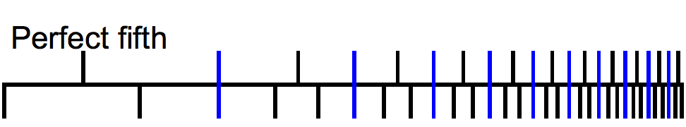

# 1.4.2 乐理：和声（Harmony） & 和弦（Chord）& 调性网络（Tonnetz）

我们对乐理音调到感观转换已有基本认知。但当我们遇到一些频率不在表中，且也不属于表中任意一个独立音调频率倍数（即其它音级），却又悦耳到想要记录的，非隶属单一琴键的声音时。或者想要合理的创造一种不存在于自然中的合成音时。音调频率比关系的平滑听感，就成为了指引。

它使我们可以通过已有音调频率的合理组合，以响度代替融合比例（可以说是古早的混音了，非常感性比较考验演奏者水平），来拟合新的声音。

在乐理中，称之为 **和声（Harmony）**。

## **和声（Harmony） & 协和（Consonance）& 不协（Dissonance）**

**和声（Harmony）** 是指将音调以两两形式组和，而产生新的声音的过程。当然，为了给予艺术发挥空间，不会也不能固定响度入内。所以，和声是指参与声音其音色频率链的合成。此处为了通用说明，需要固定图形化时，采用相同大小的抽象响度表示。

不过请注意，在实际在数字合成过程中，还是需要 **结合响度构建和声后的新谐波链的**。

<figure>
   
    <figcaption>
      
图 1.4.2-1 某钢琴同音级下纯一度（P1）与纯五度（P5）的泛音链和声图

   </figcaption>
</figure>

上例为同音级的 P1 + P5 和声（如 C4 + G4）。这样的一组声音同时弹奏时，为人们带来了听感上的和谐。而同音级下的 P1 + M2 和声（如 C4 + D4），则没有这么融洽：

<figure>
   
    <figcaption>
      
图 1.4.2-2 某钢琴同音级下纯一度（P1）与大二度（M2）的泛音链和声图

   </figcaption>
</figure>

从两者和更多样本的 **频率链重叠情况上**，过往的研究者们发现，如果参与合成的声音，在频率链上有 **较多的重合谐波** 时，人耳会觉得声音 **和谐（Harmony）** 不突兀。

而同音名不同级的 **乐理音调（Musical Note）**，其 **谐波链几乎完全重合，各频率总是相差 2 的整数倍大小**。如 C4 + C5 或 F4 + F6 等，几乎可以认为就是一个声音。依此称为 **完美协和（Perfect Consonance）**。

但相仿 P1 + P5 和声情况的音调组合，其 **谐波链存在较多重合，却依然可以被分辨**。我们称其为 **不完美协和（Inperfect Consonance）**。

而相仿 P1 + M2 和声情况的音调组合，其 **谐波链几乎很少重合，参与基音相对可辨**。我们称之为 **不协（Dissonance）**。

至于不协情况中，其 **谐波链在一定范围内完全无重合的情况，参与基音完全可辨**。我们称之为 **完全不协（Perfect Dissonance）**。

同理，可以扩展至更复杂的和声组合。

显然，**协与不协的问题，同人耳对频率的敏感度高度相关**。

仍然采用该音级 4 的例子。以 12 个音调间和声情况统计。距离 C4 基础音调的音程（Interval）和 大致频率比（C4: 当前音调，精确小数点后一位）如下：

<figure>
   
</figure>

表中，**橙色** 表示与 C4 完美协和，**黄色** 表示与 C4 不完美协和，**蓝色** 表示与 C4 不协，**靛色** 表示与 C4 完全不协。将统计扩展到整个当前音级中两两音调时，就有（音程 P1 省略比例）：

<figure>
   
</figure>

可见，
- 当两音调间音程 **为 $$[P1,\ P4,\ P5,\ P8]$$ 时**，两音调和声 **完美协和** ；
- 当两音调间音程 **为 $$[m3,\ M3,\ m6,\ M6]$$ 时**，两音调和声 **不完美协和** ；
- 当两音调间音程 **为 $$[M2,\ A4/d5,\ m7]$$ 时**，两音调和声 **不协** ；
- 当两音调间音程 **为 $$[m2,\ M7]$$ 时**，两音调和声 **完全不协** ；

至此，我们便可以利用此规律，使构成复杂和谐音的组成音，满足两两和声协和匹配。继而创造出新的声音。

**这种特殊的和声过程，即是和弦（Chord）。**

## **和弦（Chord）& 三和弦（Triad）**

以协和（包括完美协和、不完美协和）音程规律，取一组由升调方向选择的三个或更多音调组成的和声，在乐理中被称为 **和弦（Chord）**。
和弦以成组的两两相邻音间音程差异，分 **三度和弦** 和 **非三度和弦** 两个类别。

**三度弦，即以三度音程（包括 m3、M3）构成的一组和弦。** 根据组成的个数又可以细化为：**三和弦（三音）** 、 **七和弦（四音）** 、 **九和弦（五音）** 、 **十一和弦（六音）** 、 **十三和弦（七音）**。

**非三度弦，即音间音程非三度。** 情况则较为复杂，包括 **转位/离调和弦** 所代表的一系列和弦。

在工程上，相对较常用的是三度弦。而三度弦分类下，各中和弦概念存在基本规律，可以直接从三和弦向上衍生。因此，为了便于记忆，本书采用三和弦（三音）讲解。至于非三度弦的其它类型，借助对三和弦的理解，需要时再行查阅乐理专业资料即可。

**三和弦（Triad）** 的组成音有三个，根据 **升调** 顺序被分别称为 **一音（First）** 、 **三音（Third）** 、 **五音（Fifth）**。有时也称为 **根音（R [Root]）** 、 **中音（M [Mediant]）** 、 **冠音（T [Top]）**。
- **根音（R）**，即一音（First），指组成音中位于低音位置的音调；
- **中音（M）**，即三音（Third），指组成音中与根音音程三度的音调；
- **冠音（T）**，即五音（Fifth），指组成音中与根音音程五度的音调；
一般的，我们会结合两种称谓，用 **根音（Root）** 、 **三音（Third）** 、 **五音（Fifth）** 指代三和弦组成。

因为三度、五度包含了共有 **m3、M3、d5、P5、A5** 的 5 种音程在内的类型。在根音选定时，可以产生 4 种不同的组合方式，有：
- **大三和弦**，取 Root + M3 + P5，记为 $$R$$ ;
- **小三和弦**，取 Root + m3 + P5，记为 $$r$$ ;
- **增三和弦**，取 Root + M3 + A5，记为 $$R^+$$ ;
- **减三和弦**，取 Root + m3 + d5，记为 $$r^{\circ}$$ ;

**根音的选择是不受限的**，比如取 C4 即 C大调的主音为根音，则有 C4 下的 大/小/增/减三和弦分别为：	

$$
{\displaystyle 
 \begin{aligned}
   C   &= [C,\ E,\ G]        &c &= [C,\ E\flat ,\ G] \\
   C^+ &= [C,\ E,\ G\sharp]   &c^{\circ} &= [C,\ E\flat,\ G\flat] \\
 \end{aligned}
}
$$

而取 C大调 的 F4 为根音，则有 F4 下的 大/小/增/减三和弦分别为：	

$$
{\displaystyle 
 \begin{aligned}
   F   &= [F,\ A,\ C5]         &f &= [F,\ A\flat ,\ C5] \\
   F^+ &= [F,\ A,\ C5\sharp]   &f^{\circ} &= [F,\ A\flat,\ B] \\
 \end{aligned}
}
$$

**这种组合类型是固定的，可以类推至任意音调。理论适用于所有三度音程和弦，即三度弦。**

不过，因为音程之于 **自然音阶** 间的转换原因。通过组合公式，直接计算的方式依旧会显得比较繁琐。能不能参考五度圈对大/小调的查表方式，构建一个相类似的查表法，来快速完成多音调的和弦组合呢？

答案是可以的，**调性网络（Tonnetz）** 就是答案。

## **调性网络（Tonnetz）**

**现代调性网络（Tonnetz）原型**，来自于数学大家 **莱昂哈德·欧拉（Leonhard Euler，1707～1783）** 在早年尝试的，以数学建模构造良好合声的探索 [\[10\]][ref] 。欧拉首次采用数学图论方法，解决和弦问题，提出了 **欧拉调性网络**（Euler's Tonnetz，Tonnetz 是德语，相当于英文的 Tone-net）。

<figure>
   
    <figcaption>
      
图 1.4.2-3 欧拉论文原稿中的调性网络（Euler's Tonnetz）示意图

   </figcaption>
</figure>

欧拉调性网络可视化的表示了，协和和弦间的音程关系。从上而下的标识了两种联系。位于 **上方的音调**，其 **左分支** 是距离它最近的五度（P5、d5、A5）音程对应音调，而 **右分支** 是距离它最近的大三度（M3）音程对应音调。例如，F->C（F4->C5） 有 C 是 F 的 P5，F->A（F4->A4） 有 A 是 F 的 M3。全图涵盖了同音级下的一套完整标准十二律。

不过因为范围和和弦上的局限性，欧拉调性网络没有得到太多的应用。

状态一直持续到 19 世纪时期末，被 **胡戈·里曼（Hugo Riemann，1849～1919）** 打破。

胡戈·里曼结合五度圈查表法有关升降调的螺旋延展性，在对 **大小调间和弦二元性（Major/Minor Chord Dualism）** 的研究时，发现了大三和弦和小三和弦间，在欧拉调性网络沿音级的五度展开上。可以通过简单的 **平移变换（Schritt）** 和 **倒影变换（Wechsel）**，得到同源与相邻向上/向下和弦效果。由此，提出了 **里曼理论（Riemannian Theory）**。并在这之后，将原有两个主要变换中的倒影变换，扩展到了 关系变换 与 导音变换 双变换。结合原有大小和弦二元论的 平移变换，构成三主要变换体系 [\[11\]][ref] ，称为 **新里曼三元理论（Neo-Riemannian Triadic Theory）**，简称 **新里曼理论（Neo-Riemannian Theory）**。

<figure>
   
    <figcaption>
      
图 1.4.2-4 新里曼理论（Neo-Riemannian Theory）的三主要变换

   </figcaption>
</figure>

注意，上图中选择三和弦时，**必须按照从根音到冠音的相同箭头方向选择**。箭头表示了 **位于下一位** 的组成音。

 

依托调性网络的几何化，新里曼理论的 **三种主要变换**，分别是：

**P变换（P Transformation）**，即 **平行变换（Parallel Transformation）**。如上图蓝色箭头标识关键步骤。 **P变换只能在完全相同主音的自然音阶，即同一大/小调，内进行。**

在已知一则三和弦组成情况下，查询根音（Root）和五音（Fifth）相同的另一组三和弦的方式。再以根音五音连线作为平行四边形对角线，用两组三音（Third）构造平行四边形。、结果中与原三和弦中音相对的另一角，为所求和弦中音。如图中 $$C = [C \rightarrow E \rightarrow G] \ \& \  c = [C \rightarrow E\flat \rightarrow G]$$ 。

P变换，让我们能够快速完成 **同主音间 大/小三和弦** 的转换。

 

**R变换（R Transformation）**，即 **关系变换（Relative Transformation）**。如上图红色箭头标识关键步骤。 **R变换只能在主音音程互为小三度（m3）关系的自然音阶，即关系调（Relative Key），间进行。**

在已知一则三和弦组成情况下，通过将五音（Fifth）升/降一个五度（P5、d5、A5），再次以移动后的五音（Fifth）与原三和弦三音（Third）查询 大/小调的同位关系三和弦。构成结果平行四边形的另一角，就是升调方向时所求关系大调五音，或降调方向时所求关系小调根音。如图中 $$c = [C \rightarrow E\flat \rightarrow G] \ \& \  E\flat = [E\flat \rightarrow G \rightarrow B\flat]$$ 。

R变换，让我们能够快速完成 **关系调间 大三和弦 与 小三和弦** 的转换。

 

**L变换（L Transformation）**，即 **导音变换（Leading-Tone Transformation）**。如上图靛色箭头标识关键步骤。 **L变换只能在主音音程互为升调方向纯五度（P5）关系的自然音阶，即相邻调（Adjacent Key），间进行。**

在已知一则三和弦组成情况下，通过将五音（Fifth）升/降一个大三度（M3），查询新位置下的五音所处的三和弦。构成结果平行四边形的另一角，就是升调方向时所求相邻调五音，或降调方向时所求相邻调根音。如图中 $$A\flat = [A\flat \rightarrow C \rightarrow E\flat] \ \& \  c = [C \rightarrow E\flat \rightarrow G]$$ 。

L变换，让我们能够快速完成 **相邻调间 大/小三和弦** 的转换。

 

新里曼理论，进一步完善了现代调性网络的音程变换图系统。使得以该理论为根据的几何建模，存在 **无限延伸的音调覆盖** 和 **快速可查** 的特点。从而变得足够泛化且实用。由此绘制而成的新里曼理论平面拓扑调性网络，成为了三和弦的快速查表法的基石：

<figure>
   
    <figcaption>
      
图 1.4.2-4 新里曼理论（Neo-Riemannian Theory）的三主要变换

   </figcaption>
</figure>

再配合上五度圈的自然音阶快速确定，与音序频率表的音调频率映射关系，即可完成对和弦的音调频率转换。
以频率，打通乐理到心理声学、声乐工程的关系。

至此，我们已经掌握了基础的乐理观测方法，并能够较为客观的评判。而在前文中，我们提到人耳对频率的感知，是促成一切的关键。而心理声学的实验结果，是其客观数据化的前提。
那么，其具体是怎样的测量过程，而结果又是怎样体现的呢？

这就需要提到 **等响曲线（Equal Loudness Level Contour）** 了。

[ref]: References_1.md
