# 1.4.4 感观：频响曲线（FRC [Frequency Response Contour]）

**频率响应（Frequency Response）** 用来指代某系统（既可以是设备，也可以是人，泛指针对频率的感知器）在 **接收频率（Frequency）输入时的输出响度（Loudness）（或最佳接收响度）** 的特点 [\[16\]][ref] 。是描述设备频段内，**频率响度尺度** 的客观测定结果。

频率响应是对声音的响应。我们需要先了解，怎样描述一个单音在某时刻的特征，才能更好的理解什么是频率响应。虽然两者并不相同。

另外的，**声音的频率响应** 和 **电路学（Circuitology）中的频率响应效应**  也是 **非等位** 的概念（虽然两者有着一样的名称），注意区分差异。电路学频率响应效应不在本书范围。

 

需要注意的是，前文中介绍的 **频律响度特征（FLF）** 虽然和 **频率响应曲线**（FRC，泛指所有频率响应的绘图结果）采用了 **相同的坐标系设置**，并因横纵坐标一致，而能够同参考系内展示。但是 **两者含义完全不同。切勿混淆！**

## **频率 响应（Response）与 响度（Loudness）的辨析**

**响应是某系统的尺度**，而 **响度是系统尺度下的值**。响度对应的尺度，既可以来自于 考察范围内的某系统响应（例如，某设备），也可以来自于更大范围的相对客观系统（例如，自然界）。考察范围，就是该声音传播感知链中的设备部分。

对于 **相对客观系统**，因为一般作为 **响度的基础标的**，当其他系统属于其子系统时， **子母系统尺度转换的响度不需要放缩**。而只有 **发生于兄弟系统间的尺度变换，需要放缩交互时的响度**。

因此，在采用 **ANSI/ASA S1.1-2013** 或 **ISO 226 系列** 规格中，以 **声压级（SPL）** 的相对客观 **分贝（dB）** 单位表示响度作为前提。如果在 **考察范围内传递**，**不同兄弟系统** 下的响度，就需要 **将前一级** 的响度值，**从源尺度变换为新尺度**，计算 **放缩后的抽象值**。

例如，从自然届的客观环境测量某单一频率纯音为 50dB，在当前采样设备上，有该频率下 0～100dB 的响应范围，采样到的该频率为 50dB。但如果采样后，接收该频率的下一级设备只有0～60dB 的响应范围，则经过该二级设备处理后，源频率就变成了约取值 30dB 大小。当然，实际上 **并不是** 可以通过 **计算得到的**，而需要进行 **频谱测量**。但 **大致变化的形势，可以等效来看**。

即，存在 **非精确换算** ：

$$
{\displaystyle 
 \begin{aligned}
   L_{dev} \approx \frac{FR_{dev}}{FR_{ori}} \cdot L_{ori} \\
 \end{aligned}
}
$$

以参考值，表示该设备对前一级输入的影响。

而设备频响是如何测定的呢？

其测量的方式为，在保证输入声音的复合响度值不变的前提下，逐步增大指定频率的响度（保证复合响度不变则通时衰减其他频率响度），直到达到复合响度值。最终测得的该频率响度上限，就是该复合响度下的对应频率频率响应上限。 **上限可以为负数，代表该复合响度下，无法感知指定频率**。

同理，将该频率的响度衰减到 0 并保持复合响度不变时，得到的就是该复合响度下的该频率的频率响应下限。当然，**下限值不出意外一般都是 0 ，并不会高于上限**。也就是，当上限为 0 或负数时，下限也不存在意义了。

## **频率响应在不同系统下的作用**

为了便于说明，本书将 “某系统” 分成三种：接收声音转换为信号的 **收音设备（Hearer）**，接收信号并输出声音的 **放音设备（Speaker）**，和 **末端系统（Terminus）**。

- 对于 **收音设备（Hearer）**，频率响应反应的是，当收音设备 **接收到声音信号后**，由设备本身决定的当前放音音量下，**能够感知到** 声音包含频率中，某 **单个指定频率** 的实际 **响度尺度**。什么是收音设备呢？诸如，人耳、麦克风、MIDI 测试仪、助听器 等，用来接收声音或临耳（临近末端）播放的东西。

- 对于 **放音设备（Speaker）**，频率响应反应的是，当放音设备 **接收到频率信号后**，由设备本身作用而产生 **相应频率声音的最大响度**，与 **输入频率** 之间的关系。什么是放音设备呢？简单来说，就是例如：人的声带、音响、麦克风、钢琴等乐器、蜂鸣器、耳机 之类，能够产生声音或提供声音至后级的东西。

- 对于 **末端系统（Terminus）**，频率响应表示的则是 **感知的终点**。其自身拥有的 **听阈（Hearing Threshold），决定了最终结果**。而 **听阈就是该系统对声音感知的等响曲线围成的范围**。这里的末端系统，指的即为整个传播感知链的最尾端。不一定为人的神经系统，也可以是测量仪器，或者存粹的虚拟端。

频率响应对于三种设备的意义不同。但三者都会以人类较通用的听觉频率范围（20～20000Hz），作为 **主要区段（Major Range）** 进行考察。

除了末端系统（Terminus）的频率响应可由等响曲线衡量，收放音设备的频率响应情况，则还需要其他方式表示。

## **收音频响曲线（HFR [Hearer Frequency Response]）**

我们将作用于收音设备的频响曲线，称为 **收音频响曲线（HFR [Hearer Frequency Response]）**。HFR 被用来确认 **收音设备的优良程度**。代表 **收音设备的收音频段的频率敏感范围，和响度尺度关系**。

而根据情况差异，对收音设备的衡量，既可以按照其 HFR 可以有效地重现 20～20000Hz 的整个频段（如监听麦克），也可以限制在可听频谱内的较小频段（如通讯麦克）。

以 HiFi 收音为例：

<figure>
   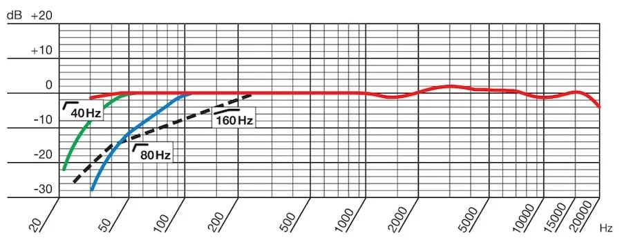
    <figcaption>
      
图 1.4.4-1 AKG C414XLS 麦克风的 HFR

   </figcaption>
</figure>

如上图所示，我们选择 AKG C414XLS 来做 **全向收音**。从 C414XLS 的官方 HFR 上，可以看到在 40 Hz 、80Hz 、160Hz  基音频率的声音采集时，C414XLS 频率响应从对应采集频率起始点位置（横坐标的 **基音频率** 作垂线至图中 **标记的当前频率线焦点**）至 20000Hz 频段，基本都控制在了 ±3dB 范围内，且有较少的波动。说明了 C414XLS 有一个近乎完美平坦的频率响应曲线，能够 **更好的** 保存采集声音的清晰度和立体感。

由此，我们引申出了衡量 HFR 好恶的 **主要考察指标**：
即，**从采集频率位置** 开始的 **足够平直（Flat）** 和 **足够光滑（Smoothly）**。

平直且光滑的 HFR 代表着，收音设备能够以 **相同大小的响度尺度**，来 **采集** 任何落于 **频段范围** 内的声音，而不会引入较大的设备误差。从而使得接收的声音，在经过本级处理后，**不会** 输出发生形变的原声采集信号。

由于采集基本是满尺度，响度尺度在 HFR 上基本等同于当前响度了。所以，为了规范和便于区分，通常会在 HFR 中采用相对于原声的响度差，来表示还原程度。即 HFR 的纵坐标，表示的是 **采集结果尺度对比原响度差值**，称为 **相对声压级（Relative SPL）**。

## **放音频响曲线（SFR [Speaker Frequency Response]）**

我们将作用于放音设备的频响曲线，称为 **放音频响曲线（SFR [Speaker Frequency Response]）**。SFR 被用来确认 **放音设备的优良程度**。代表 **放音设备的防音频段的响度尺度，和频率稳定范围关系**。

同 HFR 类似，衡量 SFR 好恶主要考察指标，几乎与 HFR 一致：
即，**从附和误差范围** 的起始点后，有 **足够平直（Flat）** 和 **足够光滑（Smoothly）** 曲线。

平直且光滑的 SFR 代表着，放音设备能够以 **相同大小的响度尺度**，来同尺度的 **播放** 任何落于 **频段范围** 内的，**未超过尺度范围响度** 的声音。这同样意味着，该放音设备不会引入较大的设备误差，从而导致接收的输入信号，或者前一级输出声音的频率响度特征，在本级输出发生形变。

因此，**理论上的最佳 SFR 就应该是一条直线**。

<figure>
   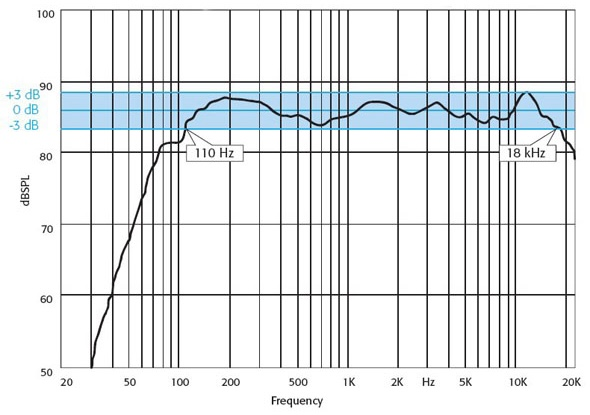
    <figcaption>
      
图 1.4.4-2 一条在 110～18000Hz 下（±3dB）平直的 SFR 样例

   </figcaption>
</figure>

这样的理想状态，基本无法企及。所以，参考 HFR 测定的区间量，SFR 设置了 **浮动标准**，即 **在一定的响度范围内的相对水平** 即可。如上图，就是音响某设备的 SFR 测试结果。该设备在 110～18000Hz 有响应均在 ±3dB 的修正内，称 **该设备 110～18000Hz（±3dB）平直**。这既是它的 SFR 属性。**对于人造设备来说 SFR 一般是固定的**。

而对于 **生物器官**，例如动物或人的声带等，**衡量 SFR 是没有意义的**。生物声带 SFR 受客观个体差异的影响，是独特且不一而同的（相比工业制品）非平直曲线族构成的区域范围。

生物有通过改变声带的大小和形状，来产生不同的声音的能力。这使得其可以 **经由训练**，来调整自身在某些声音频段上的频率响应，**来达到更高或更低的频率稳定的响度增减**。这种动态的能力，让生物具有了 **动态的频率响应范围**。同时，也可以后天调整频率响应表现。

例如，经过训练的歌手，其好听的嗓音究其原因，就是在处于自身主要声音特色频段，且适合自身音量大小的发声时，有着快速变换音调（基音）但始终处于相对光滑平直的 SFR 的能力。

 

如果我们能够使人造放音设备也具有这样的能力，或许也能实现根据不同的需要，动态调整放音频率响应。不过这样的技术成本太高。且由于需要考虑共振等因素，不一定能够得到我们想要的平滑平直 SFR ，让市面上并没有这样的产品。

大多数音响类产品，在 **对自身品质有自信** 的情况下，都会给出 SPR 以提供客户参考。

<figure>
   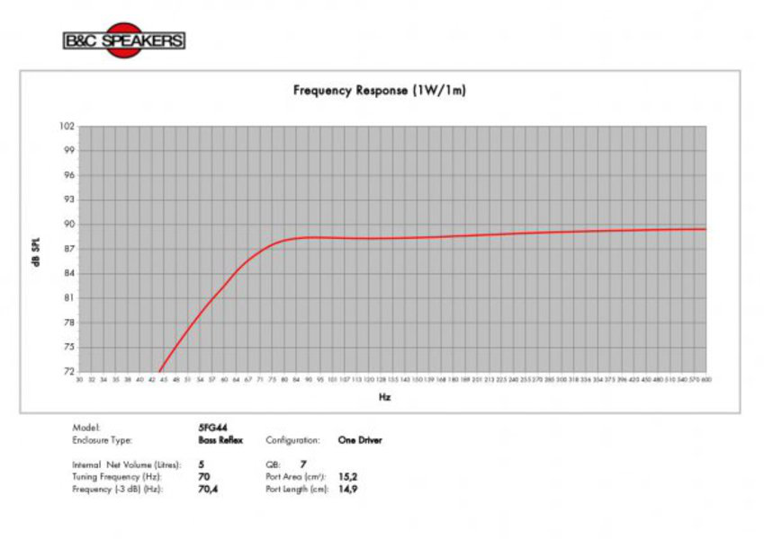
    <figcaption>
      
图 1.4.4-3 B&C 的 5FG44 喇叭单元官方 SFR

   </figcaption>
</figure>

上图为意大利 B&C Speakers 公司给出的，在空间响度恒定在 92dB 的情况下，测得自家低频驱动器 5FG44 喇叭单元的官方 SFR 。

但 SPR 并不一定都可以这么轻松获取，大多时候我们只能得到 SPR 结果的范围参数。在这种情况下，不参考 SFR 比较两个设备的好坏可用：**固定频段比较浮动范围**，或者 **固定浮动范围比较频段**。两者都是快速判断的办法。**频段越广，浮动范围越小，则设备越优秀**。

现在，让我们进入一个完整的感知过程。

## **传播感知链 & 频响上下文（Frequency Response Context）**

**以录音棚采样这一事件举例**。在监听的过程中，通常调音监理希望对链路的声源，产生的声音特征，进行完整的保存，直到进入终端（也就是人的神经系统）评估。在这种上下文语境的理想状态下，最终的末端接收的声音频率响度特征，需要 **尽可能的和声源频率响度特征保持一致**。

假设此时歌唱者发出了一个单音，整个传播感知链如下（实际情况中的曲线要复杂得多）：

<figure>
   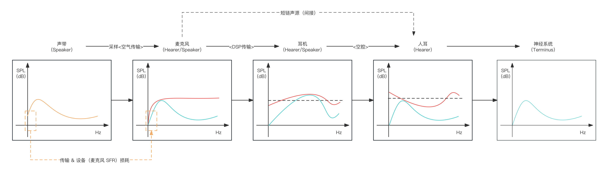
    <figcaption>
      
图 1.4.4-4 录音棚采样场景的理想传播感知链模拟

   </figcaption>
</figure>

图中，
- **橙色线**，表示 **歌唱者该时刻单音** 的 **频率响度特征（FLF）**；
- **红色线**，表示作为 **收音/放音设备** 时的 **收音频响曲线（HFR）/放音频响曲线（SFR）**；
- **蓝色线**，表示 **传输过程** 中，源单音在该级下的 **频率响度特征（FLF）**；

上例就很好的展示了，三类设备间的关系。对于前一级来说的收音设备，对于其后一级而言，是它的放音设备。

但这种监听模式，即 **狭义上的 HiFi（High Fidelity）**，是否和人直接听到相同的声音的感受一致呢？答案可能和大部分发烧友的直观认知不一致，那就是“不是”。或者说，**这种 HiFi 上的听觉感受，更近似于通过骨头传导下，歌唱者自己听到的自己的原声**。

同样情况下，假设聆听声音完全一致。不考虑位姿（听声方位不同，也会导致听到的声音不同，这部分不在本书讨论范围内），存在一个站在声源附近，直接通过空气传播，用耳朵来听的聆听者。此时，他的传播感知链如下（图例中略微夸张了效果）：

<figure>
   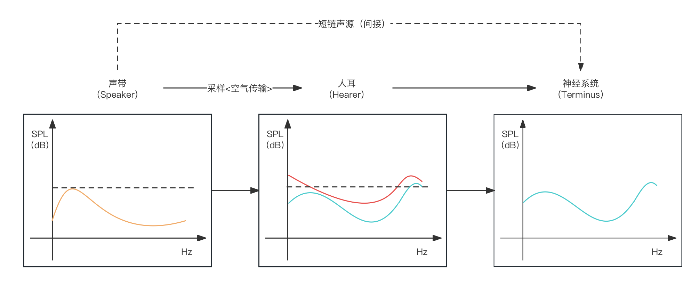
    <figcaption>
      
图 1.4.4-5 录音棚内听众（假设）场景的理想传播感知链模拟

   </figcaption>
</figure>

显然，**相同声源的某个音，在不同体系的传播感知链下，有不同的末端系统（Terminus）的直观感受**。而 **决定不同体系的关键背景要求（Majot Background Requests）**，就被称为 **频响上下文（Frequency Response Context）**。

可见，背景条件（即上下文）的不同，对需求的频率响应的衡量方式，也是完全不同的。因此，在实际情况中，背景信息至关重要，决定了我们如何利用频率响应进行有效的分析和处理。界定上下文，往往是开始频响分析的第一步，也是最为关键的一步。

为了方便理解，以频率响应应用的 HiFi 监听领域，来作为下文讲解的 频响上下文。

## **监听 HiFi 耳机的 SFR 设计原理**

这里或许已经有读者存在疑问。即然 平直光滑 是衡量 HFR & SFR 的统一标准。那为何在上文的 HiFi 传播感知链中，理想监听耳机的 SFR 却并不平直呢？

 

先考虑一个类似的场景，例如电影院的声场营造。

对于影院，理想的放音设备，应尽可能的在接收到指定范围频率的等响度输入时，能够响度恒定（理想）的输出该频段的任何声音。从而在音源上，物理客观的保证对输入的恒等还原。但有时，因为设备本身或者环境因素，我们需要突出或只产生某一个频段的声音时，此时的 SFR 就被用来作为调整的依据，突出一些某频段并减弱一些评断。直到设备的 SFR 被控制在突出该频段下，有最大响度的最佳反馈。

有来自于《声音的重建》其作者的研究工作，在平稳 SFR 输出音响下，各类影院在座位处的 HFR 综合统计 [\[17\]][ref] ：

<figure>
   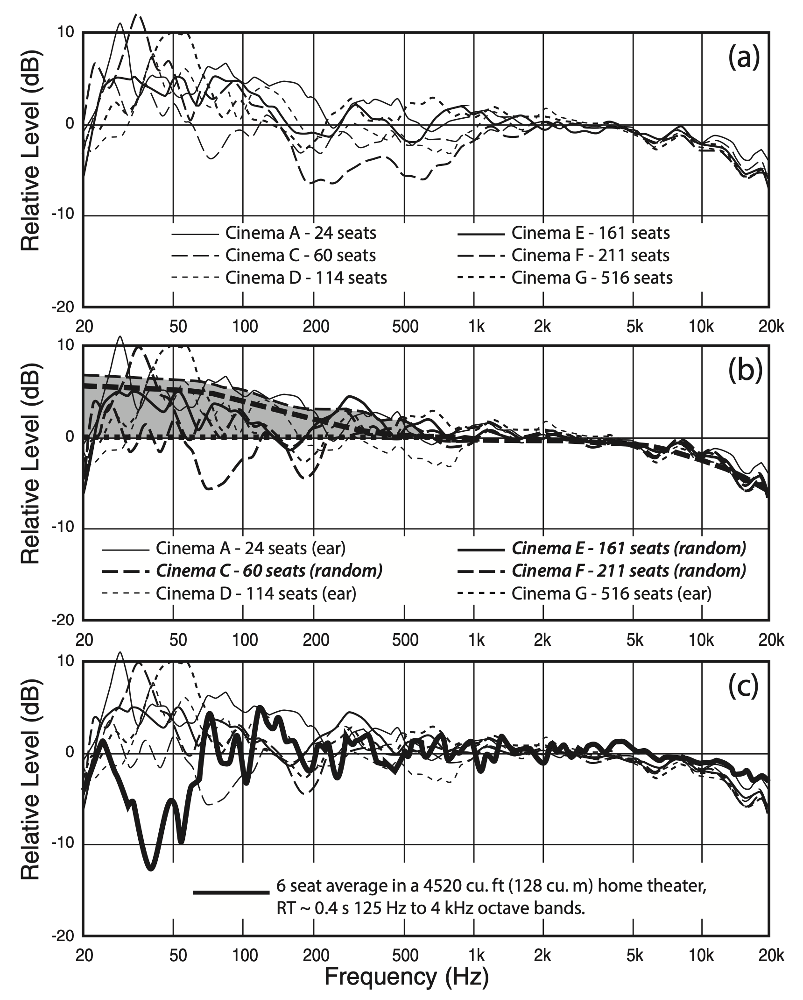
    <figcaption>
      
图 1.4.4-6 不同大小影院的座位平均听感 HFR 统计数据 <a href="References_1.md">[17]</a>

   </figcaption>
</figure>

上面展示了影院环境下，座位上的 HFR 已经不是平稳的了。因此，为了保证座位处的听感一致于自然环境听感（类似于前文中举例的录音棚内听众直听），就需要让音响的 SFR 在 20～1000Hz 有一定程度的响应（即响度尺度上的）衰减。这么做的结果就是，影院音响的 SFR 会在低频和中频的频段，不够平直。

所以，为了抵消环境或个体等的主客观影响，会调整发音设备，使其 SFR 满足条件。如下：

<figure>
   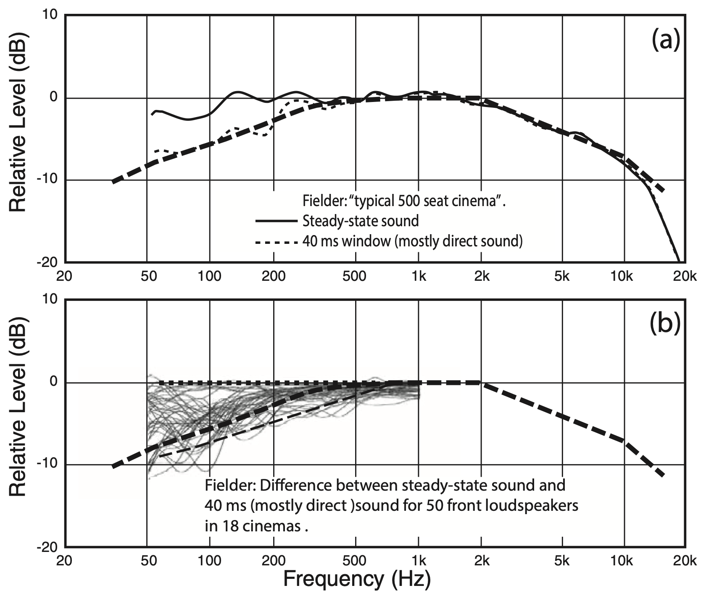
    <figcaption>
      
图 1.4.4-7 影院环境根据座位平均听感 HFR 对音响调节结果 SFR 示意图 <a href="References_1.md">[17]</a>

   </figcaption>
</figure>

同理，当我们处于 HiFi 监听的频响上下文时，由于直贴人耳，以及 HiFi 期望对歌手原声完全还原的目标，也需要对耳机进行调整，使得耳机的 SFR 可以抵消人耳的听阈特征。

 

这意味着，需要监听耳机尽可能的在接收到指定范围的频率时，能够拟合人耳（或最终感知器）在对应响度下的频响曲线。从而保证，通过前级与本级的 HFR 增减向消，实现传递数据的线性稳定。最终在末端感知节点的源数据还原时，具有目标一致性。

想到这里，首先就是如何获取人耳在对应响度下的频响曲线。这点其实很容易，只需要对照 等响曲线（ELLC），按照相应的输入响度声压级（SPL）转方（Phon）单位后，查找所在曲线即可。查到的曲线（当响度并不在图中，而是落于两曲线间时，需要计算等效曲线），就是 **当前响度下的人耳频响曲线**。

以 50dB 为例，由于在满足 ISO 标准条件下有 $$1\ dB = 1\ Phon$$ 可知，需要查找的等响曲线为 **50 方（Phon）等响曲线**。

有下图（ **橙色** 为查找结果）：

<figure>
   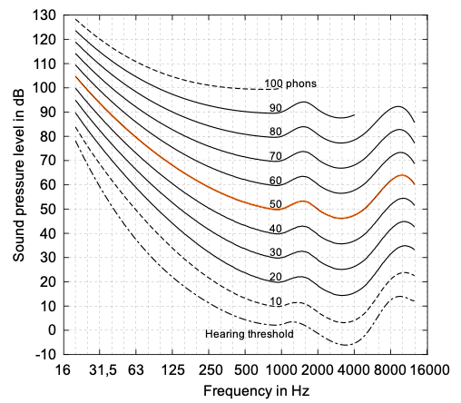
    <figcaption>
      
图 1.4.4-8 ISO 226:2023 标准等响曲线截取 50 方（Phon）线

   </figcaption>
</figure>

这即为所需 50dB 输入下的人耳平均频响曲线，即 **50dB 的人耳 HFR**。显然这只是个平均统计数据（非常高端的定制 HiFi 耳模入耳式耳机，除了采样耳道模型来制作耳机音道外，还会为每个人都进行个体 ELLC 测量，并基于测量结果，独立设计专属于个人的耳机 SFR，但这么做不适用于批量生产且极度昂贵）。

那么，想要 **抵消掉这种频响情况**，让听者能够完整感受到歌唱者的原始声音，该怎么做呢？

只需要，让生产的耳机在选定的响度输入时，其 SFR 每个频率下的响度尺度，完全与此时人耳 HFR 对应频率下的响度尺度，以 **50dB 水平线为轴对称**，就能达到效果。如下：

<figure>
   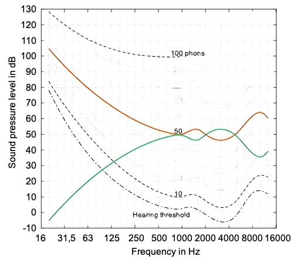
    <figcaption>
      
图 1.4.4-9 基于 ISO 226:2023 的 50 方（Phon）线设计的入耳耳机 SFR

   </figcaption>
</figure>

上图中，**绿色线** 即为想要在 50dB 响度下达到完全监听 HiFi 效果的入耳式耳机，其理想的 **50dB SFR 曲线**。入耳式耳机由于没有空胞（即耳罩式耳机，发生单元与耳朵间的空腔）问题需要考虑，等效下待处理的只有人耳 HFR 曲线，因此才会呈现出对称关系。

**以该 SFR 调整设备，直到设备频率响应近似如此，就能达到最好效果。**

不过，耳机这种人造设备，其频响特性基本是固定的。这代表着，如果我们选定一个响度作为 **基准响度（Standard Volume）**，那么在设备面临或高或低的其他响度输入时，其 SFR 是会有一定程度形变的。也就是说，我们只能尽可能的保证在选定基础响度的一定误差范围内，贴合抵消该响度范围内的人耳 HFR 曲线。

所以，**我们需要一定的标准，来方便生产活动的统一产品质量衡量**。 **哈曼曲线（Harman Target Curve）** 就是这类标准之一。

为什么是之一呢？因为人耳的特殊性和厂商各自的特色，不同厂商或研究机构，基于不同的样本集，指定了多种适用于一定范围人群或自身产品特色的 SFR 标准。而 **哈曼曲线则属于其中被接受程度最广的标准之一**。

搞清楚哈曼曲线，对于其他类似的标准，即可举一反三触类旁通。

## **哈曼曲线（HTC [Harman Target Curve]）**

**哈曼曲线（HTC [Harman Target Curve]）** 是用类似于前面本书提到 “ 50dB 响度时，入耳式耳机 SFR 抵消 人耳 ISO 226 标准 50Phons HFR” 的目标导向，获取的 **人耳 85dB 情况下** 的 HiFi 场景，用于设备参考的 **主观测量 SFR 标准**。

最早的 HTC 2013 标准，是由 **肖恩·奥利佛（Sean Olive）** 博士 和 **哈曼音频实验室（Harman Audio Lab）** 的其他研究人员，在 2013 年利用研究所条件，设计了 6 组 **双盲试听对比实验（Double-Blind Listening Test）** 测得的，经修正后听者 HFR 采样均值曲线。

<figure>
   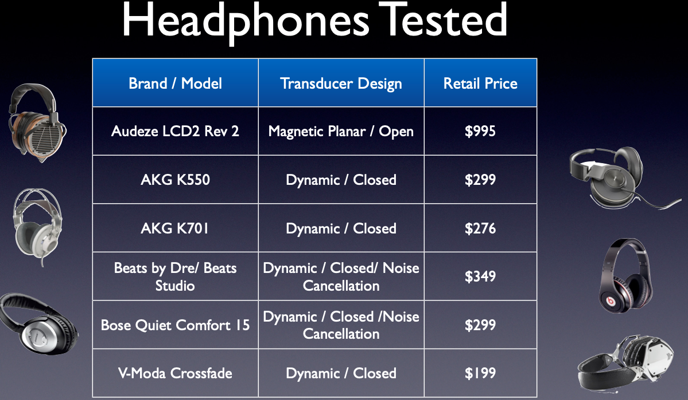
    <figcaption>
      
图 1.4.4-10 哈曼曲线 2013 标准实验采用的测试听力设备 <a href="References_1.md">[18]</a>

   </figcaption>
</figure>

他们对如上表单的听音设备，进行了 **每组 10 位不同听力情况听众** 的，听众评分和设备频响曲线测试和统计，最终得到了如下结果：

<figure>
   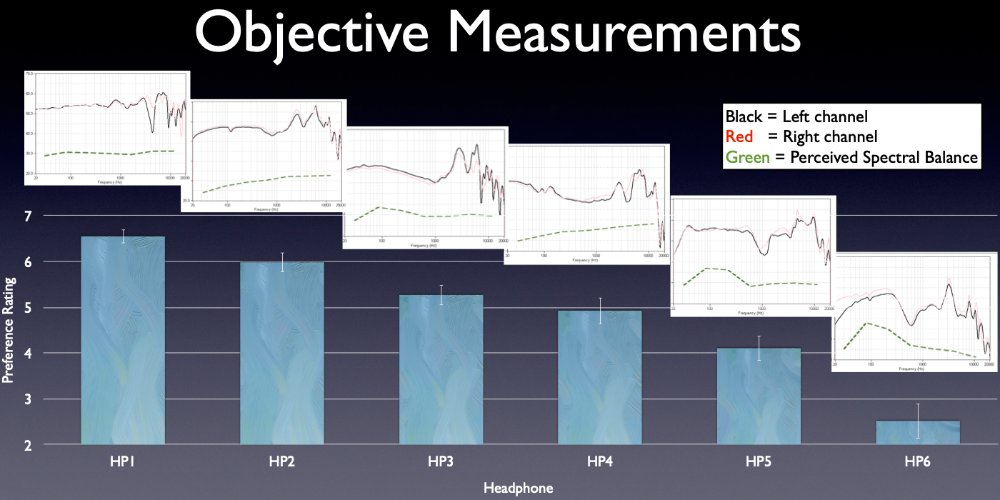
    <figcaption>
      
图 1.4.4-11 哈曼曲线 2013 测试听力设备听众评分与设备 HFR 结果 <a href="References_1.md">[18]</a>

   </figcaption>
</figure>

奥利佛博士和其团队，将 **评分最高的 HP1～HP4 组的 HFR 数据**，进行了基于 **感知均衡** 情况（图中绿色线即为均衡器调整）的 **平均化修正**，再将四组结果进行了拟合，得到了光滑的设备 85dB 时的 **HFR 人造曲线**。

<figure>
   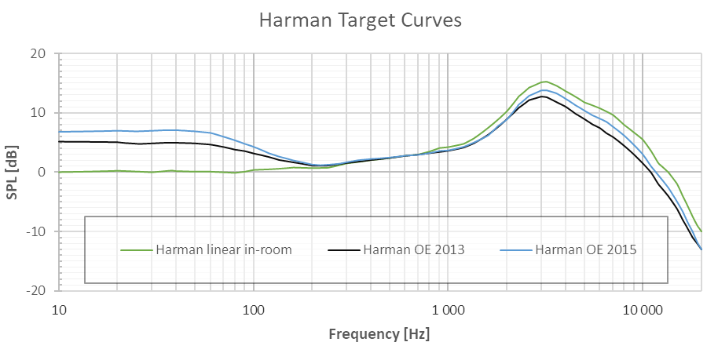
    <figcaption>
      
图 1.4.4-12 哈曼曲线 2013 和 2015 标准

   </figcaption>
</figure>

以此，认为贴近于该曲线的耳机设备，有着满足大多数人最佳听感的主观度量曲线。

不过由于样本量过小，2013 年的测量结果并没有足够的说服力。为了解决说服力问题，在 2015 年、 2017 年，哈曼曲线又经过了两轮样本量级和受试设备的扩充，并重新测定了结果。

而最 **新一次的测定就是 2017 年的 HTC 2017标准**。相对更具有参考价值：

<figure>
   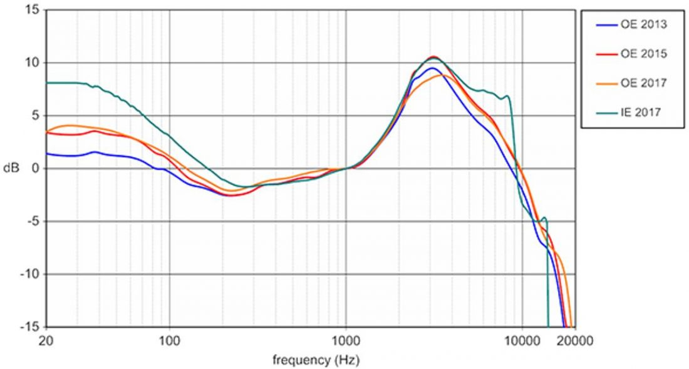
    <figcaption>
      
图 1.4.4-13 哈曼曲线 2013 和 2015 标准

   </figcaption>
</figure>

但正如 肖恩·奥利佛 本人所言，“It is important for the reader not to draw generalizations from these results beyond the conditions we tested.” （“重要的是，读者不要从这些结果中得出超出我们测试条件的概括。”） [\[19\]][ref]

**哈曼曲线只能是参考，是存在大量主观作用和客观条件的。只能作为一种主观标准提供有限的意见。而这也和其他类似的耳机 SFR 标准，有着同样的问题。**

至于具体是否能先觉的量化每个人的听觉体验呢？或许肖恩博士的另一句话，会有更大的参考价值，那就是 [\[19\]][ref]：

 

*“It makes perfect sense, at least to me. Only then will listeners hear the truth -- music reproduced as the artist intended.”（“至少对我来说是这样的。（不过也正是）只有这样，听众才能听到真相——音乐按照艺术家的意图复制。”）*

 

**这就是感官感受和工程测量的不同了。**

[ref]: References_1.md
