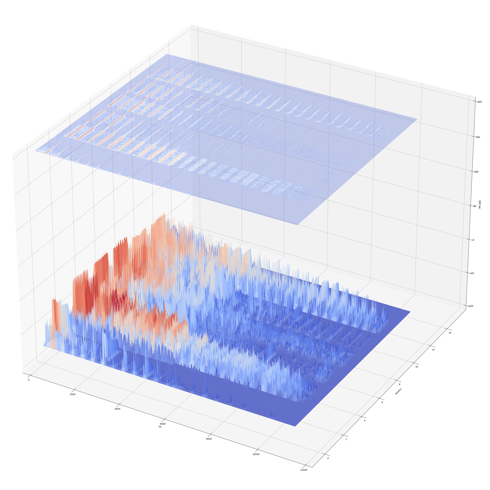
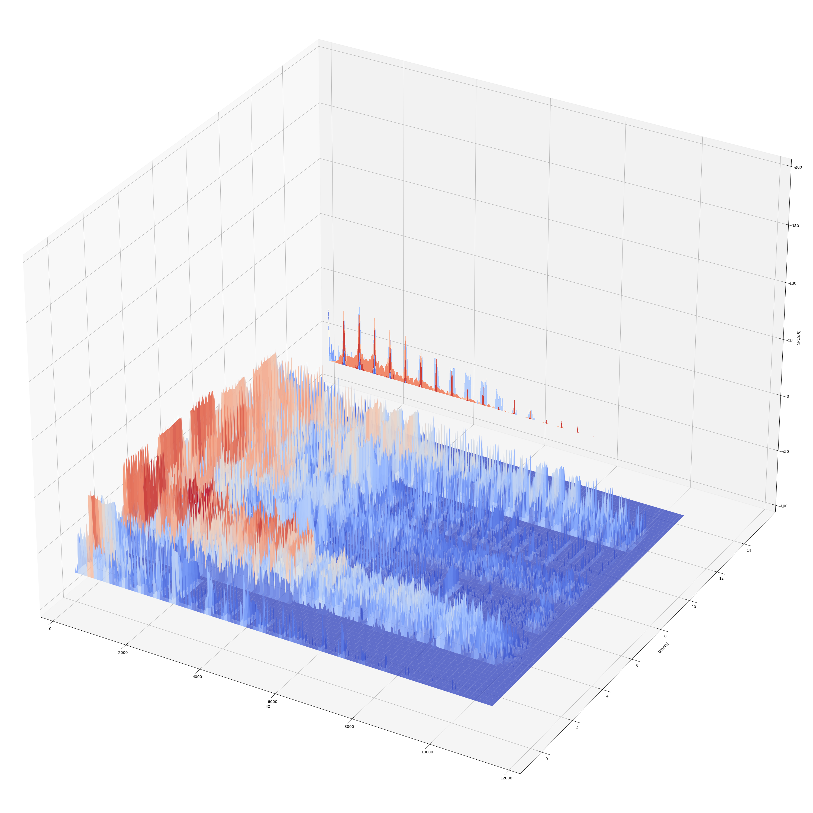

# 1.4.5 工程：频谱图（Spectrum）

如果说之前我们介绍的几种对声音的解构方式，或多或少都显得有些唯心的话，那 频谱图（Spectrum）则是一种纯客观的声音度量与观测法了。

**频谱图（Spectrum）** 是对持续一段时间的某段声音，其频率情况在由 **指定频率区间** 与 **时域** 构成 **复平面（Complex Plane）** 上展开的可视化描述图。同 某时刻声音的频率响度特征（FLF）一样，需要利用傅立叶变换时频分离获取。而从从时间流逝的角度，即时间轴作为 z轴 来观察，两者也存在相互关系。

## **频率响度特征（FLF）与频谱图的关系**

可以认为，**如果时间是离散的，频谱图就相当于由该声音持续长度时间的一系列各个时刻 频率响度特征切片，构成的图表**。

虽然频谱图中的时间被认为是连续的（实际只是步长较小而已，毕竟考虑计算及性能，会采用从属于傅立叶离散变换的 **短时傅立叶变换（STFT [Short-TIme Fourier Transform]）** 快速处理），但参考 FLF 的生成方式，只需要 **小范围求平均** 就能完成切片。

如下：

<figure>
   
    <figcaption>
      
图 1-34 一组乐器演奏 A4 音调约 12s 的 3D 频谱图

   </figcaption>
</figure>

上图就是一张完整的频谱图，如果我们在 5s左右截取前后 100ms 左右数据，并取平均。就能获得其在 5s 左右 ±100ms 范围的频率响度特征（FLF），而这结果在之前的章节中，已经见过了，即：

<figure>
   
    <figcaption>
      
图 1-35 多乐器演奏音调 A4 时在 5s 处取 100ms 所得频率响度特征

   </figcaption>
</figure>

而这张频谱图，就是该 FLF 的声源分析结果（具体的生成用代码，在本书第五章节提供）。

因此，**通过某段声音的频谱图分析，我们通过切片手段，能够获取该声源，在任意时刻的频率响度特征**。这也是为什么，频率响度特征，有时被称为频率响度切片的原因。

**一般的，若无特指，声音的频谱图皆代指该声音的 三维频谱图（3D Spectrum）。**

## **频率响度特征（FLF）与频谱图的关系**

显然，频谱图有三个坐标轴，分别是 时间轴（Time Axis）、频率轴（Frequency Axis）、响度轴（Loudness Axis）。三个坐标轴两两构成平面，而这些平面在某种程度上，提供观察声音信息的不同视角：

- 由 **时间轴（Time Axis）** 和 **频率轴（Frequency Axis）** 构成了 **时频切面**；
- 由 **时间轴（Time Axis）** 和 **响度轴（Loudness Axis）** 构成了 **波形切面**；
- 由 **频率轴（Frequency Axis）** 和 **响度轴（Loudness Axis）** 构成了 **频响切面**；

可见，前文中有关声音在乐理和感受上的解构，多发生于 波形切面 和 频响切面（尤其是后者），及其关联平行平面（如 ELLC、FRC 等）的观察窗口。可以说是 **对该切面信息主观度量的衍生产物**。

## **语谱图（Spectrogram）与 时频切面（TFS [Time-Frequency Section]）**

**时频切面（TFS [Time-Frequency Section]）** 能够用来获取，**在指定响度大小情况下，严格满足该响度的频率随时间的分布关系**。由于单独看某一个固定的响度值下的时频关系，并没有太大意义，因此常以某声音完整数据的所有响度时频切片，按照切片所处响度高低用不同颜色表示后叠加，来二维的表示该声音的频谱情况。

这样做的几何意义，即为获得了该声音的频谱图，在时频切面的投影。而通过不同颜色（通常为冷暖过渡色）对原频谱信息进行了完整的降为保存，使得这个投影结果，也可以用来代表原频谱图情况，被称为 **声纹图（Voiceprint）**。

声纹图（Voiceprint）因此也被称为 二维频谱图（2D Spectrum）。为了区别于 三维频谱图 以免产生混淆，被改称为 **语谱图（Spectrogram）**。

<figure>
   
    <figcaption>
      
图 1-36 一组乐器演奏 A4 音调约 12s 的 3D 频谱图 & 投影所得 语谱图（上）

   </figcaption>
</figure>

## **波形图（Waveform）与 波形切面（TLS [Time-Loudness Section]）**

**波形切面（TLS [Time-Loudness Section]）** 是声音信息在经过时频分离后，得到的 **从时域观察频域角度的时域维度切片**（注意观察方向，垂直于 FLS 情况，时频分离原理在第三章详解）。能够用来获取，**指定某频率下，该频率随时间的幅度（即响度）变化情况**。

通常而言，如果需要分析指定频率的情况，可以采用如此切割手段。这种处理方式一般被用在降噪模型训练，或一段特定频段频率的综合分析。所以，会取用指定频段的相应所有切片，按照其频段内频率用不同颜色表示后叠加，来二维的表示该频段内的响度时间情况。这种表示方式所构成的声音二维图表，被称为 **有限频段波形图（Limited Band Waveform）**。

而当我们选择的频段涵盖了整个声音的全部频段（大多为人耳听力的频率范围，即 20～20000Hz）时，就能够得到整个声音的完整波形图了。而这也是最为人熟知的声音图表形式，同时也是该声音 **完整的时域信息**，即大部分情况下所指的 **时域（Time Domain）**。

<figure>
   
    <figcaption>
      
图 1-37 一组乐器演奏 A4 音调约 12s 的 3D 频谱图 & 投影所得 波形图（右）

   </figcaption>
</figure>

## **频响切面（FLS [Frequency-Loudness Section]）**

**频响切面（FLS [Frequency-Loudness Section]）** 是声音信息在经过时频分离后，得到的 **从频域观察时域角度的频域维度切片**（注意观察方向，垂直于 TLS 情况，时频分离原理在第三章详解）。能够用来获取，**指定某时刻下，该时刻的频率构成情况。即 频率响度特征（FLF）**。

这个视角我们已经充分的辨析过了，此处亦不再赘言。

但有一点还需强调。
我们以类似获取声音 波形图 和 语谱图 的方式，获得频谱图在频响切面的投影，涵盖了该声音的 **完整频域信息**，即大部分情况下所指的 **频域（Frequency Domain）**。

**注意 频率响应切片（FLF） 和 频域 的区别，与父子关系（频域切片 和 完整频域）。**

<figure>
   
    <figcaption>
      
图 1-38 一组乐器演奏 A4 音调约 12s 的 3D 频谱图 & 投影所得 完整频域（前）

   </figcaption>
</figure>

 

至此，从乐理角度（艺术）、心理声学（感观）、声乐工程（声音三要素）。读者以具备基本的完整分析一段声音，并初步提取有效数据的认知能力！

下一节，让我们开始音频的采样与调制，掌握声音是如何从物理信号，转化为可传递数字信号的关键。

[ref]: References_1.md
