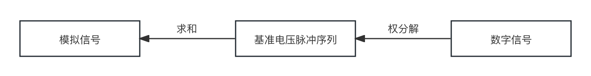

# 1.5.1 数字信号（Digital Signal）& 模拟信号（Analog Signal）& 真实波源（Original Source）

由于从数字处理时代开始，信号间的差异已逐步变大。为了 **更好地区分** 通过传感器采集的电流数据格式和数模模数转换后的格式，我们将其分为 **模拟信号（Analog Signal）** 和 **数字信号（Digital Signal）** 两种：

**模拟信号（Analog Signal）** 为采用电物理量表示的真实波源的象形连续信息，属于 **连续时间信号（CTS [Continuous Time Signal]）**；
**数字信号（Digital Signal）** 为有限离散值表示的离散信息，是 **量化（Quantification）** 后的 **离散时间信号（DTS [Discrete Time Signals]）**；

同时，**为了区分两者和数据源的关系**，将 **信号现实源头** 称为 **真实波源（Original Source）**。

所以，**只有真实波源（Original Source）才代表物理世界中的实际波情况**。

模拟信号与数字信号，一个是 **通过电压电阻等电力学技术采集（Collecting）到的真实波源数据**，一个是 **通过电子信息技术处理的电压电流转数字码结果**。

注意，**采集（Collecting）** 并不是 **采样（Sampling）**。两者没有直接联系，属于不同阶段的不同过程。但有时也会将从真实波源获取模拟信号的过程，称为 **模拟信号采样（Analog Signal Sampling）**，需要通过具体上下文来区别。 **小心容易混淆**。

真实波源一般通过一些 **电传感器** 来转为模拟信号。这些传感器包括：由多感光电阻单元构成照相机感光器（Camera Sensor）、由驻极体（ECM）单元构成的麦克风传感器、以动圈切割磁感线产生电流的动圈麦克风，简单的压力传感器（Pressure Sensor）等。

简单来说，

- **模拟信号（Analog Signal）** 是 **电流信号**；
- **数字信号（Digital Signal）** 是 **电位信号**；
- **真实波源（Original Source）** 是 **现实世界里的波（光波、机械波、引力波等）**；

我们所听到的声音，在物理介质（如空气、水等）中直接传导的信息，在转为电流电压表形后，就可以被认为是模拟信号。数字信号则在自变量（如时间）和因变量（如幅度）上，都是离散且有限的。

但我们 **并不能直接简单的将离散时间信号（DST），等同于 数字信号**。因为，离散时间信号在不经过量化因变量的操作前，其只是自变量的离散。例如，时间上间隔的从一段声音的模拟信号上截取切片，构成的时序离散的信号，其因变量的波动情况仍然属于自然量描述。

所以，采样自模拟信号的未量化离散时间信号，即为对应数字信号的 **中间形态**。

 

由此引申出，**模拟信号到数字信号的转换过程**：

<figure>
   
</figure>

称为 **模数转换（A/D [Analog-to-Digital]）**。作用于 模数转换（A/D）的设备为 **模数转换器（ADC [Analog-to-Digital Converter]）**。

 

而从 **数字信号到模拟信号的还原过程**：

<figure>
   
</figure>

称为 **数模转换（D/A [Digital-to-Analog]）**。作用于 数模转换（D/A）的设备为 **数模转换器（DAC [Digital-to-Analog Converter]）**，即所谓 HiFi 的 解码 DAC。

 

数模转换和模数转换，**并不只局限于音视频的信息转换**。其他类型的现实世界信息，也存在同样复杂或简单和电信号互转的过程。由于原理相近，本书选择以音频作为主，不做其他信号的相关展开。

[ref]: References_1.md