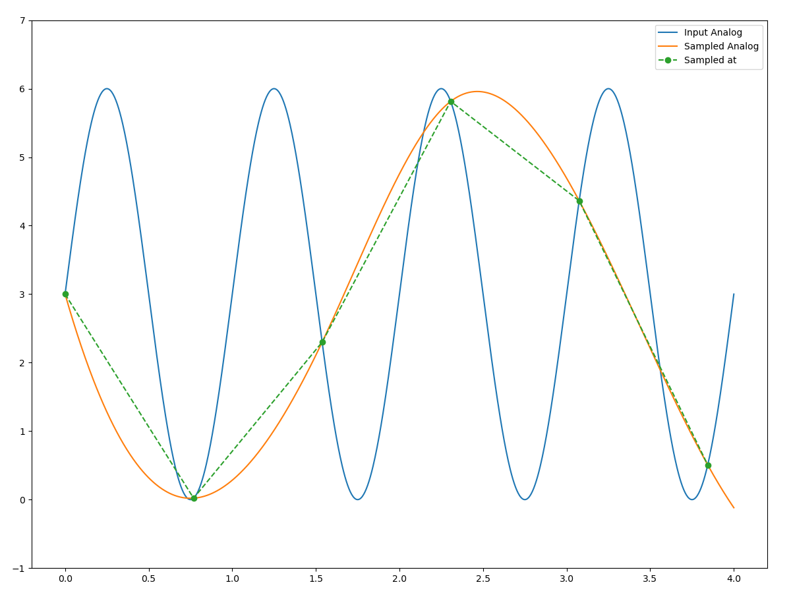
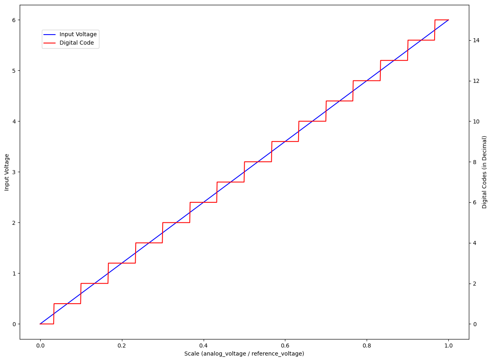
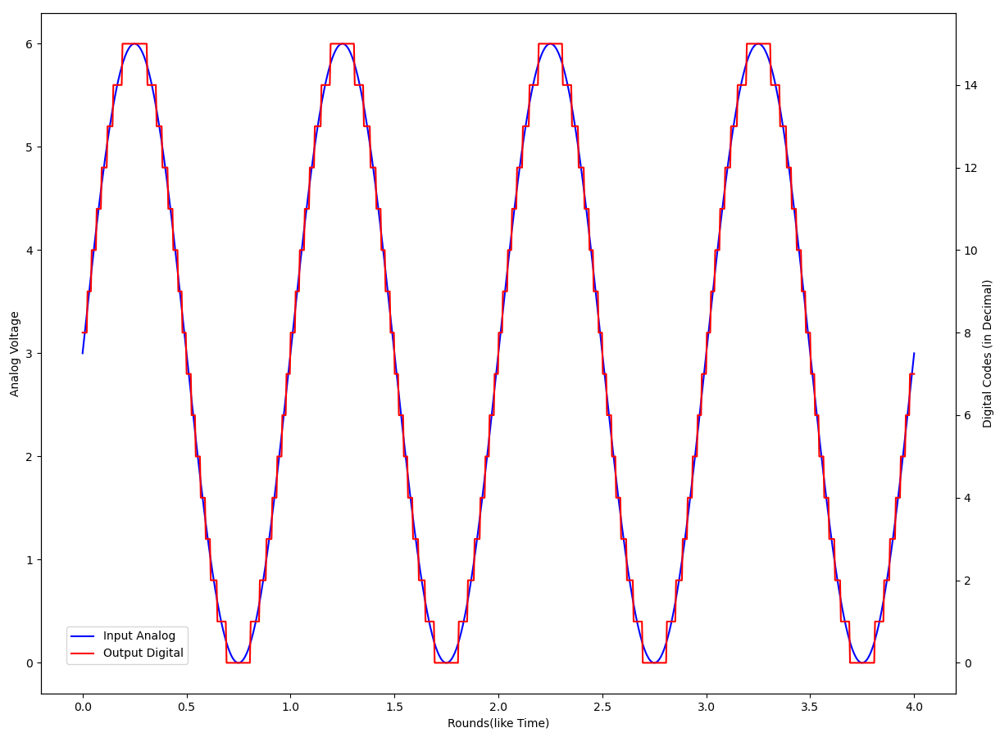

# 1.5.2 模数转换（A/D [Analog-to-Digital]）

**模数转换（A/D）** 完成对采集到真实物理信息（如温度、气压、举例等）所得的 **模拟信号**，到 **数字信号的映射**。这么做的目的，是为了利用数字信号 **可度量**、**可改动**、**可计算** 的特性，来实现对信息的 **操作**、**保存**、**传递**。

大多数情况下， A/D 会把采样和量化 放到 ADC 单元里 **一步完成**。为了同时控制这两个变量到同一基准上，ADC 通过引入 **固定参考输入（Reference Input）**，使其频率在合成累加器单元门电路数代表 **比特分辨率（Bit Resolution）** 作用下，转为十进制的等步长分割。从而可以拆解为由比特分辨率表示的，**整数比特离散值**，即门电路的电位。**控制电位调整参考输入，逼近模拟信号。** 最终得到的门电路开关状态以 **数字码（Digital Codes）** 记录，即为 **输出数字信号**。

可见，**参考输入的电压就是 ADC 所能处理的最大电压**。该值通常都来自于各国行业标准采样电压，或由特种设备的内部变压器/脉冲单元/时钟芯片决定。而 ADC 量化采样公式每被执行一次，就是一次量化采样完整过程。采样的频率，来自于设备内部时钟频率，通常是以电脉冲的形式触发。但模拟信号的输出是连续的，因此该时钟频率（即采样频率）的大小，会对采样结果有一定影响。

## **采样的准确度与采样率设定**

根据 **香农采样定律（Nyquist–Shannon Sampling Theorem）**，时钟频率需要为 **采样数据源最大频率的至少两倍大小**，才能保证采集最大频率时，不会因为非整数倍取样而导致变形。这种变形属于来自于采样过程的 **源头干扰**，会产生 **难以消弭的** 影响，例如：在一定距离拍照电子屏时出现的摩尔纹。具体原理相对简单，如下图所示，不再展开赘述（模拟代码见本章节事例）。

<figure>
   
    <figcaption>
      
图 1.5.2-1 香农采样定律取 1.3 倍于被采样频率时的采样失真演示

   </figcaption>
</figure>

依此，我们对采样频率的制定，亦有标准公式。强调这里的采样指的是 A/D 过程中的采样。

假设，当前已知一 ADC 设备，想要处理的 **模拟信号 脉冲频率范围** 为 $$F_{Ano} \in [F_{min},\ F_{max}]$$ ，该 **设备的采样频率** 为 $$F_{ADC}$$ 。则 **理想中能够覆盖最大高频模拟信号的无失真频率 $$F_{ADC}$$ 需满足**：

$$
{\displaystyle 
 \begin{aligned}
   F_{ADC} \ge 2 \cdot F_{max} \\
 \end{aligned}
}
$$

按照该不等式设置的 ADC 采样频率，即可符合要求。上式因此常在工程中被称为 **安全采样不等式（Safety Sampling Inequality）**。而根据安全采样不等式设定的 $$F_{ADC}$$ ，称为该设备的 **数字信号采样率（Digital Sampling Rate）**，即 **采样率（Samplerate/Sample Rate）**。

现在，采样频率的问题解决了。如何处理获取的离散数据，将其转换为数字码标识呢？这需要依赖 A/D 量化公式（A/D Quantization Formula），即量化采样公式的帮助。

## **量化采样公式（A/D Quantization Formula）**

如果记 **模拟信号（Analog Signal）的电压（Voltage）** 为 $$V_{Ano}$$ ，**参考输入（Reference Input）的电压（Voltage）** 为 $$V_{Ref}$$ 。合成累加器的门总数，即该 ADC 的 **最大比特分辨率（Max Bit Resolution）** 为 $$N$$ 。假设模拟信号经过 ADC 处理后，某时刻输出的 **数字信号（Digital Signal）十进制表示** 为 $$D$$ ，则这几个量间的关系就为：

$$
{\displaystyle 
 \begin{aligned}
   D = \frac{V_{Ano}}{V_{Ref}} \cdot (2^N - 1) \\
 \end{aligned}
}
$$

此式即为 **ADC 量化采样公式**，由于 采样不依赖于公式，也被称为 **A/D 量化公式（A/D Quantization Formula）**。

<figure>
   
    <figcaption>
      
图 1.5.2-2 在 ADC 量化采样公式作用下的 A/D 映射结果

   </figcaption>
</figure>

如上，当取用 $$V_{Ref} = 6\ V$$ 时，有输入模拟信号电压 $$V_{Ano} \in[0,\ 6]$$ 的数字码映射情况。连续信号通过公式处理，变成了离散值。而 $$\tfrac{1}{V_{Ref}} \cdot (2^N - 1)$$ 就是每个十进制下数字码（数字码都是二进制）所能覆盖的电压范围，称之为 **1 单位** 的 **最小显著字节（LSB [Least Significant Bit]）** 范围。

而用上例参数的 ADC 对一个时长为 4 个周期且 $$V_{Ano} \in[0,\ 6]$$ 的正弦模拟信号，进行模数转换。其完整处理的效果如下：

<figure>
   
    <figcaption>
      
图 1.5.2-3 模拟信号经 ADC 量化采样演示

   </figcaption>
</figure>

对于一款 ADC 单元，在设计确定了 **采样率（Samplerate）**、**最大比特分辨率（Max Bit Resolution）** 和 **参考输入（Reference Input）** 后，对于该设备的这些相关属性，既成 **常数固定**。其中，**最大比特分辨率（Max Bit Resolution）取值 $$N$$ ，被标注为 ADC 设备的 采样位深（Sampling Bit Depth）**。

取值 $$N$$ 为多少，就代表着单个 ADC 上，有多少以 **参考输入电压二的幂指倍缩小电压信号** 所组成的门后电压单元。

由于参考电压一般要求稳定，所以至少需要以内部元件提供稳定三相电来作为基准。不过，对于精度要求极低的设备，为了电子组件复用和电路板的简化，会采用把采样时钟信号的电压作为参考输入的非常做法。但对于高精度设备（包括麦克风等），时钟信号为高频信号，是严格不能作为参考输入的。

[ref]: References_1.md