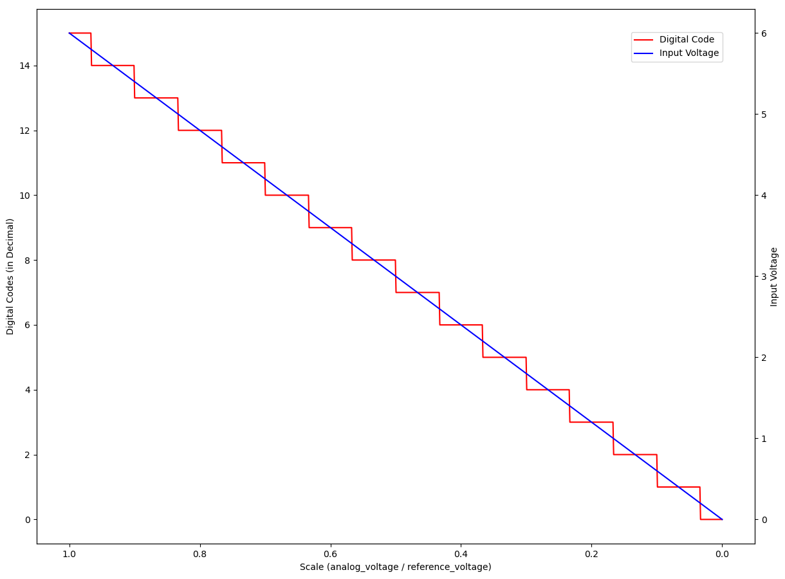
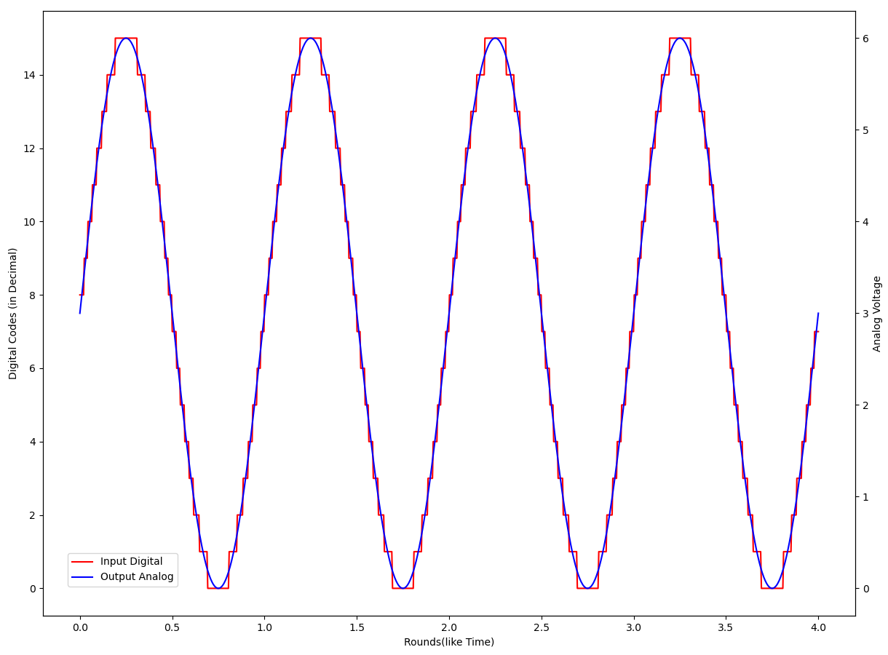

# 1.5.3 数模转换（D/A [Digital-to-Analog]）

**数模转换（D/A）** 是对模数转换（A/D）的逆向过程，完成 **从数字信号还原至模拟信号** 的工作。注意，**还原的是模拟信号（Analog Signal），而并非真实波源（Original Source）**。对音频来说，转换所得的模拟信号，再经过放音设备播放（如音响、扬声器单元等），成为真实波源。

## **数模转换公式（D/A Transfer Function）**

如果记 **数字信号（Digital Signal）十进制表示** 为 $$D$$ ，**参考输入（Reference Input）的电压（Voltage）** 为 $$V_{Ref}$$ ，合成累加器的门总数，即该 DAC 的 **最大比特分辨率（Max Bit Resolution）** 为 $$N$$ 。假设数字信号经过 DAC 处理后，某时刻输出的 **模拟信号（Analog Signal）电压（Voltage）** 为 $$V_{Ano}$$ ，则这几个量间的关系就为：

$$
{\displaystyle 
 \begin{aligned}
   V_{Ano} = \frac{D}{2^N-1} \cdot V_{Ref} \\
 \end{aligned}
}
$$

此式即为 **DAC 数模转换公式**，由于 DAC 为参考输入构建波形的内部时钟信号脉冲周期不依赖于公式，也被称为 **D/A 转换公式（D/A Transfer Function）**。

同 ADC 一致，DAC 中参考输入电压二的幂指倍缩小电压信号，组成了位门后的各个门电路所对应电压输入。**其所有输入的周期皆为时钟信号的周期，即周期完全一致。**

<figure>
   
    <figcaption>
      
图 1-42 在 DAC 数模转换公式作用下的 D/A 映射结果

   </figcaption>
</figure>

如上（**注意坐标轴**），当取用 $$V_{Ref} = 6\ V$$ 有 DAC 最大比特分辨率 $$N = 4$$ 时，输入数字信号十进制表示 $$D \in[0,\ 15]$$ 的模拟信号还原的理想情况。在没有 DAC 设备误差的情况下，上一小节经过我们模数转换所得时长为 4 个周期的数字信号，就能还原为原 $$V_{Ano} \in[0,\ 6]$$ 的正弦模拟信号：

<figure>
   
    <figcaption>
      
图 1-43 数字信号经 DAC 数模转换演示

   </figcaption>
</figure>

对于一款 DAC 单元，在设计确定了 **时钟频率（Clock Frequency）**、**最大比特分辨率（Max Bit Resolution）** 和 **参考输入（Reference Input）** 后，对于该设备的这些相关属性，既成 **常数固定**。其中，最大比特分辨率（Max Bit Resolution）取值  ，被标注为 DAC 设备的 **解析位深（Analytical Bit Depth）**，即俗称的解析力。

同样的，想要达到 **较好的还原** 模拟信号效果，**DAC 的 时钟频率（Clock Frequency），需要和 ADC 的工业标准保持一致**。因此，有时也被用 ADC 的采样率（Samplerate）的称谓代指，即所谓 DAC 采样率。这种称谓其实是不准确的。

 

而在多级设备的放音场景，为了保证包括 DAC 在内的整条解码放音链路上设备的时钟频率一致，常需要我们提供外侧时钟信号（Clock Signal），来避免由于设备间的差异，而导致还原后的模拟信号，在传递和还原真实波源时，发生周期上的挤压/拉伸形变。

[ref]: References_1.md