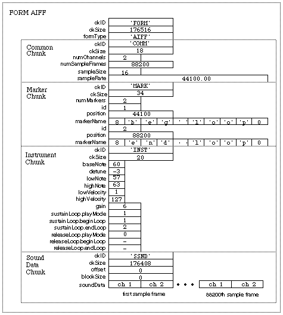

<head>
    <meta charset="UTF-8">
    <meta name="viewport" content="width=device-width, initial-scale=1.0">
    <title>Hex Data Display</title>
    
</head>

# 1.6.2 未压缩音频格式（Uncompressed Audio Format）

**未压缩音频格式（Uncompressed [Uncompressed Audio Format]）** 即 **没有经过任何压缩算法处理**，而直接将数字信号的数字码，作为存储格式保存的音频格式。因此，**未压缩音频格式的存储格式（Data Format）** 与 **原数字信号** 在音频数据内容部分，具有 **完全一致的数字码值**。

常见的未压缩音频格式，除了前文反复提到的 PCM 格式外，还有 PDM、WAV、AIFF、AU 等。PCM、PDM 格式自不必多提，而在系统中常用的 WAV 、SND/AU、AIFF等 则需额外引申。

首先的一个疑问就是，**为什么会有这么多未压缩音频格式？**

## **未压缩音频格式种类的产生**

如此结果的产生，主要来自于 **两个重要因素**：**调制模式的差异**，和 **描述信息的不同**。

**调制模式的差异**，造成了如 PCM、PDM 之类的区分，这也是上节末尾我们所谈到的（其具体原理，已经于[前面的章节](Docs_1_5_4.md)中讲解，如有疑问可以回顾），**是来自于不同 AD/DA 方法论的区别**。

**描述信息的不同**，则指向该格式，是否携带了 **描述音频的头部信息（Header Information）** 用来标记当前音频文件对应音频数据的全局附加信息。而这，则是来自于 **系统文件规范（System File Specifications）** 指定的人为因素。

## **WAV 音频格式**

自微软在早期 IBM 时代提出了 **资源交换档案标准（RIFF [Resource Interchange File Format]）** 规范后，所有于 Windows 系统内的数据存储文件，都需要按照：

<b>
【分块描述信息块（Chunk Descriptor）】+【复合数据子块（sub-Chunks）】
</b>

 

的形式，完成数据封装。而音频数据所对应的，即为 **波形格式数据（Wave File Format）**，也就是所谓 **WAV（.wav） 格式**。同时，随着 Windows 系统的极大普及，WAV 格式也成为了一种于多系统间的通用基础音频格式类型。

Windows 系统以后缀来区别具体归属 RIFF 类型。而不论是否采用 PCM 调制模式，想要存储且不采用压缩算法的音频数字信号，都需要按 RIFF 要求进行封装。当然，**现行的 WAV 格式文件，基本都是对 PCM 数据的 RIFF 套壳**。

RIFF 规定，WAV 数据格式包含了三部分数据，分别是：

- **分块描述信息块（Chunk Descriptor）**，存放基于 RIFF 体系的当前块标记；
- **音频格式子块（fmt sub-Chunk）**，存放当前存储音频相关数据的附加信息；
- **音频数据子块（data sub-Chunk）**，存放当前存储音频的存储数据；

不同区域，包含的信息（即各自参数）的 **目标作用域** 是不同的。**分块描述信息块**，主要是基于 RIFF 体系的 **相对宏观存储信息记录**，目的是为了方便于计算机系统据此进行数据归纳处理。而 **音频格式子块** 和 **音频数据子块** 才是对该 数字信号 代表的 **音频实际信息的描述和保存**。

因此，三部分各有参数标记各自重点。

 

**分块描述信息块（Chunk Descriptor）** 主要包含 3 个属性，分别是：

<table style="width:100%; border-collapse: collapse;">
  <tr style="background-color: #f2f2f2;">
    <th style="border: 1px solid #ddd; padding: 10px; width: 150px;">Params</th>
    <th style="border: 1px solid #ddd; padding: 10px; width: 120px;">Range(bytes)</th>
    <th style="border: 1px solid #ddd; padding: 10px;">Details</th>
  </tr>
  <tr>
    <th style="border: 1px solid #ddd; padding: 10px;">ChunkID</th>
    <td style="border: 1px solid #ddd; padding: 10px;">0x00~0x03 (4)</td>
    <td style="border: 1px solid #ddd; padding: 10px;">标记当前块 ID，固定存储 'RIFF' 四个大写字母的 ASCII 码，即 == 0x52494646</td>
  </tr>
  <tr style="background-color: #f2f2f2;">
    <th style="border: 1px solid #ddd; padding: 10px;">ChunkSize</th>
    <td style="border: 1px solid #ddd; padding: 10px;">0x04~0x07 (4)</td>
    <td style="border: 1px solid #ddd; padding: 10px;">记录当前块除 ChunkID 和 ChunkSize 属性外，完整文件的总体大小（bytes），== 4 + (8 + Subchunk1Size) + (8 + Subchunk2Size)</td>
  </tr>
  <tr>
    <th style="border: 1px solid #ddd; padding: 10px;">Format</th>
    <td style="border: 1px solid #ddd; padding: 10px;">0x08~0x0b (4)</td>
    <td style="border: 1px solid #ddd; padding: 10px;">标记当前 RIFF 文件类型，WAV 固定存储 'WAVE' 四个大写字母的 ASCII 码，即 == 0x57415645</td>
  </tr>
</table>

 

**音频格式子块（FMT sub-Chunk）** 主要包含 8 个属性和 2 个额外字段，分别是：

<table style="width:100%; border-collapse: collapse;">
  <tr style="background-color: #f2f2f2;">
    <th style="border: 1px solid #ddd; padding: 10px; width: 150px;">Params</th>
    <th style="border: 1px solid #ddd; padding: 10px; width: 120px;">Range(bytes)</th>
    <th style="border: 1px solid #ddd; padding: 10px;">Details</th>
  </tr>
  <tr>
    <th style="border: 1px solid #ddd; padding: 10px;">Subchunk1ID</th>
    <td style="border: 1px solid #ddd; padding: 10px;">0x0c~0x0f (4)</td>
    <td style="border: 1px solid #ddd; padding: 10px;">标记当前 子块-1 的 ID（即子块类型），固定存储 'fmt' 三个小写字母的 ASCII 码，即 == 0x666d7420</td>
  </tr>
  <tr style="background-color: #f2f2f2;">
    <th style="border: 1px solid #ddd; padding: 10px;">Subchunk1Size</th>
    <td style="border: 1px solid #ddd; padding: 10px;">0x10~0x13 (4)</td>
    <td style="border: 1px solid #ddd; padding: 10px;">记录当前子块除 ID 和 Size 属性外的大小（bytes），而对于存储 PCM 数字信号，该值恒定 == 16 bytes</td>
  </tr>
  <tr>
    <th style="border: 1px solid #ddd; padding: 10px;">AudioFormat</th>
    <td style="border: 1px solid #ddd; padding: 10px;">0x14~0x15 (2)</td>
    <td style="border: 1px solid #ddd; padding: 10px;">音频格式类型，非常用参数，因为当本身为 != 1 的值时，代表着文件存储的音频数据，采用了对应标记值的压缩算法。此时一般会采用对应的格式后缀。对于 PCM 格式，该值恒定 == 1</td>
  </tr>
  <tr style="background-color: #f2f2f2;">
    <th style="border: 1px solid #ddd; padding: 10px;">NumChannels</th>
    <td style="border: 1px solid #ddd; padding: 10px;">0x16~0x17 (2)</td>
    <td style="border: 1px solid #ddd; padding: 10px;">存储音频数据的通道数，单通道（Mono == 1），双通道（Stereo == 2），N 通道（== N）</td>
  </tr>
  <tr>
    <th style="border: 1px solid #ddd; padding: 10px;">SampleRate</th>
    <td style="border: 1px solid #ddd; padding: 10px;">0x18~0x1b (4)</td>
    <td style="border: 1px solid #ddd; padding: 10px;">数字信号采样率，注意不同调制类型需要考虑前文提到的差异，对 PCM 来说就是 &lt;PCM 采样率&gt;，有该值 == 8000 | 11025 | 24000 | 44100 等</td>
  </tr>
  <tr style="background-color: #f2f2f2;">
    <th style="border: 1px solid #ddd; padding: 10px;">ByteRate</th>
    <td style="border: 1px solid #ddd; padding: 10px;">0x1c~0x1f (4)</td>
    <td style="border: 1px solid #ddd; padding: 10px;">比特率，即当前全通道单采样周期所得数据的传输率 == SampleRate * NumChannels * BitsPerSample/8</td>
  </tr>
  <tr>
    <th style="border: 1px solid #ddd; padding: 10px;">BlockAlign</th>
    <td style="border: 1px solid #ddd; padding: 10px;">0x20~0x21 (2)</td>
    <td style="border: 1px solid #ddd; padding: 10px;">全通道数据单次采样的对齐大小，即一次全通道采样的有效数据大小，固定 == NumChannels * BitsPerSample/8</td>
  </tr>
  <tr style="background-color: #f2f2f2;">
    <th style="border: 1px solid #ddd; padding: 10px;">BitsPerSample</th>
    <td style="border: 1px solid #ddd; padding: 10px;">0x22~0x23 (2)</td>
    <td style="border: 1px solid #ddd; padding: 10px;">代表来自于 数模模数转换 的 采样位深（Sampling Bit Depth）/ 最大比特分辨率（Max Bit Resolution），该值单位为 bits，有 == 8 | 16 | 32 bits 等</td>
  </tr>
  <tr>
    <th style="border: 1px solid #ddd; padding: 10px;">ExtraParamSize</th>
    <td style="border: 1px solid #ddd; padding: 10px;">0x24~0x25 (2)</td>
    <td style="border: 1px solid #ddd; padding: 10px;">额外参数信息大小，如无则不占用字节大小，非常用参数，原因同 AudioFormat，对于 PCM 来说，该值始终 == 0，且字段不存在</td>
  </tr>
  <tr style="background-color: #f2f2f2;">
    <th style="border: 1px solid #ddd; padding: 10px;">ExtraParams</th>
    <td style="border: 1px solid #ddd; padding: 10px;">0x26~0x26+X (X)</td>
    <td style="border: 1px solid #ddd; padding: 10px;">额外参数内容，同上，对 PCM 始终 X == 0</td>
  </tr>
</table>

 

需要注意的是，音频格式子块（FMT sub-Chunk）中的 ExtraParamSize 和 ExtraParams 并不是始终存在的。对于 **以 PCM 数字信号数据为主要载荷信息的 WAV 格式，该两个字段在 fmt 子块中，是不存在**。

即，**ExtraParamSize 和 ExtraParams，在 WAV 中并不占用任何有效数据字段**。

 

**音频数据子块（DATA sub-Chunk）** 主要包含 3 个属性，分别是：

<table style="width:100%; border-collapse: collapse;">
  <tr style="background-color: #f2f2f2;">
    <th style="border: 1px solid #ddd; padding: 10px; width: 150px;">Params</th>
    <th style="border: 1px solid #ddd; padding: 10px; width: 120px;">Range(bytes)</th>
    <th style="border: 1px solid #ddd; padding: 10px;">Details</th>
  </tr>
  <tr>
    <th style="border: 1px solid #ddd; padding: 10px;">Subchunk2ID</th>
    <td style="border: 1px solid #ddd; padding: 10px;">0x24~0x27 (4)</td>
    <td style="border: 1px solid #ddd; padding: 10px;">标记当前 子块-2 的 ID（即子块类型），固定存储 'data' 四个小写字母的 ASCII 码，即 == 0x64617461</td>
  </tr>
  <tr style="background-color: #f2f2f2;">
    <th style="border: 1px solid #ddd; padding: 10px;">Subchunk2Size</th>
    <td style="border: 1px solid #ddd; padding: 10px;">0x28~0x2b (4)</td>
    <td style="border: 1px solid #ddd; padding: 10px;">记录当前子块除 ID 和 Size 属性外的大小（bytes），而对于存储 PCM 数字信号，该值为数字信号数据大小 == PCM-data-size bytes</td>
  </tr>
  <tr>
    <th style="border: 1px solid #ddd; padding: 10px;">Data</th>
    <td style="border: 1px solid #ddd; padding: 10px;">0x2c~0x2c+X (X)</td>
    <td style="border: 1px solid #ddd; padding: 10px;">当前 PCM 数字信号的数字码信息，共计 X bytes</td>
  </tr>
</table>

 

所以，**音频数据子块（DATA sub-Chunk）** 其实就是 PCM 音频格式时，被存储到计算机系统中的 **PCM 存储文件（.pcm）有效数据部分**。

 

**三个 WAV 的组成部分以固定顺序排布**，如下所示：

<figure>
   
    <figcaption>
      
图 1.6.2-1 WAV 音频格式的完整结构成分

   </figcaption>
</figure>

**共同构成了一则有效的 WAV 音频格式文件。**

 

现在，让我们再来看一段 72 bytes 的 WAV 音频文件（十六进制格式单字节展开）：

<body>

52 49 46 46 24 08 00 00 57 41 56 45 66 6d 74 20 10 00 00 00 01 00 02 00  
22 56 00 00 88 58 01 00 04 00 10 00 64 61 74 61 00 08 00 00 00 00 00 00  
24 17 1e f3 3c 13 3c 14 16 f9 18 f9 34 e7 23 a6 3c f2 24 f2 11 ce 1a 0d  

</body>

按照上述划分，就能得到各自子块的信息了：

<figure>
   
    <figcaption>
      
图 1.6.2-2 演示用 72 bytes 的 WAV 音频文件解析

   </figcaption>
</figure>

从上可知，样例其实是从一段 **2048 Bytes 的 PCM 音频对应 WAV 文件** 中，从头 **截取 72 Bytes 数据** 组成的。所以，利用头部信息来交验数据完整性，或取得更早阶段（即调制阶段）的信息，在 WAV 这种 **具有 分块描述信息块（Chunk Descriptor）** 的音频格式（Audio Format）里成为了可能。

这也是为何类 WAV 结构音频格式（包括将要提到的 SND/AU 和 AIFF 等），会代替了直接以 PCM 在电脑中进行非工程化存储的原因。

不过，这也引申出了 **两种截然相反的**，有关未压缩音频格式的 **制定思路**：**缩减头文件信息减少复杂度** ，和 **增加头文件所能涵盖的辅助数据**。典型代表，分别是 SND/AU 和 AIFF 音频格式。

## **SND/AU 音频格式**

**SND/AU** 是一种极简的，携带有描述信息的未压缩音频格式。该格式由已于 2009 年被 甲骨文（Oracle）收购的 **美国昇阳电子有限公司（Sun Microsystems, Inc）** 提出，用于解决麦克风录制转换后的 PCM 数字信号，快速简易存储的问题。

**SND/AU 音频格式（.snd/.au）** 不以 **块（Chunk）/子块（sub-Chunk）** 形式对关键数据进行分离，而是 **直接将存储分为三个部分区段**，分别是：

- **头信息区段（Header）**，存储必要的最基本音频描述信息；
- **变长辅助信息区段（Variable-length Informational Field）**，存储需要的额外信息；
- **音频数据区段（Data）**，存放当前存储音频的存储数据；

初看之下可能感觉同 WAV 格式并无太大差异，然而事实并非如此。SUD/AU 的相关音频数据的参数，以及自身有关文件系统的标志，都被 **集中于头信息字段的 6 个固定参数中**。而涉及音频本身，诸如版权信息、作者名称等数据，则并未规范如何存储，只指定了必须放入 **变长辅助信息区段** 的要求。这使 **系统并不需要管理这部分信息**。而音频数据区段，则只能存放 PCM 数字信号的数字码数据。

所以，**变长辅助信息区段（Variable-length Informational Field）** 只规定 **必须占用 4 bytes 大小**，并在有 **额外信息** 时，**以整数字节增加**，如：5（4+1） bytes、6（4+2） bytes 等。而 **音频数据区段（Data）则紧随其后**，直接以 PCM 采样按通道（Channels）数，交替分 blocks 存储即可（同 WAV 的 data 部分）。

 

**头信息区段（Header）** 主要包含 6 个属性，分别是：

<table style="width:100%; border-collapse: collapse;">
  <tr style="background-color: #f2f2f2;">
    <th style="border: 1px solid #ddd; padding: 10px; width: 150px;">Params</th>
    <th style="border: 1px solid #ddd; padding: 10px; width: 120px;">Range(bytes)</th>
    <th style="border: 1px solid #ddd; padding: 10px;">Details</th>
  </tr>
  <tr>
    <th style="border: 1px solid #ddd; padding: 10px;">magic</th>
    <td style="border: 1px solid #ddd; padding: 10px;">0x00~0x03 (4)</td>
    <td style="border: 1px solid #ddd; padding: 10px;">标记当文件类型，固定存储 '.snd' 四个字符文件后缀的 ASCII 码，即 == 0x2e736e64</td>
  </tr>
  <tr style="background-color: #f2f2f2;">
    <th style="border: 1px solid #ddd; padding: 10px;">hdr_size</th>
    <td style="border: 1px solid #ddd; padding: 10px;">0x04~0x07 (4)</td>
    <td style="border: 1px solid #ddd; padding: 10px;">记录音频数据起始偏移（bytes），用于快速数据，有 == 24 + Informational_Field_Size（bytes）</td>
  </tr>
  <tr>
    <th style="border: 1px solid #ddd; padding: 10px;">data_size</th>
    <td style="border: 1px solid #ddd; padding: 10px;">0x08~0x0b (4)</td>
    <td style="border: 1px solid #ddd; padding: 10px;">本用于记录数字信号数据大小，但由于可通过，文件大小 - hdr_size 算得，因此可取 == 0xffffffff 表示无记录/ == n 表示 n bytes 大小</td>
  </tr>
  <tr style="background-color: #f2f2f2;">
    <th style="border: 1px solid #ddd; padding: 10px;">encoding</th>
    <td style="border: 1px solid #ddd; padding: 10px;">0x0c~0x0f (4)</td>
    <td style="border: 1px solid #ddd; padding: 10px;">用于标记具体存储的 PCM 数据，所采用的标准见下方表格，只可取 == 1, 2, 3, 4, 5, 6, 7, 23, 24, 25, 26, 27</td>
  </tr>
  <tr>
    <th style="border: 1px solid #ddd; padding: 10px;">sample_rate</th>
    <td style="border: 1px solid #ddd; padding: 10px;">0x10~0x13 (4)</td>
    <td style="border: 1px solid #ddd; padding: 10px;">数字信号采样率，由于 SUD 只能存 PCM，对 PCM 来说就是 &lt;PCM 采样率&gt;，有该值 == 8000 | 11025 | 24000 | 44100 等</td>
  </tr>
  <tr style="background-color: #f2f2f2;">
    <th style="border: 1px solid #ddd; padding: 10px;">channels</th>
    <td style="border: 1px solid #ddd; padding: 10px;">0x14~0x17 (4)</td>
    <td style="border: 1px solid #ddd; padding: 10px;">存储音频数据的通道数，单通道（Mono == 1），双通道（Stereo == 2），N 通道（== N）</td>
  </tr>
</table>

 

不难发现，我们认为的 **比特率（bitrate）**，或者至少该有的 **[采样位深](Docs_1_5_2.md)（Sampling Bit Depth）** 信息，并没有直接体现在头信息字段的参数中。这 **并不** 意味着没有包含该信息，而是 SND/AU 音频格式，通过 **固定格式可支持类型** 的方式，将这部分信息 **封入了头信息字段的 encoding 子段** 里，**间接表示** 了。

而 **SND/AU 所支持的 PCM 采样规格**，总计有 **12** 种，如下：

<table style="width:100%; border-collapse: collapse;">
  <tr style="background-color: #f2f2f2;">
    <th style="border: 1px solid #ddd; padding: 10px;">Type Name</th>
    <th style="border: 1px solid #ddd; padding: 10px;">ID</th>
    <th style="border: 1px solid #ddd; padding: 10px;">Details</th>
  </tr>
  <tr>
    <th style="border: 1px solid #ddd; padding: 10px;">8 bit ISDN u-law</th>
    <td style="border: 1px solid #ddd; padding: 10px;">1</td>
    <td style="border: 1px solid #ddd; padding: 10px;">采样位深 为 8-bit 电话信号 uLaw 有损传输压缩算法</td>
  </tr>
  <tr style="background-color: #f2f2f2;">
    <th style="border: 1px solid #ddd; padding: 10px;">8 bit linear PCM</th>
    <td style="border: 1px solid #ddd; padding: 10px;">2</td>
    <td style="border: 1px solid #ddd; padding: 10px;">采样位深 为 8-bit 的线性 PCM 调制</td>
  </tr>
  <tr>
    <th style="border: 1px solid #ddd; padding: 10px;">16 bit linear PCM</th>
    <td style="border: 1px solid #ddd; padding: 10px;">3</td>
    <td style="border: 1px solid #ddd; padding: 10px;">采样位深 为 16-bit 的线性 PCM 调制</td>
  </tr>
  <tr style="background-color: #f2f2f2;">
    <th style="border: 1px solid #ddd; padding: 10px;">24 bit linear PCM</th>
    <td style="border: 1px solid #ddd; padding: 10px;">4</td>
    <td style="border: 1px solid #ddd; padding: 10px;">采样位深 为 24-bit 的线性 PCM 调制</td>
  </tr>
  <tr>
    <th style="border: 1px solid #ddd; padding: 10px;">32 bit linear PCM</th>
    <td style="border: 1px solid #ddd; padding: 10px;">5</td>
    <td style="border: 1px solid #ddd; padding: 10px;">采样位深 为 32-bit 的线性 PCM 调制</td>
  </tr>
  <tr style="background-color: #f2f2f2;">
    <th style="border: 1px solid #ddd; padding: 10px;">32 bit IEEE floating point</th>
    <td style="border: 1px solid #ddd; padding: 10px;">6</td>
    <td style="border: 1px solid #ddd; padding: 10px;">采样位深 为 32-bit 的 IEEE 归一化浮点 PCM 数据</td>
  </tr>
  <tr>
    <th style="border: 1px solid #ddd; padding: 10px;">64 bit IEE floating point</th>
    <td style="border: 1px solid #ddd; padding: 10px;">7</td>
    <td style="border: 1px solid #ddd; padding: 10px;">采样位深 为 64-bit 的 IEEE 归一化浮点 PCM 数据</td>
  </tr>
  <tr style="background-color: #f2f2f2;">
    <th style="border: 1px solid #ddd; padding: 10px;">4 bit CCITT G721 ADPCM</th>
    <td style="border: 1px solid #ddd; padding: 10px;">23</td>
    <td style="border: 1px solid #ddd; padding: 10px;">采样位深 为 4-bit 的 ITU G721 自适应 PCM 规格</td>
  </tr>
  <tr>
    <th style="border: 1px solid #ddd; padding: 10px;">CCITT G722 ADPCM</th>
    <td style="border: 1px solid #ddd; padding: 10px;">24</td>
    <td style="border: 1px solid #ddd; padding: 10px;">采样位深 为 4-bit 的 ITU G722 自适应 PCM 规格</td>
  </tr>
  <tr style="background-color: #f2f2f2;">
    <th style="border: 1px solid #ddd; padding: 10px;">CCITT G723 ADPCM</th>
    <td style="border: 1px solid #ddd; padding: 10px;">25</td>
    <td style="border: 1px solid #ddd; padding: 10px;">采样位深 为 4-bit 的 ITU G723 自适应 PCM 规格</td>
  </tr>
  <tr>
    <th style="border: 1px solid #ddd; padding: 10px;">5 bit CCITT G723 ADPCM</th>
    <td style="border: 1px solid #ddd; padding: 10px;">26</td>
    <td style="border: 1px solid #ddd; padding: 10px;">采样位深 为 5-bit 的 ITU G723 自适应 PCM 规格</td>
  </tr>
  <tr style="background-color: #f2f2f2;">
    <th style="border: 1px solid #ddd; padding: 10px;">8 bit ISDN a-law</th>
    <td style="border: 1px solid #ddd; padding: 10px;">27</td>
    <td style="border: 1px solid #ddd; padding: 10px;">采样位深 为 8-bit 电话信号 aLaw 有损传输压缩算法</td>
  </tr>
</table>

 

通过 **标记 encoding 取指定 ID** 的方式，**锚定规定好并确认具体参数的规格档次**，来简化了头内容。当然弊端也很明显。由于选定的规格，并指定了档次，使得 **相关参数是固定的**，无法使用同规格下的其他参数组，而 **无法进行动态扩展**。这一部分仅了解即可，如使用到相应详细参数，再行查阅。

 

三个 SND/AU 的组成部分以固定顺序排布，如下所示：

<figure>
   
    <figcaption>
      
图 1.6.2-3 SND/AU 音频格式的完整结构成分

   </figcaption>
</figure>

**较之 WAV 格式，简化了大量块信息。**

但也正是因为这些原因，使得工程上在处理 SND/AU 格式时，需要花费额外的工作，来处理被固定的信息成分。**这相当于另一种通过规定来实现的压缩手段了，变相的增加了系统处理资源消耗**。因此，除了在 NeXT 系统上得到了大范围应用外，现如今 SND/AU 格式已成为逐步被淘汰的一种类型。

而与之相对的，WAV 和 AIFF 则仍被大量使用在 Windows/Linux 和苹果 MacOS/iOS  系统中。让我们不得不考虑，**过渡的简化信息，是否仍有必要**。

## **AIFF 音频格式**

**音频交换文件格式（AIFF [Audio Interchange File Format]）**，即 **AIFF 音频格式（.aif/.aiff）**，正如刚刚所提，是一种被使用在 MacOS/iOS 上的未压缩音频格式。是一种隶属于 **交换文件格式（IFF [Interchange File Format]）** 文件管理体系的 **文件格式（File Format）**。该格式的特点相比 WAV 的 RIFF 分块体系而言，有着 **更为复杂的子块类别**。极大提升了能够涵盖辅助信息的广度，并以此为 苹果/Linux 等系统的文件管理，提供了更为方便的归类参考项。

AIFF 音频格式，从整体角度包含量种成分：

- **文件格式块（FORM Chunk）**，用以描述服务于系统文件管理的文件本身信息；
- **附属信息子块（INFO sub-Chunks）**，一系列不同类型的持续存储子块；

**附属信息子块** 也被称为 **本地信息块（Local Chunks）**，所有的 本地信息块 都以 **参数值的形式**，保存于 **文件格式块的 chunks 数组参数属性中**，作为数组值存储。

于是，由这两类共同构成了一个完整的 AIFF 文件结构，如下：

<figure>
   
    <figcaption>
      
图 1.6.2-4 AIFF 音频格式的完整结构成分（文件结构）简图

   </figcaption>
</figure>

从此处即可看出，IFF 体系与 RIFF 体系的差异了。**IFF 体系下，子块是以树状从属关系，挂载在 IFF 文件格式块的**。而 **RIFF 则是 分块描述信息块 和 子块 同属一级**。

 

**IFF 文件格式块（FORM Chunk）** 主要包含 4 个属性，分别是：

<table style="width:100%; border-collapse: collapse;">
  <tr style="background-color: #f2f2f2;">
    <th style="border: 1px solid #ddd; padding: 10px; width: 150px;">Params</th>
    <th style="border: 1px solid #ddd; padding: 10px; width: 120px;">Range(bytes)</th>
    <th style="border: 1px solid #ddd; padding: 10px;">Details</th>
  </tr>
  <tr>
    <th style="border: 1px solid #ddd; padding: 10px;">ckID</th>
    <td style="border: 1px solid #ddd; padding: 10px;">0x00~0x03 (4)</td>
    <td style="border: 1px solid #ddd; padding: 10px;">标记文件起始占位符，固定存储 'FORM' 四个大写字母的 ASCII 码，即 == 0x464f524d</td>
  </tr>
  <tr style="background-color: #f2f2f2;">
    <th style="border: 1px solid #ddd; padding: 10px;">ckSize</th>
    <td style="border: 1px solid #ddd; padding: 10px;">0x04~0x07 (4)</td>
    <td style="border: 1px solid #ddd; padding: 10px;">记录当前块除 ckID 和 ckSize 属性外，完整文件的总体大小（bytes），== 4 + Sum(Local Chunk Size)</td>
  </tr>
  <tr>
    <th style="border: 1px solid #ddd; padding: 10px;">fromType</th>
    <td style="border: 1px solid #ddd; padding: 10px;">0x08~0x0b (4)</td>
    <td style="border: 1px solid #ddd; padding: 10px;">标记当前 IFF 文件类型，AIFF 固定存储 'AIFF' 四个大写字母的 ASCII 码，即 == 0x41494646</td>
  </tr>
  <tr style="background-color: #f2f2f2;">
    <th style="border: 1px solid #ddd; padding: 10px;">chunks</th>
    <td style="border: 1px solid #ddd; padding: 10px;">--</td>
    <td style="border: 1px solid #ddd; padding: 10px;">用于存储 本地信息块，即子块，的完整数据见下方表格，只可取 == Sum(Local Chunk Size)</td>
  </tr>
</table>

 

**所有 IFF 文件都有以上属性**，而不同 IFF 文件区别，主要存在于 **本地信息块的差异上**，即 **chunks 数组内容的不同**。

对于 AIFF 音频格式来说，它的子块情况是什么样的呢？

 

**AIFF 将子块（sub-Chunk）拓展到了共计 12 种**。且所有子块，在 AIFF 文件中，只能存在一份，或完全不存在。有（**按优先程度，非组装顺序**，见后文）：

<table style="width:100%; border-collapse: collapse;">
  <tr style="background-color: #f2f2f2;">
    <th style="border: 1px solid #ddd; padding: 10px;">Type</th>
    <th style="border: 1px solid #ddd; padding: 10px;">Details</th>
  </tr>
  <tr>
    <th style="border: 1px solid #ddd; padding: 10px;">Common Chunk</th>
    <td style="border: 1px solid #ddd; padding: 10px;">通用信息（子）块， 用于存放有关文件本身包含所有子块的通用参数记录</td>
  </tr>
  <tr style="background-color: #f2f2f2;">
    <th style="border: 1px solid #ddd; padding: 10px;">Sound Data Chunk</th>
    <td style="border: 1px solid #ddd; padding: 10px;">音频数据（子）块， 用于存放音频数据，即当前 PCM 数字信号的数字码信息</td>
  </tr>
  <tr>
    <th style="border: 1px solid #ddd; padding: 10px;">Marker Chunk</th>
    <td style="border: 1px solid #ddd; padding: 10px;">标记信息（子）块， 用于存放有关当前音频的标记（如发行公司等）信息</td>
  </tr>
  <tr style="background-color: #f2f2f2;">
    <th style="border: 1px solid #ddd; padding: 10px;">Instrument Chunk</th>
    <td style="border: 1px solid #ddd; padding: 10px;">乐器信息（子）块， 用于存放直接作用于当前音频数据的声乐信息</td>
  </tr>
  <tr>
    <th style="border: 1px solid #ddd; padding: 10px;">Comment Chunk</th>
    <td style="border: 1px solid #ddd; padding: 10px;">评论信息（子）块， 用于存放用户等人的交互评价信息</td>
  </tr>
  <tr style="background-color: #f2f2f2;">
    <th style="border: 1px solid #ddd; padding: 10px;">Name Chunk</th>
    <td style="border: 1px solid #ddd; padding: 10px;">命名文字（子）块， 用于存放当前文件命名信息</td>
  </tr>
  <tr>
    <th style="border: 1px solid #ddd; padding: 10px;">Author Chunk</th>
    <td style="border: 1px solid #ddd; padding: 10px;">作者文字（子）块， 用于存放当前文件作者信息（区别于标记）</td>
  </tr>
  <tr style="background-color: #f2f2f2;">
    <th style="border: 1px solid #ddd; padding: 10px;">Copyright Chunk</th>
    <td style="border: 1px solid #ddd; padding: 10px;">版权文字（子）块， 用于存放当前文件版权信息</td>
  </tr>
  <tr>
    <th style="border: 1px solid #ddd; padding: 10px;">Annotation Chunk</th>
    <td style="border: 1px solid #ddd; padding: 10px;">声明文字（子）块， 用于存放当前文件声明信息</td>
  </tr>
  <tr style="background-color: #f2f2f2;">
    <th style="border: 1px solid #ddd; padding: 10px;">Audio Recording Chunk</th>
    <td style="border: 1px solid #ddd; padding: 10px;">录制信息（子）块， 用于存放音频录制采用的设备相关信息</td>
  </tr>
  <tr>
    <th style="border: 1px solid #ddd; padding: 10px;">MIDI Data Chunk</th>
    <td style="border: 1px solid #ddd; padding: 10px;">迷笛（MIDI）数据（子）块， 用于存放需迷笛系统处理的通用数据</td>
  </tr>
  <tr style="background-color: #f2f2f2;">
    <th style="border: 1px solid #ddd; padding: 10px;">Application Specific Chunk</th>
    <td style="border: 1px solid #ddd; padding: 10px;">应用信息（子）块， 用于存放经软件调整音频后，想要持续存储的调整设定参数</td>
  </tr>
</table>

 

如果说 SND/AU 是精简的一端，那 AIFF 无疑将尽可能多的信息装填到了音频文件中。这种复杂的数据归纳，使 AIFF 格式中，出现了 **多级数据结构**。

我们分别来看一下，各个分块中的参数。

 

**通用信息块（Common Chunk）** 主要包含 6 种属性，分别是：

<table style="width:100%; border-collapse: collapse;">
  <tr style="background-color: #f2f2f2;">
    <th style="border: 1px solid #ddd; padding: 10px; width: 150px;">Params</th>
    <th style="border: 1px solid #ddd; padding: 10px; width: 120px;">Range(bytes)</th>
    <th style="border: 1px solid #ddd; padding: 10px;">Details</th>
  </tr>
  <tr>
    <th style="border: 1px solid #ddd; padding: 10px;">ckID</th>
    <td style="border: 1px solid #ddd; padding: 10px;">0x00~0x03 (4)</td>
    <td style="border: 1px solid #ddd; padding: 10px;">标记当子块类型，固定存储 'COMM' 四个大写字母的 ASCII 码，即 == 0x434f4d4d</td>
  </tr>
  <tr style="background-color: #f2f2f2;">
    <th style="border: 1px solid #ddd; padding: 10px;">ckSize</th>
    <td style="border: 1px solid #ddd; padding: 10px;">0x04~0x07 (4)</td>
    <td style="border: 1px solid #ddd; padding: 10px;">记录当前块除 ckID 和 ckSize 属性外 的子块大小，单位（bytes），该值固定 == 18</td>
  </tr>
  <tr>
    <th style="border: 1px solid #ddd; padding: 10px;">numChannels</th>
    <td style="border: 1px solid #ddd; padding: 10px;">0x08~0x09 (2)</td>
    <td style="border: 1px solid #ddd; padding: 10px;">存储音频数据的通道数，单通道（Mono == 1），双通道（Stereo == 2），N 通道（== N）</td>
  </tr>
  <tr style="background-color: #f2f2f2;">
    <th style="border: 1px solid #ddd; padding: 10px;">numSampleFrames</th>
    <td style="border: 1px solid #ddd; padding: 10px;">0x0a~0x0d (4)</td>
    <td style="border: 1px solid #ddd; padding: 10px;">用于标记音频数据在数模转换时的有效采样个数，即总音频帧数 == 音频的全通道总采样次数 / 通道数</td>
  </tr>
  <tr>
    <th style="border: 1px solid #ddd; padding: 10px;">sampleSize</th>
    <td style="border: 1px solid #ddd; padding: 10px;">0x0e~0x0f (2)</td>
    <td style="border: 1px solid #ddd; padding: 10px;">即 采样位深（Sampling Bit Depth）/ 最大比特分辨率（Max Bit Resolution），该值单位为 bits，有 == 8 | 16 | 32 bits 等</td>
  </tr>
  <tr style="background-color: #f2f2f2;">
    <th style="border: 1px solid #ddd; padding: 10px;">sampleRate</th>
    <td style="border: 1px solid #ddd; padding: 10px;">0x10~0x13 (4) +6 (extendable)</td>
    <td style="border: 1px solid #ddd; padding: 10px;">数字信号采样率，由于 SUD 只能存 PCM，对 PCM 来说就是 &lt;PCM 采样率&gt;，有该值 == 8000 | 11025 | 24000 | 44100 等</td>
  </tr>
</table>

 

**音频数据块（Sound Data Chunk）** 主要包含 5 种属性，分别是：

<table style="width:100%; border-collapse: collapse;">
  <tr style="background-color: #f2f2f2;">
    <th style="border: 1px solid #ddd; padding: 10px; width: 150px;">Params</th>
    <th style="border: 1px solid #ddd; padding: 10px; width: 120px;">Range(bytes)</th>
    <th style="border: 1px solid #ddd; padding: 10px;">Details</th>
  </tr>
  <tr>
    <th style="border: 1px solid #ddd; padding: 10px;">ckID</th>
    <td style="border: 1px solid #ddd; padding: 10px;">0x00~0x03 (4)</td>
    <td style="border: 1px solid #ddd; padding: 10px;">标记当子块类型，固定存储 'SSND' 四个大写字母的 ASCII 码，即 == 0x53534e44</td>
  </tr>
  <tr style="background-color: #f2f2f2;">
    <th style="border: 1px solid #ddd; padding: 10px;">ckSize</th>
    <td style="border: 1px solid #ddd; padding: 10px;">0x04~0x07 (4)</td>
    <td style="border: 1px solid #ddd; padding: 10px;">记录当前块除 ckID 和 ckSize 属性外 的子块大小，单位（bytes），该值为 == 8 + X</td>
  </tr>
  <tr>
    <th style="border: 1px solid #ddd; padding: 10px;">offset</th>
    <td style="border: 1px solid #ddd; padding: 10px;">0x08~0x0b (4)</td>
    <td style="border: 1px solid #ddd; padding: 10px;">全通道数据单次采样的偏移大小，无需偏移则为 0 即一次全通道采样的有效数据大小，存储起始偏移，== offset_per_sample</td>
  </tr>
  <tr style="background-color: #f2f2f2;">
    <th style="border: 1px solid #ddd; padding: 10px;">blockSize</th>
    <td style="border: 1px solid #ddd; padding: 10px;">0x0c~0x0f (4)</td>
    <td style="border: 1px solid #ddd; padding: 10px;">全通道数据单次采样的对齐大小，无需对齐则为 0 即一次全通道采样的有效数据大小，固定 == numChannels * sampleSize/8</td>
  </tr>
  <tr>
    <th style="border: 1px solid #ddd; padding: 10px;">soundData</th>
    <td style="border: 1px solid #ddd; padding: 10px;">0x10~0x10+X (X)</td>
    <td style="border: 1px solid #ddd; padding: 10px;">当前 PCM 数字信号的数字码信息，共计 X bytes</td>
  </tr>
</table>

 

**标记信息块（Marker Chunk）** 主要包含 4 种属性和 **1 种 子数据体（sub-Data Info）**，本身具有 **两层数据结构模型**：

<table style="width:100%; border-collapse: collapse;">
  <tr style="background-color: #f2f2f2;">
    <th style="border: 1px solid #ddd; padding: 10px; width: 150px;">Params</th>
    <th style="border: 1px solid #ddd; padding: 10px; width: 120px;">Range(bytes)</th>
    <th style="border: 1px solid #ddd; padding: 10px;">Details</th>
  </tr>
  <tr>
    <th style="border: 1px solid #ddd; padding: 10px;">ckID</th>
    <td style="border: 1px solid #ddd; padding: 10px;">0x00~0x03 (4)</td>
    <td style="border: 1px solid #ddd; padding: 10px;">标记当子块类型，固定存储 'MARK' 四个大写字母的 ASCII 码，即 == 0x4d41524b</td>
  </tr>
  <tr style="background-color: #f2f2f2;">
    <th style="border: 1px solid #ddd; padding: 10px;">ckSize</th>
    <td style="border: 1px solid #ddd; padding: 10px;">0x04~0x07 (4)</td>
    <td style="border: 1px solid #ddd; padding: 10px;">记录当前块除 ckID 和 ckSize 属性外 的子块大小，单位（bytes），该值为 == 2 + Sum(sub-Data Size)</td>
  </tr>
  <tr>
    <th style="border: 1px solid #ddd; padding: 10px;">numMarkers</th>
    <td style="border: 1px solid #ddd; padding: 10px;">0x08~0x09 (2)</td>
    <td style="border: 1px solid #ddd; padding: 10px;">当前附加标记总数，即标记子数据体的个数，== sub-Data number</td>
  </tr>
  <tr style="background-color: #f2f2f2;">
    <th style="border: 1px solid #ddd; padding: 10px; vertical-align: top;">Markers</th>
    <td style="border: 1px solid #ddd; padding: 10px; vertical-align: top;">0x0a~0x0a + (numMarkers * perMarkerSize)</td>
    <td style="border: 1px solid #ddd; padding: 10px;">
      当前附加标记构成的 数组（Array），子数据体 Marker 的持有者，标记作用于总采样的每个独立采样上，时序顺序标记
      <table style="width:100%; border-collapse: collapse; margin-top: 10px;">
        <tr style="background-color: #f2f2f2;">
          <th style="border: 1px solid #ddd; padding: 10px;">Maker (bytes)</th>
          <th style="border: 1px solid #ddd; padding: 10px;">Sub-Detail</th>
        </tr>
        <tr style="background-color: #fcfcfc;">
          <th style="border: 1px solid #ddd; padding: 10px;">id (4)</th>
          <td style="border: 1px solid #ddd; padding: 10px;">当前标记唯一ID</td>
        </tr>
        <tr style="background-color: #f2f2f2;">
          <th style="border: 1px solid #ddd; padding: 10px;">position (4)</th>
          <td style="border: 1px solid #ddd; padding: 10px;">作用于哪个采样的数组序号</td>
        </tr>
        <tr style="background-color: #fcfcfc;">
          <th style="border: 1px solid #ddd; padding: 10px;">markerName (str)</th>
          <td style="border: 1px solid #ddd; padding: 10px;">当前标记命名（字符串）</td>
        </tr>
      </table>
    </td>
  </tr>
</table>

 

**乐器信息块（Instrument Chunk）** 主要包含 11 种属性和 **1 种 子数据体（sub-Data Info）**，本身具有 **两层数据结构模型**：

<table style="width:100%; border-collapse: collapse;">
  <tr style="background-color: #f2f2f2;">
    <th style="border: 1px solid #ddd; padding: 10px; width: 150px;">Params</th>
    <th style="border: 1px solid #ddd; padding: 10px; width: 120px;">Range(bytes)</th>
    <th style="border: 1px solid #ddd; padding: 10px;">Details</th>
  </tr>
  <tr>
    <th style="border: 1px solid #ddd; padding: 10px;">ckID</th>
    <td style="border: 1px solid #ddd; padding: 10px;">0x00~0x03 (4)</td>
    <td style="border: 1px solid #ddd; padding: 10px;">标记当子块类型，固定存储 'INST' 四个大写字母的 ASCII 码，即 == 0x494e5354</td>
  </tr>
  <tr style="background-color: #f2f2f2;">
    <th style="border: 1px solid #ddd; padding: 10px;">ckSize</th>
    <td style="border: 1px solid #ddd; padding: 10px;">0x04~0x07 (4)</td>
    <td style="border: 1px solid #ddd; padding: 10px;">记录当前块除 ckID 和 ckSize 属性外 的子块大小，单位（bytes），该值为 == 20</td>
  </tr>
  <tr>
    <th style="border: 1px solid #ddd; padding: 10px;">baseNote</th>
    <td style="border: 1px solid #ddd; padding: 10px;">0x08 (1)</td>
    <td style="border: 1px solid #ddd; padding: 10px;">乐器片段的基准乐理音调（Note），需配合 detune 该值采用 迷笛（MIDI）数字音调，范围为 0～127，而迷笛数字音调中，C4 == 60</td>
  </tr>
  <tr style="background-color: #f2f2f2;">
    <th style="border: 1px solid #ddd; padding: 10px;">detune</th>
    <td style="border: 1px solid #ddd; padding: 10px;">0x09 (1)</td>
    <td style="border: 1px solid #ddd; padding: 10px;">指定乐器片段演奏音高（Pitch），该值并未采用美体系，而直接取 音分（Cent）计数，范围为 -50～+50 ，在 baseNote 基础上乐理偏移</td>
  </tr>
  <tr>
    <th style="border: 1px solid #ddd; padding: 10px;">lowNote</th>
    <td style="border: 1px solid #ddd; padding: 10px;">0x0a (1)</td>
    <td style="border: 1px solid #ddd; padding: 10px;">指定乐器片段的最低兼容乐理音调（Note），该值采用 迷笛（MIDI）数字音调，范围为 0～127，lowNote <= baseNote + MIDI (detune)</td>
  </tr>
  <tr style="background-color: #f2f2f2;">
    <th style="border: 1px solid #ddd; padding: 10px;">highNote</th>
    <td style="border: 1px solid #ddd; padding: 10px;">0x0b (1)</td>
    <td style="border: 1px solid #ddd; padding: 10px;">指定乐器片段的最高兼容乐理音调（Note），该值采用 迷笛（MIDI）数字音调，范围为 0～127，highNote >= baseNote + MIDI (detune)</td>
  </tr>
  <tr>
    <th style="border: 1px solid #ddd; padding: 10px;">lowVelocity</th>
    <td style="border: 1px solid #ddd; padding: 10px;">0x0c (1)</td>
    <td style="border: 1px solid #ddd; padding: 10px;">指定乐器片段的最低兼容播放速度（下限），该值采用 迷笛（MIDI）播放速度，范围为 0～127，音乐只能以大于等于该值的速度播放</td>
  </tr>
  <tr style="background-color: #f2f2f2;">
    <th style="border: 1px solid #ddd; padding: 10px;">highVelocity</th>
    <td style="border: 1px solid #ddd; padding: 10px;">0x0d (1)</td>
    <td style="border: 1px solid #ddd; padding: 10px;">指定乐器片段的最高兼容播放速度（上限），该值采用 迷笛（MIDI）播放速度，范围为 0～127，音乐只能以小于等于该值的速度播放</td>
  </tr>
  <tr>
    <th style="border: 1px solid #ddd; padding: 10px;">gain</th>
    <td style="border: 1px solid #ddd; padding: 10px;">0x0e~0x0f (2)</td>
    <td style="border: 1px solid #ddd; padding: 10px;">指定乐器片段的音高（Loudness）增减益，该值采用 声压级（SPL）取 n = -32768～+32767 ，代表在当前播放音量基础上，增减 n dB</td>
  </tr>
  <tr style="background-color: #f2f2f2;">
    <th style="border: 1px solid #ddd; padding: 10px; vertical-align: top;">sustainLoop</th>
    <td style="border: 1px solid #ddd; padding: 10px; vertical-align: top;">0x10~0x19 (6)</td>
    <td style="border: 1px solid #ddd; padding: 10px;">
      指定乐器片段 持续播放部分 的循环和帧数据位置设定
      <table style="width:100%; border-collapse: collapse; margin-top: 10px;">
        <tr style="background-color: #f2f2f2;">
          <th style="border: 1px solid #ddd; padding: 10px;">Looper (bytes)</th>
          <th style="border: 1px solid #ddd; padding: 10px;">Sub-Detail</th>
        </tr>
        <tr style="background-color: #fcfcfc;">
          <th style="border: 1px solid #ddd; padding: 10px;">playMode (2)</th>
          <td style="border: 1px solid #ddd; padding: 10px;">记录当前循环模式</td>
        </tr>
        <tr style="background-color: #f2f2f2;">
          <th style="border: 1px solid #ddd; padding: 10px;">beginLoop (2)</th>
          <td style="border: 1px solid #ddd; padding: 10px;">记录循环起点的采样序号</td>
        </tr>
        <tr style="background-color: #fcfcfc;">
          <th style="border: 1px solid #ddd; padding: 10px;">endLoop (2)</th>
          <td style="border: 1px solid #ddd; padding: 10px;">记录循环终点的采样序号</td>
        </tr>
      </table>
    </td>
  </tr>
  <tr>
    <th style="border: 1px solid #ddd; padding: 10px; vertical-align: top;">releaseLoop</th>
    <td style="border: 1px solid #ddd; padding: 10px; vertical-align: top;">0x1a~0x23 (6)</td>
    <td style="border: 1px solid #ddd; padding: 10px;">
      指定乐器片段 持续播放部分 的循环和帧数据位置设定
      <table style="width:100%; border-collapse: collapse; margin-top: 10px;">
        <tr style="background-color: #f2f2f2;">
          <th style="border: 1px solid #ddd; padding: 10px;">Looper (bytes)</th>
          <th style="border: 1px solid #ddd; padding: 10px;">Sub-Detail</th>
        </tr>
        <tr style="background-color: #fcfcfc;">
          <th style="border: 1px solid #ddd; padding: 10px;">playMode (2)</th>
          <td style="border: 1px solid #ddd; padding: 10px;">记录当前循环模式</td>
        </tr>
        <tr style="background-color: #f2f2f2;">
          <th style="border: 1px solid #ddd; padding: 10px;">beginLoop (2)</th>
          <td style="border: 1px solid #ddd; padding: 10px;">记录循环起点的采样序号</td>
        </tr>
        <tr style="background-color: #fcfcfc;">
          <th style="border: 1px solid #ddd; padding: 10px;">endLoop (2)</th>
          <td style="border: 1px solid #ddd; padding: 10px;">记录循环终点的采样序号</td>
        </tr>
      </table>
   </td>
  </tr>
</table>

 

**乐器信息块** 是一种用来记录音乐背景节奏，或者特殊效果器的附属信息子块。其中的 **“乐器” 并不是由该块本身所指定的**，而是来自于 sustainLoop 和 releaseLoop 所标定的，来自于 **音频数据块（Sound Data Chunk）** 的 **Looper 子参数** 指定 **序号 beginLoop～endLoop 范围** 的音频帧构成的原声片段中，**采样到全部相关乐器的集合**。

片段分两部：**持续播放片段** 和 **收尾播放片段**。即该信息块最后两个参数所指定的信息。

- **持续播放片段（sustainLoop）**，被用于通过序号（间接）存放声音正常播放过程中，在进入结束阶段（Release Phase）前，需要循环播放的音频帧区段。
- **收尾播放片段（releaseLoop）**，被用于通过序号（间接）存放声音正常播放过程中，在进入结束阶段（Release Phase）后，需要循环播放的音频帧区段。

而何时进入所谓 **结束阶段（Release Phase）**，是由 **标记信息块（Marker Chunk）标记数组（Markers）** 中的 **“结束阶段”标记（Marker）** 决定的。因此，**标记信息块的重要程度，要高于乐器信息块**。

 

那么，循环的播放模式，即 **循环模式（playMode）** 都有哪些呢？

主要有 **3** 种，在无自定义情况下，分别是：

- **无循环模式（NoLooping）**，标记 0 ，表示片段只需单次顺序播放即可；
- **前向循环模式（ForwardLooping）**，标记 1 ，播完后从头部重新开始顺序播放；
- **前后循环模式（ForwardBackwardLooping）**，标记 2 ，播完后反向时序播放，以此循环；

**三种模式的直观效果如下**：

<figure>
   
    <figcaption>
      
图 1.6.2-5 AIFF 乐器信息块 循环模式示意图

   </figcaption>
</figure>

所以，**乐器信息块 的 “乐器” ，实则为该指代片段数据中，用于乐理节奏或乐理意义上背景节拍器（Metronome）的乐器组合的抽象代称**。

至于，乐理基调（baseNote）、偏移音高（detune）、最低音调（lowNote）、最高音调（highNote）、播速下限（lowVelocity）、播速上线（highVelocity）、音高增减益（gain）参数，则都是对整个信息块中，全部循环片段的 **补充修饰**，以 **方便达到最佳放音效果**。

 

**评论信息块（Comment Chunk）** 主要包含 4 种属性和 **1 种 子数据体（sub-Data Info）**，本身具有 **两层数据结构模型**：

<table style="width:100%; border-collapse: collapse;">
  <tr style="background-color: #f2f2f2;">
    <th style="border: 1px solid #ddd; padding: 10px; width: 150px;">Params</th>
    <th style="border: 1px solid #ddd; padding: 10px; width: 120px;">Range(bytes)</th>
    <th style="border: 1px solid #ddd; padding: 10px;">Details</th>
  </tr>
  <tr>
    <th style="border: 1px solid #ddd; padding: 10px;">ckID</th>
    <td style="border: 1px solid #ddd; padding: 10px;">0x00~0x03 (4)</td>
    <td style="border: 1px solid #ddd; padding: 10px;">标记当子块类型，固定存储 'COMT' 四个大写字母的 ASCII 码，即 == 0x434f4d54</td>
  </tr>
  <tr style="background-color: #f2f2f2;">
    <th style="border: 1px solid #ddd; padding: 10px;">ckSize</th>
    <td style="border: 1px solid #ddd; padding: 10px;">0x04~0x07 (4)</td>
    <td style="border: 1px solid #ddd; padding: 10px;">记录当前块除 ckID 和 ckSize 属性外 的子块大小，单位（bytes），该值为 == 2 + Sum(sub-Data Size)</td>
  </tr>
  <tr>
    <th style="border: 1px solid #ddd; padding: 10px;">numComments</th>
    <td style="border: 1px solid #ddd; padding: 10px;">0x08~0x09 (2)</td>
    <td style="border: 1px solid #ddd; padding: 10px;">当前附加评论总数，即评论子数据体的个数，== sub-Data number</td>
  </tr>
  <tr style="background-color: #f2f2f2;">
    <th style="border: 1px solid #ddd; padding: 10px; vertical-align: top;">Comments</th>
    <td style="border: 1px solid #ddd; padding: 10px; vertical-align: top;">0x0a~0x0a + (numComments * CommentSize)</td>
    <td style="border: 1px solid #ddd; padding: 10px;">
      当前附加评论构成的 数组（Array），子数据体 Comment 的持有者，评论以时间戳而非顺序定位，可关联 Marker
      <table style="width:100%; border-collapse: collapse; margin-top: 10px;">
        <tr style="background-color: #f2f2f2;">
          <th style="border: 1px solid #ddd; padding: 10px;">Comment (bytes)</th>
          <th style="border: 1px solid #ddd; padding: 10px;">Sub-Detail</th>
        </tr>
        <tr style="background-color: #fcfcfc;">
          <th style="border: 1px solid #ddd; padding: 10px;">timestamp (4)</th>
          <td style="border: 1px solid #ddd; padding: 10px;">评论指向时间戳，单位 ms</td>
        </tr>
        <tr style="background-color: #f2f2f2;">
          <th style="border: 1px solid #ddd; padding: 10px;">marker (4)</th>
          <td style="border: 1px solid #ddd; padding: 10px;">评论关联标记 ID</td>
        </tr>
        <tr style="background-color: #fcfcfc;">
          <th style="border: 1px solid #ddd; padding: 10px;">count (4)</th>
          <td style="border: 1px solid #ddd; padding: 10px;">评论文字总字数</td>
        </tr>
        <tr style="background-color: #f2f2f2;">
          <th style="border: 1px solid #ddd; padding: 10px;">text (str)</th>
          <td style="border: 1px solid #ddd; padding: 10px;">当前位置评论（字符串）</td>
        </tr>
      </table>
    </td>
  </tr>
</table>

 

**评论信息块** 存放的 **评论信息**，其索引标记和其他块中 **以音频帧序列号** 的方式 **有所不同**。是 **直接采用音频时间戳来标记的**。注意区分差异。

同时，评论内容可以通过 **marker 参数**，挂靠到 **标记信息块 的标记中**。这让相关评论数据能够同音频产生 **一定程度的直接交互**，该点即为评论信息块使用中的优势。

 

在评论信息块之后的优先级顺序中，出现了 **一连 4 个文字块（Text Chunk）**，分别是： **命名文字块（Name Chunk）**、 **作者文字块（Author Chunk）**、 **版权文字块（Copyright Chunk）**、 **声明文字块（Annotation Chunk）**。这 4 个文字块，拥有着相同的参数体系，为 **包含 3 种属性的单层结构**。

我们放在一起说明：

<table style="width:100%; border-collapse: collapse;">
  <tr style="background-color: #f2f2f2;">
    <th style="border: 1px solid #ddd; padding: 10px; width: 150px;">Params</th>
    <th style="border: 1px solid #ddd; padding: 10px; width: 120px;">Range(bytes)</th>
    <th style="border: 1px solid #ddd; padding: 10px;">Details</th>
  </tr>
  <tr>
    <th style="border: 1px solid #ddd; padding: 10px;">ckID</th>
    <td style="border: 1px solid #ddd; padding: 10px;">0x00~0x03 (4)</td>
    <td style="border: 1px solid #ddd; padding: 10px;">标记当子块类型，固定（注意空格）  命名文字块 == 'NAME' ==  0x4e414d45 作者文字块 == 'AUTH' ==  0x41555448 版权文字块 == '(c) ' ==  0x28232920 声明文字块 == 'ANNO' ==  0x414e4e4f</td>
  </tr>
  <tr style="background-color: #f2f2f2;">
    <th style="border: 1px solid #ddd; padding: 10px;">ckSize</th>
    <td style="border: 1px solid #ddd; padding: 10px;">0x04~0x07 (4)</td>
    <td style="border: 1px solid #ddd; padding: 10px;">记录当前块除 ckID 和 ckSize 属性外 的子块大小，单位（bytes），该值为  == text_size == X</td>
  </tr>
  <tr>
    <th style="border: 1px solid #ddd; padding: 10px;">text</th>
    <td style="border: 1px solid #ddd; padding: 10px;">0x08~0x08+X (X)</td>
    <td style="border: 1px solid #ddd; padding: 10px;">当前块的文字信息（字符串），填写相关类型块的文字信息，如： 'Author: Mr.M' etc.</td>
  </tr>
</table>

 

于 4 个文字块后的 3 类信息块，相对于 AIFF 持有的 PCM 数据来说，则并不是特别重要。当然，**此处的重要性是相对于音频数据本身而言的**，并不是指该 3 类信息块完全没有意义。

实际上，该 **3 类信息块**，即 **录制信息块（Audio Recording Chunk）**、 **迷笛数据块（MIDI Data Chunk）**、 **应用信息块（Application Specific Chunk）**，对于分别所处的 **音频工程协会（AES）规格领域**、 **迷笛编辑器领域**、 **指定的系统应用** 来说，都有 **至关体系设定之直接存储、操作、保存的重要性**。

因此，当传递的 AIFF 文件 **有涉及该三类领域时，这 3 个信息块的作用是无可替代的**。不过，如非非录音师、调音师或专业乐理工程师的话，则仅需要做简单了解即可。

 

**录制信息块（Audio Recording Chunk）** 主要包含 3 种属性，分别是：

<table style="width:100%; border-collapse: collapse;">
  <tr style="background-color: #f2f2f2;">
    <th style="border: 1px solid #ddd; padding: 10px; width: 150px;">Params</th>
    <th style="border: 1px solid #ddd; padding: 10px; width: 120px;">Range(bytes)</th>
    <th style="border: 1px solid #ddd; padding: 10px;">Details</th>
  </tr>
  <tr>
    <th style="border: 1px solid #ddd; padding: 10px;">ckID</th>
    <td style="border: 1px solid #ddd; padding: 10px;">0x00~0x03 (4)</td>
    <td style="border: 1px solid #ddd; padding: 10px;">标记当子块类型，固定存储 'AESD' 四个大写字母的 ASCII 码，即 == 0x41455344</td>
  </tr>
  <tr style="background-color: #f2f2f2;">
    <th style="border: 1px solid #ddd; padding: 10px;">ckSize</th>
    <td style="border: 1px solid #ddd; padding: 10px;">0x04~0x07 (4)</td>
    <td style="border: 1px solid #ddd; padding: 10px;">记录当前块除 ckID 和 ckSize 属性外 的子块大小，单位（bytes），该值固定为 == 24</td>
  </tr>
  <tr>
    <th style="border: 1px solid #ddd; padding: 10px; vertical-align: top;">AESChannelStatus</th>
    <td style="border: 1px solid #ddd; padding: 10px; vertical-align: top;">0x08~0x20 (24)</td>
    <td style="border: 1px solid #ddd; padding: 10px;">该值用于协助 AES 实时数字音频传输（转录时），来自 AES3-1-2009 (r2019) 规定，通常只需关注位于字节第 0、2、3、4 位的预强调（Pre-emphasis）辅助值 [20] 。该值自音源生成后，就是固定参数。这里不做展开，具体见参考文献 AES3-1-2009 (r2019) 规定</td>
  </tr>
</table>

 

**迷笛数据块（MIDI Data Chunk）** 主要包含 3 种属性，分别是：

<table style="width:100%; border-collapse: collapse;">
  <tr style="background-color: #f2f2f2;">
    <th style="border: 1px solid #ddd; padding: 10px; width: 150px;">Params</th>
    <th style="border: 1px solid #ddd; padding: 10px; width: 120px;">Range(bytes)</th>
    <th style="border: 1px solid #ddd; padding: 10px;">Details</th>
  </tr>
  <tr>
    <th style="border: 1px solid #ddd; padding: 10px;">ckID</th>
    <td style="border: 1px solid #ddd; padding: 10px;">0x00~0x03 (4)</td>
    <td style="border: 1px solid #ddd; padding: 10px;">标记当子块类型，固定存储 'MIDI' 四个大写字母的 ASCII 码，即 == 0x4d494449</td>
  </tr>
  <tr style="background-color: #f2f2f2;">
    <th style="border: 1px solid #ddd; padding: 10px;">ckSize</th>
    <td style="border: 1px solid #ddd; padding: 10px;">0x04~0x07 (4)</td>
    <td style="border: 1px solid #ddd; padding: 10px;">记录当前块除 ckID 和 ckSize 属性外 的子块大小，单位（bytes），该值为 == MIDI_data_size == X</td>
  </tr>
  <tr>
    <th style="border: 1px solid #ddd; padding: 10px; vertical-align: top;">MIDIData</th>
    <td style="border: 1px solid #ddd; padding: 10px; vertical-align: top;">0x08~0x08+X (X)</td>
    <td style="border: 1px solid #ddd; padding: 10px;">该值用于协助 MIDI 音频演奏/编辑系统，存储一系列位于 MIDI 体系下的关键编辑数据，部分可能重叠于 乐器信息块（Instrument Chunk）内的数据，但其他数据则更丰富且复杂，需要配合迷笛解析器或硬件设备使用</td>
  </tr>
</table>

 

对于 迷笛数据块 中，可能与 乐器信息块 产生冲突的数据，在 **无 迷笛（MIDI）设备（涵盖软硬件）** 的情况下，乐器信息块 的优先级高于 迷笛数据块。而当 **存在 迷笛解析器** 的情况下，两套块设备内的同类信息，将以不同的 **迷笛配置（MIDI Profile）** 形式，展现在解析软件中。

 

**应用信息块（Application Specific Chunk）** 主要包含 3 种属性，分别是：

<table style="width:100%; border-collapse: collapse;">
  <tr style="background-color: #f2f2f2;">
    <th style="border: 1px solid #ddd; padding: 10px; width: 150px;">Params</th>
    <th style="border: 1px solid #ddd; padding: 10px; width: 120px;">Range(bytes)</th>
    <th style="border: 1px solid #ddd; padding: 10px;">Details</th>
  </tr>
  <tr>
    <th style="border: 1px solid #ddd; padding: 10px;">ckID</th>
    <td style="border: 1px solid #ddd; padding: 10px;">0x00~0x03 (4)</td>
    <td style="border: 1px solid #ddd; padding: 10px;">标记当子块类型，固定存储 'APPL' 四个大写字母的 ASCII 码，即 == 0x4150504c</td>
  </tr>
  <tr style="background-color: #f2f2f2;">
    <th style="border: 1px solid #ddd; padding: 10px;">ckSize</th>
    <td style="border: 1px solid #ddd; padding: 10px;">0x04~0x07 (4)</td>
    <td style="border: 1px solid #ddd; padding: 10px;">记录当前块除 ckID 和 ckSize 属性外 的子块大小，单位（bytes），该值为 == 4 + App_data_size == 4+X</td>
  </tr>
  <tr>
    <th style="border: 1px solid #ddd; padding: 10px;">signature</th>
    <td style="border: 1px solid #ddd; padding: 10px;">0x08~0x0b (4)</td>
    <td style="border: 1px solid #ddd; padding: 10px;">标记指向系统应用签名（Application Signature），应用签名是已发布应用的唯一标识，每个应用都不同，但该字段标记的是系统级别应用的简写。在 IFF 管理体系下，该值为 4 bytes，通过这个字段，我们能准确定位数据归属的目标系统应用所在，如 Apple II Applications 有 == 'pdos' == 0x70646F73</td>
  </tr>
  <tr style="background-color: #f2f2f2;">
    <th style="border: 1px solid #ddd; padding: 10px; vertical-align: top;">data</th>
    <td style="border: 1px solid #ddd; padding: 10px; vertical-align: top;">0x0c~0x0c+X (X)</td>
    <td style="border: 1px solid #ddd; padding: 10px;">系统应用的相关数据，具体内容由签名指定的系统应用处理</td>
  </tr>
</table>

 

到此， **12 种 附属信息子块（INFO sub-Chunks）**，即 **本地信息块（Local Chunks）**，的作用介绍完毕。而各个子块的 **信息内容优先级**，便有如下顺序：

<figure>
   
    <figcaption>
      
图 1.6.2-6 AIFF 乐器信息块 信息优先级排序

   </figcaption>
</figure>

信息优先级高的子块，在出现同类信息的情况下，会被优先参考。不过对于特殊情况，也需要注意体系内差异。

而如果我们按照 AIFF 格式，去同样 **封装一段 PCM 数字信号数据** 时，它的文件结构有：

<figure>
   
    <figcaption>
      
图 1.6.2-7 完整 AIFF 音频格式文件的文件结构示意图

   </figcaption>
</figure>

显然，**AIFF 相较于 WAV、SND/AU 来说，更加的复杂**。这也是为何 AIFF 格式的运用没有 WAV 更为宽泛的原因。但富余而详细的子数据块，也使 AIFF 在多体系任务系统下，会更加的游刃有余。

借此，常用的 **三种未压缩编码格式（或者说两种，即 WAV 和 AIFF）** 与 **PCM 基础格式**，共同构成了 **音频格式的地基**。

但如此直接或相对直接的对 PCM 数据的存放方式，还是会有 **大量空间占用浪费**。于是，**为了进一步缩减音频数据**，在计算机系统中的持续化存储问题，工程师们开始采用压缩算法来提高空间利用率。这带来了携带压缩算法的，**无损压缩编码格式（Lossless [Lossless Compression Audio Format]）** 和 **有损压缩编码格式（Lossy [Lossy Compression Audio Format]）**。

[ref]: References_1.md