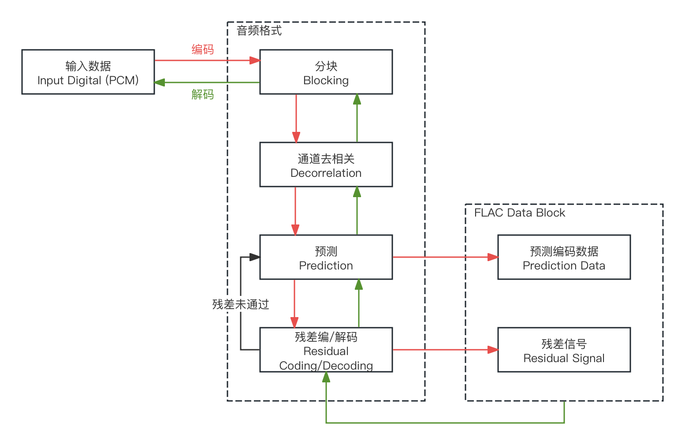
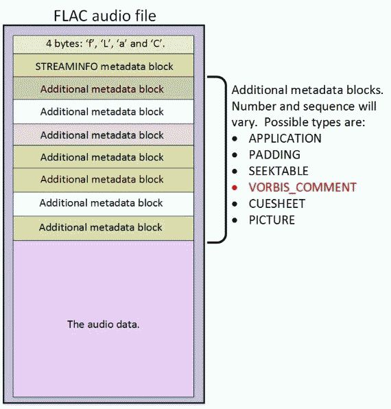
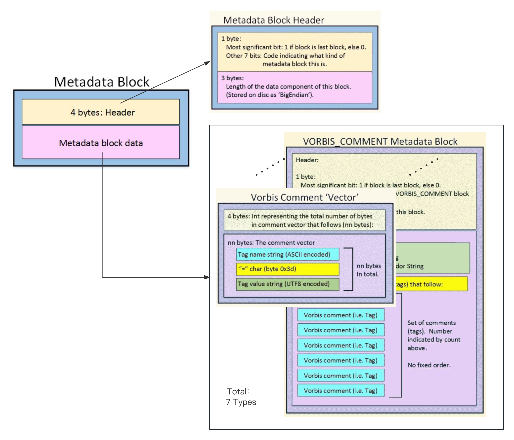

<head>
    <meta charset="UTF-8">
    <meta name="viewport" content="width=device-width, initial-scale=1.0">
    <title>Hex Data Display</title>
    
</head>

# 1.6.3 无损压缩编码格式（Lossless Compression Audio Format）

**无损压缩编码格式（Lossless [Lossless Compression Audio Format]）** 是采用 **无损压缩算法（Lossless Compression Method）对 PCM 数字信号数据，进行封装保存的音频格式（Audio Format）**。

## **无损压缩算法（Lossless Compression Method）**

**无损压缩算法（Lossless Compression Method）** 是对原始数字信号经过算法压缩后，仍可以通过算法本身的逆运算，完全一致的还原回原始数字信号的算法。属于在压缩和解压缩过程中，都 **不会丢失任何原始数据的可逆压缩算法（Reversible Compression Method）**。[\[4\]][ref]

常用无损压缩算法主要为 **四类**，分别是：

- **熵编码算法（Entropy Coding）**，采用如 **哈夫曼编码（Huffman Coding）**[\[21\]][ref] 、**香农-范诺编码（Shannon–Fano Coding）**[\[22\]][ref] 、**算数编码（Arithmetic Coding）**[\[23\]][ref] 等。此类算法通过调整信息熵，为高出现频次信息分配较短字节位，而低出现频次信息分配较长字节位的方式，缩减整体所占字节空间大小。

- **预测编码算法（Predictive Coding）**，如 **线性预测编码（LPC [Linear Predictive Coding]）**[\[24\]][ref]、**自适应差分脉冲编码调制（ADPCM [Adaptive Differential Pulse Code Modulation）**[\[25\]][ref] 等。这类算法通过预测下一个数据点的值，并仅存储预测误差，从而减少数据量。除了 ADPCM 外，一些诸如 差分脉冲编码调制（DPCM [Differential Pulse Code Modulation]）等的主要被运用于 数模模数转换 的调制方法，也是可以被在此处的。这种调制类方法，一般通过存储相邻采样点之间的差值来减少数据量，当运用于压缩时，也可归类至预测编码算法分类。

- **变换编码算法（Transform Coding）**，如 **离散傅里叶变换（DFT）**、**离散余弦变换（DCT）** 等。该类算法通过将时域信号转换为频域信号，来更有效地表示和压缩音频数据。由于其关键程度，在本书[第三章](../../../Chapter_3/Language/cn/Apex_3_Introduce.md)中，会重点讲解。

- **复合算法（Hybrid）**，是指一类 **采用了多种类型常规算法，按一定处理流排布，共同进行压缩的算法类型**。大部分无损压缩编码格式，都属于此类。比如，结合了熵编码和预测编码 FLAC、ALAC，以及多种算法混合处理的 APE。

另外需要区别一点。从 **原始波源（Original Source）** 到 **数字信号（Digital Signal）** 的过程是 **有损的**。但 **这与此处的压缩算法毫无关联**。

通过前面章节的讲解，我们可以认识到，模拟信号本身采样自原始波源的过程其实是有损的，而从模拟信号到数字信号的过程，依然也是有损的。最简单来看，单 A/D、D/A 中的 **硬件比特分辨率（Bit Resolution**），就可能因存在从 **连续到离散值再回到模拟连续值** 过程，而 **引入损失**。这一过程的损失被称为 **采样损失（Sampling Loss）**。

所以，**无损压缩算法虽然没有损失，但算法接收并处理的信号本身，就已经有一定的数据丢失了**。不过，相比有损算法而言，该损失可以通过部署更优质的硬件设备来降低损失量，且相对更适合在采集模拟信号过程考察。因此，与之算法因素，采样损失并不在格式中计入。

回到格式本身。**无损压缩编码格式（Lossless）** 最常见的主要有 **三种**，分别是 **FLAC（.flac）**、**ALAC（.m4a）** 和 **APE（.ape）**。但因为 APE 的处理流及算法闭源，与 ALAC 的平台兼容性问题，**FLAC 成为当下主流**，全平台兼容且具有三者中最高压缩率（30%～60%）的，无损压缩编码格式首选。
	
因此，本书以 FLAC 为主，介绍 无损压缩编码格式 类型的处理过程和结构特性。其他类型触类旁通，不再另行赘述。

## **FLAC 音频格式**

**开放无损编码格式（FLAC [Free Lossless Audio Codec]）**，即 **FLAC 音频格式（.flac）**，是由 **开放无损（音频）编码组织（Xiph.Org Foundation.）** 提供的一种，针对音频数据进行压缩存储的无损音频格式。由于是复合算法，其处理流水线如下（红线编码，绿线解码，解码逆运算）：

<figure>
   
    <figcaption>
      
图 1.6.3-1 FLAC 音频格式编解码执行作业流水线

   </figcaption>
</figure>

**分块（Blocking）** 是 **将输入音频分解成多个连续的块（Block）的步骤**。在 FLAC 中，这些块的大小是可变的。而块的最佳大小，通常受包括 采样率、随时间变化的频谱特性 等多种因素影响。虽然 FLAC 允许在一个流中使用不同的块大小，但我们仍需要参考编码器的建议，**使用固定的块大小**。另一方面，固定的块大小也能便于解码时的处理。

 

**通道间去相关（Interchannel Decorrelation）** 是 **针对多通道（Stereo、Multi-Channel）情况** 进行的，以选择的指定 **去相关策略（Decorrelation Strategy）** 计算新组值代原有通道数据，来 **减小原始信息冗余的辅助压缩手段**。

**去相关策略（Decorrelation Strategy）一般有三种**，即： **对称去相关（Symmetric Decorrelation）**、**主成分分析（PCA）**、**奇艺值分解（SVD）**。三者都是可逆的，而 **对称去相关 则是其中最快最简便的算法**。

记分块后有 $$(C_1, C_2)$$ 数据，对称去相关会根据分组的组内 **平均值（Mean）** 和 **差值（Sub）**，生成该组的中间信号与侧信号结果 $$(M, S)$$ 代替原 $$(C_1, C_2)$$ 。有：

$$
{\displaystyle 
 \begin{aligned}
   M = \frac{C_1 + C_2}{2} \quad , \quad S = \frac{C_1 - C_2}{2} \\
 \end{aligned}
}
$$

即 **简单的线性变换**。理所当然，其去相关的去数据冗余和降维能力也 **相对较弱**。

 

三种策略该如何选择呢？我们可以依据下表进行决定：

<table style="width:100%; border-collapse: collapse;">
  <tr style="background-color: #f2f2f2;">
    <th style="border: 1px solid #ddd; padding: 10px;">Strategy</th>
    <th style="border: 1px solid #ddd; padding: 10px; width: 140px;">Features</th>
    <th style="border: 1px solid #ddd; padding: 10px;">When to use？</th>
    <th style="border: 1px solid #ddd; padding: 10px;">Example</th>
  </tr>
  <tr>
    <th style="border: 1px solid #ddd; padding: 10px;">Symmetric</th>
    <td style="border: 1px solid #ddd; padding: 10px;">Fastest Low Complexity</td>
    <td style="border: 1px solid #ddd; padding: 10px;">simple linear transformations 简单线性变化场景</td>
    <td style="border: 1px solid #ddd; padding: 10px;">一般双通道音频</td>
  </tr>
  <tr style="background-color: #f2f2f2;">
    <th style="border: 1px solid #ddd; padding: 10px;">PCA</th>
    <td style="border: 1px solid #ddd; padding: 10px;">Slower High Complexity</td>
    <td style="border: 1px solid #ddd; padding: 10px;">when needs dimensionality reduction and feature extraction 需要降维和特征提取场景</td>
    <td style="border: 1px solid #ddd; padding: 10px;">需要所有通道的基本分类特征信息，用于模型</td>
  </tr>
  <tr>
    <th style="border: 1px solid #ddd; padding: 10px;">SVD</th>
    <td style="border: 1px solid #ddd; padding: 10px;">Slowest Highest Complexity</td>
    <td style="border: 1px solid #ddd; padding: 10px;">when needs precise matrix decomposition 需要精确矩阵分解的场景</td>
    <td style="border: 1px solid #ddd; padding: 10px;">需要矩阵化全通道特征张量，用于模型</td>
  </tr>
</table>

 

可见，除非后续步骤中涉及模型或想要更高压缩比的结果，否则选择 **对称去相关 基本已能满足大多数需求**。注意，**解码时需要逆运算**。

 

**预测（Prediction）** 则是将去相关性后的块，通过尝试找到信号的 **相近数学解集**，来 **转换块的保留数据**。一般而言，解集通常都比原始信号要 **小得多**。由于预测方法对编码器和解码器都是已知的，因此只需在压缩流中包含预测器的参数即可。**FLAC 目前只支持四种不同类别的内置已定义好的预测器**，但预留了额外的改进空间，以便添加其他方法。而从设计上讲，FLAC 允许预测器类别在块与块之间，甚至在块的各个通道之间变化。而解码时，亦需要采用相同预测方法做逆运算。

 

**残差编码（Residual Coding）** 是 **必须的校准步骤**，该步骤的目的是确认，预测器是否能准确的使用预测结果，描述输入的去相关块信号。此时，必须对原始信号和预测信号之间的差异（即误差，或残差信号）进行无损编码。
	
怎么判断预测器结果是否满足要求呢？粗略的方法，是 **通过判断 残差信号（Residual Signal）所需的每个样本位数，是否少于原始信号**。**少于则预测有效，否则无效**。而当差值过大时，通常意味着，编码器需要用 调整块大小、改变块数目、切换预测器、改变去相关方法 的流程内改动，来 **重新生成预测结果**。
	
所以，残差编码的作用，相当于整个编码过程的 **自动化结果检验**。同理于解码。

 

在经过这些步骤后，我们就得到了 **用于 FLAC 格式持续化存储的数据**，包含两部分：

<b>
【预测编码数据（Prediction Data）】+【残差信号（Residual Signal）】
</b>

 

这即是 FLAC 格式下，实际用于保存的 **一个完整 音频数据块（Audio Data Block）** 构成。存储的音频由一系列此种数据块，按时序排列组成。再配合 FLAC 格式文件结构的头部信息，共同组成了 FLAC 文件。

那么，一个完整的 FLAC 文件，其 **文件结构** 是什么样的呢？如图：

<figure>
   
    <figcaption>
      
图 1.6.3-2 完整 FLAC 音频格式文件的文件结构示意图 <a href="References_1.md">[26]</a>

   </figcaption>
</figure>

从简图中可以看出，**FLAC 文件结构仍然采用二分**，以：

<b>
【元数据信息块（Metadata Blocks）】+【音频数据块（Audio Data Blocks）】
</b>

 

的方式，进行信息区域划分。

**元数据信息块（Metadata Blocks）** 是包含 **流信息块** 和 **附属信息块** 在内的，一系列 **对音频数据本身特征进行描述** 的 **存储容器集合**。和未压缩音频 AIFF 格式较为相同，FLAC 的元数据信息块对数据的组织方式，采用了分类封装。而原本用于标记文件格式的 ID 字段，被从块中独立拿出，以 **恒定占用 FLAC 格式文件头部 4 字节（Bytes）的形式**，锚定当前数据结构信息。

即，**所有 FLAC 音频格式文件都有头部唯一字段（注意大小写）**：

<table style="width:100%; border-collapse: collapse;">
  <tr style="background-color: #f2f2f2;">
    <th style="border: 1px solid #ddd; padding: 10px; width: 150px;">Params</th>
    <th style="border: 1px solid #ddd; padding: 10px; width: 120px;">Range(bytes)</th>
    <th style="border: 1px solid #ddd; padding: 10px;">Details</th>
  </tr>
  <tr>
    <th style="border: 1px solid #ddd; padding: 10px;">FileID</th>
    <td style="border: 1px solid #ddd; padding: 10px;">0x00~0x03 (4)</td>
    <td style="border: 1px solid #ddd; padding: 10px;">标记当前文件 ID，固定存储 'fLaC' 四个大小写字母的 ASCII 码，即 == 0x664c6143</td>
  </tr>
</table>

 

至于其他被记录的关键或非关键额外信息，按照相关成分，被分为 **7 种不同种类的 基础内构元数据块** 和 **1 个无效标记块**，分别是：

<table style="width:100%; border-collapse: collapse;">
  <tr style="background-color: #f2f2f2;">
    <th style="border: 1px solid #ddd; padding: 10px; width: 150px;">Block Type</th>
    <th style="border: 1px solid #ddd; padding: 10px; width: 120px;">Mark（bit）</th>
    <th style="border: 1px solid #ddd; padding: 10px;">Details</th>
  </tr>
  <tr>
    <th style="border: 1px solid #ddd; padding: 10px;">STREAMINFO</th>
    <td style="border: 1px solid #ddd; padding: 10px;">0 : 0000 000</td>
    <td style="border: 1px solid #ddd; padding: 10px;">通用流信息块，必位于首位，用于记录音频流基本信息（比特率、采样率等）</td>
  </tr>
  <tr style="background-color: #f2f2f2;">
    <th style="border: 1px solid #ddd; padding: 10px;">PADDING</th>
    <td style="border: 1px solid #ddd; padding: 10px;">1 : 0000 001</td>
    <td style="border: 1px solid #ddd; padding: 10px;">对齐填充块，无内容（全部为 0）用于填充空间，用于在不重新编码音频数据的情况下添加或修改元数据</td>
  </tr>
  <tr>
    <th style="border: 1px solid #ddd; padding: 10px;">APPLICATION</th>
    <td style="border: 1px solid #ddd; padding: 10px;">2 : 0000 010</td>
    <td style="border: 1px solid #ddd; padding: 10px;">应用信息（子）块，用于存放经软件调整音频后，想要持续存储的调整设定参数</td>
  </tr>
  <tr style="background-color: #f2f2f2;">
    <th style="border: 1px solid #ddd; padding: 10px;">SEEKTABLE</th>
    <td style="border: 1px solid #ddd; padding: 10px;">3 : 0000 011</td>
    <td style="border: 1px solid #ddd; padding: 10px;">标记信息（子）块，用于存放快速定位音频流中特定位置的查找表</td>
  </tr>
  <tr>
    <th style="border: 1px solid #ddd; padding: 10px;">VORBIS_COMMENT</th>
    <td style="border: 1px solid #ddd; padding: 10px;">4 : 0000 100</td>
    <td style="border: 1px solid #ddd; padding: 10px;">评论信息（子）块，包含用户定义的标签信息，用于存放用户等人的交互评价信息</td>
  </tr>
  <tr style="background-color: #f2f2f2;">
    <th style="border: 1px solid #ddd; padding: 10px;">CUESHEET</th>
    <td style="border: 1px solid #ddd; padding: 10px;">5 : 0000 101</td>
    <td style="border: 1px solid #ddd; padding: 10px;">CUE 表（子）块，用于存放音轨的索引信息，即类比 CD 的 CUE 表</td>
  </tr>
  <tr>
    <th style="border: 1px solid #ddd; padding: 10px;">PICTURE</th>
    <td style="border: 1px solid #ddd; padding: 10px;">6 : 0000 110</td>
    <td style="border: 1px solid #ddd; padding: 10px;">图像数据（子）块，用于存放当前音频的专辑封面图片等图像信息</td>
  </tr>
  <tr style="background-color: #f2f2f2;">
    <th style="border: 1px solid #ddd; padding: 10px;">[Reserved]</th>
    <td style="border: 1px solid #ddd; padding: 10px;">7~126</td>
    <td style="border: 1px solid #ddd; padding: 10px;">保留（子）块，预留的 7～126 号标签，为未来扩展或自定义扩展而用</td>
  </tr>
  <tr>
    <th style="border: 1px solid #ddd; padding: 10px;">[Invalid]</th>
    <td style="border: 1px solid #ddd; padding: 10px;">127 : 1111 111</td>
    <td style="border: 1px solid #ddd; padding: 10px;">无效标记（子）块，是无效的元数据块类型用于唯一标识错误</td>
  </tr>
</table>

 

在 FLAC 中，**元数据块的基本组成高度一致**，皆为：

<b>
【元数据头（Metadata Header）】+【元数据块数据（Metadata Block Data）】
</b>

 

的形式，**不似于** AIFF 中的 ckID 来标记不同类型块，FLAC 采用元数据头中的固定标记位，以 **类型序号** 标识 **元数据块的种类**。即，并不以 ASCII 码标记的固定类型值作为头部信息。由此而来的好处是，**FLAC 的元数据头，能够以相对统一的结构定义，并包含更多有效信息**。

 

每个元数据块的 **固定头部（Metadata Header）**，以下简称 **头部（Header）**，**始终为 4 字节（4 bytes）**，包含 3 个关键字段：

<table style="width:100%; border-collapse: collapse;">
  <tr style="background-color: #f2f2f2;">
    <th style="border: 1px solid #ddd; padding: 10px; width: 150px;">Params</th>
    <th style="border: 1px solid #ddd; padding: 10px; width: 120px;">Range(bytes)</th>
    <th style="border: 1px solid #ddd; padding: 10px;">Details</th>
  </tr>
  <tr>
    <th style="border: 1px solid #ddd; padding: 10px;">Last block flag</th>
    <td style="border: 1px solid #ddd; padding: 10px;">0x00 (1 bit) x--- ----</td>
    <td style="border: 1px solid #ddd; padding: 10px;">标记当前块是否为最末位，占第一字节第七位 1 bit 当块为最末位时该位为 1 ，否则为 0</td>
  </tr>
  <tr style="background-color: #f2f2f2;">
    <th style="border: 1px solid #ddd; padding: 10px;">Block Type</th>
    <td style="border: 1px solid #ddd; padding: 10px;">0x00 (7 bits) -xxx xxxx</td>
    <td style="border: 1px solid #ddd; padding: 10px;">块类型标记位，占第一字节的 剩余 7 bits 即上表中的块类型 Mark</td>
  </tr>
  <tr>
    <th style="border: 1px solid #ddd; padding: 10px;">Block Length</th>
    <td style="border: 1px solid #ddd; padding: 10px;">0x01~0x03 (3)</td>
    <td style="border: 1px solid #ddd; padding: 10px;">块大小，记录当前块的总字节长度（不含头部），24 位</td>
  </tr>
</table>

 

而 **所有的元数据块皆有如下结构**：

<figure>
   
    <figcaption>
      
图 1.6.3-3 FLAC 音频格式的元数据信息块统一结构示意图

   </figcaption>
</figure>

现在，让我们顺序了解各类分块的关键参数（包含元数据头）。**方便与系统起见**，我们仍然将 **元数据块（Metadata Block）** 称为 **块（Chunk）**。

 

**通用流信息块（STREAMINFO Chunk）** 主要包含 10 种属性，分别是：

<table style="width:100%; border-collapse: collapse;">
  <tr style="background-color: #f2f2f2;">
    <th style="border: 1px solid #ddd; padding: 10px; width: 150px;">Params</th>
    <th style="border: 1px solid #ddd; padding: 10px; width: 120px;">Range(bytes)</th>
    <th style="border: 1px solid #ddd; padding: 10px;">Details</th>
  </tr>
  <tr>
    <th style="border: 1px solid #ddd; padding: 10px;">Header</th>
    <td style="border: 1px solid #ddd; padding: 10px;">0x00~0x03 (4)</td>
    <td style="border: 1px solid #ddd; padding: 10px;">元数据块的固定头部， 对于 STREAMINFO，首字节有 [flag bit] 000 0000</td>
  </tr>
  <tr style="background-color: #f2f2f2;">
    <th style="border: 1px solid #ddd; padding: 10px;">Min Block Size</th>
    <td style="border: 1px solid #ddd; padding: 10px;">0x04~0x05 (2)</td>
    <td style="border: 1px solid #ddd; padding: 10px;">最小块大小（以样本为单位）， 通常为 16 或 4096</td>
  </tr>
  <tr>
    <th style="border: 1px solid #ddd; padding: 10px;">Max Block Size</th>
    <td style="border: 1px solid #ddd; padding: 10px;">0x06~0x07 (2)</td>
    <td style="border: 1px solid #ddd; padding: 10px;">最大块大小（以样本为单位）， 通常为 16 或 4096</td>
  </tr>
  <tr style="background-color: #f2f2f2;">
    <th style="border: 1px solid #ddd; padding: 10px;">Min Frame Size</th>
    <td style="border: 1px solid #ddd; padding: 10px;">0x08~0x0a (3)</td>
    <td style="border: 1px solid #ddd; padding: 10px;">最小帧大小（以字节为单位）， 表示音频帧的最小字节数</td>
  </tr>
  <tr>
    <th style="border: 1px solid #ddd; padding: 10px;">Max Frame Size</th>
    <td style="border: 1px solid #ddd; padding: 10px;">0x0b~0x0d (3)</td>
    <td style="border: 1px solid #ddd; padding: 10px;">最大帧大小（以字节为单位）， 表示音频帧的最大字节数</td>
  </tr>
  <tr style="background-color: #f2f2f2;">
    <th style="border: 1px solid #ddd; padding: 10px;">Sample Rate</th>
    <td style="border: 1px solid #ddd; padding: 10px;">0x0e~0x10 (2.5 = 20 bits)</td>
    <td style="border: 1px solid #ddd; padding: 10px;">数字信号采样率，由于 SUD 只能存 PCM， 对 PCM 来说就是 &lt;PCM 采样率&gt;，有该值 == 8000 | 11025 | 24000 | 44100 等</td>
  </tr>
  <tr>
    <th style="border: 1px solid #ddd; padding: 10px;">Num of Channels</th>
    <td style="border: 1px solid #ddd; padding: 10px;">0x10 (3 bits) xxx- ----</td>
    <td style="border: 1px solid #ddd; padding: 10px;">存储音频数据的通道数， 单通道（Mono == 1），双通道（Stereo == 2）， N 通道（== N）</td>
  </tr>
  <tr style="background-color: #f2f2f2;">
    <th style="border: 1px solid #ddd; padding: 10px;">Bits per Sample</th>
    <td style="border: 1px solid #ddd; padding: 10px;">0x10~0x11 (5 bits) ---x xxxx</td>
    <td style="border: 1px solid #ddd; padding: 10px;">即 采样位深（Sampling Bit Depth）/ 最大比特分辨率（Max Bit Resolution），该值单位为 bits，有 == 8 | 16 | 32 bits 等</td>
  </tr>
  <tr>
    <th style="border: 1px solid #ddd; padding: 10px;">Total Samples</th>
    <td style="border: 1px solid #ddd; padding: 10px;">0x11~0x15 (4.5 = 36 bits)</td>
    <td style="border: 1px solid #ddd; padding: 10px;">用于标记音频数据在数模转换时的有效采样个数， 即总音频帧数 == 音频的全通道总采样次数 / 通道数</td>
  </tr>
  <tr style="background-color: #f2f2f2;">
    <th style="border: 1px solid #ddd; padding: 10px;">MD5 Signature</th>
    <td style="border: 1px solid #ddd; padding: 10px;">0x16~0x26 (16)</td>
    <td style="border: 1px solid #ddd; padding: 10px;">完整性 MD5 签名， 用于验证音频数据完整性的 MD5 哈希值，128 位。 通过验证 MD5 是否和预期一致，快速检测完整性</td>
  </tr>
</table>

 

**对齐填充块（PADDING Chunk）** 主要包含 2 种属性，分别是：

<table style="width:100%; border-collapse: collapse;">
  <tr style="background-color: #f2f2f2;">
    <th style="border: 1px solid #ddd; padding: 10px; width: 150px;">Params</th>
    <th style="border: 1px solid #ddd; padding: 10px; width: 120px;">Range(bytes)</th>
    <th style="border: 1px solid #ddd; padding: 10px;">Details</th>
  </tr>
  <tr>
    <th style="border: 1px solid #ddd; padding: 10px;">Header</th>
    <td style="border: 1px solid #ddd; padding: 10px;">0x00~0x03 (4)</td>
    <td style="border: 1px solid #ddd; padding: 10px;">元数据块的固定头部， 对于 PADDING，首字节有 [flag bit] 000 0001</td>
  </tr>
  <tr style="background-color: #f2f2f2;">
    <th style="border: 1px solid #ddd; padding: 10px;">Padding Data</th>
    <td style="border: 1px solid #ddd; padding: 10px;">0x04~0x04+X (X)</td>
    <td style="border: 1px solid #ddd; padding: 10px;">填充数据，全部为零， 用于在不重新编码音频数据的情况下添加或修改元数据</td>
  </tr>
</table>

 

**应用信息块（APPLICATION Chunk）** 主要包含 2 种属性，分别是：

<table style="width:100%; border-collapse: collapse;">
  <tr style="background-color: #f2f2f2;">
    <th style="border: 1px solid #ddd; padding: 10px; width: 150px;">Params</th>
    <th style="border: 1px solid #ddd; padding: 10px; width: 120px;">Range(bytes)</th>
    <th style="border: 1px solid #ddd; padding: 10px;">Details</th>
  </tr>
  <tr>
    <th style="border: 1px solid #ddd; padding: 10px;">Header</th>
    <td style="border: 1px solid #ddd; padding: 10px;">0x00~0x03 (4)</td>
    <td style="border: 1px solid #ddd; padding: 10px;">元数据块的固定头部， 对于 APPLICATION，首字节有 [flag bit] 000 0010</td>
  </tr>
  <tr style="background-color: #f2f2f2;">
    <th style="border: 1px solid #ddd; padding: 10px;">Application ID</th>
    <td style="border: 1px solid #ddd; padding: 10px;">0x04~0x07 (4)</td>
    <td style="border: 1px solid #ddd; padding: 10px;">标记指向系统应用签名（Application Signature）， 应用签名是已发布应用的唯一标识， 即注册的应用程序 ID，用于标识特定的应用程序</td>
  </tr>
  <tr>
    <th style="border: 1px solid #ddd; padding: 10px;">Application Data</th>
    <td style="border: 1px solid #ddd; padding: 10px;">0x08~0x08+X (X)</td>
    <td style="border: 1px solid #ddd; padding: 10px;">系统应用的相关数据， 具体内容由签名指定的系统应用处理，长度 X 字节</td>
  </tr>
</table>

 

**标记信息块（SEEKTABLE Chunk）**，也可称为索引表块，主要包含 2 种属性和 **1 种 子数据体（sub-Data Info）**，本身具有 **两层数据结构模型**：

<table style="width:100%; border-collapse: collapse;">
  <tr style="background-color: #f2f2f2;">
    <th style="border: 1px solid #ddd; padding: 10px; width: 150px;">Params</th>
    <th style="border: 1px solid #ddd; padding: 10px; width: 120px;">Range(bytes)</th>
    <th style="border: 1px solid #ddd; padding: 10px;">Details</th>
  </tr>
  <tr>
    <th style="border: 1px solid #ddd; padding: 10px;">Header</th>
    <td style="border: 1px solid #ddd; padding: 10px;">0x00~0x03 (4)</td>
    <td style="border: 1px solid #ddd; padding: 10px;">元数据块的固定头部，对于 SEEKTABLE，首字节有 [flag bit] 000 0011</td>
  </tr>
  <tr style="background-color: #f2f2f2;">
    <th style="border: 1px solid #ddd; padding: 10px; vertical-align: top;">Seek Points</th>
    <td style="border: 1px solid #ddd; padding: 10px; vertical-align: top;">0x04~0x04 + (numSeekPoints * perSPSize)</td>
    <td style="border: 1px solid #ddd; padding: 10px;">
      由查找点构成的 数组（Array），子数据体 SeekPoint 持有者，类似 AIFF 的 Markers 标记作用于总采样的每个独立采样上，时序顺序标记
      <table style="width:100%; border-collapse: collapse; margin-top: 10px;">
        <tr style="background-color: #f2f2f2;">
          <th style="border: 1px solid #ddd; padding: 10px;">SeekPoint (bytes)</th>
          <th style="border: 1px solid #ddd; padding: 10px;">Sub-Detail</th>
        </tr>
        <tr style="background-color: #fcfcfc;">
          <th style="border: 1px solid #ddd; padding: 10px;">Sample Number (8)</th>
          <td style="border: 1px solid #ddd; padding: 10px;">查找点对应的采样数</td>
        </tr>
        <tr style="background-color: #f2f2f2;">
          <th style="border: 1px solid #ddd; padding: 10px;">Byte Offset (8)</th>
          <td style="border: 1px solid #ddd; padding: 10px;">查找点对应的字节偏移量</td>
        </tr>
        <tr style="background-color: #fcfcfc;">
          <th style="border: 1px solid #ddd; padding: 10px;">Sample Offset (2)</th>
          <td style="border: 1px solid #ddd; padding: 10px;">查找点对应的采样数偏移量</td>
        </tr>
      </table>
    </td>
  </tr>
</table>

 

**评论信息块（VORBIS_COMMENT Chunk）**，主要包含 5 种属性和 **1 种 子数据体（sub-Data Info）**，本身具有 **两层数据结构模型**：

<table style="width:100%; border-collapse: collapse;">
  <tr style="background-color: #f2f2f2;">
    <th style="border: 1px solid #ddd; padding: 10px; width: 150px;">Params</th>
    <th style="border: 1px solid #ddd; padding: 10px; width: 120px;">Range(bytes)</th>
    <th style="border: 1px solid #ddd; padding: 10px;">Details</th>
  </tr>
  <tr>
    <th style="border: 1px solid #ddd; padding: 10px;">Header</th>
    <td style="border: 1px solid #ddd; padding: 10px;">0x00~0x03 (4)</td>
    <td style="border: 1px solid #ddd; padding: 10px;">元数据块的固定头部，VORBIS_COMMENT，首字节有 [flag bit] 000 0100</td>
  </tr>
  <tr style="background-color: #f2f2f2;">
    <th style="border: 1px solid #ddd; padding: 10px;">Vendor Length</th>
    <td style="border: 1px solid #ddd; padding: 10px;">0x04~0x07 (4)</td>
    <td style="border: 1px solid #ddd; padding: 10px;">标记厂商字符串长度，记为 len 厂商字符串的长度，表示厂商字符串的字节数</td>
  </tr>
  <tr>
    <th style="border: 1px solid #ddd; padding: 10px;">Vendor String</th>
    <td style="border: 1px solid #ddd; padding: 10px;">0x08~0x08+len</td>
    <td style="border: 1px solid #ddd; padding: 10px;">标记厂商字符串，字符串长度为 Vendor Length 值，用来记录当前音频的发行商等信息</td>
  </tr>
  <tr style="background-color: #f2f2f2;">
    <th style="border: 1px solid #ddd; padding: 10px;">User Comment List Length</th>
    <td style="border: 1px solid #ddd; padding: 10px;">0x08+len~0x08+len+4 (4)</td>
    <td style="border: 1px solid #ddd; padding: 10px;">记录当前评论个数，值为几，就有几条评论</td>
  </tr>
  <tr>
    <th style="border: 1px solid #ddd; padding: 10px; vertical-align: top;">User Comment List</th>
    <td style="border: 1px solid #ddd; padding: 10px; vertical-align: top;">0x08+len+4 ~ 0x08+len+4 + (numComments * perCommSize)</td>
    <td style="border: 1px solid #ddd; padding: 10px; vertical-align: top;">
      由评论构成的 数组（Array），子数据体 Comment 持有者，不同 AIFF 的 Comment FLAC 的该子数据体记录，包括的评论所有音频额外信息键值对字符串，如 "TITLE=Example"
      <table style="width:100%; border-collapse: collapse; margin-top: 10px;">
        <tr style="background-color: #f2f2f2;">
          <th style="border: 1px solid #ddd; padding: 10px;">Comment (bytes)</th>
          <th style="border: 1px solid #ddd; padding: 10px;">Sub-Detail</th>
        </tr>
        <tr style="background-color: #fcfcfc;">
          <th style="border: 1px solid #ddd; padding: 10px;">Comment Length (4)</th>
          <td style="border: 1px solid #ddd; padding: 10px;">评论字符串长度（ N 字节）</td>
        </tr>
        <tr style="background-color: #f2f2f2;">
          <th style="border: 1px solid #ddd; padding: 10px;">Comment String (N)</th>
          <td style="border: 1px solid #ddd; padding: 10px;">评论键值对字符串</td>
        </tr>
      </table>
    </td>
  </tr>
</table>

 

**CUE 表块（CUESHEET Chunk）**，主要包含 7 种属性和 **2 种 子数据体（sub-Data Info）**，本身具有 **三层数据结构模型**：

<table style="width:100%; border-collapse: collapse;">
  <tr style="background-color: #f2f2f2;">
    <th style="border: 1px solid #ddd; padding: 10px; width: 150px;">Params</th>
    <th style="border: 1px solid #ddd; padding: 10px; width: 120px;">Range(bytes)</th>
    <th style="border: 1px solid #ddd; padding: 10px;">Details</th>
  </tr>
  <tr>
    <th style="border: 1px solid #ddd; padding: 10px;">Header</th>
    <td style="border: 1px solid #ddd; padding: 10px;">0x00~0x03 (4)</td>
    <td style="border: 1px solid #ddd; padding: 10px;">元数据块的固定头部，对于 CUESHEET，首字节有 [flag bit] 000 0101</td>
  </tr>
  <tr style="background-color: #f2f2f2;">
    <th style="border: 1px solid #ddd; padding: 10px;">Media Catalog Number</th>
    <td style="border: 1px solid #ddd; padding: 10px;">0x04~0x43 (64)</td>
    <td style="border: 1px solid #ddd; padding: 10px;">记录媒体目录号，表示光盘的媒体目录号</td>
  </tr>
  <tr>
    <th style="border: 1px solid #ddd; padding: 10px;">Lead-in Samples</th>
    <td style="border: 1px solid #ddd; padding: 10px;">0x44~0x4b (8)</td>
    <td style="border: 1px solid #ddd; padding: 10px;">引导样本数，表示光盘引导区的样本数</td>
  </tr>
  <tr style="background-color: #f2f2f2;">
    <th style="border: 1px solid #ddd; padding: 10px;">Is CD</th>
    <td style="border: 1px solid #ddd; padding: 10px;">0x4c (1)</td>
    <td style="border: 1px solid #ddd; padding: 10px;">是否为 CD，1 表示是 CD，0 表示不是 CD</td>
  </tr>
  <tr>
    <th style="border: 1px solid #ddd; padding: 10px;">Reserved</th>
    <td style="border: 1px solid #ddd; padding: 10px;">0x4d~0x5f (19)</td>
    <td style="border: 1px solid #ddd; padding: 10px;">保留字段，全部为零</td>
  </tr>
  <tr style="background-color: #f2f2f2;">
    <th style="border: 1px solid #ddd; padding: 10px;">Number of Tracks</th>
    <td style="border: 1px solid #ddd; padding: 10px;">0x60 (1)</td>
    <td style="border: 1px solid #ddd; padding: 10px;">总轨数，表示光盘上的总轨数，即声轨，并非通道数 各声轨间独立，是可以在播放上重叠的</td>
  </tr>
  <tr>
    <th style="border: 1px solid #ddd; padding: 10px; vertical-align: top;">Track Information</th>
    <td style="border: 1px solid #ddd; padding: 10px; vertical-align: top;">0x61 ~ 0x61 + (numTrackInfo * perTInfoSize)</td>
    <td style="border: 1px solid #ddd; padding: 10px;">
      由声轨构成的 数组（Array），子数据体 TrackInfo 持有者，记录每个声轨的信息，包括轨号、轨偏移、ISRC、轨索引等
      <table style="width:100%; border-collapse: collapse; margin-top: 10px;">
        <tr style="background-color: #f2f2f2;">
          <th style="border: 1px solid #ddd; padding: 10px;">TrackInfo (bytes)</th>
          <th style="border: 1px solid #ddd; padding: 10px;">Sub-Detail</th>
        </tr>
        <tr>
          <th style="border: 1px solid #ddd; padding: 10px;">Track Offset (8)</th>
          <td style="border: 1px solid #ddd; padding: 10px;">轨偏移，轨道的字节偏移量</td>
        </tr>
        <tr style="background-color: #f2f2f2;">
          <th style="border: 1px solid #ddd; padding: 10px;">Track Number (1)</th>
          <td style="border: 1px solid #ddd; padding: 10px;">轨号，即轨道的编号</td>
        </tr>
        <tr>
          <th style="border: 1px solid #ddd; padding: 10px;">ISRC (12)</th>
          <td style="border: 1px solid #ddd; padding: 10px;">声轨的国际标准录音代码</td>
        </tr>
        <tr style="background-color: #f2f2f2;">
          <th style="border: 1px solid #ddd; padding: 10px;">Track Type (1)</th>
          <td style="border: 1px solid #ddd; padding: 10px;">轨类型，轨道的类型</td>
        </tr>
        <tr>
          <th style="border: 1px solid #ddd; padding: 10px;">Pre-emphasis (1)</th>
          <td style="border: 1px solid #ddd; padding: 10px;">标记是否使用预加重</td>
        </tr>
        <tr style="background-color: #f2f2f2;">
          <th style="border: 1px solid #ddd; padding: 10px;">Reserved (3)</th>
          <td style="border: 1px solid #ddd; padding: 10px;">保留开关字段，全部为零</td>
        </tr>
        <tr>
          <th style="border: 1px solid #ddd; padding: 10px; vertical-align: top;">Track Index (N) N = (num*TrackIndexSize)</th>
          <td style="border: 1px solid #ddd; padding: 10px;">
            由轨索引构成的 数组（Array），子数据体 TrackIndex 持有者，记录声轨索引信息
            <table style="width:100%; border-collapse: collapse; margin-top: 10px;">
              <tr style="background-color: #f2f2f2;">
                <th style="border: 1px solid #ddd; padding: 10px;">TrackIndex (bytes)</th>
                <th style="border: 1px solid #ddd; padding: 10px;">Sub-Detail</th>
              </tr>
              <tr>
                <th style="border: 1px solid #ddd; padding: 10px;">Index Offset (8)</th>
                <td style="border: 1px solid #ddd; padding: 10px;">索引偏移，索引字节偏移量</td>
              </tr>
              <tr style="background-color: #f2f2f2;">
                <th style="border: 1px solid #ddd; padding: 10px;">Index Number (1)</th>
                <td style="border: 1px solid #ddd; padding: 10px;">索引号，即索引的编号</td>
              </tr>
              <tr>
                <th style="border: 1px solid #ddd; padding: 10px;">Reserved (3)</th>
                <td style="border: 1px solid #ddd; padding: 10px;">保留字段，全部为零</td>
              </tr>
            </table>
          </td>
        </tr>
      </table>
    </td>
  </tr>
</table>

 

**图像数据（PICTURE Chunk）**，主要包含 12 种属性，为：

<table style="width:100%; border-collapse: collapse;">
  <tr style="background-color: #f2f2f2;">
    <th style="border: 1px solid #ddd; padding: 10px; width: 150px;">Params</th>
    <th style="border: 1px solid #ddd; padding: 10px; width: 120px;">Range(bytes)</th>
    <th style="border: 1px solid #ddd; padding: 10px;">Details</th>
  </tr>
  <tr>
    <th style="border: 1px solid #ddd; padding: 10px;">Header</th>
    <td style="border: 1px solid #ddd; padding: 10px;">0x00~0x03 (4)</td>
    <td style="border: 1px solid #ddd; padding: 10px;">元数据块的固定头部，对于 PICTURE，首字节有 [flag bit] 000 0110</td>
  </tr>
  <tr style="background-color: #f2f2f2;">
    <th style="border: 1px solid #ddd; padding: 10px;">Picture Type</th>
    <td style="border: 1px solid #ddd; padding: 10px;">0x04~0x07 (4)</td>
    <td style="border: 1px solid #ddd; padding: 10px;">图片类型，表示图片的用途，例如封面、背面等</td>
  </tr>
  <tr>
    <th style="border: 1px solid #ddd; padding: 10px;">MIME Type Length</th>
    <td style="border: 1px solid #ddd; padding: 10px;">0x08~0x0b (4)</td>
    <td style="border: 1px solid #ddd; padding: 10px;">MIME 类型字符串的长度，表示 MIME 类型字符串字节数，值为 X0 单位 bytes</td>
  </tr>
  <tr style="background-color: #f2f2f2;">
    <th style="border: 1px solid #ddd; padding: 10px; vertical-align: top;">MIME Type</th>
    <td style="border: 1px solid #ddd; padding: 10px; vertical-align: top;">0x0c~0x0c+X0 (X0)</td>
    <td style="border: 1px solid #ddd; padding: 10px;">MIME 类型字符串，表示图片的 MIME 类型，例如 "image/jpeg" 或 "image/png" ，字符串长度由上一条属性记录</td>
  </tr>
  <tr>
    <th style="border: 1px solid #ddd; padding: 10px;">Description Length</th>
    <td style="border: 1px solid #ddd; padding: 10px;">0x0c+X0~0x0c+X0+4 (4)</td>
    <td style="border: 1px solid #ddd; padding: 10px;">描述字符串的长度，表示描述字符串的字节数，值为 X1 单位 bytes</td>
  </tr>
  <tr style="background-color: #f2f2f2;">
    <th style="border: 1px solid #ddd; padding: 10px;">Description</th>
    <td style="border: 1px solid #ddd; padding: 10px;">last_at~last_at+X1 (X1)</td>
    <td style="border: 1px solid #ddd; padding: 10px;">描述字符串，表示图片的描述信息，例如 "Album Cover"</td>
  </tr>
  <tr>
    <th style="border: 1px solid #ddd; padding: 10px;">Width</th>
    <td style="border: 1px solid #ddd; padding: 10px;">last_at~last_at+4 (4)</td>
    <td style="border: 1px solid #ddd; padding: 10px;">图片宽度，单位为像素，例如值 512 ，即 512 像素（Pixels）</td>
  </tr>
  <tr style="background-color: #f2f2f2;">
    <th style="border: 1px solid #ddd; padding: 10px;">Height</th>
    <td style="border: 1px solid #ddd; padding: 10px;">last_at~last_at+4 (4)</td>
    <td style="border: 1px solid #ddd; padding: 10px;">图片高度，单位为像素，例如值 512 ，即 512 像素（Pixels）</td>
  </tr>
  <tr>
    <th style="border: 1px solid #ddd; padding: 10px;">Color Depth</th>
    <td style="border: 1px solid #ddd; padding: 10px;">last_at~last_at+4 (4)</td>
    <td style="border: 1px solid #ddd; padding: 10px;">色深，单位为位（bit），表示每个像素的位数例如值 24，表示单个像素颜色为 24 位，详见下一章</td>
  </tr>
  <tr style="background-color: #f2f2f2;">
    <th style="border: 1px solid #ddd; padding: 10px;">Colors Used</th>
    <td style="border: 1px solid #ddd; padding: 10px;">last_at~last_at+4 (4)</td>
    <td style="border: 1px solid #ddd; padding: 10px;">每像素的颜色数，表示图片使用的颜色数，即颜色总数，例如值 16，像素值为索引，取色自 16 种色的调色板而取 0 则表示，颜色完全由像素自身决定</td>
  </tr>
  <tr>
    <th style="border: 1px solid #ddd; padding: 10px;">Picture Data Length</th>
    <td style="border: 1px solid #ddd; padding: 10px;">last_at~last_at+4 (4)</td>
    <td style="border: 1px solid #ddd; padding: 10px;">图片数据的长度，表示图片数据的字节数，值为 N 单位 bytes值指向下一字段，当前块的图片数据所占总字节长度</td>
  </tr>
  <tr style="background-color: #f2f2f2;">
    <th style="border: 1px solid #ddd; padding: 10px;">Picture Data</th>
    <td style="border: 1px solid #ddd; padding: 10px;">last_at~last_at+N (N)</td>
    <td style="border: 1px solid #ddd; padding: 10px;">图片数据（逐行扫描），当前块的实际图片二进制数据，每个像素值取 色深（ColorDepth）值代表的位数</td>
  </tr>
</table>

 

剩下的 **保留块（Reserved Chunk）** 和 **无效块（Invalid Chunk）** 类型，因其数据结构定义为无 或 自定制。实际使用中，**可根据当前工程情况，内部协议设定加以利用**。

 

至此，对于 FLAC 音频格式，我们就能完整解析了。让我们来看一段 138 bytes 的 FLAC 音频文件数据（十六进制格式单字节展开）事例：

<body>

66 4c 61 43 00 00 00 22 00 10 00 10 00 04 00 00 10 00 ac 44 50 00 00 06  
ba a8 d4 1d 8c d9 8f 00 b2 04 e9 80 09 98 ec f8 42 7e 86 01 f4 35 00 00  
00 03 00 00 00 0a 69 6d 61 67 65 2f 6a 70 65 67 00 00 00 0b 41 6c 62 75  
6d 20 43 6f 76 65 72 00 00 02 00 00 00 02 00 00 00 18 00 00 00 00 00 00  
01 f4 00  

</body>

按照上述划分，获取对应子块信息，有：

<figure>
   
    <figcaption>
      
图 1.6.3-4 演示用 138 bytes 的 FLAC 音频文件数据解析

   </figcaption>
</figure>

可见，样例只是一段 FLAC 数据的元数据部分，且包含了 STREAMINFO 和 PICTURE 这两个元数据块。同时，PICTURE 的图片数据 **并不在上述数据** 中。而从 **图片数据的长度（Picture Data Length）** 和 其他字段携带的信息可知，**该图片数据为 512 x 512 的 128000 字节 24 位 JPEG 数据**。而原音频，从 **STREAMINFO 解读** 可得，未在上例中包含的音频数据块中包含的音频，为 **采样率 44100 Hz 的 16-bits 双声道立体声（Stereo）总计 44100 个采样值（即 1s 长度）的压缩后数据块数组**。

 

**作为无损压缩编码音频格式的代表，FLAC 具有重要的地位**。它能够在不丢失任何原始音频信息的情况下，极大的减少文件大小。这使得它被广泛的应用在了高保真音频存储和传输过程中。其 **无损特性确保了音频在解码后与原始音频完全一致**，令其成为了 **音频发烧友 和 专业音频制作 的首选格式**。

同样的，该特点也是无损压缩编码音频格式，**最为显著具的优势**。

 

然而，尽管无损压缩如 FLAC 提供了最高的音质保真度，**但其文件大小仍然相对较大**。在许多应用场景中，如 **流媒体** 和 **便携设备存储（尤其是在随身听时代，早期有限的存储空间情况）**，依然 **不够便利**。因此，**具有更大压缩比的有损压缩编码音频格式**，如 MP3 和 AAC 便成为了一种 **可以接受的替代方案**。这些格式 **通过舍弃人耳不易察觉的音频信息，进一步减小文件大小，同时在音质和压缩率之间取得平衡**。

虽然为人所带来的听觉感受，介于此，会相对有所衰减。

[ref]: References_1.md