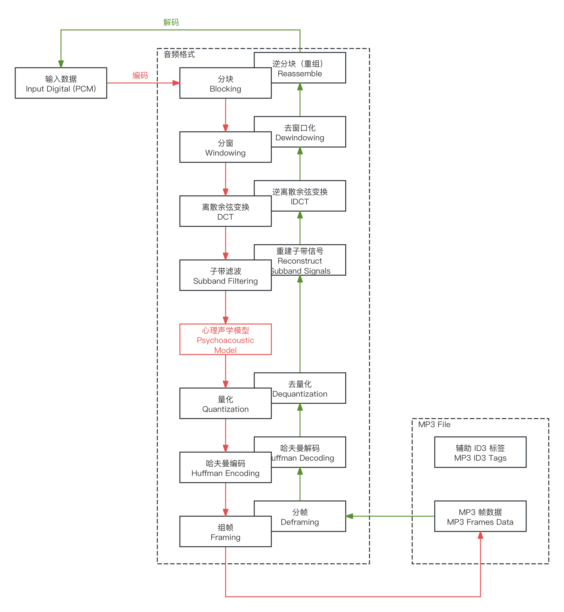
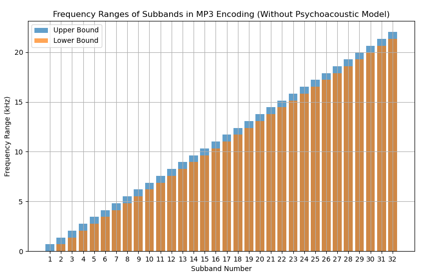
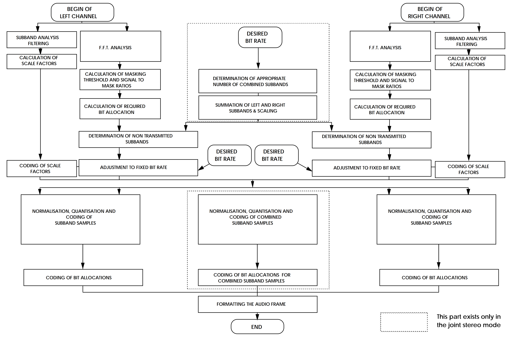
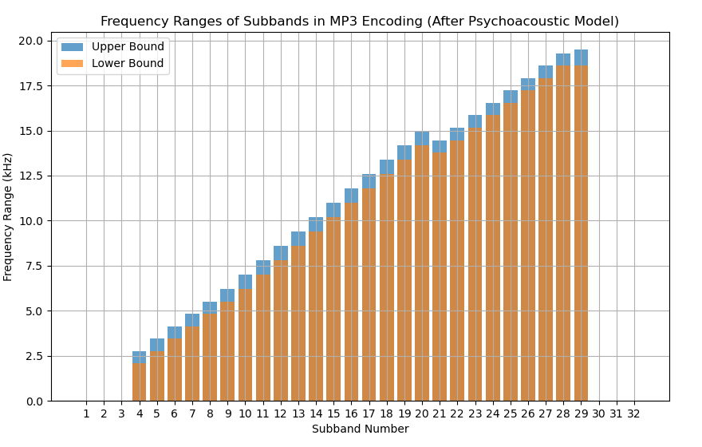
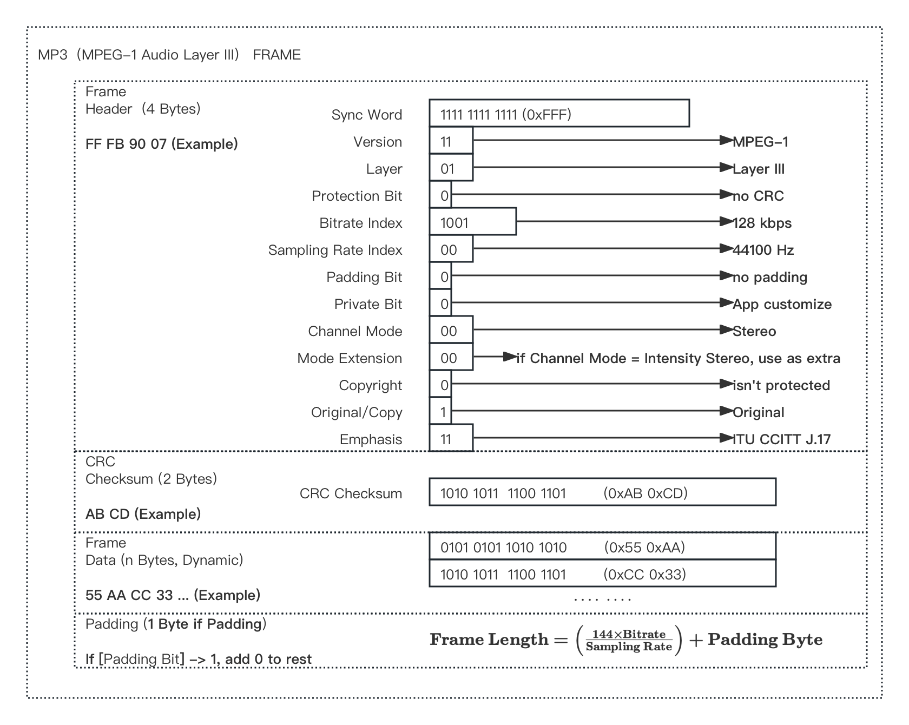
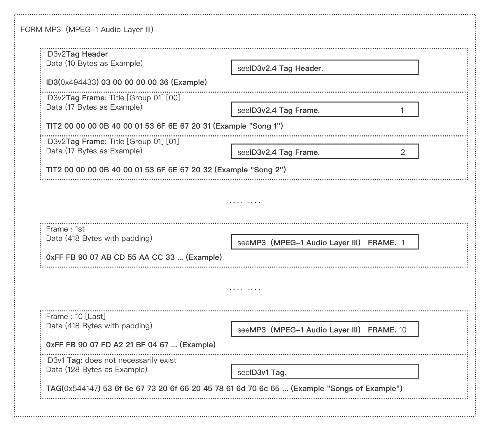

<head>
    <meta charset="UTF-8">
    <meta name="viewport" content="width=device-width, initial-scale=1.0">
    <title>Hex Data Display</title>
    
</head>

# 1.6.4 有损压缩编码格式（Lossy Compression Audio Format）

**有损压缩编码格式（Lossy [Lossy Compression Audio Format]）** 是一种 **通过舍弃部分音频数据来减少文件大小的音频压缩技术**。其采用 **有损压缩算法（Lossy Compression Method）对 PCM 数字信号数据，进行封装保存的音频格式（Audio Format）**。

## **有损压缩算法（Lossy Compression Method）**

**有损压缩算法（Lossy Compression Method）** 是对原始数字信号经过算法压缩后，仍可以通过算法本身的逆运算，**相对近似的还原回原始数字信号的算法**。因为算法会丢失部分数据导致音质下降，所以，**有损压缩算法属于不可逆压缩算法（Irreversible Compression Method）**。而按处理流分类来看，被使用在压缩/解压处理上的有损压缩算法，**只有复合算法（Hybrid）类型**。

 

对于不可逆压缩算法而言，其对 **数字信号的编码（Encoding）关键步骤**，大都为 **采用数学逼近算法，去寻找复杂曲线的解集**，用 **记录解集本身** 来替代原有数字信号的数字码信息 **进行保存**。这个求解过程就可能 **引入一定的损失**。其 **解码（Decoding）处理**，则是根据解集，**结合采用算法重新合成至原有数据**。

此时，还原出的数据，是 **算法拟合的结果而非原始样本**，即非原有数字信号的结果。

 

从数学角度来看，此类算法大都选择以 **离散傅里叶变换（DFT）**、**小波变换（Wavelet Transform）** 等技术的 **降低算力消耗近似解方案**，作为算法核心。以傅立叶族举例，在实际应用中，当选定解空间的 **[傅立叶基底函数族](../../../Chapter_3/Language/cn/Docs_3_1.md)** 并不是无穷时，**离散傅立叶基所表示的原值**，本就 **会有一定损失**（见本书[第三章](../../../Chapter_3/Language/cn/Docs_3_1.md)详解）。此外，来自数字信号的 **有损采样（Lossy Sampling）** 过程的 **采样损失（Sampling Loss）**，依旧会存在。

所以，**不可逆压缩算法是会有一定误差的。而误差的引入则来自于算法自身，一经处理后无法消除**。

不过，**算法带来的 压缩优势极为巨大**。大部分采用有损压缩算法的音频格式，都 **至少能达到 10 : 1 的压缩比（CR [Compression Ratio]）即减少约 90%** ，甚至更小。而极致压缩比下，算法对音频音质带来的影响，对大多数情况和使用者来说，却可忽略不计。

因此，采用有损压缩算法的有损压缩编码格式，在进入音频数字化时代后，被大量且广泛的应用于商业音频产品中。其中，**普及程度最广并具有最高硬件兼容性的 MP3 格式，就是最具代表的该类类型**。

## **MP3 音频格式**

**MP3（MPEG-1 Audio Layer III）**，即 **MP3 音频格式（.mp3）**。是于 1987 年，由德国 **弗劳恩霍夫应用研究促进协会（Fraunhofer [Fraunhofer Society for the Advancement of Applied Research]）** 研究所主导完成的 **音频有损压缩格式**。并于 1993 年第一代 MPEG-1 标准制定中，获得委员会认同，确立为 **通用 MPEG-1 和 MPEG-2 标准的音频规格部分**。

<figure>
   
    <figcaption>
      
图 1-55 弗劳恩霍夫应用研究促进协会的 logo

   </figcaption>
</figure>

``
PS：弗劳恩霍夫协会是业内标杆的多机构联合体，为音视频技术的发展做出了巨大贡献。
``

此外，随着 2017 年 MP3 专利到期（在此之间 MP3 由多个复杂的专利体系构筑专利网进行了版权保护），**该格式彻底成为了开源开放且兼具标准和广泛适用性的音频格式**。

MP3 的处理流水线如下（红线编码，绿线解码，解码逆运算）：

<figure>
   
    <figcaption>
      
图 1-56 MP3 音频格式编解码执行作业流水线（简）

   </figcaption>
</figure>

接下来，我们依据编码的流程顺序，对几个环节（包括解码的环节）进行梳理。

 

**分组（Blocking）** 和 **重组（Reassemble）** 是互逆的两个过程，**分组是将输入的 PCM 音频信号分解成多个连续的片段的步骤**。每片段通常包含 **1152 个采样点**，目的是将音频信号 **分割成适合后续处理的小块**，继而 **提高压缩效率和音质**。它的逆向过程即为重组。**重组是将多个片段的时域信号拼接的步骤**。解码器逐片段提取和处理压缩数据，逐步重建原始音频信号，直至恢复完整的音频信号（注意，被还原得到的 PCM 已 **不完全相同于** 原输入 PCM）。

为什么是 1152 个采样点呢？这是因为在 MPEG-1 针对音频 DCT 处理的实验上，发现 **1152 个采样点能够在编码效率和质量上，达到最佳平衡点**。且能够在保证音质的前提下减少计算复杂度。**直到 MPEG-4 将音频更改为 AAC 音频格式，并取用了更为合理的 1024 个采样点设定**。

 

**分窗（Windowing）** 和 **去窗口化（De-windowing/Inverse Windowing）** 互逆。

**分窗是对每个分块片段，应用加权处理的步骤**。常用的 **窗口函数** 包括 **汉宁窗（Hanning Window）**、 **汉明窗（Hamming Window）** 和 **黑曼窗（Blackman Window）**。几个算法都是对分组后样本片段的缩放处理，目的是 **减少频谱泄漏，提高频谱分析的精度**。记分组总样本数为 $$N$$ ，而当前分块的某个采样点值为 $$n$$ ，则对 $$n$$ 分窗处理的结果 $$w(n)$$ 有：

$$
{\displaystyle 
 \begin{aligned}
   \begin{cases}
     Hanning  &: \ w(n) = 0.5 \cdot \left( 1 - cos \left( \frac{2\pi n}{N - 1}\right) \right) \\
     Hamming  &: \ w(n) = 0.54 - 0.46 \cdot cos \left( \frac{2\pi n}{N - 1}\right) \\
     Blackman &: \ w(n) = 0.42 - 0.5  \cdot cos \left( \frac{2\pi n}{N - 1}\right) + 0.08 \cdot cos \left( \frac{4\pi n}{N - 1}\right)
   \end{cases} \\
 \end{aligned}
}
$$

通过 **对帧的两端进行平滑过渡，减少边界效应**。当处于解码流程时，**去窗口化直接对编码过程的分窗 窗口函数（Windowing Method）做逆运算即可**。当然，窗口函数并不只上面的三种，上述列出的仅为较常用的算法。

 

在下一步中的 **[离散余弦变换（DCT）](../../../Chapter_3/Language/cn/Docs_3_5_1.md)和其逆变换**，是整套 MP3 体系的核心之一。DCT 的作用，是 **将时域信号转换为频域信号并提取频率成分**，以便于 **随后的子代分析 与 心理声学模型处理后的数据量化使用**。原理不在本章节展开（见[第三章](../../../Chapter_3/Language/cn/Docs_3_5_1.md)）。

 

经过 DCT 所得的频域数据，被用作 **子带滤波（Subband Filtering）** 的输入。子带滤波是一种信号处理技术，用于 **将输入信号分解成多个频率子带（Subband），每个子带包含特定频率范围内的信号成分**。而结合我们在模数转换（A/D）提到的 **香农采样定律（Nyquist–Shannon Sampling Theorem）** 可知，有来自于 A/D 采样率（Samplerate/Sample Rate）不变的条件下， DCT 过程中的 **基底函数族函数**，函数可取用的 **最大频率值为该采样率值的一半**。所以，子带划分依据采样率的半值，**以固定步长来切割出各个子带范围**。

记子带计划分组数为 $$M$$ ，每个子带的频率范围长度为固定值 $$S$$ ，则：

$$
{\displaystyle 
 \begin{aligned}
   S = \frac{SampleRate}{2M} \\
 \end{aligned}
}
$$

我们以最常用的 **44.1 kHZ 采样率** 为例，其子带滤波后的子带划分，在 MP3 格式里，该采样率下需要分为 $$M = 32$$ 组 [\[27\]][ref] ，即：

$$
{\displaystyle 
 \begin{aligned}
   S = \frac{SampleRate}{2M} = \frac{44.1\ kHz}{2 \times 32} \approx 0.689\ kHz \\
 \end{aligned}
}
$$

所以，通过子带滤波后的子带划分情况为 **均匀的 32 组**：

<figure>
   
    <figcaption>
      
图 1-57 MP3 音频格式经过子带滤波后的子带分组情况

   </figcaption>
</figure>

但正如本书在 **[等响曲线（ELLC）](Docs_1_4_3.md)** 和 **[收音频响曲线（HFR）](Docs_1_4_4.md)** 章节所提，**人耳对声音的感知本身就是动态的**。声音的 **瞬时特征**、**由突发强信号对弱信号的心理性掩盖（即掩蔽效应）**、**超阈值噪音（即痛觉阈）所产生的噪音遮蔽** 等，都会使人对上述 **不同子带分段代表频率的感知能力发生变化**。以等长划分的子带，显然 **不能充分的** 表示该变化所带来的影响，进而 **无法做到，在筛选掉一些不必要的频段的同时，增强有效频段**。

 

**心理声学模型的作用，在此得到了体现。**

通过在编码阶段引入 **心理声学模型（Psychoacoustic Model）** 来 **动态的调整子带滤波阶段的划分结果**。我们就能进一步的压缩有效数据。在 MPEG 的设定中，**层（Layer）的概念是对一套不同编码复杂度和压缩效率级别的方案的代称**。MP3 来自于 MPEG-1 的音频层级3（Audio Layer III）。以分窗后的数据为输入，在 Layer III 的规格下，音频需要经过一个 **相对独立的复杂流水线处理过程**：

<figure>
   
    <figcaption>
      
图 1-58 MP3 音频格式在 MPEG-1 中的子带及心理声学模型工作流（立体声）<a href="References_1.md">[27]</a>

   </figcaption>
</figure>

那么，**假设经过该流水线后**，新的子带集：取低频部分，去除 子带1、子带2 和 子带3。中频部分，略微调整子 带10 到 子带20 的频率范围。高频部分，去除子 带30、子带31 和 子带32，调整 子带29 的频率范围。就有：

<figure>
   
    <figcaption>
      
图 1-59 MP3 音频格式经过心理声学模型动态处理后的子带分组情况（模拟）

   </figcaption>
</figure>

至于 **每个子带内所含的对应频率数据**，再辅助以 **量化处理** 与 **哈夫曼编码（Huffman Coding）的熵编码（Entropy Coding）处理**，完成流程末尾的数据压缩后。按照如下的数据结构封装后，即可得到最终的 **MP3 音频数据帧（Audio Frame）** 了：

<figure>
   
    <figcaption>
      
图 1-60 MP3 音频格式的数据组帧后的单帧示例

   </figcaption>
</figure>

**量化和哈夫曼编码**，相信读到此处的朋友都较为熟悉，无需赘言。其结果数据，**被用于装填当前帧的帧数据（Frame Data）部分**。相关的 **完整帧长度（包含头部的完整帧长度）**，则可以通过如下公式计算：

$$
{\displaystyle 
 \begin{aligned}
   &if\ use \ [Layer\ I] :\\
   &\quad \quad Frame\ Length =  \left( \frac{12 \times Bitrate}{Sampling\ Rate} + Padding\ Byte  \right) \times 4 \\
   &\quad .\\
   &if\ use \ [Layer\ II]\ or\ [Layer\ III] :\\
   &\quad \quad Frame\ Length = \left( \frac{144 \times Bitrate}{Sampling\ Rate} \right) + Padding\ Byte 
 \end{aligned}
}
$$

而 **组帧（Framing）**，简而言之，就是 **按格式对数据封装的过程**，注意 **只占 4 字节的 帧头（Frame Header）高密度音频辅助信息**。其中包含如下字段（索引对应单位为 **bit** ）：

<table style="width:100%; border-collapse: collapse;">
  <tr style="background-color: #f2f2f2;">
    <th style="border: 1px solid #ddd; padding: 10px; width: 150px;">Params</th>
    <th style="border: 1px solid #ddd; padding: 10px; width: 120px;">Range(bits)</th>
    <th style="border: 1px solid #ddd; padding: 10px;">Details</th>
  </tr>
  <tr>
    <th style="border: 1px solid #ddd; padding: 10px;">Sync Word</th>
    <td style="border: 1px solid #ddd; padding: 10px;">0~11 (12)</td>
    <td style="border: 1px solid #ddd; padding: 10px;">固定头部【同步字】标签，表示当前音频帧的开始，固定为 0xFFF</td>
  </tr>
  <tr style="background-color: #f2f2f2;">
    <th style="border: 1px solid #ddd; padding: 10px;">Version</th>
    <td style="border: 1px solid #ddd; padding: 10px;">12~13 (2)</td>
    <td style="border: 1px solid #ddd; padding: 10px;">MPEG 版本，00 为 MPEG-2.5，10 为 MPEG-2，11 为 MPEG-1，01 保留</td>
  </tr>
  <tr>
    <th style="border: 1px solid #ddd; padding: 10px;">Layer</th>
    <td style="border: 1px solid #ddd; padding: 10px;">14~15 (2)</td>
    <td style="border: 1px solid #ddd; padding: 10px;">MPEG 层级，01 为 Layer III，10 为 Layer II，11 为 Layer I，00保留</td>
  </tr>
  <tr style="background-color: #f2f2f2;">
    <th style="border: 1px solid #ddd; padding: 10px;">Protection Bit</th>
    <td style="border: 1px solid #ddd; padding: 10px;">16 (1)</td>
    <td style="border: 1px solid #ddd; padding: 10px;">CRC 交验状态标志，0 指启用 CRC 校验，1 指关闭 CRC 校验，CRC 校验用于检测帧数据的传输错误</td>
  </tr>
  <tr>
    <th style="border: 1px solid #ddd; padding: 10px;">Bitrate Index</th>
    <td style="border: 1px solid #ddd; padding: 10px;">17~20 (4)</td>
    <td style="border: 1px solid #ddd; padding: 10px;">表示音频数据 比特率 的相关查表索引，比特率索引的值范围从 0001 到 1110，对应的比特率从32 kbps到320 kbps。0000表示免费模式，1111保留</td>
  </tr>
  <tr style="background-color: #f2f2f2;">
    <th style="border: 1px solid #ddd; padding: 10px;">Sample Rate Index</th>
    <td style="border: 1px solid #ddd; padding: 10px;">21~22 (2)</td>
    <td style="border: 1px solid #ddd; padding: 10px;">表示音频数据 采样率 的相关查表索引，00 为 44.1 kHz，01 为 48 kHz，02 为 32 kHz，11保留</td>
  </tr>
  <tr>
    <th style="border: 1px solid #ddd; padding: 10px;">Padding Bit</th>
    <td style="border: 1px solid #ddd; padding: 10px;">23 (1)</td>
    <td style="border: 1px solid #ddd; padding: 10px;">填充字节启用标志，0 表示不使用填充，1 表示使用填充，填充位用于确保帧的长度一致</td>
  </tr>
  <tr style="background-color: #f2f2f2;">
    <th style="border: 1px solid #ddd; padding: 10px;">Private Bit</th>
    <td style="border: 1px solid #ddd; padding: 10px;">24 (1)</td>
    <td style="border: 1px solid #ddd; padding: 10px;">预留私有标志位，私有位由应用程序自行定义和使用，不影响音频数据的解码</td>
  </tr>
  <tr>
    <th style="border: 1px solid #ddd; padding: 10px;">Channel Mode</th>
    <td style="border: 1px solid #ddd; padding: 10px;">25~26 (2)</td>
    <td style="border: 1px solid #ddd; padding: 10px;">指示音频数据的声道模式，00 为立体声（Stereo），01 为联合立体声（IS），10 为双声道（Dual），11 为单声道（Mono）</td>
  </tr>
  <tr style="background-color: #f2f2f2;">
    <th style="border: 1px solid #ddd; padding: 10px;">Mode Extension</th>
    <td style="border: 1px solid #ddd; padding: 10px;">27~28 (2)</td>
    <td style="border: 1px solid #ddd; padding: 10px;">辅助表示联合立体声的类型，00 为禁用，01 为强制立体声，10 和 11 保留</td>
  </tr>
  <tr>
    <th style="border: 1px solid #ddd; padding: 10px;">Copyright</th>
    <td style="border: 1px solid #ddd; padding: 10px;">29 (1)</td>
    <td style="border: 1px solid #ddd; padding: 10px;">版权状态标志位，取 0 则音频数据不受版权保护，取 1 则音频数据受版权保护</td>
  </tr>
  <tr style="background-color: #f2f2f2;">
    <th style="border: 1px solid #ddd; padding: 10px;">Original</th>
    <td style="border: 1px solid #ddd; padding: 10px;">30 (1)</td>
    <td style="border: 1px solid #ddd; padding: 10px;">原始媒体标志位，取 0 则音频数据是复制品，取 1 则音频数据是原始录音或原始媒体</td>
  </tr>
  <tr>
    <th style="border: 1px solid #ddd; padding: 10px;">Emphasis</th>
    <td style="border: 1px solid #ddd; padding: 10px;">31~32 (2)</td>
    <td style="border: 1px solid #ddd; padding: 10px;">预强调（Pre-emphasis）处理类型 的相关查表索引，00 为 无强调，01 为 50/15 微秒（50/15 µs）滤波，10 为 保留字段，11 则采用 ITU-CCITT J.17 标准</td>
  </tr>
</table>

 

这些信息多 **以查表法** 代替了在未压缩音频格式和无损压缩音频格式中，**对音频基础信息的数值存储方式**。使每组 MP3 帧数据，都能携带这一部分信息，方便了音频以流的形式传输。

那么 MP3 音频格式，是否单纯的只有 MP3 数据帧构成呢？显然不是。 

 

MP3 的文件结构，依旧为 **两部分组成（简单示意）**：

<b>
【MP3 ID3 标签（MP3 ID3 Tags）】+【MP3 帧数据（MP3 Audio Frames）】
</b>

 

其中，**MP3 ID3 标签**，被用于做包括 **歌曲标题、艺术家、专辑、年份、流派、评论** 等信息的记录。根据使用位置和复杂度分类，可以分类两种：

- **ID3v1 用于 MP3 文件末尾**，固定 128 字节（Bytes），**最多只能包含一个**；
- **ID3v2 用于 MP3 文件开头**，长度可变不固定，记录复杂数据并存在多个不同版本；

可见，ID3 标签对 MP3 的意义，几乎等同于 FLAC 的元数据块 或 未压缩音频格式中的信息块，对本身音频格式的作用和地位。**只是并不保有音频基础信息而已。**

 

**ID3v1 是第一版的 ID3 标签规范，也是通用性最好且最简的 ID3 标签**，固定有 7 个字段：

<table style="width:100%; border-collapse: collapse;">
  <tr style="background-color: #f2f2f2;">
    <th style="border: 1px solid #ddd; padding: 10px; width: 150px;">Params</th>
    <th style="border: 1px solid #ddd; padding: 10px; width: 120px;">Range(bytes)</th>
    <th style="border: 1px solid #ddd; padding: 10px;">Details</th>
  </tr>
  <tr>
    <th style="border: 1px solid #ddd; padding: 10px;">Identifier</th>
    <td style="border: 1px solid #ddd; padding: 10px;">0x00~0x02 (3)</td>
    <td style="border: 1px solid #ddd; padding: 10px;">标记当前标签 ID，固定存储 'TAG' 四个大写字母的 ASCII 码，即 == 0x544147</td>
  </tr>
  <tr style="background-color: #f2f2f2;">
    <th style="border: 1px solid #ddd; padding: 10px;">Title</th>
    <td style="border: 1px solid #ddd; padding: 10px;">0x03~0x1e (30)</td>
    <td style="border: 1px solid #ddd; padding: 10px;">音频标题，记录该音频标题描述，固定 30 字节长度</td>
  </tr>
  <tr>
    <th style="border: 1px solid #ddd; padding: 10px;">Artist</th>
    <td style="border: 1px solid #ddd; padding: 10px;">0x1f~0x3e (30)</td>
    <td style="border: 1px solid #ddd; padding: 10px;">音频艺术家名称，记录创作该音频的艺术家名称，固定 30 字节长度</td>
  </tr>
  <tr style="background-color: #f2f2f2;">
    <th style="border: 1px solid #ddd; padding: 10px;">Album</th>
    <td style="border: 1px solid #ddd; padding: 10px;">0x3f~0x5e (30)</td>
    <td style="border: 1px solid #ddd; padding: 10px;">音频专辑名，记录该音频所在专辑名称，固定 30 字节长度</td>
  </tr>
  <tr>
    <th style="border: 1px solid #ddd; padding: 10px;">Year</th>
    <td style="border: 1px solid #ddd; padding: 10px;">0x5f~0x62 (4)</td>
    <td style="border: 1px solid #ddd; padding: 10px;">音频发行年份，记录该音频发行时间点</td>
  </tr>
  <tr style="background-color: #f2f2f2;">
    <th style="border: 1px solid #ddd; padding: 10px;">Comment</th>
    <td style="border: 1px solid #ddd; padding: 10px;">0x63~0x7e (30)</td>
    <td style="border: 1px solid #ddd; padding: 10px;">音频短评或附属文字信息，记录该音频的一些简短的额外文字信息</td>
  </tr>
  <tr>
    <th style="border: 1px solid #ddd; padding: 10px;">Genre</th>
    <td style="border: 1px solid #ddd; padding: 10px;">0x7f (1)</td>
    <td style="border: 1px solid #ddd; padding: 10px;">音频流派 的本地相关查表索引，即音频流派归类，采用本地流派列表，记录索引值</td>
  </tr>
</table>

 

**ID3v2 则是对 ID3v1 标签的扩展**，现已迭代了 **ID3v2.2**、 **ID3v2.3** 和 **ID3v2.4** 三个主要版本。从 ID3v2.2 开始（即首个 ID3v2 标准标签），ID3v2 类标签就采用了类似于 MP3 音频帧 的封装结构，将自身分为 **两个部分组成**，以便统一于音频的数据封装习惯：

<b>
【ID3 标签头（ID3 Tag Header）】+【ID3 标签帧（ID3 Tag Frame）】
</b>

 

**三个版本 ID3v2 标签头（Tag Header）的参数基本一致**，可用取值上略有差异：

<table style="width:100%; border-collapse: collapse;">
  <tr style="background-color: #f2f2f2;">
    <th style="border: 1px solid #ddd; padding: 10px; width: 150px;">Params</th>
    <th style="border: 1px solid #ddd; padding: 10px; width: 120px;">Range(bytes)</th>
    <th style="border: 1px solid #ddd; padding: 10px;">Details</th>
  </tr>
  <tr>
    <th style="border: 1px solid #ddd; padding: 10px;">Identifier</th>
    <td style="border: 1px solid #ddd; padding: 10px;">0x00~0x02 (3)</td>
    <td style="border: 1px solid #ddd; padding: 10px;">标记当前标签 ID，固定存储 'ID3' 四个大写字母的 ASCII 码，即 == 0x494433</td>
  </tr>
  <tr style="background-color: #f2f2f2;">
    <th style="border: 1px solid #ddd; padding: 10px;">Version</th>
    <td style="border: 1px solid #ddd; padding: 10px;">0x03 (1)</td>
    <td style="border: 1px solid #ddd; padding: 10px;">标签主版本号， v2.2 固定取 2，即 0000 0010  v2.3 固定取 3，即 0000 0011  v2.4 固定取 4，即 0000 0100</td>
  </tr>
  <tr>
    <th style="border: 1px solid #ddd; padding: 10px;">Revision</th>
    <td style="border: 1px solid #ddd; padding: 10px;">0x04 (1)</td>
    <td style="border: 1px solid #ddd; padding: 10px;">标签副版本号，固定取 0，即 0000 0000</td>
  </tr>
  <tr style="background-color: #f2f2f2;">
    <th style="border: 1px solid #ddd; padding: 10px; vertical-align: top;">Flag</th>
    <td style="border: 1px solid #ddd; padding: 10px; vertical-align: top;">0x05 (1)</td>
    <td style="border: 1px solid #ddd; padding: 10px;">标签标志位，记录采用的标签特性状态，  v2.2 v2.3 v2.4： 去同步，解决播放器解读 0xFF 值问题，1000 0000 有压缩（仅 v2.2），标签是否压缩，0100 0000 v2.3 v2.4： 扩展头，标签是否包含扩展头信息，0100 0000 实验位，标签是否为实验性质标签，0010 0000 v2.4： 尾部位，标签是否包含标签尾信息，0001 0000 标签尾（Footer）为 Identifier 取 "3DI" ， 而其余同标签头的相同数据结构信息，便于标志 ID3 结尾  其他位为后续拓展保留</td>
  </tr>
  <tr>
    <th style="border: 1px solid #ddd; padding: 10px;">Size</th>
    <td style="border: 1px solid #ddd; padding: 10px;">0x06~0x09 (4)</td>
    <td style="border: 1px solid #ddd; padding: 10px;">当前 ID3 标签的数据内容长度，即不包含标签头（Header）和 标签尾（Footer）的其余部分数据长度字节数，例如：扩展头 (20) + 帧1 (30)+ 帧2 (40) = 90 Bytes</td>
  </tr>
</table>

 

在标签头的标志位中，对于 v2.3 和 v2.4 有一个 **专用于扩展的数据结构**，即 **扩展头（Extended Header）** 数据。这一结构体常被用来存放一些额外的自定义信息（一般为一些状态标志，做功能启停和记录），**放置于 ID3 帧数据队列的首位**。

从参数构成上看，**ID3v2.3 的可定制控件较为约束**：

<table style="width:100%; border-collapse: collapse;">
  <tr style="background-color: #f2f2f2;">
    <th style="border: 1px solid #ddd; padding: 10px; width: 150px;">Params</th>
    <th style="border: 1px solid #ddd; padding: 10px; width: 120px;">Range(bytes)</th>
    <th style="border: 1px solid #ddd; padding: 10px;">Details</th>
  </tr>
  <tr>
    <th style="border: 1px solid #ddd; padding: 10px;">Size</th>
    <td style="border: 1px solid #ddd; padding: 10px;">0x00~0x03 (4)</td>
    <td style="border: 1px solid #ddd; padding: 10px;">扩展头占用字节数，不包含参数自身的 4 Bytes</td>
  </tr>
  <tr style="background-color: #f2f2f2;">
    <th style="border: 1px solid #ddd; padding: 10px;">Extended Flags</th>
    <td style="border: 1px solid #ddd; padding: 10px;">0x04~0x05 (2)</td>
    <td style="border: 1px solid #ddd; padding: 10px;">扩展头标志位，表示当前扩展头特性，此处不展开</td>
  </tr>
  <tr>
    <th style="border: 1px solid #ddd; padding: 10px;">Padding Size</th>
    <td style="border: 1px solid #ddd; padding: 10px;">0x06~0x07 (2)</td>
    <td style="border: 1px solid #ddd; padding: 10px;">对齐标志位，用于填充 0 来对齐数据位数</td>
  </tr>
  <tr style="background-color: #f2f2f2;">
    <th style="border: 1px solid #ddd; padding: 10px; vertical-align: top;">CRC Data</th>
    <td style="border: 1px solid #ddd; padding: 10px; vertical-align: top;">0x08~+X (X)</td>
    <td style="border: 1px solid #ddd; padding: 10px;">CRC 交验信息，一般为 2 Bytes 的 CRC 交验值</td>
  </tr>
</table>

 

相比之下，**ID3v2.4 的灵活度就要更高一些**：

<table style="width:100%; border-collapse: collapse;">
  <tr style="background-color: #f2f2f2;">
    <th style="border: 1px solid #ddd; padding: 10px; width: 150px;">Params</th>
    <th style="border: 1px solid #ddd; padding: 10px; width: 120px;">Range(bytes)</th>
    <th style="border: 1px solid #ddd; padding: 10px;">Details</th>
  </tr>
  <tr>
    <th style="border: 1px solid #ddd; padding: 10px;">Size</th>
    <td style="border: 1px solid #ddd; padding: 10px;">0x00~0x03 (4)</td>
    <td style="border: 1px solid #ddd; padding: 10px;">扩展头占用字节数，不包含参数自身的 4 Bytes</td>
  </tr>
  <tr style="background-color: #f2f2f2;">
    <th style="border: 1px solid #ddd; padding: 10px;">Num of Flag Bytes</th>
    <td style="border: 1px solid #ddd; padding: 10px;">0x04 (1)</td>
    <td style="border: 1px solid #ddd; padding: 10px;">扩展头标志位总字节数，记为 X ，辅助扩展头标志位</td>
  </tr>
  <tr>
    <th style="border: 1px solid #ddd; padding: 10px; vertical-align: top;">Extended Flags</th>
    <td style="border: 1px solid #ddd; padding: 10px; vertical-align: top;">(X)</td>
    <td style="border: 1px solid #ddd; padding: 10px; vertical-align: top;">扩展头标志位，表示当前扩展头特性，此处不展开</td>
  </tr>
</table>

 

同样的，**ID3v2 标签帧（Tag Frame）** 的数据结构，在几个版本间也有一定差异。

对于 **ID3v2.2** 有 **（注意版本）**：

<table style="width:100%; border-collapse: collapse;">
  <tr style="background-color: #f2f2f2;">
    <th style="border: 1px solid #ddd; padding: 10px; width: 150px;">Params</th>
    <th style="border: 1px solid #ddd; padding: 10px; width: 120px;">Range(bytes)</th>
    <th style="border: 1px solid #ddd; padding: 10px;">Details</th>
  </tr>
  <tr>
    <th style="border: 1px solid #ddd; padding: 10px;">Tag Frame   Identifier</th>
    <td style="border: 1px solid #ddd; padding: 10px;">0x00~0x02 (3)</td>
    <td style="border: 1px solid #ddd; padding: 10px;">标记当前标签帧 ID，固定存储 对应类型的 ASCII 码，具体类型见后续表</td>
  </tr>
  <tr style="background-color: #f2f2f2;">
    <th style="border: 1px solid #ddd; padding: 10px;">Tag Frame   Size</th>
    <td style="border: 1px solid #ddd; padding: 10px;">0x03~0x04 (2)</td>
    <td style="border: 1px solid #ddd; padding: 10px;">当前 ID3 标签帧 的数据内容长度，记为 X Bytes 不包括帧头部信息的字节数，即 头部 6 Bytes  例如：帧1 (30) Size = 30-6 = 24 Bytes = X</td>
  </tr>
  <tr>
    <th style="border: 1px solid #ddd; padding: 10px;">Tag Frame   Flags</th>
    <td style="border: 1px solid #ddd; padding: 10px;">0x05 (1)</td>
    <td style="border: 1px solid #ddd; padding: 10px;">标签帧标志位（位标记），有： 有压缩，标记当前标签帧数据是否压缩，1000 0000  有加密，标记当前标签帧数据是否加密，0100 0000  有分组，标记当前标签帧属于一组分组，0010 0000</td>
  </tr>
  <tr style="background-color: #f2f2f2;">
    <th style="border: 1px solid #ddd; padding: 10px;">Tag Frame   Grouping ID</th>
    <td style="border: 1px solid #ddd; padding: 10px;">0x06 (1)</td>
    <td style="border: 1px solid #ddd; padding: 10px;">标签帧分组标记，动态（可有可无）根据 Flags [有分组] 情况，如有分组，则记录分组 ID  分组 ID 相同的 标签帧，属于一组数据</td>
  </tr>
  <tr>
    <th style="border: 1px solid #ddd; padding: 10px; vertical-align: top;">Tag Frame  Contents</th>
    <td style="border: 1px solid #ddd; padding: 10px; vertical-align: top;">0x05~+X (X) or 0x06~+X (X)</td>
    <td style="border: 1px solid #ddd; padding: 10px; vertical-align: top;">
      当前标签帧的实际数据，例如："A Lovely Song"
    </td>
  </tr>
</table>

 

对于 **ID3v2.3** 和 **ID3v2.4** 有 **（注意版本）**：

<table style="width:100%; border-collapse: collapse;">
  <tr style="background-color: #f2f2f2;">
    <th style="border: 1px solid #ddd; padding: 10px; width: 150px;">Params</th>
    <th style="border: 1px solid #ddd; padding: 10px; width: 120px;">Range(bytes)</th>
    <th style="border: 1px solid #ddd; padding: 10px;">Details</th>
  </tr>
  <tr>
    <th style="border: 1px solid #ddd; padding: 10px;">Frame Identifier</th>
    <td style="border: 1px solid #ddd; padding: 10px;">0x00~0x03 (4)</td>
    <td style="border: 1px solid #ddd; padding: 10px;">标记当前标签帧 ID，固定存储 对应类型的 ASCII 码，具体类型见后续表</td>
  </tr>
  <tr style="background-color: #f2f2f2;">
    <th style="border: 1px solid #ddd; padding: 10px;">Frame Size</th>
    <td style="border: 1px solid #ddd; padding: 10px;">0x04~0x07 (4)</td>
    <td style="border: 1px solid #ddd; padding: 10px;">当前 ID3 标签帧 的数据内容长度，记为 X Bytes 不包括帧头部信息的字节数，即 头部 10 Bytes  例如：帧1 (30) Size = 30-10 = 20 Bytes = X</td>
  </tr>
  <tr>
    <th style="border: 1px solid #ddd; padding: 10px;">Tag Frame Status Flags</th>
    <td style="border: 1px solid #ddd; padding: 10px;">0x08 (1)</td>
    <td style="border: 1px solid #ddd; padding: 10px;">标签帧状态标志位（位标记），有：  标签保留，如修改标签时是否保留此帧，1000 0000  文件保留，如修改文件时是否保留此帧，0100 0000  只读帧，标记当前标签帧是否只能读取，0010 0000</td>
  </tr>
  <tr style="background-color: #f2f2f2;">
    <th style="border: 1px solid #ddd; padding: 10px;">Tag Frame Format Flags</th>
    <td style="border: 1px solid #ddd; padding: 10px;">0x09 (1)</td>
    <td style="border: 1px solid #ddd; padding: 10px;">标签帧格式标志位（位标记），这里有区分，   v2.3：  有压缩，标记当前标签帧数据是否压缩，1000 0000  有加密，标记当前标签帧数据是否加密，0100 0000  有分组，标记当前标签帧属于一组分组，0010 0000   v2.4：  有分组，标记当前标签帧属于一组分组，1000 0000  有压缩，标记当前标签帧数据是否压缩，0100 0000  有加密，标记当前标签帧数据是否加密，0010 0000  去同步，解决播放器解读 0xFF 值问题，0001 0000  原长度，标记该帧是否含有原数据长度，0000 1000</td>
  </tr>
  <tr>
    <th style="border: 1px solid #ddd; padding: 10px;">Tag Frame  Grouping ID</th>
    <td style="border: 1px solid #ddd; padding: 10px;">0x0a (1)</td>
    <td style="border: 1px solid #ddd; padding: 10px;">标签帧分组标记，动态（可有可无） 根据 Flags [有分组] 情况，如有分组，则记录分组 ID  分组 ID 相同的 标签帧，属于一组数据</td>
  </tr>
  <tr style="background-color: #f2f2f2;">
    <th style="border: 1px solid #ddd; padding: 10px;">Tag Frame  Data Length Indicator</th>
    <td style="border: 1px solid #ddd; padding: 10px;">0x0b~0x0d (4) or 0x0b~0x0e (4)</td>
    <td style="border: 1px solid #ddd; padding: 10px;">标签帧原数据长度，动态（可有可无） 根据 Flags [原长度] 情况，状态开启则记录数据原长 这一属性一般配合压缩使用， 不包含自身 4 Bytes  例如：压缩前 20 Bytes，则该值记录 20 Bytes</td>
  </tr>
  <tr>
    <th style="border: 1px solid #ddd; padding: 10px;">Tag Frame  Contents</th>
    <td style="border: 1px solid #ddd; padding: 10px;">0x0a~+X (X) or 0x0b~+X (X) or 0x0e~+X (X)</td>
    <td style="border: 1px solid #ddd; padding: 10px;">当前标签帧的实际数据，例如："A Lovely Song"</td>
  </tr>
</table>

 

那么标签帧有哪些类型呢，或者说 **ID3v2 的标签帧（Tag Frame）**，其数据首位 **帧 ID 标签** 都有哪些？

我们有下表：

<table style="width:100%; border-collapse: collapse;">
  <tr style="background-color: #f2f2f2;">
    <th style="border: 1px solid #ddd; padding: 10px; width: 150px;">Tag Frame Type</th>
    <th style="border: 1px solid #ddd; padding: 10px;">Details</th>
  </tr>
  <tr>
    <th style="border: 1px solid #ddd; padding: 10px;">Title</th>
    <td style="border: 1px solid #ddd; padding: 10px;">标题标签，此类的内容记录标题字符串，固定存储 "TIT2" 对应的 ASCII 码 0x54495432</td>
  </tr>
  <tr style="background-color: #f2f2f2;">
    <th style="border: 1px solid #ddd; padding: 10px;">Artist</th>
    <td style="border: 1px solid #ddd; padding: 10px;">艺术家标签，此类的内容记录艺术家字符串，固定存储 "TPE1" 对应的 ASCII 码 0x54504531</td>
  </tr>
  <tr>
    <th style="border: 1px solid #ddd; padding: 10px;">Album</th>
    <td style="border: 1px solid #ddd; padding: 10px;">专辑标签，此类的内容记录专辑字符串，固定存储 "TALB" 对应的 ASCII 码 0x54414c42</td>
  </tr>
  <tr style="background-color: #f2f2f2;">
    <th style="border: 1px solid #ddd; padding: 10px;">Year</th>
    <td style="border: 1px solid #ddd; padding: 10px;">年份标签，此类的内容记录发行年份字符串，固定存储 "YEAR" 对应的 ASCII 码 0x59454152</td>
  </tr>
  <tr>
    <th style="border: 1px solid #ddd; padding: 10px;">Comment</th>
    <td style="border: 1px solid #ddd; padding: 10px;">评论标签，此类的内容记录评论或额外信息键值对字符串，固定存储 "COMM" 对应的 ASCII 码 0x434f4d4d</td>
  </tr>
  <tr style="background-color: #f2f2f2;">
    <th style="border: 1px solid #ddd; padding: 10px;">Genre</th>
    <td style="border: 1px solid #ddd; padding: 10px;">流派标签，此类的内容记录当前音频流派字符串，固定存储 "TCON" 对应的 ASCII 码 0x54434f4e</td>
  </tr>
  <tr>
    <th style="border: 1px solid #ddd; padding: 10px;">Track Number</th>
    <td style="border: 1px solid #ddd; padding: 10px;">音轨标签，此类的内容记录当前音轨数（即大多为曲目数），固定存储 "TRCK" 对应的 ASCII 码 0x5452434b</td>
  </tr>
  <tr style="background-color: #f2f2f2;">
    <th style="border: 1px solid #ddd; padding: 10px;">Attached Picture</th>
    <td style="border: 1px solid #ddd; padding: 10px;">关联图片标签，此类的内容记录封面图数据，固定存储 "APIC" 对应的 ASCII 码 0x41504943</td>
  </tr>
</table>

 

依具上述固定值，检测不同标签帧种类的内容信息，即可参考 FLAC 的类似元数据块类型举一反三，读取标签帧内容信息（Tag Frame Contents）。对 MP3 格式来说，**标签帧内容多为编解码自设定**，或着 **较为存粹的数据内容（即非多级结构的纯数据值）**。不再单独举例。

 

于是，一个完整的 MP3 文件构成，有如下图数据：

<figure>
   
    <figcaption>
      
图 1-61 完整 MP3 音频格式文件的文件结构举例

   </figcaption>
</figure>

显然，MP3 文件结构并不像本书之前介绍的种类中，包含一个文件头部 4 Bytes 的固定文件类型标记。这是因为，**MP3 标签的标签头（Tag Header）和 MP3 数据帧的帧头（Frame Header）同步字（Sync Word），都足以表明当前文件为 MP3 格式**。

所以，**MP3 文件结构，从数据抽象的角度来看更为精炼**。

 

不过，随着 **先进音频编码（AAC [Advanced Audio Coding]）** 格式的出现，现在主流的音频流媒体传输，如对音频压缩有需要的工程中，多数选择以 AAC 进行相关音频的硬件抽象层（HAL）封装。较少在流传输中采用 MP3，**虽然 AAC 只是半开源**。

 

 

至此，在详细介绍了MP3格式之后，我们基本了解了音频保存与还原过程。

历经音频的基础知识到声波和声音的三要素，再到声音的解构和数字化处理，以及音频的存储格式。我们终于对音频的各个方面都有了相对深入的认识。而音频相关的基本概念和格式属性，到这里，已经在本书中完成了系统性梳理。

为了帮助开发者们在后续实践中更好地应用这些知识，章节末尾，作者列出了 **常用的音频相关开源库** 作为本章的句号，供大家参考和使用：

- FLAC C/C++ Library. by Xiph.Org Foundation. https://xiph.org/flac/api/index.html
- LAME (LAME Ain't an MP3 Encoder). C/C++.  http://lame.sourceforge.net/ 
- MAD (MPEG Audio Decoder). C/C++. https://www.underbit.com/products/mad/
- BASS (Basic Audio Stream System). C/C++. http://www.un4seen.com/

[ref]: References_1.md