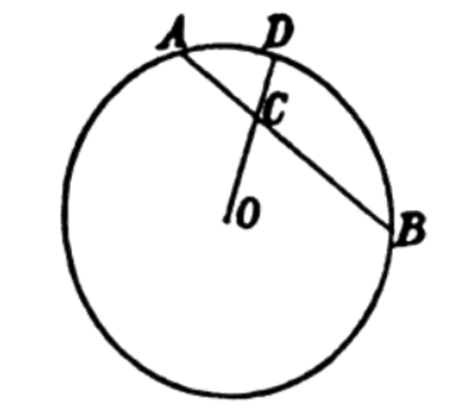

# 2.2.1 色调（Hue）

**色调（Hue）** 也被称为色相，指颜色实际种类。换一种角度来说。色调是对人眼可观察颜色的基础分类。通过色调，结合其他两个颜色的三要素，我们能够准确的描述自然界中能够形成的任意混合色。

**格拉斯曼在混合律** 中，以色轮作为环形颜色索引表，对色轮上颜色进行了基于几何弧度的划分，使颜色的色调能够用其与相对基准色的逆时针夹角表示。色调的作用在于，可以将任意两个环上选定颜色的权重看作物理重量，利用两点连线后线段质量中心与圆环圆心连线的延长线，来推算最终结果。

<figure>
   
   <figcaption>
      
图 2-4 格拉斯曼的混合律颜色推算演示

   </figcaption>
</figure>

图中，O 代表理想白点（White Point），D 代表混合后对应单色；

假设我们以选定颜色与0度的夹角，对应的弧度表示该颜色本身。现有两个颜色，分别为 $$(R_{A},G_{A},B_{A})$$ 和 $$(R_{B},G_{B},B_{B})$$ ，那么取权重 $$(W_{AC},W_{CB})$$ ， $$W = W_{AC} + D_{CB} = 1$$ 。对于 D 点的颜色 $$(R_{D},G_{D},B_{D})$$ 就有：

$$
{\displaystyle 
 \begin{aligned}
   R_{D} = W_{AC} R_{A} + W_{CB} R_{B} \\
   G_{D} = W_{AC} G_{A} + W_{CB} G_{B} \\
   B_{D} = W_{AC} B_{A} + W_{CB} B_{B}
 \end{aligned}
}
$$

混合律是对加法混合论的一次成功拓展，此时已经隐约可以看到最初色度图的理论雏形了。不过这时对颜色的索引还停留在比较初级的阶段。现代学界和工业界已普遍采用 **色度（Chromaticity）**，配合 **颜色空间（Color Space）**，来代替描述颜色种类。色调更多的被用于艺术和设计领域。

另一方面，随着 **现代色彩体系（Modern Color System）** 的在细分领域的逐步分化，部分颜色空间的规格出发点，也对色调（Hue）和饱和度（Saturation）代表的概念本身进行了充分的抽象，形成了诸如 **LAB、LUV 和 颜色三要素（HSL）等经典的色彩空间方案**。为当代计算机工业体系中，艺术设计、数据传输和工程计算方面的贯通，提供了较大的帮助（可参见后文 [2.5 经典色彩空间](Docs_2_5.md) ）。

[ref]: References_2.md