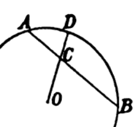

# 2.2.2 饱和度（Saturation）

***饱和度** 是指颜色的浓淡程度。以其对比标准的不同，被区分为 **光学饱和度（Colorfulness）** 和 **感官饱和度（Saturation）** [10]。光学饱和度多用于工程，感官饱和度则多用于艺术设计中。

- **光学饱和度指标** ，被定义为标准白点与实际颜色的强度分量与白点到其纯色分量的长度比；

- **感官饱和度指标** ，被定义为一个区域的颜色与其当前亮度的充盈配比；

从定义的角度来看，显然感官饱和度的主观成分较大。虽然色彩的光学饱和度和感官饱和度在概念上面存在较大差异。但是实际工程实践中，这两个通常被混为一谈（虽然这么做并不严谨）。工程师们经常以光学饱和度（Colorfulness）为主，将两个概念统称为饱和度（Saturation）。因此，我们这里使用的饱和度，即代指光学饱和度（Colorfulness）[\[11\]][ref]。

在描述的格拉斯曼颜色推算过程中，我们提到过。将其单独抽出来看：

<figure>
   
   <figcaption>
      
图 2.2.2-1 格拉斯曼的饱和度定义说明

   </figcaption>
</figure>

其中，D点就是推算颜色 $$(R_{D},G_{D},B_{D})$$ 的最大饱和度，O点则是纯白光 $$O_{pure}$$ 。

OC 代表白色分量强度，记为 $$D_{a}$$ ；

CD 代表纯色分量强度，记为 $$D_{b}$$ ；

则， $$D = D_{a} + D_{b} = 1$$ ，记为总强度。

假设 C点的颜色为 $$(R_{C},G_{C},B_{C})$$，我们就有：

$$
{\displaystyle 
 \begin{aligned}
   R_{C} = D_{a} O_{pure} + D_{b} R_{D} = (1-D_{b}) O_{pure} + D_{b} R_{D} \\
   G_{C} = D_{a} O_{pure} + D_{b} G_{D} = (1-D_{b}) O_{pure} + D_{b} G_{D} \\
   B_{C} = D_{a} O_{pure} + D_{b} B_{D} = (1-D_{b}) O_{pure} + D_{b} B_{D}
 \end{aligned}
}
$$

而 $$D_{b}$$ 就是饱和度 $$S$$ 。整个格拉斯曼颜色混合律就可以用一个公式表示了：

$$
C = (1-S) O_{pure} + S (W_{AC}R_{A}+W_{CB}R_{B}) = O_{pure} + S (W_{AC}R_{A}+W_{CB}R_{B} - O_{pure})
$$

如果记白点 O 为无穷小（0）。那么整个式子就可以简化为：

$$
C =  S (W_{AC}R_{A}+W_{CB}R_{B}) = S \cdot D
$$

在已知白点（White Point）和选定色的情况下。依据格拉斯曼饱和度取值，人们可以计算得期望的渐变色泽，从而快速调色。

同 **色调（Hue）** 一样， **饱和度（Saturation）** 也处于简单系统中，不方便体系下的量化。因此，饱和度的概念在现代学界和工业界中，**同样也普遍被色度（Chromaticity）配合颜色空间（Color Space）代替表示** ，以便于工程量化计算。 **现代色彩体系（Modern Color System）** 中的部分方案，对饱和度概念进行了有效的利用转换（可参见后文 [2.5.7 颜色三要素色彩空间](Docs_2_5_7.md) ）。

[ref]: References_2.md