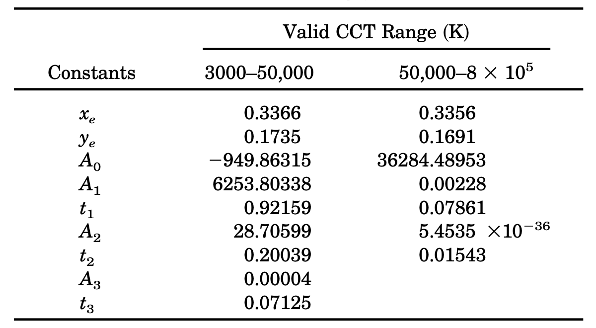

# 2.4.4 色温（Color Temperature）& 相关色温（Correlated Color Temperature）

我们在之前讲述配色函数的理论基础时，已经阐述过色温的概念了。这里做一下回顾。

**色温（Color Temperature）** 是由物体本身的黑体辐射决定的一个物理量，计量单位为 K（开尔文温度）。它被定义为，绝对黑体从绝对零度（－273.15℃）开始加温后所呈现出的颜色。

CIE 于 **1960 UCS 色彩空间** 中引入了色温的表示，并根据工业光源特性引入了 **相关色温（CCT [Correlated Color Temperature]）** 来表示 **一系列物理（辐射度）色温的近似值**。

## **色温与 1960 UCS 快速计算**

记色温 $$T$$ 有对应复合波长 $$\lambda_T$$ ，色温 $$T$$ 在 CIE XYZ 色彩空间上的颜色为 $$C_T(X_T,Y_T,Z_T)$$ ，则根据前文中对于配色函数理论基础的推导，将波长 $$\lambda_T$$ 带入经典三刺激函数，我们有：

$$
{\displaystyle 
 \begin{aligned}
   &C_T = F_{XYZ\ }(\lambda_T) \ , \ \ \ Q = \int _{0}^{\infty }S(\lambda )\,d\lambda  
        \approx {L_v}  \cdot \sum _{360nm} ^{780nm} {\frac {u_{\lambda}}{I_e}}  \lambda 
         = {L_v}  \cdot {u (\lambda_T)} \\
   &X_T =\int _{0}^{\infty }S(\lambda )\,{\overline {x}}(\lambda )\,d\lambda  
        \approx {L_v}  \cdot \sum _{360nm} ^{780nm} ({\frac {u_{\lambda}}{I_e}}  \lambda \cdot {\overline {x}}(\lambda )) \\
   &Y_T =\int _{0}^{\infty }S(\lambda )\,{\overline {y}}(\lambda )\,d\lambda   
        \approx {L_v}  \cdot \sum _{360nm} ^{780nm} ({\frac {u_{\lambda}}{I_e}}  \lambda \cdot {\overline {y}}(\lambda )) \\   
   &Z_T =\int _{0}^{\infty }S(\lambda )\,{\overline {z}}(\lambda )\,d\lambda    
        \approx {L_v}  \cdot \sum _{360nm} ^{780nm} ({\frac {u_{\lambda}}{I_e}}  \lambda \cdot {\overline {z}}(\lambda )) \\
 \end{aligned}
}
$$

上式就是色温 $$T$$ 在 CIE XYZ 上的表达，这样的表示不够简练。

如果能够找到一个由 XYZ 衍生的色彩空间，能够直接由色温 $$T$$ 值本身计算相应的颜色就好了。借用此空间，我们就能够依据该色彩空间与 XYZ 之间的联系，快速转换色温在该色彩空间上的表示到 XYZ 内，从而间接起到在 XYZ 上精简色温计算的目的。

1960年，CIE 采用了来自柯达实验室的 **大卫·麦克亚当（David Lewis MacAdam，1910 - 1998）** 在 **迪恩·布鲁斯特·朱迪（Deane Brewster Judd，1900 - 1972）** 的研究上提出的简化色度、色温与相关色温表示方案，并将方案应用在了 CIE 1931 XYZ 色彩空间上作为对 CIE 1931 XYZ 体系的补充。1960 UCS 对 XYZ 色彩空间的观察角度进行了透视变换，从不同的方向获取了 XYZ 色度平面的投影，以此构建了自身的色度特征。

记 CIE 1960 UCS 中颜色为 $$(U, V, W)$$ ，有：

$$
{\displaystyle 
 \begin{aligned}
   &(X,\ Y,\ Z) = ({\tfrac {3}{2}} U, \ \ \ Y, \ \ \ {\tfrac {3}{2}} U -3V + 2W  ) \\
   &(U, V, W)   = ({\tfrac {2}{3}} X, \ \ \ Y, \ \ \ {\frac {-X +3Y + 2Z}{2}} )
 \end{aligned}
}
$$

取 $$(U, V, W)$$ 对应色度为 $$(u, v)$$ 。存在：

$$
{\displaystyle 
 \begin{aligned}
   &(u, v) = ({\frac  {4x}{12y-2x+3}}, \ {\frac  {6y}{12y-2x+3}}) \\
   &(x, y) = ({\frac  {3u}{2u-8v+4}}\ \ , \ {\frac  {2v}{2u-8v+4}} \ ) 
 \end{aligned}
}
$$

显然，颜色表示在 1960 UCS 和 1931 XYZ 间的坐标转换仅为 **线性变化**，计算非常便捷。

1960 UCS 有什么优势能让 CIE 大动干戈呢？关键在于 UCS 能够以 **切比雪夫近似值** [\[27\]][ref] ，逼近范围在 $$(1000K, \ 15000K)$$ 的色温对应的色度 $$(\bar u(T),\ \bar v(T))$$ 取值，且控制在 $$\left|u-{\bar  {u}}\right|<8\cdot 10^{{-5}}$$ 和 $$\left|v-{\bar  {v}}\right|<9\cdot 10^{{-5}}$$ 的误差范围。如此误差可称得上相当精确了。有：

$$
{\displaystyle 
 \begin{aligned}
   &{\bar {u}}(T)\approx {\frac  {0.860117757+1.54118254\cdot 10^{{-4}}\cdot T+1.28641212\cdot 10^{{-7}}\cdot T^{2}}
                                                 {1+8.42420235\cdot 10^{{-4}}\cdot T+7.08145163\cdot 10^{{-7}}\cdot T^{2}}} \\
   &{\bar {v}}(T)\approx {\frac  {0.317398726+4.22806245\cdot 10^{{-5}}\cdot T+4.20481691\cdot 10^{{-8}}\cdot T^{2}}
                                                 {1-2.89741816\cdot 10^{{-5}}\cdot T+1.61456053\cdot 10^{{-7}}\cdot T^{2}}} 
 \end{aligned}
}
$$

上式也被称为 UCS 色温函数。以色温函数计算色度 $$(u, v)$$ ，再通过固定三刺激值的 $$Y = Y_0$$ 来快速的返向计算色温 $$T$$ 的 $$(X, Y, Z)$$ 表示。有：

$$
{\displaystyle 
 \begin{aligned}
   &(X,\ Y,\ Z) = (Y_0 \cdot {\tfrac {3u}{2v}} , \ \ Y_0, \ \ Y_0 \cdot {\tfrac {-u-10v+4}{2v}}) 
 \end{aligned}
}
$$

基于这一点，到现在为止 1960 UCS 仍然是色温及相关色温的最佳计算工具。 **CIE 利用 UCS 特性，将一系列物理色温的色彩学近似概念引入了 CIE 系统**。

## **普朗克轨迹（Planckian Locus）**

如果取 $$T$$ 范围为 $$(0, \ \infty)$$ 开尔文，那么由 $$T$$ 在指定色彩空间上的所有对应颜色所构成的轨迹曲线，就被称为 **普朗克轨迹（Planckian Locus）**，也被称为 **黑体轨迹（Blackbody Locus）**。换而言之，通过将色温  带入色温函数所求的的色度，都在普朗克轨迹上。所以，我们只需要将选定范围色温带入 UCS 色温函数，就能将普朗克轨迹表示到 UCS 色度图上。

<figure>
   
   <figcaption>
      
图 2.4.4-1 普朗克轨迹在 UCS 色度图上的表示

   </figcaption>
</figure>

把 UCS 色温函数转到 XYZ 的色度表示，就有：

$$
{\displaystyle 
 \begin{aligned}
   &({\bar  {x}}(T), {\bar  {y}}(T)) = ({\frac  {3{\bar  {u}}(T)}{2{\bar  {u}}(T)-8{\bar  {v}}(T)+4}}\ \ ,
                                               \ {\frac  {2{\bar  {v}}(T)}{2{\bar  {u}}(T)-8{\bar  {v}}(T)+4}} \ ) 
 \end{aligned}
}
$$

此表达式，即色温在 **CIE 色度图上的普朗克轨迹函数（Planckian Locus Functions）**，也被称为 **CIE 色温函数**。效果如下：

<figure>
   
   <figcaption>
      
图 2.4.4-2 普朗克轨迹在 CIE 色度图上的表示

   </figcaption>
</figure>

含有普朗克轨迹的 CIE 色度图，让我们能够直观的表现自然辐射源在 CIE 标准下的色彩特点。但是人眼对色温的感受并不会如此精准，很多在感知上近似物理色温的颜色，实际色度却在普朗克轨迹外。

如何在色温基础上引入人眼感受特征呢？相信已经有读者注意到图中，与普朗克轨迹垂直或交叉的直线了。这就是解决人眼感受问题而用到相关色温和等色温线工具。作为 CIE 体系内的标准度量衡工具，相关色温和等色温线必须具有体系内完全可求的特点，即：从指定色度推算相关色温，和从相关色温推算对应色度的能力。

>那么，什么是相关色温？

## **相关色温（CCT）的等色温线（CCT Isotherms）与麦克亚当法**

**相关色温（CCT [Correlated Color Temperature]）** 是指在同等光亮度情况下，于感知上趋同于选定色温的范围内颜色的集合 [\[28\]][ref] [\[29\]][ref]。通常我们会直接以选定的色温参考系的温度，来代替表示相关色温的温度。从主观角度理解，色温与相关色温在颜色上并无差异，或差异无法被明显察觉。

而由选定色温与其相关色温共同构成色彩空间内的连线，就被称为 **等色温线（CCT Isotherms）**，有时也会被简称为 **等温线** [\[29\]][ref]。

相关色温在 CIE 中依赖于等温线表示，而等温线依赖于对普朗克轨迹。CIE 采用麦克亚当建议的测量方式，以两个视觉恰克区分临界点间的跨度为单位麦勒德（ $$mrd$$ [Maillard]），记为 $$mrd$$ 。有麦勒德和色温单位开尔文间换算关系：

 $$
 mrd = {\tfrac {10^6}T_c }
 $$

CIE 以麦勒德为度量，来等分普朗克轨迹。例如，取 $$1 \ mrd = 10^6 K$$ 就指以 $$10^6 K$$ 为分割步长，取 $$500 \ mrd = 2000\ K$$ 就指以 $$2000\ K$$ 为分割步长。具体麦勒德的选取，依赖于实际应用场景下，对相关色温配色精确程度的要求。麦勒德取值越小，精确程度越低；反之，麦勒德取值越大，精确程度越高；即精确度与麦勒德成正比关系。**可知当麦勒德取值趋近于 $$\infty \ mrd$$ 时，整个普朗克轨迹不再分割而是完全连续**。

那么在分割后，CIE 怎么计算 CCT 呢？麦克亚当采用的是垂直取值法，即从当前想要知道相关色温的颜色在 UCS 色度图上表示位置处，向 UCS 色度图中的普朗克曲线做垂线。做得垂线与普朗克轨迹交点处对应的色温，就是当前相关色温对应的物理色温。

记目标相关色温 $$T_{cct}$$ 的色度为 $$(\bar u(T_{cct}),\ \bar v(T_{cct}))$$ ， $$T_{cct}$$ 对应的物理色温 $$T_c$$ 的色度为 $$(\bar u(T_c),\ \bar v(T_c))$$ ，那么在 **麦克亚当法（MacAdam's CCT method）** 之下，我们需要计算：

$$
\vec{cct} \cdot \vec{c}' = vector\  (\bar u(T_{cct}) - \bar u(T_c),\ \bar v(T_{cct} - \bar v(T_c)) \cdot vector\ (\bar u'(T_{cct}) ,\ \bar v'(T_{cct}) = 0
$$

式中 $$\vec{cct}$$ 为从交点指向色温色度的向量， $$\vec{c}'$$ 为普朗克轨迹对应交点色温处的导数（即切线方向），代入色温函数和欲求相关色温色度，所得 $$T_c$$ 即为所求。

## **由色度推算相关色温（CCT）的罗伯逊算法**

使用麦克亚当法计算 CCT 不太好定位交点求值，因此 **艾伦·罗伯逊（Alan R. Robertson）** 在 1968年提出了另一种快速算法：选取两个普朗克轨迹上的色温，以线性插值方法近似计算目标相关色温 [\[30\]][ref]。这一方法也被称为 **罗伯逊相关色温算法（Robertson's CCT method）**。

<figure>
   
   <figcaption>
      
图 2.4.4-3 罗伯逊相关色温算法（Robertson's CCT method）示意图

   </figcaption>
</figure>

如图 2.4.4-3 所示， $$(u_T, v_T)$$ 代表目标相关色温 $$T_c$$ 色度， $$T_i$$ 、 $$T_{i+1}$$ 代表普朗克轨迹上以指定麦勒德分割的量个最近相邻色温， $$d_i$$ 、 $$d_{i+1}$$ 为 $$(u_T, v_T)$$ 与 $$T_i$$ 、 $$T_{i+1}$$ 所在等温线的垂直距离， $$\theta _1$$ 、 $$\theta _2$$ 为延 $$(u_T, v_T)$$ 所做等温线与 $$T_i$$ 、 $$T_{i+1}$$ 所在等温线的交点处夹脚。有罗伯逊相关色温公式就可以如下表示：

$$
\frac{1}T_c=\frac{1}{T_i}+\frac{\theta_1}{\theta_1+\theta_2} \left( \frac{1}{T_{i+1}} - \frac{1}{T_i} \right)
$$

可以等价转换为 $$d_i$$ 、 $$d_{i+1}$$ 表示 $$\theta _1$$ 、 $$\theta _2$$ ，即：

$$
\frac{1}T_c=\frac{1}{T_i}+\frac{d_i}{d_i-d_{i+1}} \left( \frac{1}{T_{i+1}} - \frac{1}{T_i} \right)
$$

而 $$d_i$$ 、 $$d_{i+1}$$ 在分割用麦勒德 $$mrd$$ 固定的情况下，可以表示为：

$$
d_i=\frac{ (v_T-v_i)-mrd \cdot (u_T-u_i) }{\sqrt {1+mrd^2}}
$$

带入上式可知：

$$
T_c = \frac{ (d_i-d_{i+1}) \cdot T_i \cdot T_{i+1}}{d_i \cdot T_i -d_{i+1} \cdot T_{i+1}}
$$

显然 **罗伯逊相关色温算法虽然化解了麦克亚当法的交点坐标问题，但也不够简便**。在不追求过度精度的情况下，是否存在一种足够快捷的算法来达成相关色温的近似取值呢？这便有了 **相关色温的快速逼近法**。

## **由色度推算相关色温（CCT）的麦卡米快速逼近算法**

1992年，**卡尔文·麦卡米（Calvin S. McCamy）** 以选定参照点后使用 **三次厄尔密样条（Cubic Hermite Spline）** 的方法，得到了一组能够在 CIE XYZ 上直接使用的快速逼近公式，进一步简化了相关色温的取值过程 [\[31\]][ref] 。为了纪念麦卡米的贡献，CIE 将此快速算法称为 **麦卡米算法（McCamy's CCT method）**。

由于三次厄尔密样条的准确性依赖于参考点选取的特点。麦卡米优化了 **肯尼斯·凯利（Kenneth L. Kelly）** 的采样实验，取用了 XYZ 色彩空间上，能够使求得逼近函数更贴近于范围内实际值的关键色度 $$(0.3320,\ 0.1858)$$ 作为参考点 [\[32\]][ref] 。他将这个关键参考点称为 **“震中（Epicenter）”**。

如果记震中为 $$(x_e, y_e)$$ 则 $$(x_e = 0.3320,\ y_e = 0.1858) $$ ，记 $$(x, y)$$ 为指定希望求得相关色温 $$T_c$$ 的颜色色度。取 $$n$$ 使得：

$$
{n = \frac {x-x_e}{y-y_e} }
$$

有麦卡米算法公式：

$$
{\displaystyle T_c = McCamy(n) = -449 \cdot n^{3} + 3525 \cdot n^{2}-6823.3 \cdot n + 5520.33}
$$

因为只采用了单点的方式逼近 ，算法在保证  精确度的条件下，仅能用于计算物理色温接近于  间的相关色温。

1999年，**哈维尔·埃尔南德斯·安德烈斯（Javier Hernández-Andrés）** 等人提出的，“在麦卡米算法基础上，采用指数函数的形式以提升公式适用范围” 的改进建议 [\[33\]][ref] 。哈维尔等人在论文中给出了两段测量结果，将估值范围扩展到了 $$[3000 \ K, \ 8 \cdot 10^5\ K]$$ 。其改进的指数估值函数为：

$$
{\displaystyle T_c = A_{0}+A_{1} \cdot e^{\frac{-n}{T_{1}}} + A_{2} \cdot e^{\frac{-n}{T_{2}}} + A_{3} \cdot e^{\frac{-n}{T_{3}}} }
$$

对应生效范围被分为两段，$$n$$ 值计算同麦卡米，其余固定参照点参数取如下值：

<figure>
   
   <figcaption>
      
图 2.4.4-4 改进指数估值法的适用范围<a href="References_3.md">[33]</a>

   </figcaption>
</figure>

**指数改进版虽然提升了估值范围，但同时也提升了算法的复杂度**。大部分工程相关色温都在传统麦卡米算法适用范围内，这使得改进方法有些鸡肋。相较于使用范围广但复杂度高的算法，传统麦卡米算法就能胜任，这也是 CIE 暂时没有采纳此建议的原因。不过，CIE 将其列入为对传统麦卡米更广域范围的补充方法中，以被特殊情况使用。

>在从已知 CIE 色度获取相关色温的手段已经基本够用的情况下，剩下相对急迫的问题，就是找到从已知相关色温反向求其在 CIE 色度的快速算法了。

## **由相关色温（CCT）推算色度的反向逼近算法**

由相关色温反向计算色度的算法，在 2002年和 2006年前并没有太多突破。一方面是因为，如果已知相关色温，那么我们完全可以将其等效为物理色温带入 CIE 色温函数中，直接以求得的物理色温的色度代替；另一方面，也的确没有找到除了直接使用反向求解外的，在满足精度条件的同时还能降低计算复杂度的近似算法来解决这一问题。

2002年，由 **康奉顺（Bongsoon Kang）等人** 利用相关色温等温线的特点，用双步逐级进行的三次厄尔密样条差值法，构建了一组误差可接受的求解方程 [\[34\]][ref] 。此方法在 2006年，经过金敬熙（Kyounghae Kim）等人的进一步测量和推导后，形成了现有的由 $$T_c$$ 求色度 $$(x, y)$$ 的快速近似值算法 [\[34\]][ref]：

$$
{\displaystyle 
 \begin{aligned}
   x &= {
      \begin{cases}
         -0.2661239 \cdot {\frac {10^9}{T_c^3}} -0.2343589 \cdot {\frac {10^6}{T_c^2}} +0.8776956 \cdot {\frac {10^3}T_c} +0.179910
                             \ \ \ &1667{\text{K}}\leq T_c\leq 4000{\text{K}}\\
         -3.0258469 \cdot {\frac {10^9}{T_c^3}} +2.1070379 \cdot {\frac {10^6}{T_c^2}} +0.2226347 \cdot {\frac {10^3}T_c} +0.240390
                             \ \ \ &4000{\text{K}}\leq T_c\leq 25000{\text{K}}
      \end{cases}
   } \\
   y &= {
      \begin{cases}
         -1.1063814 \cdot x^{3} -1.34811020 \cdot x^{2} +2.18555832 \cdot x -0.20219683 \ \ \ &1667{\text{K}}\leq T_c\leq 2222{\text{K}}\\
         -0.9549476 \cdot x^{3} -1.37418593 \cdot x^{2} +2.09137015 \cdot x -0.16748867 \ \ \ &2222{\text{K}}\leq T_c\leq 4000{\text{K}}\\
         +3.0817580 \cdot x^{3} -5.87338670 \cdot x^{2} +3.75112997 \cdot x -0.37001483 \ \ \ &4000{\text{K}}\leq T_c\leq 25000{\text{K}}
      \end{cases}
   } \\
 \end{aligned}
}
$$

但是这一套算法，仍然无法代替非精确场景下，直接通过对应物理色温计算普朗克轨迹上色度的方法实用。因此，CIE 也和麦卡米指数逼近的情况一样，仅是将其列入了相关色温在需求精确值情况下的补充。这里有所了解即可。

>时至今日，此方向也还在等待更 SOTA 的突破

[ref]: References_2.md