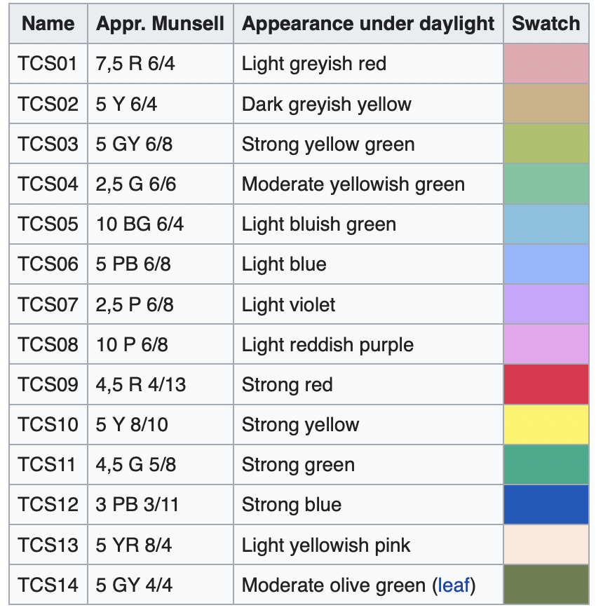

# 2.4.6 显色指数（Color Rendering Index）

**显色指数（CRI [Color Rendering Index]）** 是用来指代设备期望表达颜色与实际展示颜色差异程度的指标，单位为 $$Ra$$ ，取值范围 $$[0 \ Ra, \ 100 \ Ra]$$ 。通俗来讲， $$0 \ Ra$$ 意味着完全偏差，比如黑洞； $$100 \ Ra$$ 则代表着 100% 的颜色还原，比如太阳。

CIE 为了量化显色指数的测量标准，在 1995 年给出了一组被称为 **CIE 基准颜色（CIE SC [CIE 1995 Standard Color]）** 的 **测试用例（TCS [Test Color Samples]）** 如下：

<figure>
   
   <figcaption>
      
图 2.4.6-1 显色指数（CRI）CIE 颜色标准测试用例

   </figcaption>
</figure>

这组测试用例，在随后的大量验证中被发现是 **不太准确的**。

2005 年，专注于日光颜色还原的，现如今已被 **爱丽色（X-Rite）** 收购的 **原科尔莫根（Kollmorgen）子公司格雷塔格（Gretag AG）和麦克白（Macbeth）**，基于自身及爱丽色（X-Rite）生产的分光光度仪和比色计工程报告的统计信息，对比了 CIE 基准颜色标准的弊端 [\[40\]][ref] [\[41\]][ref] ，并推出了一套新的颜色测试标准用例。这套用例就是随后被广泛使用的 **24 色标准色卡（Color Checker）**，也被称为 **麦克白标准色卡（MCC [Macbeth Color Checker]）**。

<figure>
   
   <figcaption>
      
图 2.4.6-2 MCC 2005 标准色卡

   </figcaption>
</figure>

**目前工程上大都采用 MCC 作为设备显色指数的测试标准**。除了标准 24 色外，还有更为丰富的 160 色。颜色的丰富程度有助于提升测量的准确性，因此，在更为严苛标准下得到的显色指数结果，将更具有代表性。

最新一次的基于 CIE XYZ 的校准结果如下，可作为工程参考：

<figure>
   
   <figcaption>
      
图 2.4.6-2 MCC 2005 标准色卡

   </figcaption>
</figure>

那么怎么计算 CRI 呢？最为简单的方法就是计算设备实际显示颜色和目标颜色的色差，并归一化。1964 年，CIE 提出了 **UVW 色彩空间（CIE 1964 U\* V\* W\* Color Space）**，作为对于 **1960 UCS 在归一化能力上的补充**。UVW 通过引入白点，使 UCS 上表示的颜色能够被以相对白点坐标的形式转换到一个等大的数值范围内，从而解决了显色指数的计算问题。此后，CIE 将 UVW 作为 UCS 的 **特定补充方案**，计入到了 XYZ 的体系内并 **沿用至今**。

假设当前我们测得的颜色在 CIE 1960 UCS 中的色度为 $$(u,\ v)$$ ，取白点为 $$(u_0,\ v_0)$$ 。记 CIE 1960 UCS 中颜色为 $$(U, V, W)$$ ，对应 CIE 1964 UVW 中坐标为 $$(U^*, V^*, W^*)$$ ，有：

$$
{\displaystyle 
 \begin{aligned}
   (u, v) &= ({\frac  {4x}{-2x+12y+3}}, \ {\frac  {6y}{-2x+12y+3}}) \\
   (U^*, V^*, W^*) &= (13W^{*} \cdot (u-u_{0}), \ \ \ 13W^{*} \cdot (v-v_{0}), \ \ \ {25Y^{\frac {1}{3}}-17}) 
 \end{aligned}
}
$$

带入 CIE XYZ 色差计算规则，就有色差 $$\Delta C$$ 取欧氏距离：

$$
{\displaystyle 
 \begin{aligned}
   \Delta C = \Delta E(U^*, V^*, W^*)={\sqrt {\left(\Delta U^{*}\right)^{2}+\left(\Delta V^{*}\right)^{2}+\left(\Delta W^{*}\right)^{2}}}
 \end{aligned}
}
$$

基于 CIE 颜色标准规定，我们要求的显色指数为 $$Ra$$ 在 UVW 中有：

$$
{\displaystyle 
 \begin{aligned}
   Ra = 100 - 4.6 \cdot \Delta E_{UVW} = 100 - 4.6 \cdot \Delta C
 \end{aligned}
}
$$

虽然 CIE 对 UVW 的定义是基于 CIE SC，但 MCC 仍然可以使用此快速算法。我们将上述整个计算过程统称为 **CIE 色度自适应转换（CAT [Chromatic Adaptation Transformation]）的 CRI 公式**，简称 **CIE CAT-CRI**。

**到此，色彩的度量的关键指标基本介绍完毕**。不难发现，每一次色彩关键标准的制定都与设备无关色彩空间的迭代密切相关。每一个设备无关色彩空间的设计，都针对性的解决某一种顺承而来的色彩度量问题。可以说，正是这些设备无关色彩空间，共同构成了色彩衡量发展的里程碑。

>现在，我们已经从各个度量指标的演化角度，对概念进行了整理。是时候从发展史出发，来纵观整个过程中这些里程碑式的经典色彩空间了。

[ref]: References_2.md