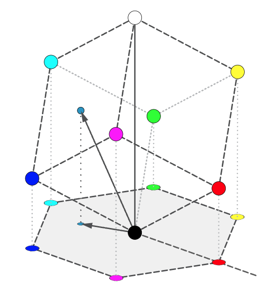
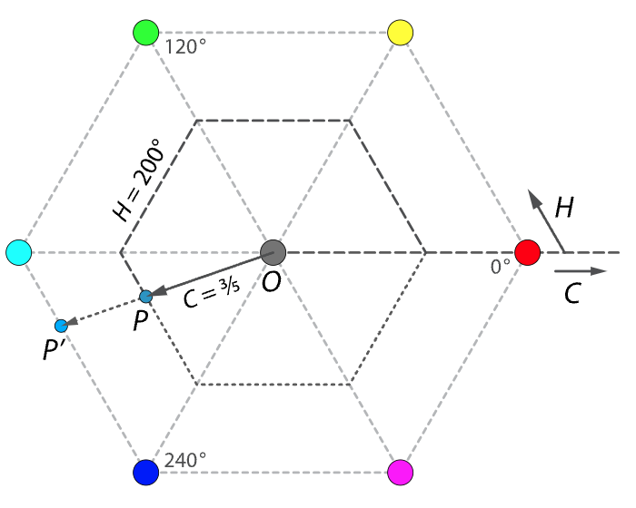
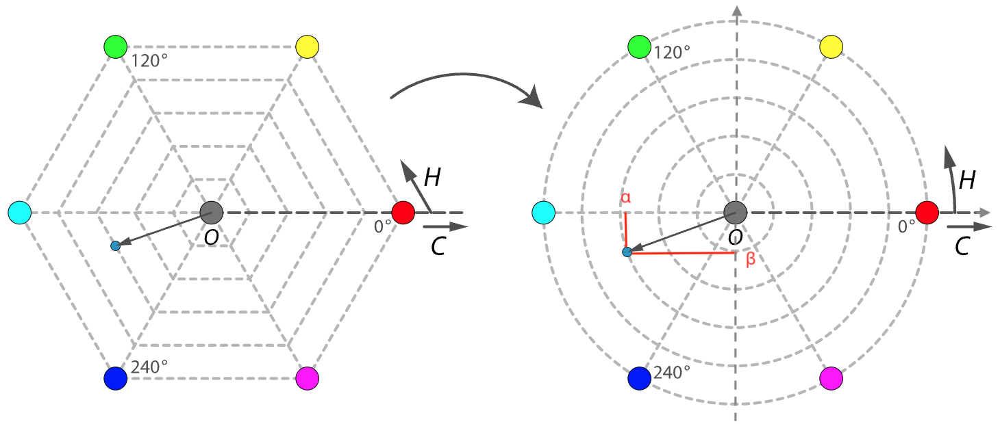
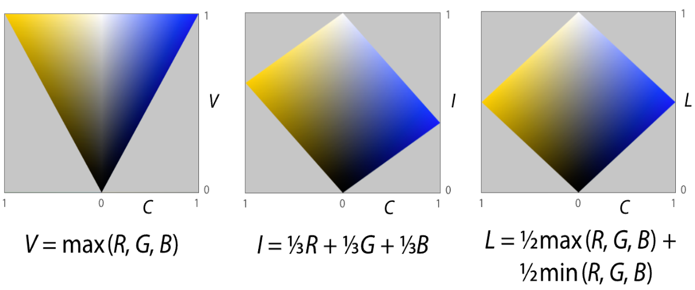
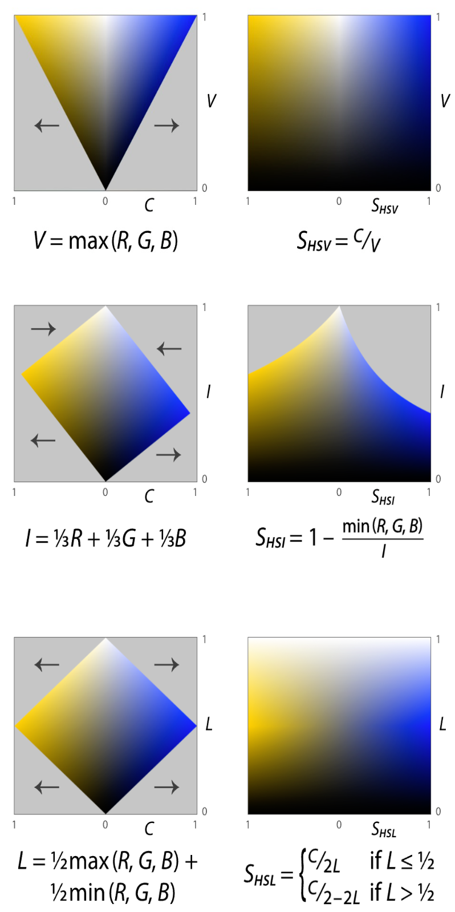

# 2.5.7 颜色三要素色彩空间（HSL [HSV / HSI / HSL（Lightness）]）

**HSL（Hue，Saturation，Luminance） 色彩空间** 又被称为 **颜色三要素色彩空间**，是对 **HSV（Hue，Saturation，Value）色彩空间、 HSI（Hue，Saturation，Intensity）色彩空间、HSL（Hue，Saturation，Lightness）色彩空间的统称**，简称 **三要素色彩空间**。这里的 **V（Value）、I（Intensity）、L（Lightness）其实代指的，基本等同于前文中提及的光亮度（Luminance）的简化概念**。HSI 色彩空间，在设计理念上趋同于 HSV 色彩空间。HSL(Lightness) 在 HSV 、 HSI上进行了改进整合。因此，通常所称的 HSL 色彩空间，即为 HSL（Lightness）色彩空间。

**后文中为了说明，保持 HSL 统一代称，在需要区分说明时，使用 HSV、HSI、HSL（Lightness）独立称谓指定区别。**

1938年，为了解决彩色电视信号的转换和传输问题，一位名叫 **乔治·瓦伦西（Georges Valensi，1889 - 1980）** 的法国电信工程师，提交了以色调与光亮度来进行彩色图片编码传输的解决方案并注册了专利 [\[14\]][ref] [\[15\]][ref] 。方案中首次引入了使用色调和光亮度，来构建色彩空间的概念。瓦伦西在持有专利的有效时间内，经过反复延长申请，使他的专利权从 1939年 一直持续到了 1971年。尴尬的是，彩色电视机在 1946年才被 **约翰·洛吉·贝尔德（J.L.Baird，1888 - 1946）** 发明出来。而彩电和彩色信号，真正得到大规模商业化应用和普及的时间节点，几乎到了20世纪70年代。因此，在美电 1953年出台美国安全彩电标准和 1954年推出 RCA彩色电视机之前，瓦伦西几乎没有靠此专利得到任何收益。

<figure>
   
   <figcaption>
      
图 2-22 乔治·瓦伦西（Georges Valensi）于 1945 年在美专利局注册手稿 <a href="References_3.md">[15]</a>

   </figcaption>
</figure>

1978年，HSV 色彩空间的概念由 **阿尔维·雷·史密斯（A.R Smith，Alvy Ray Smith III，1943 - 今）** 提出。HSV 的目的是为了解决计算机显示对 RGB 的主色还原问题。这要求我们提供一种更直观，并更接近经典理论的，可连续变化且动态可分的色彩模型 [\[16\]][ref] 。

而于1978年同年，在 **乔布洛夫（George H. Joblove）** 和 **格林伯格（Donald Greenberg）** 发表的的论文 **《为计算机图形设计的色彩空间》** 中 [\[17\]][ref]，也通过引入 HSI 色彩空间，来尝试解决这个问题。论文同时还拿 HSI 与 HSV 做了比对。

为什么认为 HSV 和 HSI 是可以约等的？仅仅只是因为两者近乎先后出现于同年？并不是。最关键的判断，还是来自于 HSV 和 HSI 对颜色空间的定义。可以认为 HSV 和 HSI 的差异，是一种观察角度导致的偏差，是同种概念的参考位选取的不同而导致的。这种差异主要体现在光亮度与饱和度在模型中的处理。两者的解决方案，在这两个色彩要素的计算与设定上，各有优劣。HSI 的饱和度选取方式，让模型更接近人眼对颜色的感知，使颜色从 RGB 转换 HSI 更为便捷。但同时也导致还原相对麻烦。HSV 正好相反。那么是否存在一种模型，可以取弊存优呢？

1979年，在 **美国计算机协会（ACM）** 旗下的 **计算机图形图像特别兴趣小组（SIGGRAPH）** 组织的年度会报会议上。 **泰克科技有限公司（Tektronix, Inc. US）** 的工程师们提出了 HSL（Lightness）色彩空间 [\[18\]][ref]，尝试综合 HSV 和 HSI 解决色彩感知还原与颜色空间转换问题。

HSL（Lightness）从数学角度上， **以中值对 HSV 和 HSI 的光亮度概念进行了整合**，使饱和度的表示得到简化，并保留了 HSI 的视觉感官还原特点。这也使 HSL（Lightness）模型，于 1979 年年末的计算机图形标准委员会（Computer Graphics Standards Committee，CGSC）报告上，被选定作为 **三要素色彩空间基础标准** 的原因 [\[19\]][ref] 。

>为了更好的理解这一点，需要分析 HSV、HSI、HSL（Lightness）的异同。

## **相同的色调拓扑计算**

HSV 和 HSI 色彩空间为了计算机色彩还原服务，本身模型基于 RGB 色彩空间的拓扑变化。如果我们将 RGB 色彩空间中的 **白点（White Point）** 和 **黑点（Black Point）** 连线，那么我们就能得到一条由白到灰到黑的渐变对角线，这条线被我们称之为 **灰度线（Grey Line）**。

HSV 和 HSI 以灰度线作为法线，取过黑点的平面为投影平面，将 RGB 色彩空间的单位立方体投影到了此平面上。为了区别于 **标准 CIE 色度平面（CIE Chromaticity Plane）**，这个平面被称为 **HSL 色度平面（HSL Chromaticity Plane）**。

<figure>
   
   <figcaption>
      
图 2-23 RGB 色彩空间投影建立 HSL 色度平面（HSL Chromaticity Plane）示意图

   </figcaption>
</figure>

HSL 色彩空间，以该平面做为 **基准平面**。取从 **青色（Cyan）指向红色（Red）的连线作为基准轴，取红色为 0°，青色为 180°**。

假设 RGB 色彩空间内存在颜色 $$C_{RGB}$$ ，在 HSL 色度平面上的投影为 $${C_{RGB}}^{\prime}$$ 。 $${C_{RGB}}^{\prime}$$ 与黑点连线和基准轴的逆时针夹角，记为 $$H$$ 。为了更好的表示 $$C_{RGB}$$ 与其 HSL 色度平面投影的关系，瓦伦西曾在自己的专利 [\[14\]][ref] [\[15\]][ref] 中将， 与黑点连线的长度称为 **色相（Chrominance）**。在 HSL 中，继承了这一点，记为 $$C$$ 。

<figure>
   
   <figcaption>
      
图 2-24 HSL 色度平面（HSL Chromaticity Plane）示意图

   </figcaption>
</figure>

需要注意的是，引入色相是为了用一个中间变量，把 $${C_{RGB}}^{\prime}$$ 的投影平面特性转化为颜色三要素的物理表述 [\[14\]][ref] [\[18\]][ref] 。**色相本身并不是一个标准概念**，在此处的意义为白点颜色与选定颜色之间的欧式距离，而 **并非指** 色度（Chromaticity）。它是 HSL 引入的对同色调下颜色饱和度的代称，即 **狭义色差（sCA）**。

 

介于此，为了便于说明，我们 **将 HSL 的中间量 $$C$$ 按照更贴近的含义，称为色差**。

而 **实际上 $$H$$ 就是 色调（Hue）**，有 $$H$$ 、 $$C$$ 的关系为：

$$
{\displaystyle 
 \begin{aligned}
   &M=\max(R,G,B) \\
   &C =\text {max} (R,G,B) - \text {min} (R,G,B) \\
   &H = 
     60^ \circ \times {\begin{cases} 
       \mathrm {undefined}       ,& {\text{if }} C=0 \\
       {\frac {G-B} {C}} + 0     ,& {\text{if }} M=R \\
       {\frac {B-R} {C}} + 2     ,& {\text{if }} M=G \\
       {\frac {R-G} {C}} + 4     ,& {\text{if }} M=B
     \end{cases}} 
 \end{aligned}
}
$$

这样的表示方法有些不尽如人意。因为 RGB 色彩空间在 HSL 色度平面的投影，是一个正六边形。导致了 $$H^{\prime}$$ 在转换为角度表示上，存在分段的情况。那么如何使其简化为非条件函数表示呢？HSL 采用了 **对正六边形投影做了二维拓扑变为单位圆**，来处理此问题。

<figure>
   
   <figcaption>
      
图 2-25 HSL 色度平面（HSL Chromaticity Plane）连续性处理拓扑示意图

   </figcaption>
</figure>

取基准轴从黑点指向红色为 X轴正方向，做直角坐标系。

记为 X轴单位长度为 $$\alpha$$ ，Y轴单位长度为 $$\beta$$ ，有：

$$
{\displaystyle 
 \begin{aligned}
   &\alpha =R-G\cdot \cos(60^ \circ)-B\cdot \cos(60^ \circ)={\tfrac {1}{2}}(2R-G-B) \\
   &\beta =G\cdot \sin(60^ \circ)-B\cdot \sin(60^ \circ)={\tfrac {\sqrt {3}}{2}}(G-B) \\
 \end{aligned}
}
$$

那么，中间量 $$C$$ 可以表示为：

$$
{\displaystyle C ={\sqrt {\alpha ^{2}+\beta ^{2}}}}
$$

同时，色调（Hue） $$H$$ 与 $$C$$ 的关系，就可以转化为 $$H$$ 与 $$\alpha$$ 、 $$\beta$$ 的关系了：

$$
{\displaystyle 
 \begin{aligned}
   &H =\text{atan2} (\beta ,\alpha )
 \end{aligned}
}
$$

>这样在描述上，就比较简洁了。便于计算机处理。

## **不同的光亮度与饱和度处理**

计算色调之后，HSV、HSI、HSL（Lightness）在 **光亮度（Luminance）**，和 **饱和度（Saturation）** 的处理上就存在不同了。因为以灰度线为法线的缘故，光亮度较好抽象。**记各模型光亮度（Luminance）表示分别为** $$L_{value} = V$$ 、 $$L_{intensity} = I$$ 、 $$L_{lightness} = L$$ 。

有 $$V$$ 、 $$I$$ 、 $$L$$ 与原 RGB 颜色空间内颜色 $$C_{RGB}$$ 的关系如下：

$$
{\displaystyle 
 \begin{aligned}
   &V = \max(R,G,B) = M \\
   &I \ = \text{avg} (R,G,B)={\tfrac {(R+G+B)}{3}} \\
   &L = \text {mid} (R,G,B)={\tfrac {(\max(R,G,B)+\min(R,G,B))}{2}} 
 \end{aligned}
}
$$

如果我们取色调（Hue） $$H$$ 为 $$50^ \circ$$ （偏黄） & $$230^ \circ$$ （偏蓝）。以色差 $$C$$ 和光亮度构成坐标系，取色差 $$C$$ 为横轴，各模型光亮度参数为纵轴。那么条件下  在 HSV、HSI、HSL（Lightness）的 **色差切面（Chrominance Slice）**，就如下图所示：

<figure>
   
   <figcaption>
      
图 2-26 HSV、HSI、HSL（Lightness）色差切面（Chrominance Slice）示意图

   </figcaption>
</figure>

图中灰色区域为无效值。指定色差 $$C$$ 与光亮度配参构成的切面，需要在坐标范围内避开无效取值。这就意味着 **以色差 $$C$$ 作为关键参数的模型，必须以区域限定的方法处理灰区问题**。而 HSV、HSI、HSL（Lightness）被设计的目的，是为计算机色彩还原服务的。以条件限定的方式来处理，将会为计算机运算带来大量逻辑判断，极大的影响图片处理效率。因此，色差 $$C$$ **并不能** 被直接用作 HSL 的基础参数。这也是为何不以饱和度（Saturation）的称谓，来直接指代色差 $$C$$ 的原因。HSL 中的饱和度概念，与实际颜色三要素的饱和度定义（狭义）存在差异。这里的饱和度，是对实际物理饱和度概念进行衍射拓展后的结果，即**广义饱和度**。

如何减少这些不必要的运算，得到广义饱和度参数呢？直接的做法是对 **色差切面（Chrominance Slice）** 进行 **一定程度的形变**，使得色差切面能够填充整个坐标平面。由于各模型在设定之初，已经通过取用灰度线为投影法线的方式，在几何定义上抽象出纵轴参数 $$V$$ 、 $$I$$ 、 $$L$$ 。参数 $$V$$ 、 $$I$$ 、 $$L$$ **直观体现了颜色三要素的光亮度（Luminance）对物理发光强度的描述**。因此，只需要做水平方向的拉伸（压缩），用拓扑后的横坐标单位，来替换色差  作为模型的饱和度参数即可。记 **各模型饱和度（Saturation）分别为** $$S_{HSV} = S_{V}$$ 、 $$S_{HSI} = S_{I}$$ 、 $$S_{HSL} = S_{L}$$ 。

有 $$S_{V}$$ 、 $$S_{I}$$ 、  $$S_{L}$$ 与 $$C_{RGB}$$ 、色差 $$C$$ 、各自亮度值的关系如下：

$$
{\displaystyle 
 \begin{aligned}
   &S_{V}={
        \begin{cases}
          {0}, &{\text{if }} V = 0 \\
          {\frac {C}{V}}, \ \ &{\text{otherwise}}
        \end{cases}} \\
   &S_{I}={
        \begin{cases}
          {0}, &{\text{if }} I = 0 \\
          {1-{\frac {\min(R,G,B)}{I}}}, \ \ &{\text{if }} {I \neq 0}
        \end{cases}} \\
   &S_{L}={
        \begin{cases} 
          {0}, &{\text{if }} L = 1 {\text{ or }} L = 0 \\
          {\frac {C}{1-|2L-1|}}, \ \ \ \ \ \ &{\text{otherwise}} 
        \end{cases}} 
 \end{aligned}
}
$$

转换后，的 **色差切面（Chrominance Slice）** 就 **比较连续** 了：

<figure>
   
   <figcaption>
      
图 2-27 HSV、HSI、HSL（Lightness）切面拓扑示意图

   </figcaption>
</figure>

很容易看出 HSL（Lightness）在保证自身任意选定色调 $$H$$ 时的色差切面不包含无效区域的同时，还具有 HSI 本身对人眼观察颜色还原的特点。而其计算过程中依赖的条件判断，则可以使用绝对值运算代替。可以说，**HSL（Lightness）结合了 HSV、HSI 的优点，且一定程度上避开了两者的缺陷**。

## **三要素色彩空间的配色函数**

现在，所有要素准备齐全。如果记目标颜色为 $$C_{HSL}$$ ，则 HSL  **配色函数** 如下：

$$
{\displaystyle C_{HSL} = H \cdot Hue + S \cdot Saturation + L \cdot Luminance = Vector[H, S, L]} 
$$

如果记 $$C_{HSL}$$ 在 RGB 色彩空间对应颜色为 $$C_{RGB} = (R, G, B)$$ ，记有 $$C_{RGB} \rightarrow C_{HSL}$$ 的转换函数为 $$F$$ ，则 $$C_{HSL} \rightarrow C_{RGB}$$ 的反向过程就为 $$F^{-1}$$ 。有之前使用的通用中间量：

$$
{\displaystyle 
 \begin{aligned}
   &\quad \quad \quad \quad \quad 
    \alpha = {\tfrac {1}{2}}(2R-G-B) \quad \quad \quad
    \beta = {\tfrac {\sqrt {3}}{2}}(G-B) \ \ \ \ \ \ \\ 
   & C = {\sqrt {\alpha ^{2}+\beta ^{2}}} \approx (\max(R,G,B) - min(R,G,B)) = \text {range} (R,G,B) \\
 \end{aligned}
}
$$

存粹使用 $$\alpha$$ 、 $$\beta$$ 会使计算过于复杂，因此中间量 $$C$$ 在处理时大多数都是用原有定义代替。 $$\alpha$$ 、 $$\beta$$ 仅用于角度计算。从之前讲解可知，这样做并不会导致偏色，而只会影响 HSL 色度平面的几何样式。结合之前的完整推导过程，带入 $$\alpha$$ 、 $$\beta$$ 、 $$C$$ ，能得到从 RGB 到 HSL 的映射 $$F$$ 为：

$$
{\displaystyle 
 \begin{aligned}
   &F_{HSV} ={
    \begin{cases}
      & H = \text {atan2} (\beta ,\alpha ) \\
      & S = \text {range} (R,G,B) \cdot \max(R,G,B)^{-1} \\
      & V = \max(R,G,B) 
    \end{cases}
   } \\

   &F_{HSI} ={
    \begin{cases}
      & H = \text {atan2} (\beta ,\alpha ) \\
      & S = {
          \begin{cases}
            {0}, &{\text{if }} I = 0 \\
            1- {\min(R,G,B)} \cdot {\text {avg} (R,G,B)^{-1}}, \ \ &{\text{if }} {I \neq 0}
          \end{cases}} \\
      & I \ = \text {avg} (R,G,B)={\tfrac {(R+G+B)}{3}} 
    \end{cases}
   } \\

   &F_{HSL} ={
    \begin{cases}
      & H = \text {atan2} (\beta ,\alpha ) \\
      & S = \tfrac {1}{2} \cdot \text {range} (R,G,B) \cdot {\min(L,\ 1 - L)}^{-1} \\
      & L = \text {mid} (R,G,B)={\tfrac {(\max(R,G,B)+\min(R,G,B))}{2}} 
    \end{cases}
   } 
 \end{aligned}
}
$$

而从 HSL 到 RGB ，由于色度被作为了传入参数，在转换为 RGB 时就需要处理扇区划分问题。记 $$\angle_{RG}: H \in [0^{\circ}, 120^{\circ})$$ ， $$\angle_{GB}: H \in [120^{\circ}, 240^{\circ})$$ ， $$\angle_{BR}: H \in [240^{\circ}, 360^{\circ})$$ ，其中 $$H = 0^{\circ}$$ 或 $$H = 360^{\circ}$$ 时，有 $$(R,G,B) = (1,\ 0,\ 0)$$ 。则映射 $$F^{-1}$$ 为：

$$
{\displaystyle 
 \begin{aligned}
    H ,\ {\angle_{const}} &\in [0^ \circ,\ 360^ \circ) \\
   {F_{HSV}}^{-1} &= {
      \begin{cases}
        & k = \{(\tfrac {\angle_{const} + H}{60^ \circ})\ \bmod\ 6\} \\
        & sector = \max(0,\ \min(k,\ 4-k,\ 1)) \\
        & f(H,S,V)_{\angle_{const}} = f_{\angle_{const}} ^{hsv} = V-VS \cdot sector 
      \end{cases}
    } \\
   &\Rightarrow 
      (R,G,B) = {F_{HSV}}^{-1}(H,S,V) = (f_{300^ \circ}^{hsv},\ f_{180^ \circ}^{hsv},\ f_{60^ \circ}^{hsv}) \\
   \\
   {F_{HSI}}^{-1} &= {
      \begin{cases}
        & k = \{(\tfrac {\angle_{const} + H}{60^ \circ})\ \bmod\ 6\} \\
        & sector = \max(0,\ \min(k,\ 4-k,\ 1)) \\
        & f(H,S,I)_{\angle_{const}} = f_{\angle_{const}} ^{hsi} = I-IS \cdot sector  
      \end{cases}
    } \\
    &\Rightarrow 
      (R,G,B) = {F_{HSI}}^{-1}(H,S,I) = (f_{300^ \circ}^{hsi},\ f_{180^ \circ}^{hsi},\ f_{60^ \circ}^{hsi}) \\
   \\
   {F_{HSL}}^{-1} &= {
      \begin{cases}
        & k = \{(\tfrac {\angle_{const} + H}{60^ \circ})\ \bmod\ 6\} \\
        & sector = \max(0,\ \min(k,\ 4-k,\ 1)) \\
        & f(H,S,L)_{\angle_{const}} = f_{\angle_{const}} ^{hsl} = {L - LS \cdot sector} 
      \end{cases}
    } \\
    &\Rightarrow 
      (R,G,B) = {F_{HSL}}^{-1}(H,S,L) = (f_{300^ \circ}^{hsl},\ f_{180^ \circ}^{hsl},\ f_{60^ \circ}^{hsl}) \\
 \end{aligned}
}
$$

即：

$$
(R,G,B) = {F}^{-1}(H,S,L) = (f_{300^ \circ},\ f_{180^ \circ},\ f_{60^ \circ})
$$

可以看出，**排除** $$C_{RGB} \rightarrow C_{HSL}$$ 后 HSL 代表值的不同外， $$F^{-1}$$ **并不存在显著差异**。这正是因为 HSV、HSI、HSL（Lightness）三者的色彩空间设定，在本质上是一样的而产生的结果。 **差异只存在于几何切面的抽象上。** 

显然 HSL 模型直观地体现了颜色三要素的两个重要事实，即： **亮度与图像的色彩信息无关，色彩信息体现自其色调和饱和度**。这使得 HSL 色彩空间更适合在，对需要偏重于颜色三要素基础，进行色彩基础分析和检测的场景。

所以 HSL 的缺陷也很明显。对比 **CIE LAB 和 CIE LUV**，虽然 HSL 具有较好的对色彩生理学感知还原的特点，但 HSL 在 RGB 转换上却没法像 LAB 与 LUV 一样快速。后者在指定白点后，就能一线性关系将色彩转换到 XYZ 色彩空间，而 XYZ 到 RGB 只需要一个固定矩阵即可。这就意味着 **HSL 在 RGB 换算上更为复杂**。

另外，HSL 和 LAB 两者，都没有很好的处理到颜色压缩存储和数据传输方面的设计。除了精准调节和对比场景会使用 HSL 外（这种场景 CIE LAB 也能胜任且更精确），HSL 相较于 CIE LAB 和 CIE LUV 色彩空间（尤其是与 LUV 相比）并没有太大的优势。因此，**各个组织（包括 CIE、ITU等）至今仍在尝试用更为先进的色彩统一化方案解决“均色问题”**。

虽然存在各种弊端，但 HSL 对数据传输的探索和创造性的色彩空间设定，依旧 **为后来 ITU 制定 YUV 色彩格式提供了不少思路上的帮助**。使现代色彩存储体系，在结合 CIE 1976 UCS（即 LAB 与 LUV）的归一化和 HSL 的坐标设定的基础上，得以得到拓展。

[ref]: References_2.md