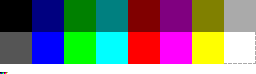
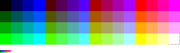
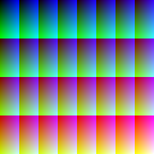
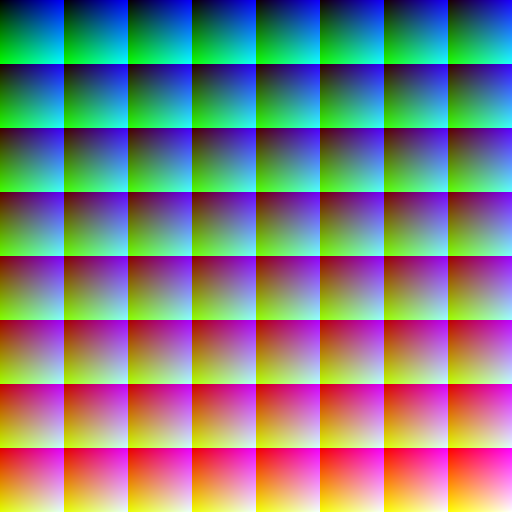

# 2.6.2 RGB 体系色彩格式

**原色格式（Primaries Format）**，或 RGB 体系色彩格式最大的特点就是在于，其对颜色表示的富集程度和存储空间大小密切相关。可以说 **RGB 色彩格式中，每个通道能够占用的存储空间越大，则能够表示的颜色越多**。非常的简单粗暴。统一的，RGB 色彩格式的格式空间，即为 **归一化的 CIE RGB 色彩空间**。

## **3-bit RGB**

**3-bit RGB 色彩格式** 采用了红绿蓝各 1-bit 的存储格式。因此，3-bit RGB 最多只能表示 $$2^3 = 8$$ 种颜色：

<figure>
   
   <figcaption>
      
图 2-29 4-bit RGBI 可表示的所有颜色

   </figcaption>
</figure>

以鹦鹉图为例，在 3-bit RGB 格式下的展示效果如下：

<figure>
   
   <figcaption>
      
图 2-30 3-bit RGB 表示的鹦鹉图

   </figcaption>
</figure>

此格式被广泛运用于 **Oric** 和 **NEC 的 PC-8801 与 PC-9801 机型** 上。

## **4-bit RGBI**

1981年，IBM 在其 CGA 中，以 **4-bit RGBI 格式** 对彩色图片进行了存储。在此格式下，颜色被分为 RGBI 4个通道，每个通道各用 1-bit 表示。因此，RGBI 最多只能表示 $$2^3 \times 2 = 16$$ 种颜色：

<figure>
   
   <figcaption>
      
图 2-31 4-bit RGBI 可表示的所有颜色

   </figcaption>
</figure>

以鹦鹉图为例，在 4-bit RGBI 格式下的展示效果如下：

<figure>
   
   <figcaption>
      
图 2-32 4-bit RGBI 表示的鹦鹉图

   </figcaption>
</figure>

此格式 **只有 IBM 5153 在使用**。

## **6-bit RGB**

**6-bit RGB 色彩格式** 采用了红绿蓝各 2-bit 的存储格式。因此，6-bit RGB 最多只能表示 $$(2^2)^3 = 64$$ 种颜色：

<figure>
   
   <figcaption>
      
图 2-33 6-bit RGB 可表示的所有颜色

   </figcaption>
</figure>

以鹦鹉图为例，在 6-bit RGB 格式下的展示效果如下：

<figure>
   
   <figcaption>
      
图 2-34 6-bit RGB 表示的鹦鹉图

   </figcaption>
</figure>

此格式在 **IBM 的增强图形适配器（EGA [Enhanced Graphics Adapter]）上被首次运用**。并在之后伴随了多个 IBM 主机版本。

## **9-bit RGB**

**9-bit RGB 色彩格式** 采用了红绿蓝各 3-bit 的存储格式。因此，9-bit RGB 最多只能表示 $$(2^3)^3 = 512$$ 种颜色：

<figure>
   
   <figcaption>
      
图 2-35 9-bit RGB 可表示的所有颜色

   </figcaption>
</figure>

以鹦鹉图为例，在 9-bit RGBI 格式下的展示效果如下

<figure>
   
   <figcaption>
      
图 2-36 9-bit RGB 表示的鹦鹉图

   </figcaption>
</figure>

此格式最早在 **1985年 的土星520ST（Atari 520ST）机型** 上被使用。

## **12-bit RGB**

**12-bit RGB 色彩格式** 采用了红绿蓝各 4-bit 的存储格式。因此，12-bit RGB 最多能表示 $$(2^4)^3 = 4096$$ 种颜色：

<figure>
   
   <figcaption>
      
图 2-37 12-bit RGB 可表示的所有颜色

   </figcaption>
</figure>

以鹦鹉图为例，在 12-bit RGBI 格式下的展示效果如下

<figure>
   
   <figcaption>
      
图 2-38 12-bit RGB 表示的鹦鹉图

   </figcaption>
</figure>

此格式被运用在 **Apple IIGS、土星 STE 系列** 和 **世嘉（Sega）Game Gear 游戏机** 上。

## **15-bit RGB**

**15-bit RGB 色彩格式** 采用了红绿蓝各 5-bit 的存储格式。因此，15-bit RGB 最多能表示 $$(2^5)^3 = 32,768$$ 种颜色：

<figure>
   
   <figcaption>
      
图 2-39 15-bit RGB 可表示的所有颜色

   </figcaption>
</figure>

以鹦鹉图为例，在 15-bit RGBI 格式下的展示效果如下

<figure>
   
   <figcaption>
      
图 2-40 15-bit RGB 表示的鹦鹉图

   </figcaption>
</figure>

此格式被运用在 **索尼的 PS1 游戏机** 上。

## **16-bit RGB（RGB565）**

**16-bit RGB 色彩格式** 采用了红蓝各 5-bit ，而绿色 6-bit 的存储格式。因此，16-bit RGB 最多只能表示 $$(2^5)^2 \times (2^6) = 65,536$$ 种颜色：

<figure>
   
   <figcaption>
      
图 2-41 16-bit RGB 可表示的所有颜色

   </figcaption>
</figure>

以鹦鹉图为例，在 16-bit RGBI 格式下的展示效果如下

<figure>
   
   <figcaption>
      
图 2-42 16-bit RGB 表示的鹦鹉图

   </figcaption>
</figure>

此格式被运用在 **携带有扩展图形阵列（XGA [Extended Graphics Array]）的 IBM 机型** 上。

## **18-bit RGB**

**18-bit RGB 色彩格式** 采用了红绿蓝各 6-bit 的存储格式。因此，18-bit RGB 最多能表示 $$(2^6)^3 = 262,144$$ 种颜色：

<figure>
   
   <figcaption>
      
图 2-43 18-bit RGB 可表示的所有颜色

   </figcaption>
</figure>

以鹦鹉图为例，在 18-bit RGBI 格式下的展示效果如下

<figure>
   
   <figcaption>
      
图 2-44 18-bit RGB 表示的鹦鹉图

   </figcaption>
</figure>

此格式被运用在 **IBM 8514**，以及 **IBM 携带视频图像阵列（VGA [Video Graphics Array]）** 或 **多色图像阵列（MCGA [Multi-Color Graphics Array]）显卡** 的设备上。

## **24-bit RGB & 32-bit RGBA8888**

**24-bit RGB 色彩格式** 采用了红绿蓝各 8-bit 的存储格式。因此，24-bit RGB 最多能表示多达 $$(2^8)^3 = 256^3 = 16,777,216$$ 种颜色：

<figure>
   
   <figcaption>
      
图 2-45 24-bit RGB 可表示的所有颜色

   </figcaption>
</figure>

以鹦鹉图为例，在 24-bit RGBI 格式下的展示效果如下

<figure>
   
   <figcaption>
      
图 2-46 24-bit RGB 表示的鹦鹉图

   </figcaption>
</figure>

这一格式最早于 1998年，被应用于 **IBM 携带超级视频图像阵列（SVGA [Super Video Graphics Array]）显卡** 的设备上。由于 24-bit 对应 RGB 三通道各 8-bit 的特性和硬件 RAM 非常契合，使此格式至今仍为最常用的 RGB 色彩格式。**配合额外 Alpha 透明度通道，24-bit RGB 色彩格式可以被扩充为 32-bit RGBA8888 色彩格式，进一步提升颜色精细度。**

显然，**RGB 色彩格式和物理存储空间的扩展紧密相关，其每一次可表示色阶的扩充，都意味着一次存储介质和空间的显著提升**。

**此特点决定了，当市面上绝大多数显卡的存储及处理能力没有发展的情况下，更细腻的 RGB 色彩格式也不太可能得到推广。同理，广泛应用于图像传输的 YUV 色彩格式则是规格驱动，其更多依赖于传输协议的演变和数据带宽的更新迭代。**

[ref]: References_2.md