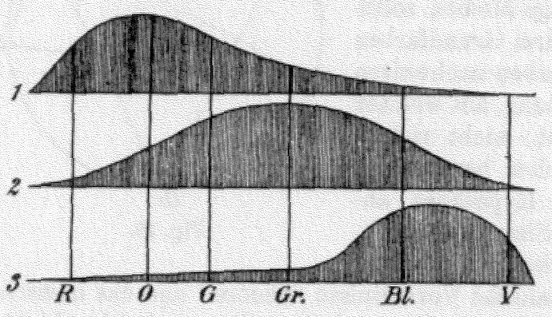

# 3.1 色彩基础

1666年，艾萨克·牛顿（Isaac Newton，1642 - 1726）通过光的色散实验，发现了太阳光可以分解成依次为红、橙、黄、绿、蓝、靛、紫的单色光，并可以由单色光复合而成白光 ，由此提出了牛顿颜色原理（Newton's theory of colour）。并于 1705 年结合他在光学领域的其他发现与猜想，编著为《光学》[\[1\]][ref]。在此之前，亚里士多德提出的白光为一种纯粹光源才是学界共识。色散试验的伟大，在于为人们揭示了人类视觉感知色彩形式的光学物理特性。人们首次接触到了光谱（Spectrum）概念。此后，人们对光谱进行了大量基于颜色观测的研究，并逐步完成了奠基色彩学（Color Science）的理论归纳总结。

人们发现，如果我们将由红到紫的可见光谱（380nm - 780nm）首尾相连，那么就能够得到一个 360 度的连续可分色表。这个表被称之为色轮（Color Wheel）[\[2\]][ref]。色轮中， 0 度表示红色，360 度表示紫色。环的圆心，即正中央则为纯白。

在此基础上，色彩学就颜色的合成，产生了三大理论：加法混合论、减法混合论、中性混合论。从物理意义上讲，加法混合论代表着自然界中自发光物体的光源色彩混合，减法混合论代表着反光物体反射光色彩混合情况，中性混合论依赖人类生理特征进行的色彩还原形式。加法混合论和减法混合论分别在光学领域和艺术领域，得到了广泛的应用。所以，加法混合论所采用的红（Red）、绿（Green）、蓝（Blue）三基色被称为光学三原色（RGB），减法混合论所采用的深红（Cyan）、青（Magenta）、黄（Yellow）三基色被称为颜料三原色（CMY）。

   

  	

   
    
   
   图 3.1-1 色轮（Color Wheel）与颜色（Vienna，1772）[\[2\]][ref]

   

  	

1802年，托马斯·杨（Thomas Young，1773 - 1829）在对可见光谱范围内光线波长测量时，发现人眼对红绿蓝三色光波极为敏感。杨确定了人眼中存在 3 种能够感知不同波长的光感神经纤维，佐证了光学三原色的生理基础，并粗略的测定了人的三色感知范围 [\[3\]][ref]。

1850年，赫尔曼·冯·亥姆霍兹（Hermann von Helmholtz，1821 - 1894）在杨的研究基础上，经实验确定了杨理论（Young's theory）中所提及三色感知的光感神经纤维，就是后续被我们所熟知的视锥细胞（cone cells），并对三类视锥细胞敏感的红、绿、蓝三色所对应光波波长进行了重测定。由此，进一步推动了三色理论（trichromatic theory）雏形的形成 [\[4\]][ref] [\[5\]][ref]。人们为了纪念两位的贡献，也将三色理论称为 杨-亥姆霍兹理论（Young–Helmholtz theory）。

   

  	

   
    

   图 3.1-2 赫尔曼·冯·亥姆霍兹的三色理论，关于视锥细胞感知范围的手稿

   

  	

受限于当时的科研器材水平，亥姆霍兹很遗憾的没有确切的办法，测量到三类视锥细胞可感知的确切波长范围。不过现代医学领域的研究，已相对准确的得到了答案。我们的眼睛基于此三种颜色的波形叠加组合，形成了能够覆盖从紫到红（360nm - 780nm）的 312nm - 1050nm 可观测波长范围 [\[6\]][ref]。

[ref]: References_3.md