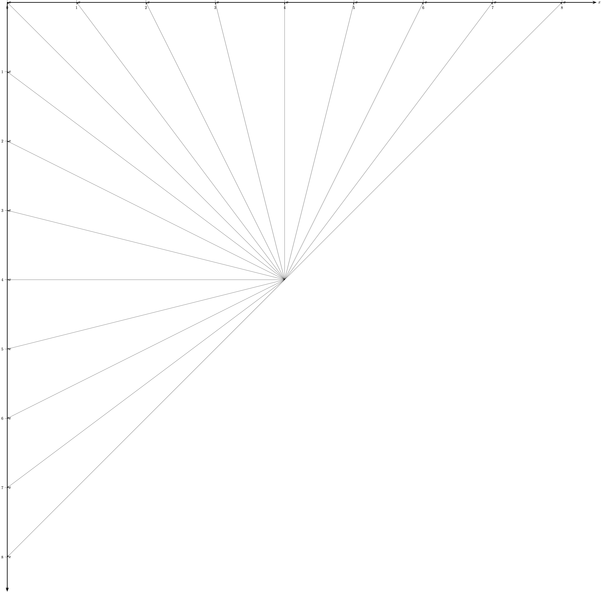
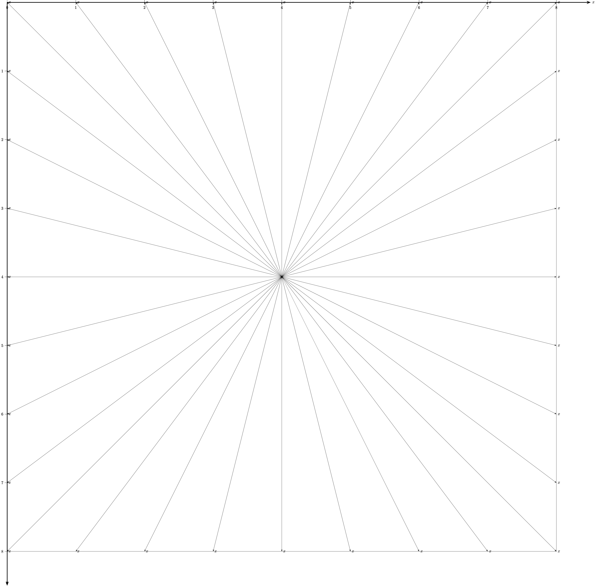
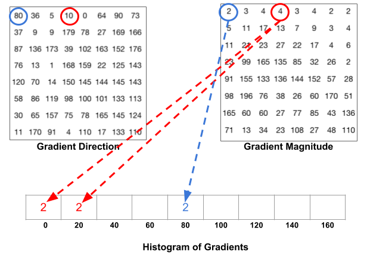
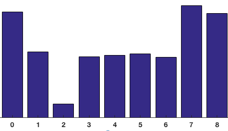
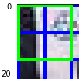

# 3.3.1 方向梯度直方图（HOG [Histogram of Oriented Gradient]）

在前文中，我们提到了索贝尔滤波（Sobel Filter）卷积核对中心点周边方向信息的提炼，可以被用来获取方向梯度直方图的梯度矢量计算中。那么什么是方向梯度直方图呢？

方向梯度直方图最早的 **概念原型（Prototype）** 来自于 **罗伯特·麦康纳尔（Robert K. McConnell）** 在 1986 年申请的有关模式识别专利中，对 **视野（FoV [Field of View]）** 方向性输入产生输出结果差异的判断过程。并于 1994 年 **三菱电子研究实验室（Mitsubishi Electric Research Laboratories）** 在手势识别应用的区域检测过程中，首次总结为当前称谓 [\[16\]][ref]  。**最终经过 2005 年 CVPR 顶会参会论文验证，重新确认了 HOG 在动态检测上的高适配度，才开始被人熟知** [\[17\]][ref] 。

**方向梯度直方图（HOG [Histogram of Oriented Gradient]）** 是对用于提炼并描述区域范围内像素漂移情况方法论的概念抽象。是对过程的抽象，而非对结果的抽象。由于本身最终运算能够表示为处理单元形式，因而属于 **特征描述算子（Feature Descriptor）** 的一种。整体思想则是在单元间隔均匀的卷积核内，使用重叠的局部梯度提炼算法并 **录表统计归一化（Normalization）** ，以取得中心点变化方向矢量。方法常结合 **阈值限定（Thresholding）** 筛选结果，提高运动预测的准确度。

显然，方向梯度直方图并不只适用于索贝尔， **只要能够提供中心点周边梯度变化的大小和方向的算子，都可以被应用于 HOG 的求解中** 。一个方向梯度直方图是否优秀，最大的影响点就在于梯度提炼的是否精准。

## **HOG 的标准处理流**

HOG 有一套相对固定的标准过程的。基本可以按照如下顺序进行：

1. 数据优化，通过滤波算法（如高斯滤波），减少干扰信息并增强灰度（光亮度）对比；
2. 梯度计算，通过梯度滤波器（如索贝尔滤波）提取图像每个像素的梯度矢量；
3. 分组抽象，指定梯度矢量采样卷积核范围，即分组（Cell）
4. 矢量合并，将分组内所有像素的梯度矢量，以方向投票统计合并权重，获取 HOG
5. 块归一化，指定块大小（由分组为单位），整合 HOG 统计结果并归一化快内分组权重

五个步骤，共同构成了方向梯度直方图方法论本身。 **且四五两步概念不同，但密不可分。**

## **数据优化**

数据优化的目的是为了增强光亮度变化差异，并减少干扰噪声，从而更好的保存并放大像素梯度变化情况。我们记原信号为 $$S(x)$$ ，记经过滤波降噪和修饰后的灰度（光亮度）数据为 $$S_g(x)$$ 。从 $$S(x)$$ 到 $$S_g(x)$$ 的处理过程就不再赘述（见滤波，类比处理）。记经过优化函数 $$O_g(x)$$ 处理，以 $$S_g(x)$$ 获取的优化结果为 $$S_o(x)$$ 。那么，相对简单的处理方式，就是直接对 $$S_g(x)$$ 进行 伽马矫正（Gamma Correction）来得到 $$S_o(x)$$ 。取伽马因子为 $$\gamma$$ ，矫正系数（Adjust Factor）为 $$A$$ （一般情况 $$A = 1.0$$ 为常量），有：

$$
{\displaystyle 
 \begin{aligned}
    O_g(x) =& Gamma(S) = A \cdot S(x)^{\gamma} \\
 \end{aligned}
}
$$

**伽马矫正（Gamma Correction）** 本是用于应对，早期 **阴极射线管（CRT [Cathode Ray Tube]）显示器** 的电子偏转特征，引入的采样源数据非线性转换算法。传统的 CRT 显示器在显示时就会完成对偏转数据的自然逆向过程，而在 **液晶显示器（LCD [Liquid Crystal Display]）** 上，则需要 **主动的实现这一反向运算** ，否则会面临数据亮度过爆的问题。

由于采样时采用 $$\gamma < 1$$ 应用于数据修正, 所以 $$\gamma < 1$$ 时的 $$\gamma$$ 值被称为 **编码伽马值（Encoding Gamma）** 。相应的，$$\gamma > 1$$ 时的 $$\gamma$$ 值被称为 **解码伽马值（Decoding Gamma）** 。而采样到还原的过程中，对伽马矫正的不同运用被分别称为 **伽马编码（Gamma Encode）** 和 **伽马解码（Gamma Decode）** 。

<center>
<figure>
   
    <figcaption>
      <p>图 3.3.1-1 原数据经过伽马编解码（伽马矫正）的还原过程示意图</p>
   </figcaption>
</figure>
</center>

	
伽马矫正本身的作用正是针对原图色彩通道数据，进行非线性的映射。衍生为对图片整体光亮度的调节，因此在灰度值上的体现最为明显。我们利用这种特性，来增强图片的对比信息，放大像素梯度变化。

这一步，通常取用 $$\gamma \in [0.45,\ 1.25]$$ 区间内的值，或 $$\gamma = 0.5$$ 的原论文推荐值来进行修正。得到用于后续处理的灰度数据源 $$S_o(x)$$ 。

## **梯度计算**

在经过优化得到高对比度的 **灰度（光亮度）图** 后，就可以利用一些方向梯度卷积核算法，来计算每一个像素点光亮度变换的梯度矢量了。

此时应用边缘检测索贝尔滤波，目的同 HOG 的默认设定中，采用横纵方向均取 **单一中线** 的简化 **普雷维特算子（Prewitt Operator）** ，以求取梯度 **方向（Orientate）** 和 **强度（Magnitude）** 的作用一致。显然，并不只有索贝尔算法或普雷维特算法，适用于方向梯度直方图中梯度矢量的计算。**只要能够提供中心点周边梯度变化的大小和方向的算子，都可以被应用于 HOG 的此步的求解计算中。**

我们记方向为 $$\Theta$$ ，强度为 $$A$$ ，横向 $$x$$ 轴方向的滤波核函数 $$G_x$$ ，纵向 $$y$$ 轴方向的滤波核函数 $$G_y$$ 。强度系数 $$K$$ 为同态值 $$K= K_x = K_y$$$ 。此处不含推导展示结论。

记 **边缘检测普雷维特滤波核函数** 为 $$\mathcal{P}_p(\vec{x_c})$$ ，有：

$$
{\displaystyle 
 \begin{aligned}
    G_x =& K_x \cdot 
    {
      \begin{bmatrix} 
        +1 ,&  \quad 0   ,&  \quad -1
      \end{bmatrix}
    } \ \cdot S_o(\vec{x_c})^{3 \times 1} \\
    G_y =& K_y \cdot 
    {
      \begin{bmatrix} 
        +1 ,&  \quad 0   ,&  \quad -1
      \end{bmatrix} ^{T}
    } \cdot S_o(\vec{x_c})^{1 \times 3} \\
    A =& \vert {\mathcal{P}_p(\vec{x_c})} \vert = K \cdot \sqrt{ {G_x}^{2} + {G_y}^{2} } \\
    \Theta =& \angle \mathcal{P}_p(\vec{x_c})\ = {atan2}(G_y,\ G_x)\\
 \end{aligned}
}
$$

记 **边缘检测索贝尔滤波核函数** 为 $$\mathcal{S}_p(\vec{x_c})$$ ，有：

$$
{\displaystyle 
 \begin{aligned}
    G_x =& K_x \cdot 
    {
      \begin{bmatrix} 
        +1 ,&  \quad \ \ 0   ,&  \quad \ \ -1      \\
        +2 ,&  \quad \ \ 0   ,&  \quad \ \ -2      \\
        +1 ,&  \quad \ \ 0   ,&  \quad \ \ -1
      \end{bmatrix}
    } \cdot S_o(\vec{x_c})^{3 \times 3} \\
    G_y =& K_y \cdot 
    {
      \begin{bmatrix} 
        +1 ,&  \quad \  +2   ,&  \quad \     +1      \\
         0 ,&  \quad \ \ 0   ,&  \quad \quad  0      \\
        -1 ,&  \quad \  -2   ,&  \quad \     -1
      \end{bmatrix}
    } \cdot S_o(\vec{x_c})^{3 \times 3} \\
    A =& \vert {\mathcal{S}_p(\vec{x_c})} \vert = K \cdot \sqrt{ {G_x}^{2} + {G_y}^{2} } \\
    \Theta =& \angle \mathcal{S}_p(\vec{x_c})\ = {atan2}(G_y,\ G_x)\\
 \end{aligned}
}
$$

更明确的，当我们采用不同算法进行梯度计算时，梯度提炼的结果，将会在较大程度上影响最终得到的方向梯度直方图。是需要更准确、更快捷，还是需要高抗性、低波动，应以实际工程角度考量。根据具体需要来采用不同的边缘检测算法。

**而梯度方向和强度的计算则可统一为共识：**

$$
{\displaystyle 
 \begin{aligned}
    A =& K \cdot \sqrt{ {G_x}^{2} + {G_y}^{2} } \\
    \Theta =& \angle \ [{tan^{-1}}(\tfrac{G_y}{G_x})] \\
 \end{aligned}
}
$$

称为 **通用卷积核梯度矢量公式（Formula of Kernel Gradient Vector）** 。

经过此步计算后，灰度数据源 $$S_o(x)$$ 的输入就被转换为原信号为 $$S(x)$$ 的所有像素点，梯度方向数据集 $$\Theta(x)$$ 和 梯度强度数据集 $$A(x)$$ 。不过此时的数据量相对较大，不便于计算处理，还需 **简化信息量** 。

## **分组抽象 & 矢量合并**

**分组抽象的目的是为了提炼每个像素点的数据，汇总分组内逐个像素特征到分组整体的单元特征。** 由于原有梯度方向的平面完整性，以 $$\Theta$$ 范围即便只限定为整数角，也包含 $$[0^{\circ},\ 360^{\circ})$$ 共 $$360$$ 个取值。 **这样造成的数据膨胀，不利于有限算力的处理。** 因此，以尽可能不损失方向包含实际意义为前提， **将角度按照权重分割** 来表示原梯度包含信息，是个不错的办法。

假设我们将 $$[0^{\circ},\ 360^{\circ})$$ 按照 $$\angle \Theta = [\Theta_0\ ,\ ...\ ,\ \Theta_{\theta-1}]$$ 的边界角度，拆分为 $$\theta$$ 个指定方向。记存在像素点 $$\vec{x_c}$$ 的梯度 $$\vec{G}(\vec{x_c}) = (A_c,\ \Theta_c)$$ 的方向落于角度区间 $$[\Theta_a,\ \Theta_b)$$ 内，有：

$$
{\displaystyle 
 \begin{aligned}
    A_c = W_a & \cdot A_a + W_b \cdot A_b \\
    \Theta_c = W_a & \cdot \Theta_a + W_b \cdot \Theta_b \\
    W_a = \frac{\Theta_c - \Theta_a}{\Theta_b - \Theta_a} & \quad \quad W_b = \frac{\Theta_b - \Theta_c}{\Theta_b - \Theta_a} \\
 \end{aligned}
}
$$

其中 $$W_a + W_b = 1$$ ，按照权重 $$W_a$$ 、 $$W_b$$ 即可拆分 $$\vec{G}(\vec{x_c})$$ 数据到 $$\Theta_a$$ 、 $$\Theta_b$$ 角度分量混合表示。记两个角度方向的分量分别为 $$\vec{G_a}$$ 、 $$\vec{G_b}$$ ，则：

$$
{\displaystyle 
 \begin{aligned}
    \vec{G_a} =& (W_a \cdot A_c ,\ W_a \cdot \Theta_c) \\
    \vec{G_b} =& (W_b \cdot A_c ,\ W_a \cdot \Theta_c) \\
    \vec{G}(\vec{x_c}) &= \vec{G_a} + \vec{G_b} \\
 \end{aligned}
}
$$

显然，以 $$\angle \Theta = [\Theta_0\ ,\ ...\ ,\ \Theta_{\theta-1}]$$  **指定方向的矢量合形式表示** ， $$\vec{G}(\vec{x_c})$$ 除了 $$\Theta_a$$  、 $$\Theta_b$$ 角度外，**其余角度分量为 $$0$$ ，** 有：

$$
{\displaystyle 
 \begin{aligned}
    \vec{G}(\vec{x_c}) &= \angle \Theta(0, \ ...\ , W_a, W_b,\ ...\ ,0) \\
 \end{aligned}
}
$$

由于不需要考虑反向的数据还原，核内采样按照 $$\angle \Theta = [\Theta_0\ ,\ ...\ ,\ \Theta_{\theta-1}]$$ 的边界角度的方向矢量合形式求和，即可完成分组内的特征整合。记得到分组的 $$\theta$$ 维特征向量 $$\vec{Cell}$$ ，则：

$$
{\displaystyle 
 \begin{aligned}
    \vec{Cell} &= \sum  \angle \vec{G}(\vec{x_c})  \\
 \end{aligned}
}
$$

**那么现在的问题就是如何分组，或者分为几组了。**

当采样核为 $$n \times n$$ 时，我们取边界整数点出发过核心 $$(\tfrac {1}{2}n,\ \tfrac {1}{2}n)$$ 的连线，加上对角线一起作为分组分割线。 **由任意两条相邻分割线间的夹角，构成以核心为原点的角度分组。** 所以， $$\angle \Theta = [\Theta_0\ ,\ ...\ ,\ \Theta_{\theta-1}]$$ 代表的正是分割线角度。因此，当不区分夹角及其对角方向时，中心角能够分为 $$\theta = n + 1$$ 组，称为 **无符号梯度（Unsigned Gradient）** 分组。当考虑夹角与对角方向互反时，中心角能够分为 $$\theta = 2(n+1)$$ 组，称为 **有符号梯度（Signed Gradient）** 分组。

采样核一般为 $$n \times n = 8 \times 8$$ 大小，此时无符号梯度以方向标记，可分为 $$9$$ 组即:

$$
{\displaystyle 
 \begin{aligned}
    \angle \Theta =& [0^{\circ},\ 20^{\circ},\ 40^{\circ},\ 60^{\circ},\ 80^{\circ},\ 100^{\circ},\ 120^{\circ},\ 140^{\circ},\ 160^{\circ}]  \\
 \end{aligned}
}
$$

<center>
<figure>
   
</figure>
</center>


而有符号梯度则可分为 $$18$$ 组：

$$
{\displaystyle 
 \begin{aligned}
    \angle \Theta = 
    \begin{bmatrix} 
        &\angle \Theta_{lt}  \\
        &\angle \Theta_{rb}
    \end{bmatrix} =
    \begin{bmatrix} 
          0^{\circ},&  20^{\circ},&  40^{\circ},&  60^{\circ},&  80^{\circ},& 100^{\circ},& 120^{\circ},& 140^{\circ},& 160^{\circ}  \\
        180^{\circ},& 200^{\circ},& 220^{\circ},& 240^{\circ},& 260^{\circ},& 280^{\circ},& 300^{\circ},& 320^{\circ},& 340^{\circ}
    \end{bmatrix}
 \end{aligned}
}
$$

<center>
<figure>
   
</figure>
</center>


以无符号梯度的 $$9$$ 组分组为例，统计只需累计入组即可：

<center>
<figure>
   
    <figcaption>
      <p>图 3.3.1-2 核大小  的无符号梯度（Unsigned Gradient）分组示意图</p>
   </figcaption>
</figure>
</center>

**随后依次统计分组的采样核内数据**。上图数据统计结果如下（概略图）：

<center>
<figure>
   
    <figcaption>
      <p>图 3.3.1-3 无符号梯度分组的单组采样核内统计结果示意直方图</p>
   </figcaption>
</figure>
</center>

统计完毕时，特征向量 $$\vec{Cell}$$ 随即生成完毕。我们以 $$W_{\theta}$$ 表示分组的特征向量，在方向 $$\theta$$ 上的强度大小（即此方向矢量的秩），则对于无符号梯度（Unsigned Gradient）分组：

$$
{\displaystyle 
 \begin{aligned}
    \vec{Cell} &= \sum  \angle \vec{G}(\vec{x_c}) = \vec{\Theta}(W_{0^{\circ}}, \ ...\ , W_{160^{\circ}}) \in \mathbb{R}^{9 \times 1} \\
 \end{aligned}
}
$$

同样，对有符号梯度（Signed Gradient）分组：

$$
{\displaystyle 
 \begin{aligned}
    \vec{Cell} &= \sum  \angle \vec{G}(\vec{x_c}) = \vec{\Theta}(W_{0^{\circ}}, \ ...\ , W_{160^{\circ}}, \ ...\ , W_{340^{\circ}}) \in \mathbb{R}^{18 \times 1} \\
 \end{aligned}
}
$$

至此，完成分组提炼。

**这种对数据梯度的蒸馏手段非常重要，因为它不只可以运用于物体识别等情况的中间步骤，也可以被运用于粗糙的运动特征检测。**

而从分组的数据得来的分组特征，还需要归一化才能被有效使用。

## **块归一化**

由于分组内梯度矢量的分解叠加有可能会使某个方向上的梯度强度 **远超其他方向** ，因而造成该方向上的灰度（光亮度）变化会极大的影响结果。 **这样的影响当然是有利的，但无法相对统一的权重，也会给处理带来大量的不确定性。** 如图例：

<center>
<figure>
   
    <figcaption>
      <p>图 3.3.1-4 块归一化说明图例（数据源）</p>
   </figcaption>
</figure>
</center>

**取绿色框中以 $$n \times n = 8 \times 8$$ 采样核，经过前几步以无符号梯度（Unsigned Gradient）方式处理，会得到的四个分组：**

<center>
<figure>
   
    <figcaption>
      <p>图 3.3.1-5 图例（数据源）绿色框中四个分组特征向量直方图表示</p>
   </figcaption>
</figure>
</center>

**如果能够将这种变化趋势原封不动的保存下来，并缩小尺度到统一标准，就可以实现即保证特征不被不必要的削减，也有足够一致的度量衡。** 因此，归一化就是解决办法。

**归一化（Normalization）** 是将目标数据集，按照总体权重等比放缩到指定区间范围的一种数学工具。通常我们选取当前采样分组包含的数据，即为归一化的目标数据集。组与组间独立归一化。但 **块归一化（Block Normalization）** 和一般情况下不完全一样，是以 **块（Block）** 为样本源而非 **组（Cell）** 样本源本身，来进行归一化处理的。

**什么是块（Block）呢？**

**块（Block）是对于由一系列分组（Cell）按照一定规则（例如四叉树、标准单元等）组合构成的分组并集单元的称谓。** 是组的集合。对块的分法有各种形式，但在方向梯度直方图中，使用的是一种直接切入的固定设置。记块大小为 $$N \times N$$ ，块的最小单位为组，则取 $$N \times N = 2 \times 2$$ 的固定大小组采样，构成 HOG 的分块。即图例中的绿色方块：

<center>
<figure>
   
    <figcaption>
      <p>图 3.3.1-6 图例（数据源）块划分单一块示意图</p>
   </figcaption>
</figure>
</center>

同分组一样，分块的目的也是为了更好的将特征数据进行汇总。只不过分块时的基础单元，从分组时的像素梯度矢量，变为了分组特征向量。记分块为 $$Block$$ ，分块特征向量为 $$\vec{Block}$$ 。仍以 $$\vert target \vert_1$$ 表示归一化操作，有：

$$
{\displaystyle 
 \begin{aligned}
    \vec{Block} &= \vert [\vec{Cell}_1,\ \vec{Cell}_2,\ \vec{Cell}_3,\ \vec{Cell}_4] \vert_1  \in \mathbb{R}^{(N \times N) \cdot \theta \times 1}  \\
 \end{aligned}
}
$$

可见，在 $$2 \times 2$$ 大小的固定分块下，分块特征向量  的维度即为分组特征向量方向的 $$4$$ 倍，即 $$(N \times N) \cdot \theta$$ 。如果我们采用 L-2 归一化（即 L2范数）处理，记归一化因子为 $$L_2$$ ，则：

$$
{\displaystyle 
 \begin{aligned}
    L_2 &= \sqrt{|\vec{Cell}_1 |^2+\ |\vec{Cell}_2 |^2+\ |\vec{Cell}_3 |^2+\ |\vec{Cell}_4 |^2}  \\
        &= \sqrt{\sum  (| \angle \vec{G}_1|^2 +\ | \angle \vec{G}_2|^2  +\ | \angle \vec{G}_3|^2  +\ | \angle \vec{G}_4|^2 )} \\
    \vec{Block} 
        &= \frac{1}{L_2}[\vec{Cell}_1,\ \vec{Cell}_2,\ \vec{Cell}_3,\ \vec{Cell}_4] \in \mathbb{R}^{(N \times N) \cdot \theta \times 1}  
 \end{aligned}
}
$$

那么，对图例中的分组进行块归一化到 $$[0,\ 1]$$ 区间，所得如下：

<center>
<figure>
   
    <figcaption>
      <p>图 3.3.1-7 图例（数据源）绿色框对应块的块归一化特征向量结果</p>
   </figcaption>
</figure>
</center>

之后，按照块大小为步长，对全图分块计算即可得到输入图片的方向梯度直方图运算结果。达成对图片整体和分块区域的运动检测目的。

那么，在具体实践中是怎么做的呢？

同前文中对滤波的处理方法类似，**对于此类存在核操作流的方法论，为了充分利用 GPU 并行计算能力，通用思路仍然是抽象为可执行的渲染程序片来交由 GPU 加速。**

## **以索贝尔梯度计算 HOG 的 GLSL 渲染程序片**

现在，我们可以依据理论来做 GPU 的动态管线程序片封装。

首先，我们需要定义 **顶点程序片（Vertex Shader）** 。通过该程序片指定 GPU 的绘制区域，以及纹理与物体的点位映射。由于我们是对整个视窗界面进行处理，所以可以采用对传入的顶点数据进行坐标变换的方式，来求得顶点映射的纹理坐标，减少少量数据通信：

```glsl
attribute vec3 position;

varying vec4 fs_position;
varying vec2 fs_texcoord;

void main()
{
    fs_position = vec4(position.x, position.y, position.z, 1.0);
    fs_texcoord = (position.xy + vec2(1.0, 1.0)) / 2.0;
    gl_Position = fs_position;
}
```


[ref]: References_3.md