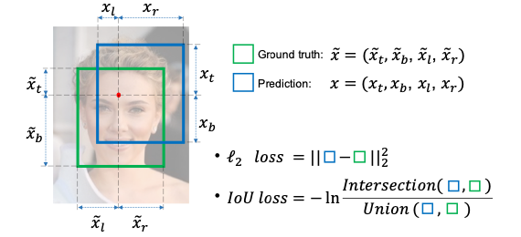
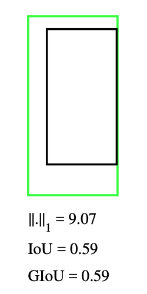
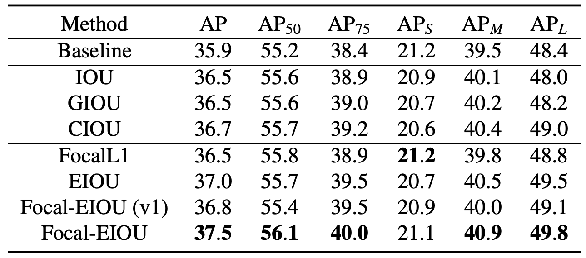

# 3.3.2 朴素目标检测结果度量 - IoU & GIoU

考虑到算法本身需要作为目标检测结果准确性的衡量标准，并用于模型的计算过程。所以不能采用较高复杂程度的算法。而 **交并比（IoU [Intersection over Union]）** 计算作为相对简单的区域检测算法，则是可被采用的不错方案。

**交并比顾名思义，即为交集和并集的比值。** 只不过这里的交集和并集，指的是 **预测结果（Prediction）对应的预测框（Anchor Box）和标注框（Ground Truth）的交集与并集**，记为 $$I = Intersection$$ 和 $$U = Union$$ 。

<center>
<figure>
   
    <figcaption>
      <p>图 3-11 原论文中交并比示意图<a href="References_3.md">[19]</a></p>
   </figcaption>
</figure>
</center>

如图所示，交并比公式非常简洁（注意 **并非 IoU Loss** ），可记为：

$$
{\displaystyle 
 \begin{aligned}
    IoU &= \frac{Intersection(Anchor,\ Truth)}{Union(Anchor,\ Truth)} = \frac{I}{U} \\
 \end{aligned}
}
$$

**而根据交并比设计的损失函数，就是交并比损失函数（IoU Loss）。**

同其他有关深度学习领域，针对损失函数提出的算法理论一致。IoU Loss 在模型中同样存在两项应用，分别为 **前向预测（Forward Prediction）** 和 **反向传播（Backward Propagation）**。 **即标准损失的计算和模型梯度迭代的加速。**

## **交并比损失函数（IoU Loss）**

根据原论文的设计，IoU 前向扩散作用在 ReLU 激活函数层（ReLU Layer）后，以代替传统物体识别模型采用的 $$L_2$$ 损失函数，判断待筛选的预测框是否命中。由于始终有 $$IoU \in [0, \ 1]$$ ，交并比损失函数可被认为是 $$p(IoU = 1) = 1$$ 的 **特殊交叉熵损失函数（cross-entropy Loss）**，有：

$$
{\displaystyle 
 \begin{aligned}
    IoU \ \mathcal{L}oss &= -p \cdot ln(IoU) - (1 - p) \cdot ln(1-IoU) | \quad p(IoU = 1) = 1  \\
        &=  -ln(IoU) \\
 \end{aligned}
}
$$
 
带入交并比实际值，有：

$$
{\displaystyle 
 \begin{aligned}
    IoU \ \mathcal{L}oss &= -ln \frac{Intersection(Anchor,\ Truth)}{Union(Anchor,\ Truth)}  = -ln \frac{I}{U} \\
 \end{aligned}
}
$$

此即为 **交并比损失函数**。由于 $$IoU \in [0, \ 1]$$ 有 $$-ln(IoU) \approx 1-IoU$$ ，考虑到计算便利性，**在条件范围内常用差值代替对数计算**。即：

$$
{\displaystyle 
 \begin{aligned}
    IoU \ \mathcal{L}oss &\approx 1-IoU \quad  IoU \in [0, \ 1] \\
 \end{aligned}
}
$$

相比 $$L_2$$ 损失函数的简单区域差值来衡量命中的方式， IoU 考虑到了 **预测框与标准框的平面空间位置关系**，并通过对位置的衡量 **锁定了两者间的平面位姿独立优化**，因而具有更贴合客观的代表性。且在交叉熵类型损失函数（详见下一章）的特性作用下，**结果落于单位量化的百分比区间**，利于阈值衡量和操作之便。

## **交并比损失函数（IoU Loss）的反向传播（Backward Propagation）**

**反向传播（Backward Propagation）** 简单来说，是通过当前学习到的参数在参数空间内指定方向的运动趋势，来反相强化或衰减该方向上的参数权重，进而达到更快使模型拟合的数学方法论统称。自 **杰弗里·辛顿（Geoffrey Hinton，“深度学习之父”，当代人工智能领域三巨头之一）** 教授提出并汇总这一概念以来，持续的被作为深度学习根基理论之一，应用在各类算法的学习过程中。

如果从物理学角度来看，**把参与训练的相关模型参数的权重向量比作速度**，那么，损失函数的反向传播，就相当于 **速度在各个方向上的某一时刻的加速度**。所以，其影响的是权重在方向上的迭代步长变化，即为优化算法的输出。

交并比损失函数的反向传播，为便于称呼，简称 **反向交并比（Backward IoU/ IoU Back）**。取图 3.3.2-1 说明，记预测框为 $$x = (x_l, x_t, x_r, x_b)$$ 面积为 $$X$$ ，标注框为 $$\tilde{x} = (\tilde{x}_l, \tilde{x}_t, \tilde{x}_r, \tilde{x}_b)$$ 面积为 $$\tilde{X}$$ ，则反向交并比可表示为：

$$
{\displaystyle 
 \begin{aligned}
    IoU\ \mathcal{B}ack &= \frac{\partial \mathcal{L}}{\partial x} = \frac{I \cdot (\nabla_xX - \nabla_xI) - U \cdot \nabla_xI}{U^2 \cdot IoU}  \\
        &= \tfrac{1}{U} \cdot \nabla_xX \ - \ \tfrac{U+I}{UI} \cdot \nabla_xI  \\
 \end{aligned}
}
$$

其中， $$\nabla_xX$$ 是 **预测框面积关于位置的偏导数（Partial Derivative）**， $$\nabla_xI$$ 是 **交集区域面积关于位置的偏导数**，有：

$$
{\displaystyle 
 \begin{aligned}
   I_w &= min(x_l,\ \tilde{x}_l) + min(x_r,\ \tilde{x}_r) \\
   I_h &= min(x_t,\ \tilde{x}_t) + min(x_b,\ \tilde{x}_b) \\
   \nabla_xX &= {
        \begin{cases}
          \frac{\partial X}{\partial x_t( \mathbf{or}\ \partial x_b)} = x_l + x_r \\
          \frac{\partial X}{\partial x_l( \mathbf{or}\ \partial x_r)} = x_t + x_b 
        \end{cases}
   }   \\
   \nabla_xI &= {
        \begin{cases}
          \frac{\partial I}{\partial x_t( \mathbf{or}\ \partial x_b)} = {
            \begin{cases}
              I_w &, \ if ( x_t < \tilde{x}_t\ \mathbf{or}\  x_b < \tilde{x}_b ) \\
              0   &, otherwise 
            \end{cases}
          }  \\
          \frac{\partial I}{\partial x_l( \mathbf{or}\ \partial x_r)} = {
            \begin{cases}
              I_h &, \ if ( x_l < \tilde{x}_l\ \mathbf{or}\  x_r < \tilde{x}_r ) \\
              0   &, otherwise 
            \end{cases}
          }  
        \end{cases}
   }   \\
 \end{aligned}
}
$$

带入求得 $$IoU\ \mathcal{B}ack$$ 值，作用于 **优化算法的梯度变换**，如 **自适应动量算法（Adam）** 等。来发挥相应作用。

## **交并比损失函数（IoU Loss）的简单 C++ 语言实现**

到这里，我们就可以根据基本情况来做一下交并比的代码实现了。由于需要进行一些基本的矩阵运算，我们选择采用引入 **轻量级的 GLM（GL Mathematics）** 开源库，来协助完成基本工作。

我们选择 GLM 库的原因，是因为其可以通过纯粹的包含头文件的方式，简便轻巧的启动包含基本图形矩阵数据结构和方法的完整库功能。在其开源协议保证下，非常适合运用于大部分工程项目。如果需要也可以自己分装部分算法和操作。例如在某些场景下，我们需要计算物体体积方块区域，到视窗平面上的投影位置：

```C++
#include <glm/ext.hpp>

#include "stdio.h"
#include "math.h"

typedef glm::vec2 Vector_2f;
typedef glm::vec3 Vector_3f;
typedef glm::vec4 Vector_4f;
typedef glm::mat2 Matrix_2x2f;
typedef glm::mat3 Matrix_3x3f;
typedef glm::mat4 Matrix_4x4f;

#define XC_PI 3.14159265358979323846
#define XC_RADIAN(d_) (XC_PI * d_ / 180.0f)
#define XC_VECTOR_NORMALIZE(v_) glm::normalize(v_)
#define XC_VECTOR_CROSS(vl_, vr_) glm::cross(vl_, vr_)
#define XC_VECTOR_DOT(vl_, vr_) glm::dot(vl_, vr_)
#define XC_MATRIX_INVERSE(m_) glm::inverse(m_)
#define XC_MATRIX_TRANSPOSE(m_) glm::transpose(m_)
#define XC_MATRIX_DOT(ml_, mr_) dot_m4x4(ml_, mr_)
#define XC_V4_M44_DOT(vl_, mr_) dot_v4_m4x4(vl_, mr_)

Vector_4f
dot_v4_m4x4(Vector_4f v4_, Matrix_4x4f m4x4_) {
    return m4x4_[0] * v4_[0] + m4x4_[1] * v4_[1] + m4x4_[2] * v4_[2] + m4x4_[3] * v4_[3];
}

Matrix_4x4f
dot_m4x4(Matrix_4x4f ml_, Matrix_4x4f mr_) {
    Matrix_4x4f result_;
    result_[0] = mr_[0] * ml_[0][0] + mr_[1] * ml_[0][1] + mr_[2] * ml_[0][2] + mr_[3] * ml_[0][3];
    result_[1] = mr_[0] * ml_[1][0] + mr_[1] * ml_[1][1] + mr_[2] * ml_[1][2] + mr_[3] * ml_[1][3];
    result_[2] = mr_[0] * ml_[2][0] + mr_[1] * ml_[2][1] + mr_[2] * ml_[2][2] + mr_[3] * ml_[2][3];
    result_[3] = mr_[0] * ml_[3][0] + mr_[1] * ml_[3][1] + mr_[2] * ml_[3][2] + mr_[3] * ml_[3][3];
    return result_;
}
```

此处我们简单的实现了两个快速算法，用于协助我们完成目标 $$4 \times 1$$ 向量与 $$4 \times 4$$ 矩阵的点乘，和两个 $$4 \times 4$$ 矩阵的点乘。 **其实类似的快速算法已在库内有封装，此处仅是用于说明 GLM 的一些基本用法。**

不过，**对于交并比的代码工程化来说，并不需要这么复杂：**

```C++
#include <glm/ext.hpp>

#include "stdio.h"
#include "math.h"

typedef glm::vec2 Vector_2f;
typedef glm::vec4 Vector_4f;

bool static IoU_simple(Vector_4f anchor_box_, Vector_4f ground_box_, float threshold_ = 0.8f) {
    float M_area_, T_area_, I_area_, U_area_;
    float IoU_mark_;
    {
        Vector_2f I_lt = {
            MAX(anchor_box_[0], ground_box_[0]),
            MAX(anchor_box_[1], ground_box_[1])
        };
        Vector_2f I_rb = {
            MIN(anchor_box_[2], ground_box_[2]),
            MIN(anchor_box_[3], ground_box_[3])
        };
        if (I_rb.x < I_lt.x || I_rb.y < I_lt.y) {
            return false;
        }
        M_area_ = MAX(ABS(anchor_box_[2] - anchor_box_[0]), 0) *
                  MAX(ABS(anchor_box_[3] - anchor_box_[1]), 0);
        T_area_ = MAX(ABS(ground_box_[2] - ground_box_[0]), 0) *
                  MAX(ABS(ground_box_[3] - ground_box_[1]), 0);
        I_area_ = MAX(ABS(I_lt.x - I_rb.x), 0) * MAX(ABS(I_lt.y - I_rb.y), 0);
        U_area_ = M_area_ + T_area_ - I_area_;
        IoU_mark_ = I_area_ / U_area_;
    }
    return (1 - IoU_mark_ > threshold_);
}
```

**上面的简短过程，就是整个交并比的 C++ 语言封装了。可见易于迁移。**

## **IoU 的缺点与 GIoU 的改进**

交并比损失函数并非是没有缺陷的。 **一个显而易见的问题就是 IoU 无法评估预测框和标注框无交集区域时，预测框的优劣程度（梯度消失）。** 这所造成的直接问题就是，当 **无交集情况出现**，我们将无法只通过 IoU 损失函数，来使预测框快速的向标注框方向运动。从而导致数据浪费并产生不准确的结果，且有可能使模型陷入局部解而导致停滞。

2019 年的 CVPR 上，来自斯坦福大学的研究团队以交并比为基础，提出了 IoU 的改进版 **通用交并比（GIoU [Generalized Intersection over Union]）算法** [\[20\]][ref] 。解决了无交集的判断问题。

GIoU 采用的处理办法为，在原有 IoU 计算的基础上，引入预测框与标注框区域所构成的最小外接矩形，即 **两者的最小外接闭包（smallest enclosing convex）** 参与损失函数计算，来辅助量化两者之间的远近到权重迭代中， 记为 $$C = Convex$$ 。

<center>
<figure>
   
    <figcaption>
      <p>图 3-12 红框即为 IoU 图例中，I 和 U 的最小外接矩形</p>
   </figcaption>
</figure>
</center>

改进后的通用交并比公式 **同样非常简洁** （注意 **并非 GIoU Loss** ），可记为：

$$
{\displaystyle 
 \begin{aligned}
    GIoU &= IoU - \frac{|C - (A \cup B)|}{|C|} = IoU - \frac{|C - U|}{|C|} \\
 \end{aligned}
}
$$

从公式可知，当 **预测框与标注框不存在交集时**， $$U = |A \cup B| = 0 \rightarrow IoU = 0$$ 有：

$$
{\displaystyle 
 \begin{aligned}
    GIoU &= IoU - \frac{C-0}{C} = -1 \\
 \end{aligned}
}
$$

当 **预测框与标注框完全重合时**， $$I = |A \cap B| = |A \cup B| = U \rightarrow IoU = 1$$ 有：

$$
{\displaystyle 
 \begin{aligned}
    GIoU &= IoU - \frac{C-U}{C} = IoU - \frac{0}{C} = 1 \\
 \end{aligned}
}
$$

**基于此，GIoU 的取值范围为 $$GIoU \in [-1, \ +1]$$ 。**

## **通用交并比损失函数（GIoU Loss）**

GIoU 本质是一种对 IoU 算法的 **泛化补充**，所以在损失函数 $$GIoU \ \mathcal{L}oss$$ 的表达上，**直接采用 GIoU 代替 IoU 作为影响因子即可**。有：

$$
{\displaystyle 
 \begin{aligned}
    GIoU \ \mathcal{L}oss & = -ln(GIoU) \approx 1-GIoU \quad  GIoU \in [-1, \ 1] \\
 \end{aligned}
}
$$

同理，记 $$\nabla_xX$$ 是预测框面积关于位置的偏导数（Partial Derivative）， $$\nabla_x\tilde{X}$$ 是标注框面积关于位置的偏导数（Partial Derivative）， $$\nabla_xI$$ 是交集区域面积关于位置的偏导数，有：

$$
{\displaystyle 
 \begin{aligned}
    GIoU\ \mathcal{B}ack &= \frac{\partial \mathcal{L}}{\partial x} =  \frac{\partial \mathcal{L}_{IoU}}{\partial x} + \frac{\partial \mathcal{L}_{UoC}}{\partial x} \\
        &= \frac{I \cdot (\nabla_xX - \nabla_xI) - U \cdot \nabla_xI}{U^2 \cdot IoU} + \frac{U \cdot (\nabla_xX + \nabla_x\tilde{X}) - C \cdot  (\nabla_xX - \nabla_xI)}{C \cdot U} \\
        &= \tfrac{1}{U} \cdot \nabla_xX \ - \ \tfrac{U+I}{UI} \cdot \nabla_xI \ + \ \tfrac{1}{U} \cdot \nabla_xI \ + \tfrac{1}{C} \cdot \nabla_x\tilde{X} \ - \ \tfrac{C-U}{CU} \cdot \nabla_xX   \\
        &= \tfrac{1}{C} \cdot \nabla_xX \ - \ \tfrac{1}{I} \cdot \nabla_xI \ + \ \tfrac{1}{C} \cdot \nabla_x\tilde{X} \\
 \end{aligned}
}
$$

而 **标注框在单次迭代中是常量值**，即 $$\nabla_x\tilde{X} = 0$$ 代入：

$$
{\displaystyle 
 \begin{aligned}
    GIoU\ \mathcal{B}ack &= \tfrac{1}{C} \cdot \nabla_xX \ - \ \tfrac{1}{I} \cdot \nabla_xI
 \end{aligned}
}
$$

显然 **GIoU 的反向传播计算相比 IoU 更为快捷有效**。这也是其 **通用性** 的体现之一。

## **通用交并比损失函数（GIoU Loss）的简单 C++ 语言实现**

万事具备，现在只需要代码实现 GIoU 算法即可，仍然非常便捷。只需在原 IoU 算法上补充改进部分即可：

```C++
#include <glm/ext.hpp>

#include "stdio.h"
#include "math.h"

typedef glm::vec2 Vector_2f;
typedef glm::vec4 Vector_4f;

bool static GIoU_simple(Vector_4f anchor_box_, Vector_4f ground_box_, float threshold_ = 0.8f) {
    float M_area_, T_area_, I_area_, U_area_, C_area_;
    float IoU_mark_, GIoU_mark_;
    {
        Vector_2f I_lt = {
            MAX(anchor_box_[0], ground_box_[0]),
            MAX(anchor_box_[1], ground_box_[1])
        };
        Vector_2f I_rb = {
            MIN(anchor_box_[2], ground_box_[2]),
            MIN(anchor_box_[3], ground_box_[3])
        };
        if (I_rb.x < I_lt.x || I_rb.y < I_lt.y) {
            return false;
        }
        M_area_ = MAX(ABS(anchor_box_[2] - anchor_box_[0]), 0) *
                  MAX(ABS(anchor_box_[3] - anchor_box_[1]), 0);
        T_area_ = MAX(ABS(ground_box_[2] - ground_box_[0]), 0) *
                  MAX(ABS(ground_box_[3] - ground_box_[1]), 0);
        I_area_ = MAX(ABS(I_lt.x - I_rb.x), 0) * MAX(ABS(I_lt.y - I_rb.y), 0);
        U_area_ = M_area_ + T_area_ - I_area_;
        IoU_mark_ = I_area_ / U_area_;
    }
    {
        Vector_2f C_lt = {
            MIN(anchor_box_[0], ground_box_[0]),
            MIN(anchor_box_[1], ground_box_[1])
        };
        Vector_2f C_rb = {
            MAX(anchor_box_[2], ground_box_[2]),
            MAX(anchor_box_[3], ground_box_[3])
        };
        if (C_rb.x < C_lt.x || C_rb.y < C_lt.y) {
            return false;
        }
        C_area_ = MAX(ABS(C_lt.x - C_rb.x), 0) * MAX(ABS(C_lt.y - C_rb.y), 0);
        GIoU_mark_ = IoU_mark_ - (C_area_ - U_area_) / C_area_;
    }
    return ((1.0 - GIoU_mark_) * 0.5f > threshold_);
}
```

完成 GIoU 算法的程序化封装。

## **GIoU 的缺点与 IoU 算法族的发展**

那么，GIoU 算法是否依旧存在缺陷呢？

虽然 GIoU 可以适度的缓解无交集情况的梯度消失问题，但 **并不能加速当预测框完整包含标注框时的梯度迭代**。此时 GIoU 算法，会因为最小外接矩形等同于并集  的缘故，退化为 IoU 算法。从而无法起到有向加速梯度趋向更贴合标注大小的目的。

<center>
<figure>
   
    <figcaption>
      <p>图 3-13 预测框（绿）包含标注框时 GIoU 退化为 IoU 示意图<a href="References_3.md">[20]</a></p>
   </figcaption>
</figure>
</center>

针对这种情形，后续的一些研究试图通过引入 **框中心点（DIoU [Distance-IoU]）** [\[21\]][ref] ，结合 **长宽一致性（CIoU [Complete-IoU]）** [\[21\]][ref] ，并在中心点基础上 **进一步优化损失函数的设计（EIoU [Efficient-IoU]）** [\[22\]][ref] 来解决此问题。虽然取得了不错的效果，但算法复杂度也有较大变化，考虑到实际工程情况取舍可以酌情选用，本书不再展开讲解。

几种算法的对比结果如表 **《当前主流 IoU 算法族基于 COCO val-2017 数据集的对比结果》** 所示 [\[22\]][ref]，仅供参考：

<center>
<figure>
   
</figure>
</center>

进行到这里，在一些耗时训练之后，我们就能够得到一个静态的物体识别算法模型了。 **由于静态模型不需要持续迭代，通过直接取模型参数或者接入其他成型的推理引擎，即可完成对指定关注物体的识别操作。**

需要注意的是，目前训练所得的 **简易模型**，还不能在 **不经过辅助方法** 的情况下，**自主完成锁定需要检测的物体**。模型只能用于判断某一个给定检测范围（检测框）内的数据，是否属于被用于训练录入的标签物体，并给出命中率。 

因此，依旧需要人为提供用于辅助锁定检测目标的方法。 **配合检测所得命中率经过阈值筛选最终结果，得到其所处像素位置。**


[ref]: References_3.md