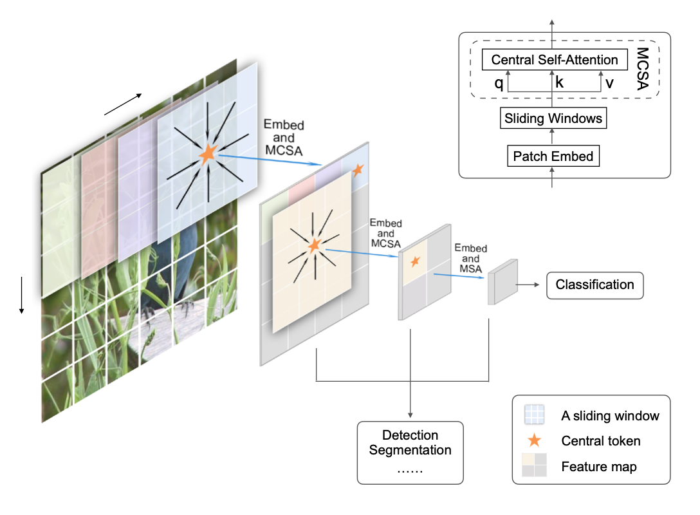

# 3.3.2 朴素目标检测物体锁定 - 分步滑动窗口（Simple Sliding Window）

**分步滑动窗口（Simple Sliding Window）** 是一种常用的辅助锁定检测目标的手段。其优势在于，**简单易行且精度可控** 。

作为一个经典的工具范式，分步滑动窗口被广泛应用于深度学习相关的特征提取、语义分割、物体检测、物体识别等各种场合。前面的章节中使用 HOG 提取特征向量时的卷积核操作，其中卷积核就可以被认为是一个步长等于窗口大小的滑动窗口。本质上，滑动窗口和卷积核只是不同视角下对同种数学工具的不同描述而已。

**滑动窗口** 实则为一个泛化的概念，而称谓上的差异，主要体现在狭义的分步滑动窗口更注重强调概念上的步长选择。例如中科院就从变步长角度出发，提出了一种基于滑动窗口捕获图像信息的分批量化整合空间结构局部相关性的视觉 Transformer 基础模型 SimViT [\[23\]][ref] 。滑动窗口之名，仅用于区分关注点的差异，可见一斑。

<figure>
   
    <figcaption>
      
图 3.3.3-1 滑动窗口在 SimViT 中的运用<a href="References_3.md">[23]</a>

   </figcaption>
</figure>

我们日常工程中，在已经有可以被部署的物体检测模型阶段之后，可用滑动窗口锁定随时间轴变化而发生运动的目标。

方法本身有三个关键概念，分别是：**窗口大小（Window Size）** 、**滑动步长（Sliding Step）** 、**采样层级（Sample Level）** 。

**窗口大小（Window Size）** 即 **滑动窗口的空间属性** ，等价于卷积核大小的意义。在二维情况下通常指由 **宽（Width）和高（Height）组成的矩形所围成的闭包内区域** ，记为 $$Size = (W,H)$$ 。

**滑动步长（Sliding Step）** 即 **滑动窗口的运动属性** ，代表窗口在维度空间内的移动状态。在二维情况下则分为 **横向（Horizontal）** 和 **纵向（Vertical）** 两个方向。一般在大多数工程场景下，都会选择 **速度为常量取值的匀速步长（Uniform Step）** ，且 **优先横向扫描（Transverse Scaning）** ，记为 $$Step = (u,v)$$ 。

**采样层级（Sample Level）** 即 **原数据的缩放（提取）层级** ，如 SimViT 的图例中，就可以被认为在窗口大小恒定情况下，利用 MCSA 注意力激励算法向上采样，构建了双层（2-Level）的变步长滑动窗口单元，记为 $$Level = (l)$$ ，有：

$$
Level = (l) = Subsampling + Upsampling + 1
$$

由于本身是通过设定大小的窗口 **滑动筛选过滤** ，因此窗口的大小是否 **贴合被检测目标的大小** ，会较大程度上影响最终判定结果。但也需要均衡算力消耗。假设当前用于检测的图像大小为 $$(Img\_W,\ Img\_H)$$ ，一套工程上的经验方法计算方式如下：

$$
{\displaystyle 
 \begin{aligned}
 {WParams} =
   {
        \begin{cases}
          Size &= (W,H) = ( \lfloor \tfrac{Img\_W}{2} \rfloor + 1,\ \lfloor \tfrac{Img\_H}{2} \rfloor + 1) \\
          Step &= (u,v) = ( \tfrac{Img\_W}{lv \cdot W},\ \tfrac{Img\_H}{lv \cdot H})     \\
          Level &= (lv) ,\quad  lv  \in [1,\ 3 ] 
        \end{cases}
   }   \\
 \end{aligned}
}
$$

代入图像大小获得配置，来快速获取包含完整被检测物体的闭包，方便模型处理得到目标实际区域，并工程缩减模型的输入。

[ref]: References_3.md