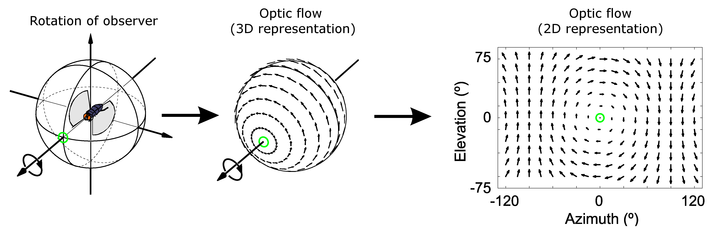
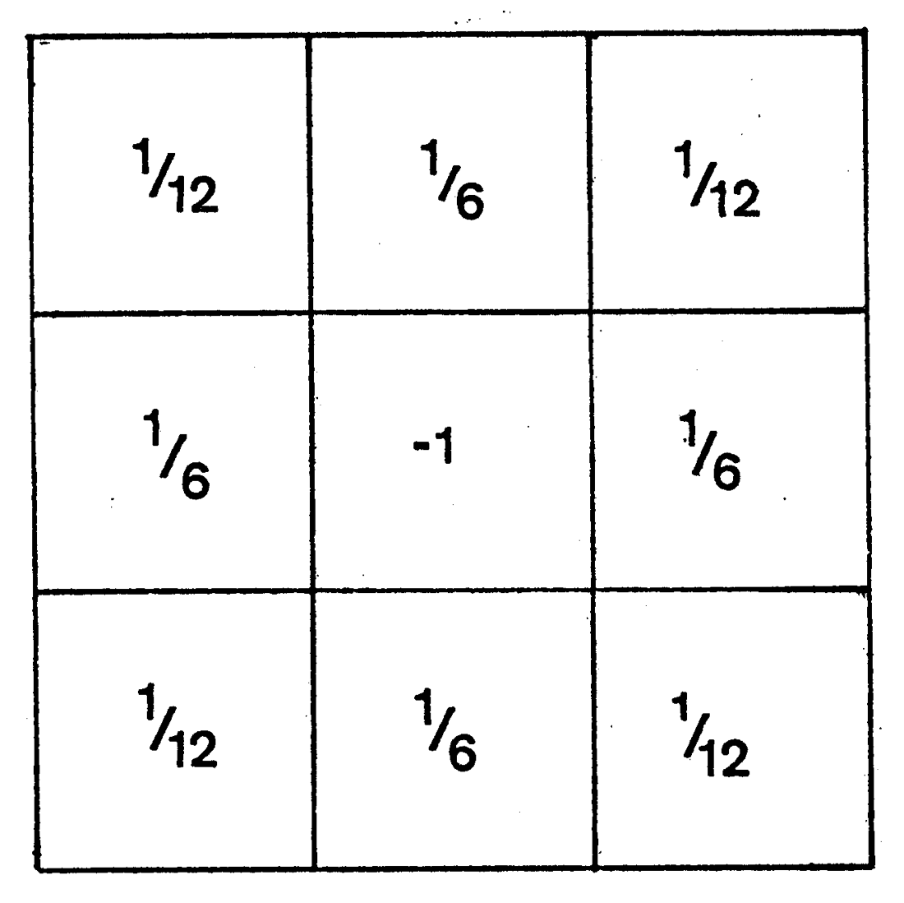

# 3.4.1 传统光流法（Classic Optical Flow Methods）

在 **计算机视觉（Computer Vision）** 体系中，**光流（Optical Flow）** 指的是场景内像素点在观察者所观察场景空间视角下的瞬时相对运动速度。 **光流法（Methods of Optical Flow）** 即是利用场景序列间的像素时域运动与相邻像素相关性变化，构建前后场景间像素对应关系的数学模型，完成像素运动信息推算的方法。

光流是一个基于观察者的相对概念，并不能完全覆盖真实的物体运动情况。在由二维图像按时序组成的视频中，采样自原三维空间的抽象像素，其三维运动矢量会被投影到观察者的视窗平面上，转为运动矢量在视窗平面上的二维投影矢量。因此，为了便于区分，往往将原三维空间三维运动矢量全体组成的矢量空间称为 **三维光流场（3D Optical Flow Field）** ，简称 **光动场（OMF [Optical  Momentum Field]）** 。而把视窗平面全体投影矢量构成的矢量平面称为 **二维光流场（2D Optical Flow Field）** ，简称 **光流场（OFF [Optical Flow Field]）** 。

观察者、光动场、光流场三者的关系如下图所示：

<figure>
   
    <figcaption>
      
图 3.4.1-1 观察者、光动场、光流场投射变化视图<a href="References_3.md">[24]</a>

   </figcaption>
</figure>

在使用光流法前，首先需要量化光流的表达。

工程上通常选用生物光学的 **梯度光流公式族（Gradient-Based Optical Flow Method）** 来作为衡量光流的基本数学描述。因此，梯度光流法也被称为 **基本光流法（Baseline Methods of Optical Flow）** [\[25\]][ref] 。

## **基本光流公式（Basic Gradient-Based Optical Formula）**

**基本光流公式（Basic Gradient-Based Optical Formula）** 也称为 **基本光流约束（Basic Optical Constraint）** ，是所有传统梯度光流法的根基，提供了光流与光流场在时序上的基础关系，并构建了通用的基本假设。分别是：

1. 灰度不变假设，即时域稳定，每一个像素点，灰度值不随时间发生改变；
2. 光流场内可导，即空域稳定，每一个像素与其相邻区域，像素的光流场变化是连续的；

这两个假设决定了在此条件下，**每个光动场内抽象像素和其投影光流场内像素，在光流运动上的时空稳定性** 。

记在 $$t$$ 时刻的某位于 $$p = (x,\ y)$$ 的像素点，存在平面瞬时速度 $$\vec{v} = (u,\ v)$$ 即光流。取 $$I(p,\ t)$$ 代表对应像素点的灰度值，则根据条件，单位时间变化有：

$$
{\displaystyle 
 \begin{aligned}
    I(p,\ t) = I(p + \vec{v},\ t+1) \\
 \end{aligned}
}
$$

当 **不限制时间流向** ，自 $$t$$ 时刻经历 $$\Delta t$$ 到 $$t_1 = t + \Delta t$$ ，存在 $$I(p,\ t) = I(p + \vec{v},\ t + \Delta t) $$ 有：

$$
{\displaystyle 
 \begin{aligned}
   {
        \begin{cases}
          I(x,\ y,\ t) &= I (x + \Delta x,y + \Delta y,t + \Delta t) \\
          \vec{v}(u,\ v) & = (\tfrac{\Delta x}{\Delta t}, \ \tfrac{\Delta y}{\Delta t})
        \end{cases}
   }   \\
 \end{aligned}
}
$$

则根据 **泰勒级数（Taylor series）** 展开，有：

$$
{\displaystyle 
 \begin{aligned}
    I (x + \Delta x,y + \Delta y,t + \Delta t) 
            &= I(x,\ y,\ t) \ +\ 
                       \tfrac{ \partial I}{\partial x} \cdot \Delta x \ +\ 
                       \tfrac{ \partial I}{\partial y} \cdot \Delta y \ +\ 
                       \tfrac{ \partial I}{\partial t} \cdot \Delta t \ +\ \varepsilon \\
            &= I(x,\ y,\ t) \ +\ 
                       \tfrac{ \partial I}{\partial x} \cdot u \cdot \Delta t \ +\ 
                       \tfrac{ \partial I}{\partial y} \cdot v \cdot \Delta t \ +\ 
                       \tfrac{ \partial I}{\partial t} \cdot \Delta t \ +\ \varepsilon \\
 \end{aligned}
}
$$

其中 $$\varepsilon$$ 为泰勒展式的高阶无穷小项，它代表了影响灰度不变假设中灰度值的实际样本噪音和量化引入误差，纳入负号，显然我们期望：

$$
{\displaystyle 
 \begin{aligned}
    \tfrac{ \partial I}{\partial x} \cdot u \cdot \Delta t \ +\ 
   &\tfrac{ \partial I}{\partial y} \cdot v \cdot \Delta t \ +\ 
    \tfrac{ \partial I}{\partial t} \cdot \Delta t \ +\ \varepsilon = 0 \\ 
   &\Rightarrow \\
    \varepsilon =\tfrac{ \partial I}{\partial x} \cdot u \ &+\ 
    \tfrac{ \partial I}{\partial y} \cdot v \ +\ 
    \tfrac{ \partial I}{\partial t}  \rightarrow 0 \\ 
 \end{aligned}
}
$$

上式中 $$\tfrac{ \partial I}{\partial x}$$ 、 $$\tfrac{ \partial I}{\partial y}$$ 、 $$\tfrac{ \partial I}{\partial t}$$ 是 $$I(p,\ t) = I(x,\ y,\ t)$$ 分别在三个参数方向的偏导数，记 $$\nabla_xI = \tfrac{ \partial I}{\partial x}$$ 、 $$\nabla_yI = \tfrac{ \partial I}{\partial y}$$ 、 $$\nabla_t I = \tfrac{ \partial I}{\partial t}$$ 。则原等式就相当于：

$$
{\displaystyle 
 \begin{aligned}
    \varepsilon = I{'}(x,\ y) \cdot \vec{v} \ +\ \nabla_t I = \nabla_p I \cdot \vec{v} \ +\ \nabla_t I \rightarrow 0 \\ 
 \end{aligned}
}
$$
	
这就是 **基本光流公式** 了。

可见当 $$t$$ 确定时，想要求得指定像素点 $$p$$ 的光流 $$\vec{v} = (u,\ v)$$ ，单凭基本约束是不够的。因此，必须通过其他的方式引入新的约束条件来进行光流的求解。最容易联想到的，就是通过已有的空域图像信息来进行限制。由此，根据采用空域信息量的方法，传统梯度光流法被分为了 **稠密光流法（Dense Optical Flow Methods）** 和 **稀疏光流法（Sparse Optical Flow Methods）** 。

**稠密光流法（Dense Optical Flow Methods）** ，即 **全局光流法（Global Optical Flow Methods）** ，指引入的补充约束需要计算场内所有像素点情况。

**稀疏光流法（Sparse Optical Flow Methods）**，指引入的补充约束只需要计算部分像素区域的光流信息，即可达成约束要求的光流法。

经典稠密光流法的代表是 Horn–Schunck 光流算法，经典稀疏光流法的代表是 Lucas-Kanade 光流算法。

## **Horn–Schunck 梯度光流法（Horn–Schunck Method）**

1981 年，麻省理工计算机实验室的 **贝尔特霍尔德·霍恩（Berthold K.P. Horn，1943～Present）** 和 **布莱恩·舒克（Brian G. Schunck）** ，在基本光流约束的前提下，提出了单帧光流场内光流全局光滑变化的假设 [\[26\]][ref] 。

该假设认为，若光流场内 **任意一点的光流** 与 **临近点的光流** 变化都是光滑的，则存在能够 **描述全场能量的单帧光流场能量函数** ，使得该时间段的场内能量变化 **小值稳定** 。即对原光流场内可导假设进行了补充，使其建立了范围覆盖到整个场内像素的宏微观光流变化，与全抽象能量场能量强度间的关系。

这一补充假设也被称为 **光流平滑约束（Optical Flow Smoothness Constraint）** ，或 **Horn–Schunck 约束** 。由于需要对整个场内的所有像素点光流进行计算，从而获取能量函数求最小值，方法被归类为稠密光流法。

数学上可以通过对 $$\vec{v}$$ 求 $$p = (x,\ y)$$ 的二阶偏导数趋向无穷小来逼近无突变情况，构建平滑程度表示，有：

$$
{\displaystyle 
 \begin{aligned}
  &{
        \begin{cases}
          \nabla^2_p u &= \tfrac{ \partial^2 u}{\partial x^2} \ +\  \tfrac{ \partial^2 u}{\partial y^2}  \\
          \nabla^2_p v &= \tfrac{ \partial^2 v}{\partial x^2} \ +\  \tfrac{ \partial^2 v}{\partial y^2}
        \end{cases}
   }   \\
  &\nabla^2_p \vec{v} = \nabla^2_p u \ +\ \nabla^2_p v \rightarrow 0 \\
 \end{aligned}
}
$$

而 $$\nabla^2_p u$$ 、 $$\nabla^2_p v$$ 则可以通过 **拉普拉斯展式** ，利用周边像素点光流求逼近值的方式获取 [\[27\]][ref] 。

<figure>
   
    <figcaption>
      
图 3.4.1-2 Horn–Schunck 法采用的中心光流平滑度逼近卷积核<a href="References_3.md">[27]</a>

   </figcaption>
</figure>

有：

$$
{\displaystyle 
 \begin{aligned}
    \nabla^2_p \vec{v} &= \nabla^2_p u \ +\ \nabla^2_p v \\
    &=  \sum_{xy}\vec{v}_{xy} \cdot 
    {
      \begin{bmatrix} 
        \tfrac{1}{12} ,&  \quad \ \ \tfrac{1}{6}   ,&  \quad \ \ \tfrac{1}{12}      \\
        \tfrac{1}{6} ,&  \quad    -1   ,&  \quad \ \ \tfrac{1}{6}      \\
        \tfrac{1}{12} ,&  \quad \ \ \tfrac{1}{6}   ,&  \quad \ \ \tfrac{1}{12}
      \end{bmatrix}
    } \\
    &= (\bar{u} \ -\ u)^2 \ +\ (\bar{v} \ -\ v)^2
 \end{aligned}
}
$$

那么，指定 $$\varepsilon_c^2$$ 为光流平滑约束的 $$L_2$$ 误差代表值，则：

$$
{\displaystyle 
 \begin{aligned}
  \varepsilon_c^2 = (\bar{u} \ -\ u)^2 \ +\ (\bar{v} \ -\ v)^2 \rightarrow 0 \\
 \end{aligned}
}
$$

结合基本约束条件，针对像素点 $$p$$ 的光流 $$\vec{v} = (u,\ v)$$ 求解，就有两个约束条件了：

$$
{\displaystyle 
 \begin{aligned}
   {
        \begin{cases}
          \varepsilon = \nabla_p I \cdot \vec{v} \ +\ \nabla_t I \rightarrow 0 \\
          \varepsilon_c^2  = (\bar{u} \ -\ u)^2 \ +\ (\bar{v} \ -\ v)^2 \rightarrow 0
        \end{cases}
   }   \\
 \end{aligned}
}
$$

至此，假设当前时间 $$t$$ 有全光流场能量 $$E$$ ，引入光滑因子 $$\alpha$$ 构建能量函数。问题随即转换为，求满足约束的 $$(u,\ v)$$ 值，使得 $$E$$ 最小：

$$
{\displaystyle 
 \begin{aligned}
   E &= \int\int (\varepsilon^2 \ +\ \alpha^2 \varepsilon_c^2) \ dxdy \\
     &= \int\int  [\nabla_p I \cdot \vec{v} \ +\ \nabla_t I \ +\ \alpha^2 \nabla^2_p u \ +\ \alpha^2 \nabla^2_p v] \ dxdy \\
     &\rightarrow min
 \end{aligned}
}
$$

显然，当 $$E$$ 取得最小时：

$$
{\displaystyle 
 \begin{aligned}
  &{
        \begin{cases}
          \tfrac{ \partial E}{\partial u} = 2 \cdot (\nabla_p I \cdot \vec{v} \ +\ \nabla_t I) \cdot \nabla_xI \ -\ 2\alpha^2 (\bar{u} \ -\ u) = 0\\
          \tfrac{ \partial E}{\partial v} = 2 \cdot (\nabla_p I \cdot \vec{v} \ +\ \nabla_t I) \cdot \nabla_yI \ -\ 2\alpha^2 (\bar{v} \ -\ v) = 0
        \end{cases}
   }   \\
 \end{aligned}
}
$$

进一步对两侧同求 $$p$$ 的二阶导可化为：

$$
{\displaystyle 
 \begin{aligned}
  &{
        \begin{cases}
          (\alpha^2 \ +\ \nabla_xI^2 \ +\ \nabla_yI^2) \cdot (\bar{u} \ -\ u) = \nabla_xI \cdot (\nabla_xI \cdot \bar{u} \ +\ \nabla_yI \cdot \bar{v} \ +\ \nabla_t I) \\
          (\alpha^2 \ +\ \nabla_xI^2 \ +\ \nabla_yI^2) \cdot (\bar{v} \ -\ v) = \nabla_xI \cdot (\nabla_xI \cdot \bar{u} \ +\ \nabla_yI \cdot \bar{v} \ +\ \nabla_t I)
        \end{cases}
   }   \\
 \end{aligned}
}
$$

即：

$$
{\displaystyle 
 \begin{aligned}
  &{
        \begin{cases}
          (u \ -\ \bar{u}) = - \frac{\nabla_xI \cdot (\nabla_xI \cdot \bar{u} \ +\ \nabla_yI \cdot \bar{v} \ +\ \nabla_t I)}{\alpha^2 \ +\ \nabla_xI^2 \ +\ \nabla_yI^2} \\
          (v \ -\ \bar{v}) = - \frac{\nabla_xI \cdot (\nabla_xI \cdot \bar{u} \ +\ \nabla_yI \cdot \bar{v} \ +\ \nabla_t I)}{\alpha^2 \ +\ \nabla_xI^2 \ +\ \nabla_yI^2}
        \end{cases}
   }   \\
 \end{aligned}
}
$$

但由于启动时 $$\vec{v}_p = (u,\ v)$$ 实际是未知的，而 $$avg(\vec{v}_p) = (\bar{u},\ \bar{v})$$ 也是未知的。因此，我们需要将计算转换为由前一次结果驱动的向后迭代运算进行。

通过 **克拉默法则（Cramer's Rule）** 可知，位于第 **n+1** 次迭代的像素点 **p = (x,\ y)** 光流 $$\vec{v}_{n+1}$$ 取值，与第 $$n$$ 次迭代时，对应相同像素点 $$p = (x,\ y)$$ 所处卷积核的光流均值 $$avg(\vec{v}_n) = (\bar{u}_n,\ \bar{v}_n)$$ 存在关系：

$$
{\displaystyle 
 \begin{aligned}
  &{
        \begin{cases}
          u_{n+1} = \bar{u}_n - \frac{\nabla_xI \cdot (\nabla_xI \cdot \bar{u}_n \ +\ \nabla_yI \cdot \bar{v}_n \ +\ \nabla_t I)}{\alpha^2 \ +\ \nabla_xI^2 \ +\ \nabla_yI^2} \\
          v_{n+1} = \bar{v}_n - \frac{\nabla_xI \cdot (\nabla_xI \cdot \bar{u}_n \ +\ \nabla_yI \cdot \bar{v}_n \ +\ \nabla_t I)}{\alpha^2 \ +\ \nabla_xI^2 \ +\ \nabla_yI^2} 
        \end{cases}
   }   \\
 \end{aligned}
}
$$

上式即是 **HS 法的核心光流推到公式** 了。

当设置好启动时的 $$avg(\vec{v}_0) = (\bar{u}_0,\ \bar{v}_0)$$ 初始值，就可以迭代获取后续帧内的像素光流场情况了。 **一般取启动帧所有像素点 $$avg(\vec{v}_0) = (0,\ 0)$$ 。**

**可见 Horn–Schunck 算法是需要逐个像素参与核运算，且保存完整前值的历史算法。**

## **Lucas-Kanade 梯度光流法（Lucas-Kanade Method）**

1981 年同年，在 HS 法提出的近乎相同时间，当时还在 **卡内基梅隆大学（Carnegie-Mellon University）** 计算机学院的 **布鲁斯·卢卡斯（Bruce D. Lucas）** 和 **金出武雄（Takeo Kanade，1945～Present）** 教授，共同提出了 Lucas-Kanade 光流法，同样试图借此完成对基础光流约束的补充，使得能够预测光流场情况 [\[26\]][ref] 。

和 HS 法纯粹对空域的关注不同，LK 法细化基础光流约束中的时空稳定条件 [\[28\]][ref] ：

1. 时域上，LK 法提出了 **像素微位移假设** 。假设认为图像像素位置随时间变化是连续的，进而才能够求的像素光流和时间之间的偏导关系；
2. 空域上，LK 法提出了 **空间趋同性假设** 。假设认为场景中相同表面的相邻像素点运动模式是趋同的，且由光动场到光流场投影后，其光流情况也是保持了这一性质。

**这两个补充条件，让 LK 法定义的整个场景时空，任意一点和其相邻空间都是时空连续的。** 这使我们可以将有关全图逐个像素点光流时空关系的推导，通过分割整体图像的像素点集合，转换为不同像素点子集构成的对应分块（卷积核），以核内区域为单元的光流时空关系推导。从点对点，变为了区域对区域。

基于此，在核心位置 $$c = (x,\ y)$$ 和所处时刻 $$t$$ 已知的情况下，核内区域光流场内所有像素的光流可以被认为是一个相同值 $$\vec{v} = (u,\ v)$$ 。且必然有区域内，基础约束条件 $$\varepsilon = \nabla_c I \cdot \vec{v} \ +\ \nabla_t I$$ 的高阶无穷小 $$\varepsilon = 0$$ 成立。

记当前图像大小为 $$W \times H$$ ，有 $$n \times n$$ 大小分块（卷积核），全图光流场面临的计算量会降为对 $$N = W/n \times H/n$$ 个窗口核心光流的推算。记 $$m = n^2$$ ，则存在核内方程组：

$$
{\displaystyle 
 \begin{aligned}
  &{
        \begin{cases}
          \nabla_c I_{11} \cdot \vec{v} \ +\ \nabla_t I_{11} = 0 \\
          \nabla_c I_{12} \cdot \vec{v} \ +\ \nabla_t I_{12} = 0 \\
          \cdots \\
          \nabla_c I_{nn} \cdot \vec{v} \ +\ \nabla_t I_{nn} = 0
        \end{cases}  \quad
        \Rightarrow  \quad
        \begin{cases}
          \nabla_x I_1 \cdot u \ +\ \nabla_y I_1 \cdot v \ =\ -\nabla_t I_1 \\
          \nabla_x I_2 \cdot u \ +\ \nabla_y I_2 \cdot v \ =\ -\nabla_t I_2 \\
          \cdots \\
          \nabla_x I_m \cdot u \ +\ \nabla_y I_m \cdot v \ =\ -\nabla_t I_m
        \end{cases}
   }   \\
 \end{aligned}
}
$$

即：

$$
{\displaystyle 
 \begin{aligned}
  \begin{bmatrix} 
    \sum \nabla_x I_m , \ \sum \nabla_y I_m 
  \end{bmatrix} 
  \begin{bmatrix} 
    u \\
    v 
  \end{bmatrix} = 
  \begin{bmatrix} 
    \sum -\nabla_t I_m
  \end{bmatrix} \\
 \end{aligned}
}
$$

记 $$M_c =\begin{bmatrix} \sum \nabla_x I_m , \ \sum \nabla_y I_m \end{bmatrix}$$ ， $$M_t =\begin{bmatrix} \sum -\nabla_t I_m \end{bmatrix}$$ ，则：

$$
{\displaystyle 
 \begin{aligned}
  \vec{v} &= 
    \begin{bmatrix} 
      u \\
      v 
    \end{bmatrix} = ({M_c}^T \cdot M_c)^{-1} \cdot {M_c}^T \cdot M_t \\
          &= 
  \begin{bmatrix} 
    &\sum (\nabla_x I_m)^2                &, \ \sum \nabla_x I_m \cdot \nabla_y I_m  \\
    &\sum \nabla_x I_m \cdot \nabla_y I_m &, \ \sum (\nabla_y I_m)^2
  \end{bmatrix}^{-1} 
  \begin{bmatrix} 
    \sum \nabla_x I_m \cdot \nabla_t I_m  \\
    \sum \nabla_x I_m \cdot \nabla_t I_m
  \end{bmatrix} 
 \end{aligned}
}
$$

上式即是 **LK 法的核心光流推到公式** 了。

**可见 Lucas-Kanade 算法，属于只需要启动（且不用初始化），就能够在分块（卷积核）内自行完成核心光流保存的自适应循环算法。**

从物理角度理解，式子中的 $$\nabla_x I_m$$ 、 $$\nabla_y I_m$$ 、 $$\nabla_t I_m$$ ，是分块 $$m$$ 内像素 $$p$$ 的灰度值 $$I$$ ，对其所处全图像素位置 $$p = (x,\ y)$$ 和时间参数 $$t$$ 方向的变化趋势，即 **灰度加速度** 。鉴于完备的灰度数据，加速度可以利用动量算法结合牛顿法等方式逼近，快速的从帧变化中取得。那么对光流 $$\vec{v}$$ 的求解就成为了 **简单的数值计算问题** 。

对比 HS 稠密光流和 LK 稀疏光流经典算法，显然 **LK 在工程场景中更具优势**。

同样，以 LK 算法为代表的稀疏光流法，由于其本身占用数据量和算力远远小于稠密光流法的缘故，得到了更为广泛的工程运用。尤其是 LK 算法本身，凭借高可控和简单的特性，被大量使用在如今的编解码器技术上。例如空域冗余压缩所采用的双向光流等算法，就可以被认为是从 LK 算法衍生出的实际运用产物。而稠密光流法，目前还停留在单帧分析等场景，不过考虑到深度学习带来的变革，利用稠密光流的思想来训练光流约束模型，并引入新一代音视频编解码过程，也从另一个角度开始发挥稠密光流法的工程价值。

但不论是哪一种类型的光流法，基于学术需求和面向工程要求的精度还是有极大的差异的。传统音视频工程对于效率要求高，而精度要求相对较低，我们需要 **更快速** 的处理方式。

[ref]: References_3.md