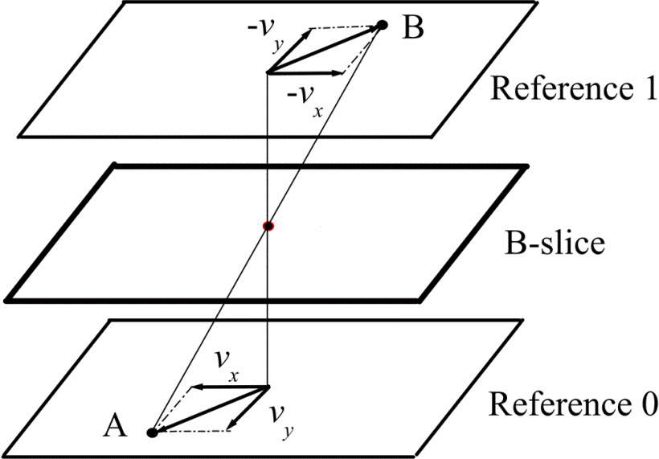

# 3.4.2 双向光流预测（BDOF [Bi-Directional Optical Flow]）

**双向光流预测值修正**，简称 **双向光流预测（BDOF [Bi-Directional Optical Flow]）**，最早在 H.265 的二版规格，由三星工程师以编码压缩补充手段的方式提出 [\[29\]][ref] 。在 VVC 的初版制定过程中，贡献者们通过对算法层面的优化，提升了 BDOF 处理单元的性能。随 VVC 被采纳为 H.266 规格一起，作为标准的一部分被收录其中。

双向光流预测是以 LK 光流法的约束条件为基础，提出的一种亮度值推理算法。方法在编解码过程中以 LK 微位移假设为基，限制所有前后向预测帧（B帧）的选取，必须保持 **当前帧（Current Frame）** 与前后两帧在相同位置处的光流成 **等大反向关系（Reverse Equality）**。

通过这一联系，BDOF 在已知时间流向（即视频向前、向后）时，可以通过前向帧和期望预测方向的下一个关联帧，推导出当前帧的实际光流场变化情况。进而在无保存当前帧数据的前提下，求得当前帧的实际灰度值（亮度参考值）。

对于采用具有线性色彩空间映射关系的规格，依赖线性转换保证了关于灰度的推理，这时  BDOF 也可以适用在各自的原色格式（RGB）的数据通道上。但由于视频传输中，一般不直接采用会造成大量数据浪费的原色格式，所以，BDOF 只被用来对传输格式（YUV）代表亮度值的 Y 通道数据，进行冗余控制。

本质上，**双向光流预测是个类似二次牛顿法的逼近求解过程**。根据镜像的特性，推导可转为线性求中值（对应的交点最小值）。如下图所示：

<figure>
   
    <figcaption>
      
图 3.4.2-1 BDOF 构建参考对称光流示意图<a href="References_3.md">[29]</a>

   </figcaption>
</figure>

假设，当前临近三帧有需要推算分块 $$m$$ 范围内像素点 $$p = (x,\ y)$$ 的灰度。 **按时序方向（视屏正常播放方向，图中由下而上）** 的前向帧（过去帧）为 $$R_0$$ 有块灰度值 $$I_0$$ 集、当前帧为 $$R_c$$ 有块灰度值 $$I_c$$ 集、后向帧（未来帧）为 $$R_1$$ 有块灰度值 $$I_1$$ 集。根据 LK 的局部光流趋同性，分块 $$m$$ 范围内像素点的光流相等，可记 $$R_0$$ 光流 $$\vec{v}_A$$ ， $$R_1$$ 光流 $$\vec{v}_B$$ 。

由于人为的有 $$R_0$$ 、 $$R_1$$ 的光流在 $$R_c$$ 镜像对称，如果记 $$R_0$$ 光流 $$\vec{v}_A =(V_x,\ V_y)$$ ，则 $$R_1$$ 光流 $$\vec{v}_B =(-V_x,\ -V_y)$$ ，即 $$\vec{v}_B = -\vec{v}_A$$ 。

那么，将关系代入 LK 条件下的基础光流公式，存在块间光流满足：

$$
{\displaystyle 
 \begin{aligned}
  &{
        \begin{cases}
          +\nabla_x I_0 \cdot V_x \ +\ \nabla_y I_0 \cdot V_y \ +\ \varepsilon \ =\ -\nabla_t I_0 \\
          -\nabla_x I_1 \cdot V_x \ -\ \nabla_y I_1 \cdot V_y \ +\ \varepsilon \ =\ -\nabla_t I_1
        \end{cases}
   }   \\
 \end{aligned}
}
$$

因为从 $$R_0 \rightarrow R_c \rightarrow R_1$$ 只 **推移单位时间**，所以有关时间单位导数近似：

$$
{\displaystyle 
 \begin{aligned}
  &{
        \begin{cases}
          \nabla_t I_0 \ =\ I_0 \ -\ I_c \\
          \nabla_t I_1 \ =\ I_1 \ -\ I_c
        \end{cases}
   }  \Rightarrow  \nabla_t I_0 - \nabla_t I_1 \ =\ \Delta I \\
 \end{aligned}
}
$$

则三者间的光流关系可化为：

$$
{\displaystyle 
 \begin{aligned}
  &{
        \begin{cases}
          I_0 \ -\ I_c \ +\ \nabla_x I_0 \cdot V_x \ +\ \nabla_y I_0 \cdot V_y\ +\ \varepsilon  \ =\ 0 \\
          I_1 \ -\ I_c \ -\ \nabla_x I_1 \cdot V_x \ -\ \nabla_y I_1 \cdot V_y \ +\ \varepsilon \ =\ 0
        \end{cases}
   }   \\
 \end{aligned}
}
$$

**未知量有 $$I_c$$ 和 $$(V_x,\ V_y)$$ 三个，是无法单独依赖上方的方程组，只通过两个约束获取的。** 不过，块的光流 **仍然** 是满足 LK 约束，而 LK 法提供了对光流相对独立的预估，配合背景有：

$$
{\displaystyle 
 \begin{aligned}
  &{
    \begin{cases}
    \vec{v}_A = 
    \begin{bmatrix} 
      +V_x \\
      +V_y 
    \end{bmatrix} = ({M_{c0}}^T \cdot M_{c0})^{-1} \cdot {M_{c0}}^T \cdot M_{t0} \\
    \vec{v}_B = 
    \begin{bmatrix} 
      -V_x \\
      -V_y 
    \end{bmatrix} = ({M_{c1}}^T \cdot M_{c1})^{-1} \cdot {M_{c1}}^T \cdot M_{t1}
        \end{cases}
   }   \\
 \end{aligned}
}
$$

即：

$$
{\displaystyle 
 \begin{aligned}
    \begin{bmatrix} 
      V_x \\
      V_y 
    \end{bmatrix} &= \tfrac{1}{2}[({M_{c0}}^T \cdot M_{c0})^{-1} \cdot {M_{c0}}^T \cdot M_{t0} + ({M_{c1}}^T \cdot M_{c1})^{-1} \cdot {M_{c1}}^T \cdot M_{t1}] \\
                  &= [\tfrac{({M_{c0}}^T \cdot M_{c0})^{-1} \cdot {M_{c0}}^T}{2} \cdot M_{t0} + \tfrac{({M_{c1}}^T \cdot M_{c1})^{-1} \cdot {M_{c1}}^T}{2} \cdot M_{t1}] \\
 \end{aligned}
}
$$

而同理于时域梯度的差值近似。对于分块 $$m$$ 范围内像素点 $$p = (x,\ y)$$ 的空域灰度梯度，也可近似换算为：

$$
{\displaystyle 
 \begin{aligned}
  &{
        \begin{cases}
          \nabla_x I_0 \ =\ \frac{I_0(x+1) \ -\ I_0(x-1)}{2} \\
          \nabla_y I_0 \ =\ \frac{I_0(y+1) \ -\ I_0(y-1)}{2} \\
          \nabla_x I_1 \ =\ \frac{I_1(x+1) \ -\ I_1(x-1)}{2} \\
          \nabla_y I_1 \ =\ \frac{I_1(y+1) \ -\ I_1(y-1)}{2}
        \end{cases}
   }  \Rightarrow {
        \begin{cases}
          \nabla_x I_0 + \nabla_x I_1 \ =\ \Delta avg(I_x) = \Delta \bar{I_x} \\
          \nabla_y I_0 + \nabla_y I_1 \ =\ \Delta avg(I_y) = \Delta \bar{I_y} \\
          \nabla_x I_0 - \nabla_x I_1 \ =\ avg(\Delta I_x) = \bar{\Delta I_x} \\
          \nabla_x I_0 - \nabla_x I_1 \ =\ avg(\Delta I_y) = \bar{\Delta I_y} 
        \end{cases}
   } \\
 \end{aligned}
}
$$

代入样本梯度到 $$M_c =\begin{bmatrix} \sum \nabla_x I_m , \ \sum \nabla_y I_m \end{bmatrix}$$ ，$$M_t =\begin{bmatrix} \sum -\nabla_t I_m \end{bmatrix}$$ ，展开可得 $$(V_x,\ V_y)$$ 取值：

$$
{\displaystyle 
 \begin{aligned}
    \begin{bmatrix} 
      V_x \\
      V_y 
    \end{bmatrix} &= \begin{bmatrix} 
      \frac{\sum (\Delta \bar{I_x} \Delta \bar{I_y} ) \cdot \sum (\Delta \bar{I_y} \Delta I) - \sum (\Delta \bar{I_x} \Delta I ) \cdot \sum \Delta \bar{I_y}^2}
           {\sum \Delta \bar{I_x}^2 \cdot \sum \Delta \bar{I_y}^2 - \sum (\Delta \bar{I_x} \Delta \bar{I_y}) \cdot \sum (\Delta \bar{I_y} \Delta \bar{I_x}) } \\
      \frac{\sum (\Delta \bar{I_x} \Delta \bar{I_y} ) \cdot \sum (\Delta \bar{I_x} \Delta I) - \sum (\Delta \bar{I_y} \Delta I ) \cdot \sum \Delta \bar{I_x}^2}
           {\sum \Delta \bar{I_x}^2 \cdot \sum \Delta \bar{I_y}^2 - \sum (\Delta \bar{I_x} \Delta \bar{I_y}) \cdot \sum (\Delta \bar{I_y} \Delta \bar{I_x}) } 
    \end{bmatrix} \\
 \end{aligned}
}
$$

**现在，只有 $$I_c$$ 是未知的了，而可取范围在分块 $$m$$ 之内时，对于任意块内点 $$I_c = I_p$$ 。** 代入原方程组即可，有：

$$
{\displaystyle 
 \begin{aligned}
   I_c \ &=\frac{\ I_0 \ +\ I_1 \ +\ (\nabla_x I_0 - \nabla_x I_1) \cdot V_x \ +\ (\nabla_y I_0 - \nabla_y I_1) \cdot V_y}{2} \ +\ \varepsilon \\
         &=\frac{\ I_0 \ +\ I_1 \ +\ \bar{\Delta I_x}  \cdot V_x \ +\ \bar{\Delta I_y}  \cdot V_y}{2} \ +\ \varepsilon \\
   I_c \ &=I_p \quad \quad  p(x,\ y) \in m
 \end{aligned}
}
$$
	
式子中的 $$\varepsilon$$ 为误差修正值，一般取 $$\varepsilon = 0.5$$ 。

如是，双向光流预测的基本原理，数理推导佐证完毕。

可见，BDOF 的算力消耗重点是在有关 $$(V_x,\ V_y)$$ 的求解上。所以，工程化会采用小于当前分块的子块大小做卷积核，使用近似求解快速计算。当然也可以在满足精度要求下，通过模型化解决，思路类似于光流补帧的数据预处理。而由于涉及到规格中的不少工程处理技巧，有关 BDOF 标准化的部分，我们留到 H.266 规格详解时再行展开。

[ref]: References_3.md