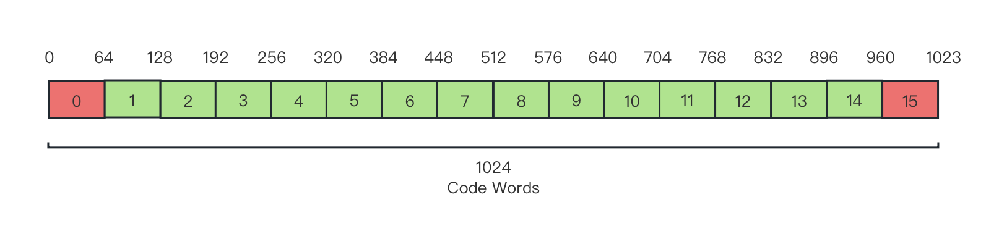

# 3.4.4 色度缩放亮度映射（LMCS [Luma Mapping with Chroma Scaling]）

**色度缩放亮度映射（LMCS [Luma Mapping with Chroma Scaling]）** 技术，是一类纯粹的空域数据处理技术，即本身不涉及时域相关性，直接针对像素原值的冗余分离手段。传统音视频编解码中，包括大部分帧内预测工具、帧内编码条带分块、色度重建等，严格来说都属于这种类型。

LMCS 最早引入自 H.266/VVC 标准中，用于编解码环路滤波阶段 [\[31\]][ref] 。通过建立从传输格式对应存储位深（Bit Depth），到色度和亮度实际可取值范围间的线性转换放缩，来提高针对 **标准动态范围（SDR [Standard Dynamic Range]）** 和 **高动态范围（HDR [High Dynamic Range]）** 视频的支持，提升编解码性能。

这是一种基于物理存储方式和实际规格约束的差异，以直接操作空域到数据的映射关系，来间接降低信息熵的一种技术（有别于熵编码技术族对存储的信息熵直接衰减）。

LMCS 由两个组件构成，分别是：**分段线性（Piecewise Linear）亮度映射（LM [Luma Mapping]）** 和 **依赖亮度（Luma-Dependent ）色度残差缩放（CRS [Chroma Residue Scaling]）** ，简称为 **亮度映射（LM）** 和 **色度缩放（CS）** 。前者精简格式，后者压缩数据。

## **分段线性亮度映射**

分段线性亮度映射，即 **亮度映射（LM）** 的基本目的，是为了方便规格支持的传输格式，在数据存储格式（Data Format）和格式空间（Format Space）原值之间的非对称相互转换。

例如，H.266 中采用 ITU-R BT.2100 的色彩转换规格标准，并兼容 ITU-R BT.709 等其他的的历史转换规格。其中，ITU-R BT.2100 提供了 10-bit YUV 存储格式，而老规格中亦然也有一系列 8-bit YUV 存储格式。同时，YUV 本身亦是具有两种基本有效范围，即 **狭隘区间（Narrow Range）** 和 **完整区间（Full Range）** 。这些不同的 YUV 格式和区间，虽然各自的原色空间色域表示存在范围差异，但由于传输格式都采用同一套 CIE YUV 色彩空间衡量，因此在颜色的传输格式取值上是互通的，差异只在于存储格式的存储范围上，即两个线性区间的映射。

所以，理论上可以 **只采用一个转换标准的传输格式，就能通过数据存储范围的线性转换，实现对所有规格下标准的兼容** 。

假设目标 YUV 规格亮度存储值为 $$I_{out}$$ 存储取值范围为 $$I_{out} \in [Min_{out},\ Max_{out}]$$ ，当前输入 YUV 规格亮度存储值为 $$I_{in}$$ 存储取值范围为 $$I_{in} \in [Min_{in},\ Max_{in}]$$ ，则：

$$
{\displaystyle 
 \begin{aligned}
   I_{out} &= \frac{Max_{out} - Min_{out}}{Max_{in} - Min_{in}} \cdot (I_{in} - Min_{in}) + Min_{in} \\
 \end{aligned}
}
$$

不过在实际使用过程中，因为均色问题（详见第二章）仍在 CIE YUV 标准空间上存在，亮度值本身在整个色域范围并不均匀，使得亮度值（灰度值）转换到存储值后，存储值也保留了这种性质。这在存储格式和格式空间一致的情况下，由于互为逆变换的缘故，并不存在转换误差。但当两者不一致时，非对称转换非互逆，则会产生误差，并随传输格式的原色格式还原而扩大。如果我们为了保证完美映射，则需要引入复杂的计算，不利于像素通道级别的处理过程。

这个问题，亮度映射提出以 **分段牛顿法对亮度存储值取值范围处理** ，即采用分段线性映射来减小误差水平到可接受的范围，并降低算力消耗。

我们一般将原有亮度值对应的可取范围称为原区域，而在此之上分割得到的每个子段，被称为 **子区域** 。记 **原区域码字长（Code Words）** 为 $$CW_{total}$$ 个，而位于索引 $$i \in \mathbb{Z}[0 ,\ N - 1]$$ 位置的子区域 $$CW_{i}$$ 的码字长为 $$CW_{bin}[i]$$ 个，均值为 $$avg(CW_{bin})$$ 。 **码字（Code Word）** 即来自哈夫曼编码数据传输中，所指代的有意义代表值，此处则相当于一个范围内有效的灰度值。则：

$$
{\displaystyle 
 \begin{aligned}
   CW_{bin}[i] &= round \begin{pmatrix} \frac{CW_{total}}{i_{end} - i_{start} + 1} \end{pmatrix} 
                = round \begin{pmatrix} \frac{CW_{total}}{index_{avail}} \end{pmatrix} \\
 \end{aligned}
}
$$

其中， $$i_{end}$$ 、 $$i_{start}$$ 是实际可用于存放数据子区域上下限的索引的，而 $$index_{avail}$$ 即为有效索引的数目。

注意分段码字长和存储格式位深（Bit Depth）并无强相关。若非要建立联系，则两者的关联只相关于取值范围。取 **存储格式位长** 为 $$DF_{bits}$$ 位（bit），保护位等效（非整）占用 $$index_{safe}$$ 个索引数目，有：

$$
{\displaystyle 
 \begin{aligned}
   avg(CW_{bin}) &= \frac{2^{DF_{bits}}}{N}  = \frac{2^{DF_{bits}}}{index_{avail} +index_{safe}}\\
 \end{aligned}
}
$$

例如，当采用 狭隘区间的 10-bit YUV 存储格式时，由于高低电平保护区域的存在，亮度值能够取值的范围其实是 $$I \in [64,\ 940]$$ ，而等效到亮度可用的子区域索引上就相当于只有 $$\mathbb{Z}[1,\ 14]$$ 可用。那么，就有 $$avg(CW_{bin}) = 64$$ ，子区域划分如图：

<figure>
   
    <figcaption>
      
图 3.4.4-1 位深 10-bit 亮度映射码字子区域分段示意图（无修正）

   </figcaption>
</figure>

则原线性转换就有分段表示：

$$
{\displaystyle 
 \begin{aligned}
   I_{out} &= \frac{Max_{out}[i] - Min_{out}[i]}{Max_{in}[i] - Min_{in}[i]} \cdot (I_{in} - Min_{in}[i]) + Min_{in}[i] \quad , i \in \mathbb{Z}[i_{start} ,\ i_{end}]\\
 \end{aligned}
}
$$

即，输入和输出的一一对应分段映射。

现在，基本的分段构建完毕，在数据还原程度上有了可行的保证。但是，这一系列操作除了提供兼容性便利外，在数据量上却是无衰减的，所以 **对空域冗余的压缩没有太大的帮助** 。

因此，具体采用过程中还要根据情况，从码字方面进行数据优化。

## **依赖亮度色度残差缩放**

依赖亮度色度残差缩放，即 **色度缩放（CS）** ，顾名思义需要依靠亮度码字子区域划分后的分片进行放缩。不过这种放缩和亮度映射不太一样的一点在于， **它甚至并不和物理意义浅关联，而是存粹作为数据上的处理，来进行的数量级上的放缩** 。当然，色度本身是有意义的，这点不能混淆。

色度缩放依旧采用了码字分段处理，为了匹配亮度值对应码字区域的变化强度，分段即与亮度取值范围子区域 $$CW_{i}$$ 码字的划分一致。以此计算分段内常量的 **色度缩放因子（Chrome Scale Factor）** ，来对 $$CW_{i}$$ 内色度进行统一处理。

记 $$CW_{i}$$ 子区域，**编码阶段** 色度缩放因子（Chrome Scaling Factor）为 $$S_{enc}[i]$$ ，**解码阶段** 色度缩放因子为 $$S_{dec}[i]$$ ，显然 $$S_{dec}[i] = {S_{enc}[i]}^{-1}$$ 。若记区域内对应某采样（像素点）亮度 $$I_{in}$$ 的色度值（如采用 YUV 则是其 UV 分量，独立计算）为 $$C_{in}$$ ，而输出存储值（传输值）亮度 $$I_{out}$$ 的色度值为 $$C_{out}$$ ，则：

$$
{\displaystyle 
 \begin{aligned}
   \begin{cases}
     C_{out} &=  C_{in} \ \cdot S_{enc}[i] \\
     C_{in}  &=  C_{out} \cdot S_{dec}[i] 
   \end{cases} \\
 \end{aligned}
}
$$

而 $$S_{enc}[i]$$ 和亮度保证相同的放缩比，有：

$$
{\displaystyle 
 \begin{aligned}
   S_{enc}[i] &= \frac{Max_{out}[i] - Min_{out}[i] + \Delta CRS}{Max_{in}[i] - Min_{in}[i]} = {S_{dec}[i]}^{-1} \\
 \end{aligned}
}
$$

其中， $$\Delta CSR$$ 即为色度残差修正值，这个量为一个查表或其他方式处理的外部传参。虽然理论上， $$\Delta CSR$$ 可以通过在 LMCS 过程中，以计算当前帧分块局部色度残差，或全局残差均值来代替，但这种做法消耗太多不必要算力而不太可取。另外，考虑到 $$\Delta CSR$$ 在编解码中是个相对常用的概念，可以通过其他模块或方法解决，因此一般 **不会在** LMCS 里进行处理。

此处我们认为 $$\Delta CSR$$ 为一个色度放缩修正常量即可。可见色度缩放因子在子区域 $$CW_{i}$$ 确认的情况下，是一个 **固定值** 。

现在，LMCS 的理论准备就绪了。我们来看这种纯粹的规格技术是怎么运用的。即，子区域码字修正过程。

## **LMCS 技术在 SDR 和 HDR-HLG 格式中的应用**

我们在对图片进行信息分离和提取时了解到，从频域来看，光亮度（灰度值）变化较大，且对亮度精度要求高的部分，一般在低频轮廓区域出现，占用整体数据量比例较小。而光亮度差异较小，变化平滑，且精度要求低的部分，往往是高频区域，占有大量的数据。此时，如果从光亮度数据，即空域角度出发，低频区域内的 **局部亮度方差（Local Spatial Variance）** 和高频区域相比，与 **全局平均空域亮度方差（Global Average Spatial Variance）** 的平均平方误差（MSE [Mean-Square Error]）则会更大。

通过这一点，我们能够可以在一定程度上，只通过空域亮度数据，就确认是否是低频或高频区域，从而为其分配更少或更多的码字。使得对精度要求高的低频分割更精细，码字分片信息密度更高。而高频则更粗粒度，码字分片信息密度更低。提高精度并减少不必要的数据占用。

那么用于统计局部方差的样本区域该怎么选择呢？在 H.266/VVC 标准的执行委员会联合视频探索小组（JVET [Joint Video Exploration Team]） 推荐的 VVC 验证模型（VTM [VVC Test Model]）官方工程实践里，仍然采用了基本卷积核（此处即代指正方形的无权重采样窗口），这种便于 GPU 加速改造的方式来进行中心点周边一定区域的关联性采样。

记 **局部方差采样核（Local Variance Kernel）** 为 $$LVK_{p}$$ ，简称 **方差核** ，中心为 $$p = (x,\ y)$$ ，窗口为 $$K \times K$$ 大小。取当前帧画面大小为 $$W \times H$$ ，有经验取值：

$$
{\displaystyle 
 \begin{aligned}
   K &= floor \begin{pmatrix} \frac{min(W,\ H)}{240} \end{pmatrix}  \cdot 2 + 1  \\
 \end{aligned}
}
$$

则， $$LVK_{p}$$ 对应核心点 $$p$$ 的局部亮度方差 $$Var_{p}$$ 为：

$$
{\displaystyle 
 \begin{aligned}
   Var_p &= \frac{1}{K^2} \sum (I_k - I_p)^2 \\
 \end{aligned}
}
$$

于是，只要 **确定当前各个分片的平均样本均值情况，就可以进行修正了** 。 另一个耗时位置在于亮度均方误（MSE）与全局差值比的计算，一个比较鲁棒的实现是，通过求取落于当前码字分段内，包含样本的 **平均对数方差（Average Log Variance）** 来代替处理，记为 $$Var_{avg}[i]$$ ，有：

$$
{\displaystyle 
 \begin{aligned}
   Var_{avg}[i] &= \frac{\sum log(Var_p + 1.0)}{Count[i]}  \\
 \end{aligned}
}
$$

其中， $$Count[i]$$ 为当前码字分段所包含的样本（即亮度落于区段内的像素点）总数。

而我们需要统一衡量所有码字分片的情况，因此需要归一化处理。记归一化后对应分片的平均对数方差为 $$Norm[i]$$ ，则：

$$
{\displaystyle 
 \begin{aligned}
   Norm[i] &= Var_{avg}[i] \cdot \frac{N}{\sum Var_{avg}[i]}  \\
 \end{aligned}
}
$$

至此，我们即可根据归一化的 $$Norm[i]$$ 取值，开展对当前帧的码字分片进行修正的工作了。取修正补偿为 $$\Delta_1[i]$$ 和 $$\Delta_2[i]$$ ，记码字分段子区域 $$CW_{i}$$ 的包含的样本，占总样本比例为 $$Hist[i]$$ ，且强制 $$Hist[i] \in [0,\ 0.4]$$ 经验范围（ **避免失衡** ），有：

$$
{\displaystyle 
 \begin{aligned}
  Hist[i] &= max(min(0.0,\ \frac{Count[i]}{\sum Count[i]}),\ 0.4) \\
  \Delta = &\begin{cases}
     \Delta_1[i] &= round(10 \cdot Hist[i]) \\
     \Delta_2[i] &= round(20 \cdot Hist[i]) 
  \end{cases} \quad \in \mathbb{Z} \\
 \end{aligned}
}
$$

则最终修正后的码字长 $$\hat{CW_{bin}}[i]$$ 与原长 $$CW_{bin}[i]$$ 的关系为：

$$
{\displaystyle 
 \begin{aligned}
  \hat{CW_{bin}}[i]  & = 
   {
        \begin{cases}
          CW_{bin}[i] \quad &, Norm[i] = 1.0 \\
          CW_{bin}[i] + \Delta_1[i] \quad &,\ 0.8 \le Norm[i] < 0.9 \\
          CW_{bin}[i] + \Delta_2[i] \quad &,\ 0.0 \le Norm[i] < 0.8 \\
          CW_{bin}[i] - \Delta_1[i] \quad &,\ 1.1 \le Norm[i] < 1.2 \\
          CW_{bin}[i] - \Delta_2[i] \quad &,\ 1.2 \le Norm[i] 
        \end{cases}
   } \\
 \end{aligned}
}
$$

以新分片码字长度 $$\hat{CW_{bin}}[i]$$ 更新子区域 $$CW_{i}$$ 后，在将修正后的码字范围，代入色度自适应处理，就组成了最终修正标准（注意只有输出码字子区域需要修正），只展示编码阶段，解码取逆运算：

$$
{\displaystyle 
 \begin{aligned}
   CW_{in}[i]  &\in [Min_{in}[i],\ Max_{in}[i]] = [Max_{in}[i-1]+1,\ Min_{in}[i]+ CW_{bin}[i]] \\
   CW_{out}[i] &\in [Min_{out}[i],\ Max_{out}[i]] = [Max_{out}[i-1]+1,\ Min_{out}[i]+\hat{CW_{bin}}[i]] \\
   Color_{out}  & = 
   {
        \begin{cases}
           I_{out} &= \frac{Max_{out}[i] - Min_{out}[i]}{Max_{in}[i] - Min_{in}[i]} \cdot (I_{in} - Min_{in}[i]) + Min_{in}[i] \\ 
           C_{out} &=  C_{in} \ \cdot \frac{Max_{out}[i] - Min_{out}[i] + \Delta CRS}{Max_{in}[i] - Min_{in}[i]}
        \end{cases}
   } \quad , i \in \mathbb{Z}[i_{start} ,\ i_{end}] \\
 \end{aligned}
}
$$

两式结合，即是 **LMCS 关于 SDR 和 HDR-HLG 格式的修正公式** 。

依旧选 **狭隘区间的 10-bit YUV 存储格式** 取均匀样本为例，修正后的结果如下：

<figure>
   
    <figcaption>
      
图 3.4.4-2 位深 10-bit 亮度映射码字子区域分段示意图（修正后）

   </figcaption>
</figure>

当然，这一套修正方式，是针对 SDR 和 HDR-HLG 格式采用的 **峰值信噪比（PSNR [Peak Signal-to-Noise Ratio]）** 指标考核方式进行的。对于采用 **加权峰值信噪比（wPSNR [weighted Peak Signal-to-Noise Ratio]）** 指标考核的 HDR-PQ 格式，则需要另外的处理流程。具体本书不再行展开，感兴趣可参阅原 H.266/VVC 的 LMCS 补充意见稿 [\[31\]][ref] 。

可见偏重于工程规格依赖的技术，和基于现实观察的理论进行迁移的技术，在实践上还是有较大处理细节关注点上的差异的。前者更注重和具体规格设置的匹配（如 LMCS 等），因此相对局限。而后者则更在意规律性质的还原（如 HOG、BDOF 等），对比之下更为通用。同时，前者理论约束较多会比较繁琐，但实现起来的复杂程度和最终效果，却会有较大的波动，即可以非常简单，也可以充满策略。

**毕竟对于规格而言，重要的在于规定与限制，以便统一实现。但具体实现的过程，就因设计和目标而异了。**
	
相对于空域两者皆有的情况，频域冗余处理则更偏重依赖传统数学工具，来达成压缩效果。

[ref]: References_3.md