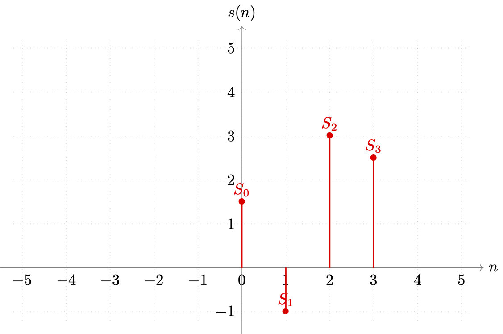
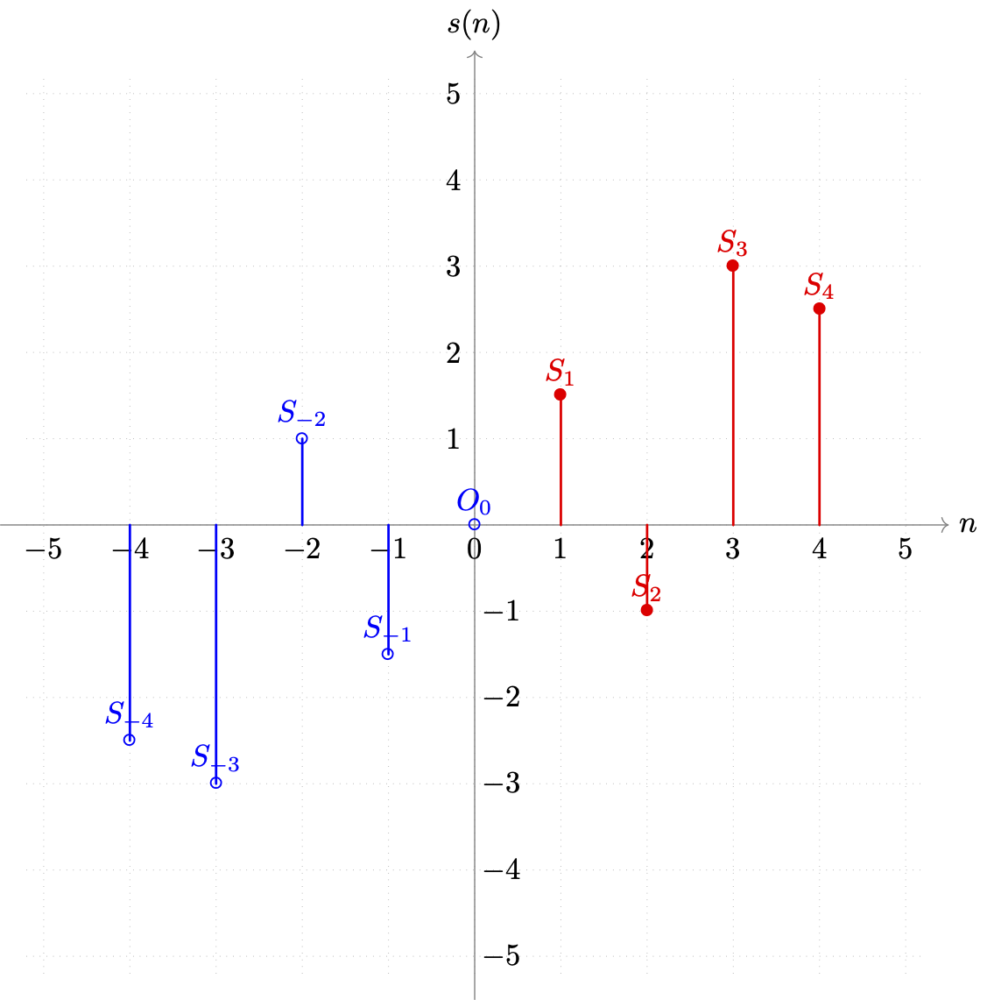

# 3.5.1 整数离散正余弦变换（IDST/IDCT）

**整数离散正余弦变换（IDST/IDCT）**，顾名思义，就是将原本作用于浮点域的离散正余弦变换（DST/DCT），**通过适当放缩量化到整数域进行**。

在本章开始时，我们曾花了大量篇幅讲解信号分析的核心算法， **傅立叶变换（Fourier Transform）**，并简短的辨析了一维/二维离散傅立叶变换（1D/2D-DFT）。

回顾前文。有提到，如果取任意点 $$\vec{P}(x,y)$$ 可取 $$x \in [0, \ 1, \ \cdots , \ W]$$ ， $$y \in [0, \ 1, \ \cdots , \ H]$$ ，只取整数位置。同时， $$u \in [-\tfrac{U}{2}, \ \cdots , \ +\tfrac{U}{2}]$$ 、 $$v \in [-\tfrac{V}{2}, \ \cdots , \ +\tfrac{V}{2}]$$ ，有离散 $$\vec{k} \in [\vec{k_0}, \ \vec{k_1}, \ \cdots, \ \vec{k_{n}}]$$ ， $$n = UV = HW$$ ，则：

$$
{\displaystyle 
 \begin{aligned}
   SDD: \ \ \hat{f}(u,v) &= \sum_{x = 0}^{W} \sum_{y = 0}^{H}  f(x,y) \cdot e^{-i (ux+vy)} \\
   FDD: \ \ f(x,y) &=  \frac{1}{U\cdot V} \sum_{u=-U/2}^{+U/2} \sum_{v= -V/2}^{+V/2} \hat{f}(u,v) \cdot {\mathcal {F}}_{\omega}(x, y) \\
 \end{aligned}
}
$$

即由空域离散化（SDD）与频域离散化（FDD）共同构成空频离散化（SFD [Spacial Frequency Discrete]）表达的 **二维离散傅立叶（2D-DFT）**，如下所示：

$$
{\displaystyle 
 \begin{aligned}
   {\mathcal {F}}_{\omega} = [{\mathcal {F}}_{\vec{k_0}},&{\mathcal {F}}_{\vec{k_1}},\cdots,{\mathcal {F}}_{\vec{k_n}}]  \\
   \hat{f}(u,v) = \sum_{x = 0}^{W} \sum_{y = 0}^{H}  f(x,y) \cdot e^{-i (ux+vy)}  \ \ \ \ \ \Leftrightarrow & \ \ \ \ \ 
   f(x,y) = \frac{1}{U\cdot V} \sum_{u=-U/2}^{+U/2} \sum_{v= -V/2}^{+V/2} \hat{f}(u,v) \cdot {\mathcal {F}}_{\omega}(x, y) \\
 \end{aligned}
}
$$

虽然当时，并没有约束复平面波 $${\mathcal {F}}_{\omega}(x,y)$$ 波矢 $${\vec{k}}$$ 的方向，即方向可以是平面内任意角度与大小。但对于周期（范围）确定情况下，构成傅立叶变换的基底函数族 $${\mathcal {F}}_{\omega} = [{\mathcal {F}}_{\vec{k_0}},\ {\mathcal {F}}_{\vec{k_1}},\cdots,{\mathcal {F}}_{\vec{k_n}}]$$ ，基底函数（即原函数拆解的目标平面波组）的选取，却是可以被 **一定程度约束的**。

如果我们约束，取周期 $$T = 2 \pi n$$ 的标准正余弦函数（Sine/Cosine），按照 **四分之一周期** 的步长 $$Step = \tfrac{\pi}2{}$$ 偏移得到的 $${\mathcal {F}}_{\xi}(x)$$ 和 $${\mathcal {F}}_{\eta}(y)$$ 构成波矢 $${\vec{k}}$$ 。选取沿着 $$x$$ 轴方向的一维波 $${\mathcal {F}}_{\xi}(x)$$ 和沿着 $$y$$ 轴方向的一维波 $${\mathcal {F}}_{\eta}(y)$$ 组成的 $$16^n$$ 个定向复平面波 $${\mathcal {F}}_{\omega}(x,y)$$ 集合，为当前函数的基底函数族。

那么，我们就能够在 **补齐周期数据** 后，使用 **快速傅立叶变换（FFT）** 来求解了。

**但这样的做法，适用于分析，却并不适合冗余处理场景。**

即使运用快速傅立叶变换，也仍然会有较大的算力消耗。且由于完整作用于任意数据源信号，所以不能保证基底函数族整体层面的规律性，从而无法提炼出统一的矩阵化算子。这让直接使用传统分析算法的方式，在 GPU 加速方面尽显劣势。

考虑到冗余压缩，并不要求保证数据帧完整不可分的输入，且精度也相对分析场景要求较低。如果能够适当的利用指数函数三角函数化，其本身的周期规律和标准化约束，建立基底整体的规律性，来契合傅立叶变换的性质。就能够在消减不必要参数（常量固定）并限定生效范围后，实现对离散傅立叶变化的常量化矩阵运算。建立卷积核，加速压缩过程。

因此，首选的出发点，就是 **泛化离散正余弦变换（DST/DCT）到任何已知周期（范围）的数据信号源**。

## **离散正余弦变换（DST/DCT）的泛化**

沿用前文设定，记构成原信号函数 $$s(t)$$ 的复指数函数 $${\mathcal {S}}_{\omega}(t)$$ 有角频率（角速度）为 $${\omega_n} = \tfrac{2\pi n}{T}$$ 。有傅立叶函数：

$$
{\displaystyle 
 \begin{aligned}
   s(t)  &= \frac{1}{N}\sum_{n = 0}^{N} \hat{a}_{\omega} \cdot cos(\omega t) + i \cdot \hat{b}_{\omega} \cdot sin(\omega t)\\
   \hat{a}_{\omega}  &= \hat{s}(-\omega) + \hat{s}(\omega)  \ \ \ \ \ 
   \hat{b}_{\omega}  = \tfrac{1}{i} \cdot (\hat{s}(-\omega)-\hat{s}(\omega)) \\
 \end{aligned}
}
$$

按约束条件，信号函数波长 $$T = 2 \pi$$ 做步长 $$Step = \tfrac{\pi}{2}$$ 的可变 $$n \in [0, \ N - 1]$$ 等分，使复指数函数 $${\mathcal {S}}_{\omega}(t) = {\mathcal {S}}_{\omega}(n)$$ 。则存在 $$k \in [0, \ N-1]$$ 有 $${\omega_n} = \tfrac{2\pi n}{T} = \tfrac{2\pi k}{N} = {\omega_k}$$ 简化表示为 $${\omega}$$ ，可对原式做三角函数离散化处理（详细推导回顾本章首节）。

当输入信号满足奇函数特性时，可得 **标准正弦的离散正弦变换（DST）的傅立叶展式** 为：

$$
{\displaystyle 
 \begin{aligned}
   s(n)  &= \frac{1}{N}\sum_{k = 0}^{N-1} \hat{s}(k) \cdot sin(\tfrac{2 \pi n}{N} k)  \\
   \hat{s}(k)  &= \sum_{n = 0}^{N-1} s(n) \cdot sin(-\tfrac{2 \pi n}{N} k ) \\
 \end{aligned}
}
$$

当输入信号满足偶函数特性时，有 **标准余弦的离散余弦变换（DCT）的傅立叶展式** 为：

$$
{\displaystyle 
 \begin{aligned}
   s(n)  &= \frac{1}{N}\sum_{k = 0}^{N-1} \hat{s}(k) \cdot cos(\tfrac{2 \pi n}{N} k)  \\
   \hat{s}(k)  &= \sum_{n = 0}^{N-1} s(n) \cdot cos(-\tfrac{2 \pi n}{N} k ) \\
 \end{aligned}
}
$$

但是，自然信号是不分奇偶的，想要将公式适用范围扩大，就需要根据正余弦傅立叶变换要求，对输入信号进行不改变原始数据的扩充调整。根据选择作为基底的标准函数正余弦的差异，**人为构造** 满足条件输入的方法论，被分为 **离散正弦变换（DST）分解** 和 **离散余弦变换（DCT）分解**，两套实现。

假设原信号函数 $$s(t) = s(n)$$ 在 $$n \in \mathbb{Z} [0, \ N - 1]$$ 的各节点位置，有样本采样 $$S \in [S_0, \ S_{N - 1}]$$ ，取 $$N = 4$$ 模拟最小子块（即实际技术被使用时的通用情况）。如图：

<figure>
   
    <figcaption>
      
图 3.5.1-1 事例样本取值与切片索引关系图示

   </figcaption>
</figure>

当目标分解为 DST 时，我们需要平移原数据 $$+\tfrac{3}{2} Step$$ 个步长，并补充中心原点 $$O_0$$ 后，再做基于中心原点 $$O_0 = (0,\ 0)$$ 的映射。如此才能保证，补充的映射数据和旧数据，能够组成新的等步长数据组，满足离散化的处理条件。得到如下新集合（蓝色为补充数据，红色为原数据）：

<figure>
   
    <figcaption>
      
图 3.5.1-2 事例样本目标 DST 补充后与切片索引关系图示

   </figcaption>
</figure>

新的样本集，数据量较原有数据翻了一倍多。但只有  轴正向的取值有意义。所以，采用 DST 类型分解，在扩充后，周期跨度都变为了 $$T= 2N + 1$$ ，且原离散展式 **只有 $$n \in [1, \ N]$$ 的部分是有效的**。我们可以将偏移的 $$+1 \times Step$$ 划到式中处理，则 $$n$$ 的取值范围就仍然可以保持为 $$n \in \mathbb{Z} [0, \ N - 1]$$ 。

不过考虑到 DST 目标是为了处理奇数阶信号源分解，为避免 $$sin(0)=0$$ 值无意义的问题，会取 $$k \in [1, \ N]$$ 的范围，并选用标准正弦向左移动 $$-\tfrac{1}{2} \pi$$ 的偏移作为 **基底正弦族**。因此，为了统一，对 $$n$$ 采用直接包含偏移 $$+1 \times Step$$ 的取值，使得 $$n$$ 有 $$n \in \mathbb{Z} [1, \ N]$$ 。需要注意这个细节差异。

当目标分解为 DCT 时，需要在基于 $$y=s(n)$$ 轴对称前，先行平移元数据 $$+\tfrac{1}{2} Step$$ 个步长。得到如下新集合（蓝色为补充数据，红色为原数据）：

<figure>
   
    <figcaption>
      
图 3.5.1-3 事例样本目标 DCT 补充后与切片索引关系图示

   </figcaption>
</figure>

新的样本集，数据量较原有数据翻了一倍。同样只有 $$x$$ 轴正向的取值有意义。所以，采用 DCT 类型分解，在扩充后，周期跨度都变为了 $$T= 2N$$ ，且原离散展式 **只有 $$n \in [\tfrac{1}{2}, \ N - \tfrac{1}{2}]$$ 的部分是有效的**。而由于非整数索引 $$n$$ 不利于匹配原值，我们将偏移的 $$+\tfrac{1}{2} Step$$ 划到式中处理，则 $$n$$ 的取值范围就仍然可以保持为 $$n \in \mathbb{Z} [0, \ N - 1]$$ 。

于是，结合两种分解，有：

$$
{\displaystyle 
 \begin{aligned}
  DST:&
   {
        \begin{cases}
          s(n)  &= \frac{1}{2N+1}\sum_{k = 1}^{N} \hat{s}(k) \cdot sin(\tfrac{2 \pi (k-\tfrac{1}{2})}{2N+1} n)  
                 = \sqrt{\frac{1}{2N+1}} \sum_{k = 1}^{N} -(-\sqrt{\frac{1}{2N+1}} \cdot \hat{s}(k)) \cdot sin( \tfrac{\pi n (2k-1)}{2N+1} )  \\
          \hat{s}(k)  &= 2 \cdot \sum_{n = 1}^{N} s(n) \cdot sin(-\tfrac{2 \pi (k-\tfrac{1}{2})}{2N+1} n ) 
                 = 2 \cdot \sum_{n = 1}^{N} s(n) \cdot sin(-\tfrac{\pi n (2k-1)}{2N+1} ) 
        \end{cases}
   } \\
  DCT:&
   {
        \begin{cases}
          s(n)  &= \frac{1}{2N}\sum_{k = 0}^{N-1} \hat{s}(k) \cdot cos(\tfrac{2 \pi (n+\tfrac{1}{2})}{2N} k)  
                 = \sqrt{\frac{1}{2N}} \sum_{k = 0}^{N-1} (\sqrt{\frac{1}{2N}} \cdot \hat{s}(k)) \cdot cos( \tfrac{\pi (2n+1) k}{2N} )  \\
          \hat{s}(k)  &= 2 \cdot \sum_{n = 0}^{N-1} s(n+\tfrac{1}{2}) \cdot cos(-\tfrac{2 \pi (n+\tfrac{1}{2})}{2N} k ) 
                 = 2 \cdot \sum_{n = 0}^{N-1} s(\tfrac{2n+1}{2}) \cdot cos(\tfrac{\pi (2n+1) k}{2N} ) 
        \end{cases}
   } \\
 \end{aligned}
}
$$

不过，由于 DCT 采用了 **非整数步长**，当 $$k=0$$ 时并不一定有拟合的曲线使得 $$\hat{s}(0) = 0$$ ，且 偶函数特点使 $$\hat{s}(0)$$ 在上式中被重复计算，因此需要针对变换后的 $$s(n)$$ 剔除一次的 $$\hat{s}(0)$$ 均值累积，所以：

$$
{\displaystyle 
 \begin{aligned}
  DCT|_{k = 0}:&
   {
        \begin{cases}
          s(n)  &= \frac{1}{N}\cdot \hat{s}(0)+ \sqrt{\frac{1}{2N}} \sum_{k = 1}^{N-1} (\sqrt{\frac{1}{2N}} \cdot \hat{s}(k)) \cdot cos( \tfrac{\pi (2n+1) k}{2N} )  \\
                &= \sqrt{\frac{1}{2N}} ( \frac{2}{\sqrt{2N}} \cdot \hat{s}(0)) +  \sum_{k = 1}^{N-1} (\sqrt{\frac{1}{2N}} \cdot \hat{s}(k)) \cdot cos( \tfrac{\pi (2n+1) k}{2N} ) ) \\
          \hat{s}(k)  &= 2 \cdot \sum_{n = 0}^{N-1} s(\tfrac{2n+1}{2}) \cdot cos(\tfrac{\pi (2n+1) k}{2N} ) 
        \end{cases}
   } \\
 \end{aligned}
}
$$

上式中，对原信号函数 $$s(n)$$ 的 DST 均值常量 $$\frac{1}{2N+1}$$ 拆解为 $$\begin{pmatrix} \sqrt{\frac{1}{2N+1}} \end{pmatrix} ^2$$ 两部分，而 DCT 均值常量 $$\frac{1}{2N}$$ 拆解为 $$\begin{pmatrix} \sqrt{\frac{1}{2N}} \end{pmatrix} ^2$$ 两部分。其目的是为了，通过分别分配到各自展开式和傅立叶解上，来保证工程化后的算子，在 **正逆运算上的统一**。 

因此，我们取：

$$
{\displaystyle 
 \begin{aligned}
  DST:& X_k  = -\sqrt{\frac{1}{2N+1}}  \cdot \hat{s}(k) = \sqrt{\frac{1}{2N+1}}  \cdot \hat{s}(-k) \\
  DCT:& X_k  = \frac{1}{\sqrt{2N}}  \cdot \hat{s}(k) \quad \& \quad X_0  = \frac{2}{\sqrt{2N}}  \cdot \hat{s}(k) \\
 \end{aligned}
}
$$

代入即可得到，原 **离散正弦变换（DST）的工程表达式** ：

$$
{\displaystyle 
 \begin{aligned}
  &k \in [1,\ N] \quad \quad n \in [1,\ N] \\
  DST:&
   {
        \begin{cases}
          S_n  &= \frac{1}{\sqrt{2N+1}} \sum_{k = 1}^{N} X_k \cdot sin( \tfrac{\pi n(2k-1) }{2N+1} )  \\
          X_k  &= \frac{2}{\sqrt{2N+1}} \cdot \sum_{n = 1}^{N} S_n \cdot sin(\tfrac{\pi n(2k-1)}{2N+1} ) 
        \end{cases}
   } \\ 
 \end{aligned}
}
$$

和，原 **离散余弦变换（DCT）的工程表达式** 为：

$$
{\displaystyle 
 \begin{aligned}
  &k \in [0,\ N-1] \quad \quad n \in [0,\ N - 1] \\
  DCT:&
   {
        \begin{cases}
          S_n  &= \frac{1}{\sqrt{2N}} \sum_{k = 0}^{N-1} X_k \cdot cos( \tfrac{\pi (2n+1) k}{2N} )  \\
          X_k  &= \frac{2}{\sqrt{2N}}  \cdot \sum_{n = 0}^{N-1} S_n \cdot cos(\tfrac{\pi (2n+1) k}{2N} )\ , k \ge 1 \\
          X_k  &= \frac{2 \cdot 2}{\sqrt{2N}}  \cdot \sum_{n = 0}^{N-1} S_n \cdot cos(\tfrac{\pi (2n+1) k}{2N} )\ , k = 0
        \end{cases}
   } \\
 \end{aligned}
}
$$

这就是信号处理上经常使用的，**泛化离散正余弦变换公式组**。 

从上面的过程中可以发现，我们在傅立叶基底函数族的选取上，实际限定了函数的相位、周期，并约束了原信号的特性。如果在初始相位和原信号特性上做调整，最终的结果也会有所差异。从数学工具角度来看，这种变化 **最终会产生 8 种 DST 和 8 种 DCT 的变体**，以分别应对实虚部奇偶阶数和初始相位不同时的快速计算。但由于工程化上需要力求简洁和相似（形似）的表达。因此，相对于其他几种的组合，我们最终采用的公式组中的两类，来用于各自条件输入的统一处理。

现在，GPU 加速的理论已准备就绪，我们来看算子是怎么获取的。

## **整数离散正弦变换（IDST）的 GPU 矩阵算子**

首先，将离散正弦变换扩展到二维情况，有：

$$
{\displaystyle 
 \begin{aligned}
  &k(u,v) \& p(x,y)  \in [(1,\ 1),\ (N,\ N)] \\
  DST: X_k(u,v)  &= \begin{pmatrix} \frac{2}{\sqrt{2N+1}} \end{pmatrix} ^2 \cdot \sum_{p = (1,1)}^{(N,N)}S_p(x,y) \cdot sin(\tfrac{2u-1}{2N+1} \pi x) \cdot sin(\tfrac{2v-1}{2N+1} \pi y) \\ 
 \end{aligned}
}
$$

考虑可构成卷积核的子块最小大小为 $$4 \times 4$$ ，则有 $$N=4$$ 使上式变为：

$$
{\displaystyle 
 \begin{aligned}
  &k(u,v) \& p(x,y)  \in [(1,\ 1),\ (4,\ 4)] \\
  DST: X_k(u,v)  &= \frac{4}{9} \cdot \sum_{p = (1,1)}^{(4,4)}S_p(x,y) \cdot sin(\tfrac{2u-1}{9} \pi x) \cdot sin(\tfrac{2v-1}{9} \pi y) \\ 
 \end{aligned}
}
$$

如此，就可以矩阵表示 $$4 \times 4$$ 的 DST 变化为：

$$
{\displaystyle 
 \begin{aligned}
  DST_{4 \times 4}: \\
  X_k(u,v)|_v  &= K_{DST} \cdot S_p(x, y) \\ 
  &= \begin{bmatrix} 
    &\frac{2}{3} \cdot \sum_{v=1}^4 \begin{pmatrix}  \frac{2}{3} \cdot \sum_{u=1}^4 sin(\tfrac{2u-1}{9} \pi x) \end{pmatrix} \cdot sin(\tfrac{2v-1}{9} \pi y) 
  \end{bmatrix}  \cdot
  S_p(x, y) \\
 \end{aligned}
}
$$

即有：

$$
{\displaystyle 
 \begin{aligned}
  K_{DST}&= \frac{2}{3} \begin{bmatrix} 
    &sin(\tfrac{1}{9}\pi)     &, \quad sin(\tfrac{2}{9}\pi)     &, \quad sin(\tfrac{3}{9}\pi)     &, \quad sin(\tfrac{4}{9}\pi)   \\
    &sin(\tfrac{3}{9}\pi)     &, \quad sin(\tfrac{6}{9}\pi)     &, \quad sin(\tfrac{9}{9}\pi)     &, \quad sin(\tfrac{12}{9}\pi)   \\
    &sin(\tfrac{5}{9}\pi)     &, \quad sin(\tfrac{10}{9}\pi)    &, \quad sin(\tfrac{15}{9}\pi)    &, \quad sin(\tfrac{20}{9}\pi)   \\
    &sin(\tfrac{7}{9}\pi)     &, \quad sin(\tfrac{14}{9}\pi)    &, \quad sin(\tfrac{21}{9}\pi)    &, \quad sin(\tfrac{28}{9}\pi)   
  \end{bmatrix} \\
    &= \frac{2}{3} \begin{bmatrix} 
    &sin(\tfrac{1}{9}\pi)     &, \quad sin(\tfrac{2}{9}\pi)     &, \quad sin(\tfrac{3}{9}\pi)     &, \quad sin(\tfrac{4}{9}\pi)    \\
    &sin(\tfrac{3}{9}\pi)     &, \quad sin(\tfrac{3}{9}\pi)     &, \quad \quad  0                 &, -sin(\tfrac{3}{9}\pi)         \\
    &sin(\tfrac{4}{9}\pi)     &, -sin(\tfrac{1}{9}\pi)          &, -sin(\tfrac{3}{9}\pi)          &, \quad sin(\tfrac{2}{9}\pi)    \\
    &sin(\tfrac{2}{9}\pi)     &, -sin(\tfrac{4}{9}\pi)          &, \quad sin(\tfrac{3}{9}\pi)     &, -sin(\tfrac{1}{9}\pi)   
  \end{bmatrix} 
 \end{aligned}
}
$$

其中， $$K_{DST}$$ 就是 DST 的卷积核算子，但目前还是 **浮点数的形式**。浮点数矩阵不利于 GPU 算力的节省，因此还需要整数化。考虑 $$K_{DST}$$ 本身作用在实际像素取值上，而像素值的数据格式是以整数形式离散化存储的，具有位深数据范围中值记为常量 $$D$$ 。

比如，8-bit 位深格式可取范围为 $$[0,\ 255]$$ ，就有 $$D=128$$ 取值。我们可以利用这一特点来对原数据进行放缩，并四舍五入取整。

记整数化后的 $$K_{DST}$$ 为 $$\hat{K}_{DST}$$ 则:

$$
{\displaystyle 
 \begin{aligned}
  \hat{K}_{DST}&\approx  \begin{bmatrix} 
    &29    &, \quad 55     &, \quad 74     &, \quad 84   \\
    &74    &, \quad 74     &, \quad 0      &,      -74   \\
    &84    &,      -29     &,      -74     &, \quad 55   \\
    &55    &,      -84     &, \quad 74     &,      -29
  \end{bmatrix} = D \cdot K_{DST} \\
 \end{aligned}
}
$$

原 DST 的算子，即可以转化为如下表示：

$$
{\displaystyle 
 \begin{aligned}
  X_k(u,v)|_v  &= \frac{1}{D} \cdot D \cdot K_{DST} \cdot S_p(x, y) \\ 
  &=  \frac{1}{D} \cdot \hat{K}_{DST} \cdot S_p(x, y) \\
 \end{aligned}
}
$$

当然，这里单独计算了分离后波矢 $${\vec{k}}=(u,v)$$ 对应平面波的权重 $$X_k(u,v)$$ ，那么对于整个 $$4 \times 4$$ 区域所有的平面波权重（即傅立叶解）就有 **等价矩阵** ：

$$
{\displaystyle 
 \begin{aligned}
  X_k|_{4 \times 4}   &=  \begin{pmatrix} \frac{1}{D} \end{pmatrix} ^2  \cdot \hat{K}_{DST} \cdot S_p|_{4 \times 4} \cdot {\hat{K}_{DST}}^T \\
 \end{aligned}
}
$$

精简一下，即可写为：

$$
{\displaystyle 
 \begin{aligned}
  X_k  &=  \begin{pmatrix} \frac{1}{D} \end{pmatrix} ^2  \cdot \hat{K}_{DST} \cdot S_p\cdot {\hat{K}_{DST}}^T \\
 \end{aligned}
}
$$

这个即为 **整数正弦变化（IDST）核心公式**，而 $$\hat{K}_{DST}$$ 则被称为 **整数正弦变化的基本算子（IDST Opt）**。显然，在已知 $$S_p$$ 和存储范围 $$D$$ 的情况下，还是非常容易求得 $$X_k$$ 的。而对应的 GPU 程序片也很简单，基本可当作滑动窗口移动步长 $$K = 4$$ 的固定算子乘法运算，就不再复写了。

## **整数离散正弦变换（IDST）的 GPU 矩阵算子**

同理于 IDST，虽然 **整数离散余弦变换（IDCT）** 的切入理论，和 IDST 有一些不同。但最终的算子区别仅在于取值上。

仍然需要，将离散正弦变换扩展到二维情况。有：

$$
{\displaystyle 
 \begin{aligned}
  &k(u,v) \& p(x,y)  \in [(0,\ 0),\ (N-1,\ N-1)] \\
  &\varepsilon_k|_{k=(0,0)} = \frac{1}{\sqrt{2}} \quad \& \quad \varepsilon_k|_{k \ne (0,0)}=1 \\
  DCT: X_k(u,v)  &= \begin{pmatrix} \frac{2 \cdot \varepsilon_k}{\sqrt{2N}} \end{pmatrix} ^2 \cdot \sum_{p = (0,0)}^{(N-1,N-1)}S_p(x,y) \cdot cos(\tfrac{2x+1}{2N} \pi u) \cdot cos(\tfrac{2y+1}{2N} \pi v) \\ 
 \end{aligned}
}
$$

依然，考虑可构成卷积核的子块最小大小为 $$4 \times 4$$ ，则有 $$N=4$$ 使上式变为：

$$
{\displaystyle 
 \begin{aligned}
  &k(u,v) \& p(x,y)  \in [(0,\ 0),\ (3,\ 3)] \\
  &\varepsilon_k|_{k=(0,0)} = \frac{1}{\sqrt{2}} \quad \& \quad \varepsilon_k|_{k \ne (0,0)}=1 \\
  DCT: X_k(u,v)  &= \begin{pmatrix} \frac{\varepsilon_k}{\sqrt{2}}  \end{pmatrix} ^2 \cdot \sum_{p = (0,0)}^{(3,3)}S_p(x,y) \cdot cos(\tfrac{2x+1}{8} \pi u) \cdot cos(\tfrac{2y+1}{2N} \pi v) \\ 
 \end{aligned}
}
$$

如此，就可以矩阵表示 $$4 \times 4$$ 的 DCT 变化为：

$$
{\displaystyle 
 \begin{aligned}
  DCT_{4 \times 4}: \\
  X_k(u,v)|_v  &= K_{DCT} \cdot S_p(x, y) \\ 
  &= \begin{bmatrix} 
    &\frac{\varepsilon_v}{\sqrt{2}} \cdot \sum_{y=0}^3 \begin{pmatrix}  \frac{\varepsilon_u}{\sqrt{2}} \cdot \sum_{x=0}^3 cos(\tfrac{2x+1}{8} \pi u) \end{pmatrix} \cdot cos(\tfrac{2y+1}{8} \pi v) 
  \end{bmatrix}  \cdot
  S_p(x, y) \\
  &=  \frac{1}{\sqrt{2}} \cdot \begin{bmatrix} 
    &\varepsilon_v \cdot \sum_{y=0}^3 \frac{1}{\sqrt{2}} \cdot \begin{pmatrix} \varepsilon_u \cdot \sum_{x=0}^3 cos(\tfrac{2x+1}{8} \pi u) \end{pmatrix} \cdot cos(\tfrac{2y+1}{8} \pi v) 
  \end{bmatrix}  \cdot
  S_p(x, y) \\
  \varepsilon_k|_{k=(0,0)} &= \frac{1}{\sqrt{2}} \quad \& \quad \varepsilon_k|_{k \ne (0,0)}=1 \\
 \end{aligned}
}
$$

即有：

$$
{\displaystyle 
 \begin{aligned}
  K_{DCT}&= \frac{1}{\sqrt{2}}  \begin{bmatrix} 
    &\frac{1}{\sqrt{2}} cos(\tfrac{0}{8}\pi)     &, \quad \frac{1}{\sqrt{2}} cos(\tfrac{0}{8}\pi)     &, \quad \frac{1}{\sqrt{2}} cos(\tfrac{0}{8}\pi)     &, \quad \frac{1}{\sqrt{2}} cos(\tfrac{0}{8}\pi)   \\ 
    &cos(\tfrac{1}{8}\pi)     &, \quad cos(\tfrac{3}{8}\pi)     &, \quad cos(\tfrac{5}{8}\pi)     &, \quad cos(\tfrac{7}{8}\pi)   \\ 
    &cos(\tfrac{2}{8}\pi)     &, \quad cos(\tfrac{6}{8}\pi)     &, \quad cos(\tfrac{10}{8}\pi)    &, \quad cos(\tfrac{14}{8}\pi)  \\ 
    &cos(\tfrac{3}{8}\pi)     &, \quad cos(\tfrac{9}{8}\pi)     &, \quad cos(\tfrac{15}{8}\pi)    &, \quad cos(\tfrac{21}{8}\pi)
  \end{bmatrix} \\
    &= \frac{1}{\sqrt{2}}  \begin{bmatrix} 
    &\frac{1}{\sqrt{2}}       &, \quad \frac{1}{\sqrt{2}}       &, \quad \frac{1}{\sqrt{2}}       &, \quad \frac{1}{\sqrt{2}}     \\ 
    &cos(\tfrac{1}{8}\pi)     &, \quad cos(\tfrac{3}{8}\pi)     &, \quad cos(\tfrac{3}{8}\pi)     &, -cos(\tfrac{1}{8}\pi)        \\ 
    &cos(\tfrac{2}{8}\pi)     &, -cos(\tfrac{2}{8}\pi)          &, -cos(\tfrac{2}{8}\pi)          &, \quad cos(\tfrac{2}{8}\pi)  \\ 
    &cos(\tfrac{3}{8}\pi)     &, -cos(\tfrac{1}{8}\pi)          &, \quad cos(\tfrac{1}{8}\pi)     &, -cos(\tfrac{3}{8}\pi)
  \end{bmatrix} 
 \end{aligned}
}
$$

依然取位深数据范围中值记为常量 $$D$$ 。有 $$D=128$$ 对应 8-bit 位深格式 $$[0,\ 255]$$ 的可取范围，使得我们能够将结果矩阵整数化处理。记整数化后的 $$K_{DCT}$$ 为 $$\hat{K}_{DCT}$$ 则:

$$
{\displaystyle 
 \begin{aligned}
  \hat{K}_{DCT}&\approx  \begin{bmatrix} 
    &64    &, \quad 64     &, \quad 64     &, \quad 64   \\
    &83    &, \quad 36     &,      -36     &,      -83   \\
    &64    &,      -64     &,      -64     &, \quad 64   \\
    &36    &,      -83     &, \quad 83     &,      -36
  \end{bmatrix} = D \cdot K_{DCT} \\
 \end{aligned}
}
$$

原 DCT 的算子，即可以转化为如下表示：

$$
{\displaystyle 
 \begin{aligned}
  X_k(u,v)|_v  &= \frac{1}{D} \cdot D \cdot K_{DCT} \cdot S_p(x, y) \\ 
  &=  \frac{1}{D} \cdot \hat{K}_{DCT} \cdot S_p(x, y) \\
 \end{aligned}
}
$$

当然，这里单独计算了分离后波矢 $${\vec{k}}=(u,v)$$ 对应平面波的权重 $$X_k(u,v)$$ ，那么对于整个 $$4 \times 4$$ 区域所有的平面波权重（即傅立叶解）就有 **等价矩阵** ：

$$
{\displaystyle 
 \begin{aligned}
  X_k|_{4 \times 4}   &=  \begin{pmatrix} \frac{1}{D} \end{pmatrix} ^2  \cdot \hat{K}_{DCT} \cdot S_p|_{4 \times 4} \cdot {\hat{K}_{DCT}}^T \\
 \end{aligned}
}
$$

精简一下，即可写为：

$$
{\displaystyle 
 \begin{aligned}
  X_k  &=  \begin{pmatrix} \frac{1}{D} \end{pmatrix} ^2  \cdot \hat{K}_{DCT} \cdot S_p\cdot {\hat{K}_{DCT}}^T \\
 \end{aligned}
}
$$

这个即为 **整数余弦变化（IDCT）核心公式**，而 $$\hat{K}_{DCT}$$ 则被称为 **整数余弦变化的基本算子（IDCT Opt）**。同样，在已知 $$S_p$$ 和存储范围 $$D$$ 的情况下，还是非常容易求得 $$X_k$$ 的。而对应的 GPU 程序片也很简单，基本可当作滑动窗口移动步长 $$Step_K = 4$$ 的固定算子乘法运算，就不再复写了。

**现在汇总两者所述**，对于整数离散正余弦变换（IDST/IDCT）的同理性，我们将 $$\hat{K}_{DST}$$ 与 $$\hat{K}_{DCT}$$ 统一称为 $$\hat{K}$$ 矩阵，即 **整数离散正余弦变换算子（IDST/IDCT Opt）**。而 $$\hat{K}$$ 的取值，显然和位深（Bit Depth）是强相关的。只有确定位深情况，才有固定的 $$\hat{K}$$ 矩阵。

因此，**当存储格式（Data Format）位深为 8-bit 时目标 $$4 \times 4$$ 大小，整合后的公式如下** ：

$$
{\displaystyle 
 \begin{aligned}
          \hat{K}_{DST} \approx  \begin{bmatrix} 
            &29    &, \quad 55     &, \quad 74     &, \quad 84   \\
            &74    &, \quad 74     &, \quad 0      &,      -74   \\
            &84    &,      -29     &,      -74     &, \quad 55   \\
            &55    &,      -84     &, \quad 74     &,      -29
            \end{bmatrix} , \quad
    &     \hat{K}_{DCT} \approx  \begin{bmatrix} 
            &64    &, \quad 64     &, \quad 64     &, \quad 64   \\
            &83    &, \quad 36     &,      -36     &,      -83   \\
            &64    &,      -64     &,      -64     &, \quad 64   \\
            &36    &,      -83     &, \quad 83     &,      -36
            \end{bmatrix}  \\
  X_k  =  \begin{pmatrix} \frac{1}{D} \end{pmatrix} ^2  \cdot & \hat{K} \cdot S_p\cdot \hat{K}^T \\
 \end{aligned}
}
$$

整合后的两种变化中， $$\hat{K}_{DCT}$$ 会将卷积核范围内大部分 **低频信息** 对应基底的 **分离权重**，富集到结果矩阵 $$X_k$$ 的 **左上角** ；而 $$\hat{K}_{DST}$$ 会将卷积核范围内大部分 **低频信息** 对应基底的 **分离权重**，富集到结果矩阵 $$X_k$$ 的 **右上角**。而低频权重所对应的高残差区域，才是原始图像最关键的轮廓数据。因此，对于压缩场景，考虑到数据存储惯性，采用 $$\hat{K}_{DCT}$$ 得到关键权重值 $$X_k(0,0)$$ 的方式更为合适。而 $$\hat{K}_{DST}$$ 则由于取用的基底函数类型，决定了其更适合平滑波动区域的数据处理，例如轮廓内的相对均匀填充部分。

我们通常将 $$\hat{K}_{DCT}$$ 得到的 $$X_k(0,0)$$ 称为 **直流系数（DC [Direct Coefficient]）**，而把 $$X_k$$ 其余位置的基底函数权重值，称为 **交流系数（AC [Alternating Coefficient）**。

数据还原时，通过矩阵逆运算求得常量矩阵 $$\hat{K}^{-1}$$ ，随后代入 $$S_p  =  D^2  \cdot  \hat{K}^{-1} \cdot X_k\cdot {\hat{K}^{-1}}^T$$ 式中还原原值。而对于其它类型的三角基底函数，和不同的目标窗口大小（常用为 $$2^n$$ , 取 $$n=2,3,4,5$$ ），使用基本公式代入，并按照上述推导类比处理，即可获取对应算子。

这就是最终主流的，整数离散正余弦变换。之于其它的 DST/DCT 共计 16 种类型，皆在特殊条件下起相关作用，被运用到针对子块的数据分离过程中。当然，推理过程依旧一致，只不过部分性质存在不同，如 DCT-8 就无法利用周期性来根据已知算子直接类推，每个不同的大小，都需要重新计算，这里不另作展开。

而对于整数离散正余弦变换本身来说，我们常用它来初步完成对子块内高低频数据的分离汇总，即对数据的分离归类。借此，方便后续在频域上，根据提纯结果进行压缩处理。对于其它位深取值，则根据 $$\hat{K}=D \cdot K$$ 计算即可，而 $$K$$ 在窗口大小不变（即基底函数族固定）情况下，不会发生变化，可认为是一个常数矩阵。

[ref]: References_3.md