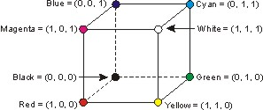

# 3.5.3 CIE RGB 色彩空间（CIE 1931 RGB Color Space）

在经过大量对理论的实践探索后，人们发现三维坐标系统无疑是从空间和原理上，最为合适构建色彩模型的描述载体。但传统的 RGB 色彩空间由于没有系统，且存在 **基准波长校准问题** ，并不适用于现代工业。

1931年，为了解决工业体系内颜色描述的模型化， **国际照明委员会（CIE [International Commission on Illumination]）** 进行了对光学三原色色彩空间抽象汇总的工作。

**现在我们所称的 RGB 色彩空间，多指 CIE RGB 色彩空间** 。CIE RGB 色彩空间最为重要的贡献，是在格拉斯曼颜色实验的基础上确定了光谱三刺激值，以 **Red 取 700nm、Green 取 546.1nm、Blue 取 435.8nm** 作为光学三原色波长的基准标定，将人眼可见光谱范围内的所有颜色，依据前文中提到的 **三原色函数（Trichromatic Primaries Functions）** 统一到了模型。

<figure>
   
   <figcaption>
      
图 3.5.3-1 CIE RGB 色彩空间（CIE RGB Color Space）顶点色示意图

   </figcaption>
</figure>

CIE RGB 色彩空间的配色函数直接采用了传统三原色色彩空间的配色函数，唯一不同的只在于三原色的选取：

$$
C_{RGB} =  R \cdot Red_{700} + G \cdot Green_{546.1} + B \cdot Blue_{435.8} = Vector[R, G, B]
$$

因此，CIE RGB 也不可避免的继承了光学三原色色彩空间的 **负色匹配** 问题。

[ref]: References_3.md