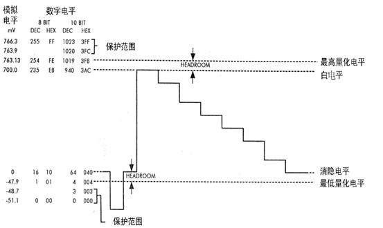
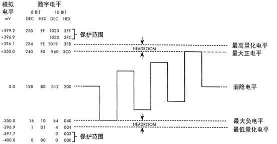
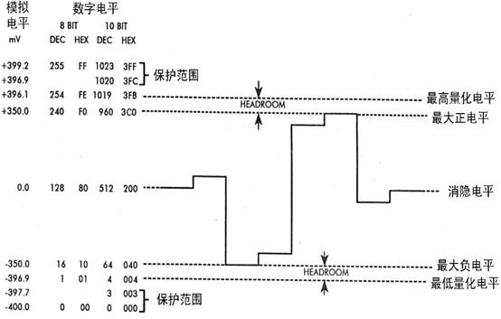
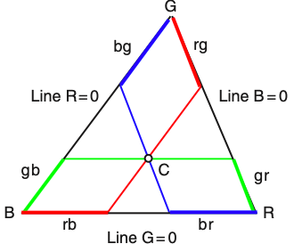
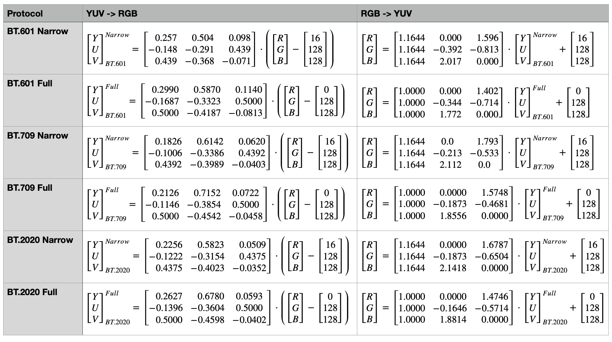
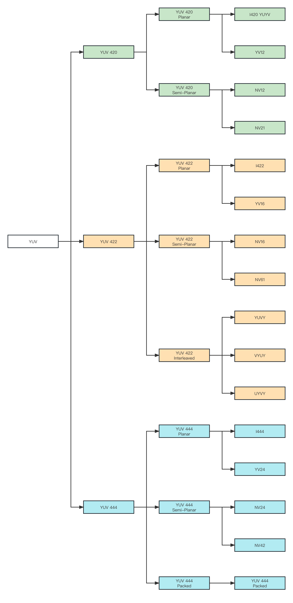
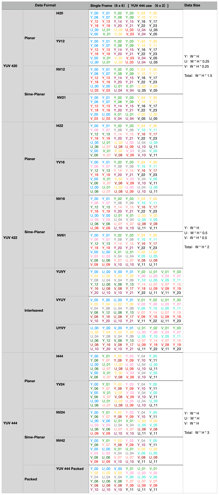

# 3.6.3 YUV 体系色彩格式

**传输格式（Transport Format）** ，即当下我们常用的 YUV 色彩格式也被称为 **YCbCr、YPbPr、Y′UV 色彩格式** 。其中，**Y/Y′ 指代光亮度分量，U/Cb/Pb 指代蓝色色度分量，V/Cr/Pr 指代红色色度分量** 。YUV 色彩格式受启发自，CIE LUV 中用与 xyY 色度图有线性转换关系的 uv 分量表示平面色彩信息的思想，最初被 **国际电信联盟无线电通信部门（ITU-R [International Telecommunication Union Radiocommunication Sector]）** 做为 **彩色图像编解码流水线（Color Image Pipeline）** 的一部分提出，用来 **对图片进行压缩传输** 。

在之前的讨论中我们知道，CIE LUV 在指定白点情况下，可以直接将其所含色彩经由线性变换转换到 CIE XYZ 色彩空间，再从 CIE XYZ 依托固定转换矩阵，变换到 CIE RGB 色彩空间。将两个过程进行合并可知，存在从 LUV 到 RGB 的固定转换矩阵。因此，做为 CIE LUV 思路衍生下的实践产物，YUV 同样也具有这一特点。不同于 LUV 设备无关，YUV 是设备相关的。其受限于外部因素，对整体色度平面的处理上有一定程度的调整，使 YUV 根据采用规格的不同，有着不同的设备相关化调参。不过设备相关化处理带来的弊端，就是 YUV 相较于 LUV 来说色差变换更为不均匀。

当前 **YUV 的常用规格** 有三种：**BT.601、BT.709、BT.2020** 。其中，BT.601 最早于 1982 年提出，最新一次修订于 2011年，适用于 **标准画质电视（SDTV [Standard Definition Television]）** [\[46\]][ref] 。BT.709 最早于 1990 年提出，最新一次修订于 2015年，适用于 **高清画质电视（HDTV [High Definition Television]）** [\[47\]][ref] 。BT.2020 最早于 2012 年提出，最新一次修订于 2015年，适用于 **超高清画质电视（UHDTV [Ultra-High Definition Television]）** [\[48\]][ref] 。

YUV 是目前唯一做到了工程意义上打通图像数据压缩、传输和存储的色彩格式。为了便于说明，我们这里假设 Y、U、V 通道皆以当下主流的 8-bit 形式存放数据。 

## **YUV 的数字电信号特征**

YUV 被设计的目的主要就是为了进行数据传输，而数据传输就意味着数模信号转换。所以，根据可用电信号区间，YUV 存在两种有效范围：**狭隘区间（Narrow Range）、完整区间（Full Range）** 。

- **狭隘区间** 中，Y通道取值范围为 $$[16,\ 235]$$ ，U、V通道取值范围为 $$[16,\ 240]$$ ；
- **完整区间** 中，Y、U、V通道取值范围均为 $$[0,\ 255]$$ ；

**大多数应用场景下，YUV 都以狭隘范围表示** ，究其原因是由电讯号传输特性决定的。在广播电视系统中，为了防止过高和过低的信号造成 **临界电平过载（Critical Level Overload）** 现象，会人为的在信号可用模拟电平区段上，预留出一定的 **“保护带”，保护最高位和最低位的电平不被使用** 。为了便于指代，电气学上把“保护带”称为 **保护范围（Protection Range）**，被保护的最高位和最低位电平称为 **保护电平（Protection Level）** ，用于指代零信号量的电平被称为 **消隐电平（Blanking Level）** ，可用电平区段的上边界称为 **白电平（White Level）** ，下边界称为 **黑电平（Black Level）** ，黑白电平之间就是 **信号电平（Signal Level）** 了。

对于 8-bit 传输信号来说，保护电平为 $$0 \ mV$$ 和 $$255 \ mV$$ 。Y通道取 $$16 \ mV$$ 为消隐电平，可用电平区间上下分别预留了 $$[236,\ 254]$$ 和 $$[1,\ 15]$$ 的保护范围；U、V 通道则以 $$128 \ mV$$ 为消隐电平，可用电平区间上下分别预留了 $$[241,\ 254]$$ 和 $$[1,\ 15]$$ 的保护电平。所有可用的信号电平，分别组成了 Y、U、V 三通道取值范围的狭隘区间。

<figure>
   
   <figcaption>
      
图 3.6.3-1 YUV Y通道信号电平分配图 <a href="References_3.md">[49]</a>

   </figcaption>
</figure>

<figure>
   
   <figcaption>
      
图 3.6.3-2 YUV U通道信号电平分配图 <a href="References_3.md">[49]</a>

   </figcaption>
</figure>

<figure>
   
   <figcaption>
      
图 3.6.3-3 YUV V通道信号电平分配图 <a href="References_3.md">[49]</a>

   </figcaption>
</figure>

**对于不需要进行数据传输的场景，就不再需要保护电平了。** 此时 8-bit 信号电平可以取用到 $$[0,\ 255]$$ 的完整范围表示。

解释清楚信号范围划分，接下来就该说明 ITU 对于 YUV 色彩格式下的 RGB YUV 颜色互转的定义了。**在 YUV 和 RGB 的转换上，狭隘范围（Narrow）和完整范围（Full）并不影响推算，仅影响最终的转换矩阵结果。**

## **YUV 与 RGB 间的相互转换**

从工程角度出发，YUV 需要尽可能简单的处理过程。所以，YUV 在采用 LUV 转换思路的基础上结合了 HSL 的坐标处理思想，以 XYZ 坐标系下 xyY 色度图所在平面，截取色域三角形有效范围构建质心坐标的形式，进行了 YUV 色彩格式的格式空间关键要素定义。

不同于 LUV 和 HSL，YUV 并没有对完整的可见光色域进行拓扑变换，而是需要 **手动设定 RGB 三原色的代表点和质心** ，来确定围成的色域范围和坐标系。因此，YUV 的色彩空间天然就是有缺陷的。不过，放弃完整色域换来了 YUV 足够通用的方法论。**后续规格上的更新，只用按照工程测定结果来进行色域范围的调整，就能延续同一套计算过程满足新的需求。** 这种可根据情况修整的延展性，也是 YUV 被广泛运用的原因之一。

那么，**在 YUV 中 RGB 三原色的选取是否就是完全随意的呢？** 答案是否定的。

RGB 三原色代表点的选取，完全依赖于设备本身对三原色的设定。即，设备的 RGB 色彩格式的格式空间决定了设备的三原色。由于不同的设备间差异可能非常大，想要使 YUV 格式通用，就必须在 YUV 体系的色彩格式规格制定时，固定做为标准的 RGB 三色坐标，通过自身格式空间的线性特征，来抹平不同设备间的转换误差。

我们假设 YUV 格式空间中，用于参照的 R点取自 xyY 色度图中坐标 $$R(x_R,\ y_R)$$ ，G点取自 xyY 色度图中坐标 $$G(x_G,\ y_G)$$ ，B点取自 xyY 色度图中坐标 $$B(x_B,\ y_B)$$ 。有下图：

<figure>
   
   <figcaption>
      
图 3.6.3-4 YUV 格式空间在 xyY 色度图上的色域裁剪说明

   </figcaption>
</figure>

根据图示可知，落于 RGB 围成三角形范围内的任意点 $$C$$ ，与三角形顶点存在关系：

$$
{\displaystyle 
 \begin{aligned}
   &C = B + (gB + rB) = R + (bR + gR) = G + (bG + rG)   
     &\Rightarrow \\
   &C - G = b \cdot (B - G) +  r \cdot (R - G) 
 \end{aligned}
}
$$

取质心 $$W$$ 为轴心。指定 YUV 色彩空间下 $$Y + U + V = 1$$ ，选择 $$U = C_b \cdot (B - W)$$ 、 $$V = C_r \cdot (R - W)$$ 为坐标轴， $$C_b$$ 、 $$C_r$$ 为归一化因子。有 $$Y$$ 有效区间为 $$[0,\ 1]$$ ， $$U$$ 有效区间为 $$[-U_{max},\ U_{max}]$$ ， $$V$$ 有效区间为 $$[-V_{max},\ V_{max}]$$ 。

这里以 YUV 对应规格选定的 RGB 三色电信号，经过 **电位差伽马预矫正（Gamma pre-corrected）** 得到的归一化电平测量值 $$(W_R \ , W_G \ , W_B )$$ 为依据 [\[46\]][ref] [\[47\]][ref] [\[48\]][ref] ，取 YUV 光亮度参数有线性公式 $$Y = W_R \cdot R + W_G \cdot G + W_B \cdot B$$ 。则由点 $$C$$ 与质心 $$W$$ 的向量差 $$C - W = (C -G)-(W-G)$$ 推得：

$$
{\displaystyle 
 \begin{aligned}
   Y &= W_R \cdot R + W_G \cdot G + W_B \cdot B \\
   U &= {\tfrac {U_{max}} {1 - W_B}} \cdot (B - Y)  \\
   V &= {\tfrac {V_{max}} {1 - W_R}} \cdot (R - Y)  \\
 \end{aligned}
}
$$

上式即为 **YUV 格式空间的狭义配色函数** 。需要注意的是，测量值 $$(W_R \ , W_G \ , W_B )$$ 是规格强相关的。其取值仅取决于规格中指定的 RGB 三色对应电信号电配比。

根据 RGB 与 YUV 归一化后 $$Y + U + V = R + G + B = 1$$ 的数理特征，很容易就能证明 YUV 和 RGB 的线性等价关系：

$$
{\displaystyle 
 \begin{aligned}
   Y + U + V &= R + G + B = 1   \\
             &= {\tfrac {1}{W_G}}\left( W_G \cdot R + W_G \cdot G + W_G \cdot B  \right)  \\
             &= {\tfrac {1}{W_G}}\left( Y + (W_G - W_R) \cdot G + (W_G - W_B) \cdot B  \right)   \\
             &=3Y + {\tfrac {W_G - W_R}{W_G}} \cdot (R - Y) +  {\tfrac {W_G - W_B}{W_G}} \cdot (B - Y)  \\
             &=3Y + {\tfrac {W_G - W_R}{W_G}} \cdot {\tfrac {1 - W_R}{V_{max}} \cdot V}  + {\tfrac {W_G - W_B}{W_G}} \cdot {\tfrac {1 - W_B}{U_{max}} \cdot U}  \\
   R + G + B &=\left( Y + {\tfrac {1 - W_R}{V_{max}} \cdot V}  \right) + \left( Y + {\tfrac {W_R}{W_G}} \cdot {\tfrac {1 - W_R}{V_{max}} \cdot V}  + {\tfrac {W_B}{W_G}} \cdot {\tfrac {1 - W_B}{U_{max}} \cdot U}  \right) + \left( Y + {\tfrac {1 - W_B}{U_{max}} \cdot U}  \right) 
 \end{aligned}
}
$$

线性的变化关系对 YUV 相当重要，**这意味着上式可直接以转换矩阵 $$M_{RGB2YUV}$$ 表示** ，有：

$$
C_{RGB} = {M_{RGB2YUV}}^{-1} \cdot C_{YUV} = {M_{RGB2YUV}}^{-1} \cdot M_{RGB2YUV} \cdot C_{RGB} = E \cdot C_{RGB}
$$

这一点保证了不论何种设备，设备间经过 YUV 色彩格式传递的 RGB 数据，**在转换前后都有一致的值** ，维护了数据的准确性。

现在，理论基础得到了佐证。在此条件下，如果已经测得关键参数值，怎样计算转换矩阵 $$M_{RGB2YUV}$$ 呢？

以 **BT.601 的狭隘区间（Narrow Range）** 为例。规格中取 D65 作为白点和质心 $$W$$ ，测得 $$(W_R \ , W_G \ , W_B )$$ 为 $$(0.299, \ 0.587, \ 0.114)$$ 。经过值域范围平移后，带入狭义配色函数计算，有：

$$
{\displaystyle 
 \begin{aligned}
   (Y-16)  \cdot 255 &= (+0.299 \cdot R + 0.587 \cdot G + 0.114 \cdot B) \cdot (235 - 16) \\
   (U-128)  \cdot 255 &= (-0.299 \cdot R - 0.587 \cdot G + 0.886 \cdot B) \cdot (235 - 16) \\
   (V-128)  \cdot 255 &= (+0.701 \cdot R - 0.587 \cdot G - 0.114 \cdot B) \cdot (235 - 16) 
 \end{aligned}
}
$$

换算一下就能得到 $$M_{RGB2YUV}$$ 的表达式：

$$
{\begin{bmatrix} Y \\ U \\ V \end{bmatrix}}_{BT.601}^{Narrow}= 
{\begin{bmatrix} 
   0.257     &    0.504     &   0.098    \\
  -0.148     &   -0.291     &   0.439    \\
   0.439     &   -0.368     &  -0.071    
\end{bmatrix}}
\cdot
\left(
  {\begin{bmatrix} R \\ G \\ B \end{bmatrix}} - 
  {\begin{bmatrix} 16 \\ 128 \\ 128 \end{bmatrix}}
\right)
$$

可见，转换矩阵 $$M_{RGB2YUV}$$ 的计算结果，只依赖于规格条件所指定的 $$(W_R \ , W_G \ , W_B )$$ 测定值和 YUV 的取值范围。

其他规格下的计算方式也是一样，并无差异。这里列出 **常用的主流规格带入公式后的结果** ，方便工程参考：

<figure>
   
   <figcaption>
      
图 3.6.3-5 YUV 常用规格转换矩阵表

   </figcaption>
</figure>

>关于 YUV 色彩格式的格式空间部分，到这里就说明完毕。接下来我们来看组成 YUV 色彩格式的数据存储部分。

## **YUV 的数据存储**
目前主流的 YUV 色彩格式的 **存储格式族（Data Format Family）** 主要有三种，分别是 **YUV420、YUV422、YUV444** 。
- **YUV420 族** 下的存储格式，以 4个Y通道分量共用一组UV分量构成（YYYY U V）；
- **YUV422 族** 下的存储格式，以 2个Y通道分量共用一组UV分量构成（YY U V）；
- **YUV444 族** 下的存储格式，三通道分量一一对应（Y U V）；

而每一种 YUV 存储格式族，根据 Y通道、U通道、V通道的数据排布，又可以分为：**平面（Planar）、半平面（Semi-Planar）、夹层（Interleaved）、打包（Packed）** 四种存储的 **数据分组类型**。

- **平面（Planar）** 类型，Y、U、V 数据独立存放；
- **半平面（Semi-Planar）** 类型，Y通道数据独立存放，UV通道数据交替打包存放；
- **夹层（Interleaved）** 类型，三通道数据以两个Y与一组UV为数据组，封包排列存放；
- **打包（Packed）** 类型，三通道数据以一组YUV为数据组，封包排列存放；

因此，整个 YUV 的存储格式从属关系如下图所示：

<figure>
   
   <figcaption>
      
图 3.6.3-5 YUV 存储格式（Data Format）谱系图

   </figcaption>
</figure>

这些 YUV 存储格式最大的特点在于数据组成上。我们用相同颜色表示位于同一组的 YUV 数据。 **假设存在一张包含 36 个像素点的 6x6 的图片（为了避免颜色重复，YUV444 用 12个像素点的 6x2 图片）。** 以 Y、U、V 分别代表对应通道的有效数据，所有存储格式数据排布如下：

<figure>
   
   <figcaption>
      
图 3.6.3-6 YUV 存储格式（Data Format）对比说明

   </figcaption>
</figure>

显然，从数据的压缩程度上来说，YUV420 族明显具有较高的压缩比。但由于YUV 格式并不是完全无损的，与之相对的问题就是高压缩比导致的图片细节损失。不过图片的细部信息大都存在于灰度图上，而这部分信息主要由 Y 通道保存，因此人眼难以察觉丢失的颜色细节。相比较高压缩比带来的优势，这部分损失可以忽略不计。所以，在音视频数据传输及图像存储中，工程上常常采用 YUV420 族下的色彩格式进行保存。

 
 

>至此，有关音视频工程中的图片色彩处理部分，基本讲解完毕。下一章我们将利用目前已掌握的音视频知识，来做针对一段音频和一张图片基本分析的工程实践。

[ref]: References_3.md