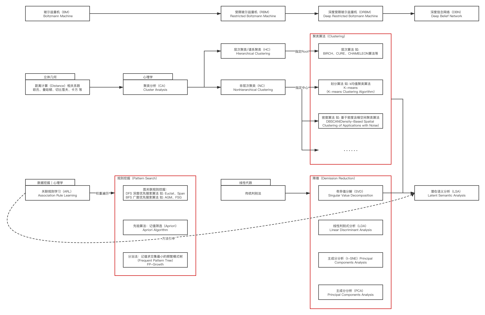

# 4.1 发展概览

**机器学习（ML）** 传统意义上的方法，可以大致分为两类：**有监督学习（Supervised Learning）** 和 **无监督学习（Unsupervised learning）**。

在 1946～2006 年期间，两种类型因为各自侧重领域存在区分，基本是同步并行发展的。有监督学习（Supervised Learning）经常被用来做一些拥有较为充足数据和标注的样本集的分类、预测工作。而无监督学习（Unsupervised learning）则更多的被用于数据重建，或简单二元分类应用上。直到 2006 年 **杰弗里·辛顿（Geoffrey Hinton，1947～Present）** 和 **拉斯·萨拉胡迪诺夫（Russ Salakhutdinov）** 提出了RBM 的快速学习算法 [\[1\]][ref]，并在 2008 年由 **雨果·拉罗谢尔（Hugo Larochelle）** 和 **约书亚·本吉奥（Yoshua Bengio，1964～Present）** 实现多层 RBM 节点组成的深度信念网络（DBN）半监督分类 [\[2\]][ref] 后，无监督学习才逐渐被更多人所知。

## **有监督学习（Supervised Learning）**

**有监督学习（Supervised Learning）** 指的是，在迭代中需要人为调参裁剪的 机器学习（ML）过程。即，从标签化训练数据集中推断出函数的机器学习任务。每一个样本集中的训练数据，都是由输入参数和预期结果组合而成。这其中，预期结果也被称为监督信号。常见的有监督学习如：支持向量机（SVM）、线性回归（Linear Regression）、逻辑回归（Logistic Regression）、朴素贝叶斯（NBM）、决策树（DT）、K-临近（K-Nearest）、深度信念网络（DBN）。

<figure>
   
    <figcaption>
      
图 4.1-1 经典有监督学习关联图谱

   </figcaption>
</figure>

## **无监督学习（Unsupervised Learning）**

**无监督学习（Unsupervised Learning）** 指的是，在迭代中不需要人为干预的 机器学习（ML）过程。即，根据未标签的训练数据进行函数推断的机器学习任务。每一个样本集中的训练数据，**仅由** 输入的样本参数组成。无人工标注和对应输入的预期结果标记。

无监督学习主要分为两大类：**确定型** 和 **概率型**，不过也有 **将概率型做为无监督学习**，而 **确定型归类为半监督（SSL [Semi-Supervised Learning]）的分类方式**。这种分类方式的原因主要是因为，确定型的代表主要是 **自编码器（Auto Encoder）**，而自编码器在实际运行过程中，并不是完全不需要人为调参的。自编码器虽然不需要启动时进行样本标记，但是需要对解码后的结果进行对比筛选，因此也被学术界认为并不是完全的无监督。	

**确定型无监督学习**，主要进行数据的复原、重现、重构等操作，无法进行数据分类。因此这种类型目前主要指代自编码器（Auto Encoder）及其改进算法，其目标主要是能够从抽象后的数据中尽量无损地恢复原有数据。自编码器（Auto Encoder）类型最大的特点就是：

1. 数据相关（Data-Specific），只能用于训练集类似数据的编解码。
2. 数据有损（Data-Degradation），解码后的输出与编码前的输入相比是退化的。
3. 定制自动化（Customized Automation），根据指定类型输入，训练特定的自编码器，而不需要完成任何新工作。

**概率型无监督学习**，主要根据概率情况推算分类、结果状态。这种类型代表就是受限波尔兹曼机（RBM）及其改进算法（rRBM等）或延伸（DBN等），其目标主要是使受限玻尔兹曼机达到稳定状态时原数据出现的概率最大。从基础上来讲，属于贝叶斯学派的观点。

<figure>
   
    <figcaption>
      
图 4.1-2 经典无监督学习关联图谱

   </figcaption>
</figure>

## **深度学习（Deep Learning）的崛起**

前文中我们提到了 2008 年基于 DBN 的半监督分类带给了业界极大的启发。从这一刻开始，深度学习的前置科技已经准备就绪。而传统的分类方式，显然已经 **不足以描述** 未来可能的发展趋势了。

2011 年 **吴恩达（Andrew Ng，1976～Present）** 等学者发表了《有关单层神经网络的无监督特征学习》[\[3]][ref] ，首次将受限波尔兹曼机（RBM）应用于无监督特征学习（Unsupervised Feature Learning）。论文通过简单的算法，实现了当时在 CIFAR-10 数据集（Acc: 79.6％） 和 NORB 数据集（Acc: 97.2％） 上最高的准确度，引起了剧烈反响。大家开始思考，是否能够通过更深层的网络结构，配合强大算力与过去积累的算法，来构造一种能够自主特征提取（Features self-extracting）的人工神经网络（ANNs [Artificial Neural Networks]）模型。从而实现从单一模式识别到高层抽象的过渡 [\[4]][ref] （ 2013 年前，此类多数还停留在，用于做复杂多模式识别的应用领域），进一步推进人工智能（AI [Artificial Intelligence]）发展。受此启发，大家开始尝试与其他领域概念结合，从而解决过去备受困扰的难题。

2012 年由 Hinton 学生 **埃里克斯·克里热夫斯基（Alex Krizhevsky）** 发表的 AlexNet [\[5]][ref] 无疑为人们的信心打上了有力的兴奋剂。AlexNet 在 ImageNet LSVRC-2012 训练集上以 top-5 error 15.3% 和高达 78.1% 的识别率展示了深度学习在目标分类领域强大的潜力。要知道当年第二名的 top-5 error 仅为 26.2%，差距高达 10.9%。

AlexNet 的关键之处，就在于它将 LeNet [\[6]][ref] 逐步完善的 **卷积神经网络（CNN [Convolutional Neural Network]）** 的基本框架和操作单元概念，与深度信念网络（DBF）中由RBM单元构成的计算单元设计理念进行了结合，并引入了由生物学侧抑制概念衍生的 **局部响应归一化（LRN [Local Response Normalization]）** 来构建了整个网络模型。证明了深度学习的正确性，和手段的多样性。这为随后深度学习概念的分类及发展，有着 **承上启下** 的作用。

AlexNet 的出现，将深度学习送上了高速发展的快车道。深度学习开始做为一种有效的训练方法而逐渐登上历史舞台，而与之相关的各种其他领域方向也被送上了副驾驶。
综合以往技术与深度学习近年来的发展过程，我们有了如下的脉络：

<figure>
   
    <figcaption>
      
图 4.1-3 深度学习与传统及相关进展关联图谱

   </figcaption>
</figure>

从图不难看出。时至今日，在深度学习方向上的工业化，逐渐形成以已由 **神经网络框架（backbone）**，配合 **逐层预训练（layer-wise pre-training）** 与 **裁剪（fine-tunning）**，来构筑一类问题的 **批处理解决方案**。当前模型发展也呈现了多元化的态势，在不同领域分支里也出现了更多的针对于领域内问题处理的细分。我们将由此发散而出的一系列模式分析方法统一归类为深度学习的手段，就具体研究内容而言，目前主要涉及如下处理理念：

1. **多层自编码神经网络**，包括：自编码（Auto Encoder，**注意其在实现上区别于 Transformer 的自编码器类型**）、稀疏编码（Sparse Coding）、降噪编码（Stacked Denoising Autoencoders）等单元处理手段；
2. **深度信念网络（DBN）**，由单层或多层RBM构成的神经网络系统；
3. **卷积神经网络（CNN）**，卷积运算的神经网络系统；
4. **循环神经网络（RNN）**，共参循环单元链式递归的神经网络系统；
5. **生成对抗网络（GAN）**，生成 & 判别模型互相博弈的神经网络系统；
6. **自注意力网络（Transformer）**，一种基于自注意力（Self-Attention）和多头注意力（Multi-head Attention）机制的序列到序列（Sequence to Sequence）深度神经网络模型；

**深度神经网络（DNN [Deep Neural Network]）** 可以认为是这一系列方法所包含的神经网络类型的统称。这几种处理方式经常 **交叉混用**，或 **多级组合互相协作**。例如：通过 CNN+GAN 来完成视觉风格迁移，通过多层Transformer 自编码器（Auto Encoder） 实现的用于 NLP 的 BERT 模型。

而随着近年来的进一步发展，传统机器学习几大领域和新兴深度学习之间逐步交叉覆盖，出现了类似于 **深度强化学习（DRL [Deep Reforcement Learning]）** 这样的概念。例如：AlphaGo 和 DQN（Deep Q Networks）就是这一交叉方向的产物。同时，由于研究中发现，日常人所处理的信息是有限的，如果想要达到更贴近日常情况的 ML，那么必须考虑样本量不足的情况。为了解决这部分日益增长的问题，结合现有的DL手段，人们从 2019 年开始逐渐重视小样本学习（Few-Shot Learning）、大语言模型（LLM [Large Language Model]）等领域的发展和探索。未来与之相关领域（如：元学习 Meta-Learning）可以预见将会有更多的注意力倾注。

<figure>
   
    <figcaption>
      
图 4.1-4 深度学习与传统及相关领域关系图（图小圆有重叠部分）

   </figcaption>
</figure>

在这一过程中，一些传统的机器学习技术展现出了新的活力。在部分问题的处理上，通过新老技术结合构建的新型网络，如：ArcFace、DQN 等。相对来说，诸如聚类分析、降维、模式分析、自编码器等，在当下往往都以单元、组件、方法论的方式在新网络中发挥传统的作用。而新一代技术的发展，更多的是在原有的研究基础上演变而来的。这就是我们总能够在新发布的 SOTA 中，看到过去的理念和前人的影子的原因。

即 **事物的发展，总是螺旋上升的**。深度学习是机器学习的手段，最终实现人工智能，或有限度的人工智能，才是目的。

**传统机器学习对音视频方面的帮助，并不算太大。但是深度神经网络却极大的契合了音视频工程特征。**

由于传统音视频，尤其是图像处理，和深度神经网络的技术栈关联性。音视频工程不可避免会大量使用到深度学习技术。想要简单了解深度学习模型是怎么起到作用的，就需要对一些基本概念有清晰的认知。

[ref]: References_4.md