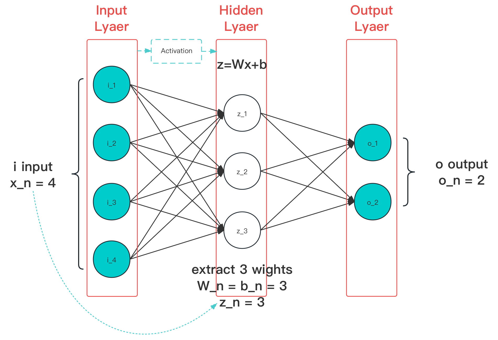

# 4.3 经典激活函数（Classic Activation Function）

**激活函数（Activation Function）** 是一种被设计用来，在模型训练的每个单元数据输入位置，**为输入引入非对称性特征** 的特殊辅助函数。

<figure>
   
    <figcaption>
      
图 4.3-1 激活函数作用阶段（图中蓝色线条）示意图

   </figcaption>
</figure>

从图上可以看出，激活函数主要作用于隐藏层的输入。示例中只有一层隐藏层，因此激活函数作用位置在输入层接收输入数据后，交付到隐藏层的过程中。而对于多个隐藏层情况，前一级的输入也会经激活后才交付给后一级。

如果不采用激活函数，那么我们经过每层神经网络计算后，得到的最终输出都将为线性结果。线性输出实际就是最原始的感知器（Perceptron）。而单纯使用线性函数计算，在实际的处理过程中，对于大多是场景将不能很好的描述其特征。常见的算法问题常常需要引入非线性特性，才能更好的拟合样本。通常，我们通过引入激活函数来给我们设计、使用的神经网络，提供逼近任何非线性场景的能力。

激活函数，基本满足：单一输入输出、单一层处理、可参与训练参数  ，的一类激活函数。其中常用的几类，被称为 **经典激活函数（Classic Activation Function）** 。

**一般的：**

- 当一个激活函数 $$f(x)$$ 满足 $$x \rightarrow +\infty \quad f\prime(x)=0$$ 时，我们称之为 **右饱和** 。 
- 当一个激活函数 $$f(x)$$ 满足 $$x \rightarrow -\infty \quad f\prime(x)=0$$ 时，我们称之为 **左饱和** 。 
- 当一个激活函数，既满足左饱和又满足又饱和时，我们称之为 **饱和** 。
- 对任意的 $$x$$ ，如果存在常数 $$c$$ ，当 $$x > c$$ 时恒有 $$f\prime(x)=0$$ 取值，则称其为 **右硬饱和** 。 
- 对任意的 $$x$$ ，如果存在常数 $$c$$ ，当 $$x < c$$ 时恒有 $$f\prime(x)=0$$ 取值，则称其为 **左硬饱和** 。 
- 若既满足左硬饱和，又满足右硬饱和，则称这种激活函数为 **硬饱和** 。 
- 如果只有在 **极限** 状态下偏导数 $$f\prime(x)=0$$ 的函数，称之为 **软饱和**。

由于激活函数的作用，大多基于同向对比实验的统计结果来进行说明（目前，部分有相关的数理研究佐证，如 ReLU，但仍有争议）。因此，这里仅列出算子的公认已证明特性，和 C 语言实现。

[ref]: References_4.md