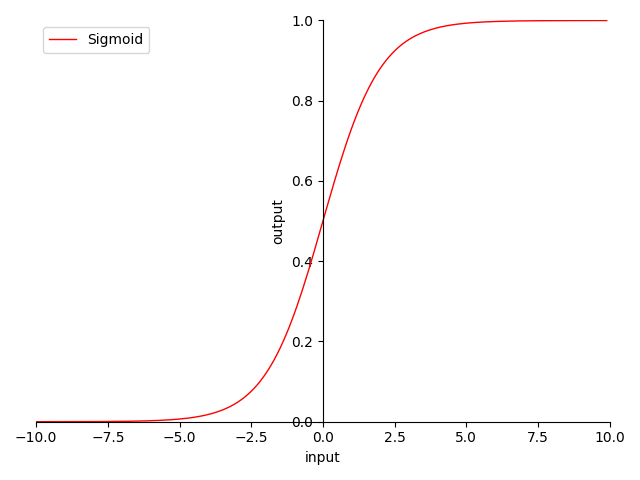

# 4.3.1 Sigmoid

**迭代公式：**

$$
{\displaystyle 
 \begin{aligned}
   \delta(x) = \frac{1}{1+e^{-x}} \\
 \end{aligned}
}
$$

**图像：**

<center>
<figure>
   
    <figcaption>
      <p>图 4-9 Sigmoid 函数图</p>
   </figcaption>
</figure>
</center>

**特性：**

1. 非 0 为中心（non-zero-centered）
2. 输出范围在 $$[0,\ 1]$$ 之间，导数 $$< 0.25$$
3. 输出 $$> 0$$ ，反向传播（BP）权值正向堆积（梯度始终 $$> 0$$）
4. 输入 $$(-\infty,\ -5]$$ 或 $$[+5,\ +\infty)$$ 时，输出近乎无变化，逐层梯度趋  ，更易导致梯度消失
5. 指数计算，较为消耗资源

Sigmoid 激活函数梯度趋近于 0，即软饱和。这会导致BP在该区域部分的导数，无法有效的传递误差至上层（趋 0 失效），导致前层权值无更新，从而无法收敛。且因为 非 0 为中心，使得我们在使用它做激活函数时，需要考虑数据对称（zero-mean data）。

Sigmoid 也可以根据情况，使用其他算法代替，例如（swish、h-swish）。通常在二分问题上采用 Sigmoid 是不错的选择，诸如：是否是某一类、问题对错，即古典逻辑回归（Classical Logical Regression）。

## **Sigmoid 算子化**

利用 C 语言实现对算子的封装，有：

```C
#include <stdio.h>
#include <math.h>

double sigmoid(double x) {
  return 1 / (1 + exp(-x));
}

int main() {
  double x = 0.5;
  double y = sigmoid(x);
  printf("The sigmoid of %f is %f\n", x, y);
  return 0;
}
```

运行验证可得到结果：

```C
The sigmoid of 0.500000 is 0.622459
```

[ref]: References_4.md