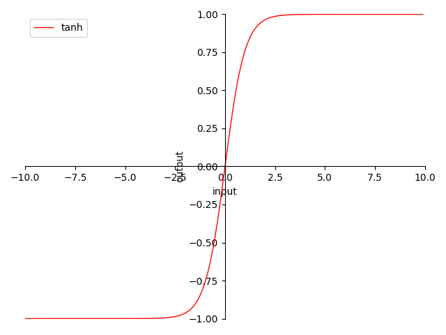

# 4.3.2 Tanh

**迭代公式：**

$$
{\displaystyle 
 \begin{aligned}
   sinh(x) &= \frac{e^x-e^{-x}}{2} \\
   cosh(x) &= \frac{e^x+e^{-x}}{2} \\
   \delta(x) = tanh(x) &= \frac{sinh(x)} {cosh(x)} = \frac{e^x-e^{-x}}{e^x+e^{-x}} \\
 \end{aligned}
}
$$

**图像：**

<center>
<figure>
   
    <figcaption>
      <p>图 4.3.2-1 Tanh 函数图</p>
   </figcaption>
</figure>
</center>

**特性：**

1. 0 为中心（zero-centered）
2. 输出范围在 $$[-1,\ +1]$$ 之间，输出值域对称
3. 当输入在 $$(-\infty,\ -2.5]$$ 或 $$(-\infty,\ -2.5]$$ 时，Tanh也会面临梯度趋 $$0$$ 问题（过饱和问题）
4. 指数计算，较为消耗资源

不难看出 $$Tanh( x ) =  2 \cdot Sigmoid( 2x ) - 1$$ 。本质上来讲 Tanh 属于Sigmoid 的一种变体，尝试通过平移拉伸变换，来解决 Sigmoid 的非原点对称问题。虽然能够处理梯度堆积带来的影响，但是 tanh 同样不能处理相较于堆积更为严重的梯度消失问题。这也是饱和类激活函数的通病。

## **Tanh 算子化**

利用 C 语言实现对算子的封装，有：

```C
#include <stdio.h>
#include <math.h>

double tanh(double x) {
  return (exp(x) - exp(-x)) / (exp(x) + exp(-x));
}

int main() {
  double x = 0.5;
  double y = tanh(x);
  printf("The tanh of %f is %f\n", x, y);
  return 0;
}
```

运行验证可得到结果：

```C
The tanh of 0.500000 is 0.462117
```


[ref]: References_4.md