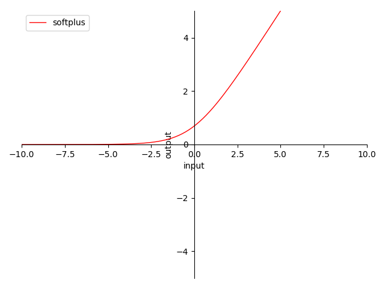

# 4.3.3 Softplus

**迭代公式：**

$$
{\displaystyle 
 \begin{aligned}
   \delta(x) = log(1+e^x) \\
 \end{aligned}
}
$$

**图像：**

<center>
<figure>
   
    <figcaption>
      <p>图 4.3.3-1 Softplus 函数图</p>
   </figcaption>
</figure>
</center>

**特性：**

1. 非 0 为中心（non-zero-centered）
2. 输出范围在 $$[0,\ +\infty)$$ 之间，导数正好为 Sigmoid 
3. 输出 $$\ge 0$$ ，反向传播（BP）权值正向堆积（梯度始终 $$\ge 0$$ ）
4. 当输入在 $$[+5,\ +\infty)$$ 时，梯度趋近常量 $$1$$ ，极大避免梯度消失问题 及 梯度爆炸问题
5. 当输入在 $$(-\infty,\ -5]$$ 时，输出近乎无变化，逐层梯度趋 $$0$$ ，更易导致梯度消失
6. 指数计算，较为消耗资源

Softplus 可以看作是 ReLU 的平滑版，即无穷阶连续可导。但是因为采用了指数运算，且特性在计算机处理可近似相同。因此，常常使用 ReLU 而不是 Softplus。并且实验验证，Softplus 也并不优于 ReLU。

## **Softplus 算子化**

利用 C 语言实现对算子的封装，有：

```C
#include <stdio.h>
#include <math.h>

double softplus(double x) {
  return log(1 + exp(x));
}

int main() {
  double x = 0.5;
  double y = softplus(x);
  printf("The softplus of %f is %f\n", x, y);
  return 0;
}
```

运行验证可得到结果：

```C
The softplus of 0.500000 is 0.648721
```


[ref]: References_4.md