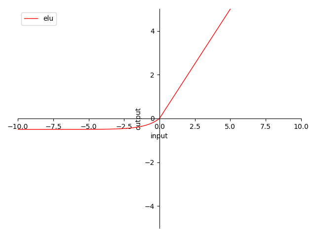

# 4.3.5 ELU & SELU

**迭代公式：**

$$
{\displaystyle 
 \begin{aligned}
   ELU: \ \delta(x) &= 
    \begin{cases}
       x & x \geq 0 \\
       \alpha (e^x-1) & x<0
    \end{cases} \\
   SELU: \ \delta(x) &= \lambda \cdot ELU(x,\ \alpha) \\
 \end{aligned}
}
$$

**图像：**

<center>
<figure>
   
    <figcaption>
      <p>图 4-14 ELU & SELU 函数图</p>
   </figcaption>
</figure>
</center>

**特性：**

1. 0 为中心（zero-centered）
2. 输出范围在 $$(-c,\ +\infty)$$ 之间，称 $$c$$ 为常量乘数
3. 输出值域对称，降低在正向堆积风险
3. 当输入在 $$(0,\ +\infty)$$ 时，梯度为常量 $$1$$ ，完美解决梯度消失问题 及 梯度爆炸问题
4. 当输入在 $$(-\infty,\ 0\ ]$$ 时，梯度以 $$f(x)+c$$ 形式变化，仍然存在梯度消失风险
5. 公式中的 $$\alpha$$ 可取经验值，也可参与迭代
6. 指数计算，较为消耗资源

ELU（2016）被称为 指数线性单元。也是一种为了处理 ReLU 梯度消失问题而提出的激活函数。 ELU 比之 ReLU 其他几种变体，最大的特点就是曲线平滑。而 SELU 则是在原有 ELU 激活函数的基础上，再乘以一个系数（通常取固定常量），即 $$SELU( x ) = \lambda \cdot ELU( x )$$ 。根据原作者 **京特·克兰鲍尔（Günter Klambauer）** 在论文《Self-Normalizing Neural Networks》中的描述 [\[8\]][ref] ，推荐取 $$\lambda = 1.0507009873554804934193349650124$$ 的经验值。

SELU 可使输入经过一定层数处理后，变为固定分布。

## **ELU & SELU 算子化**

利用 C 语言实现对算子的封装，有：

```C
#include <stdio.h>
#include <math.h>

double elu(double x, double alpha) {
  return x >= 0 ? x : alpha * (exp(x) - 1);
}

double selu(double x, double alpha, double lambda) {
  return lambda * (x >= 0 ? x : alpha * (exp(x) - 1));
}

int main() {
  // ELU
  {
    double x = -0.5;
    double alpha = 1.0;
    double y = elu(x, alpha);
    printf("The ELU of %f with alpha=%f is %f\n", x, alpha, y);
  }

  // SELU
  {
    double x = -0.5;
    double alpha = 1.6732632423543772848170429916717;
    double lambda = 1.0507009873554804934193349650124;
    double y = selu(x, alpha, lambda);
    printf("The SELU of %f with alpha=%f and lambda=%f is %f\n", x, alpha,
           lambda, y);
  }

  return 0;
}
```

运行验证可得到结果：

```C
The ELU of -0.500000 with alpha=1.000000 is -0.393469
The SELU of -0.500000 with alpha=1.673263 and lambda=1.050701 is -0.428348
```


[ref]: References_4.md