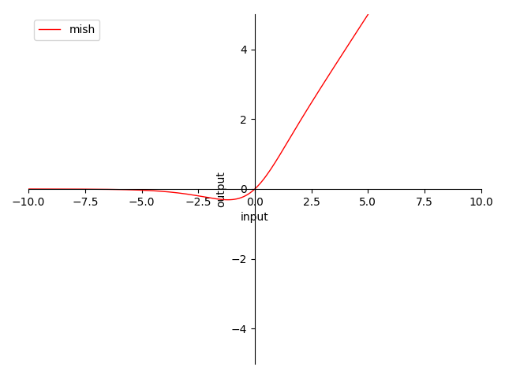

# 4.3.6 Mish

**迭代公式：**

$$
{\displaystyle 
 \begin{aligned}
   \delta(x)_i &= x \cdot tanh(softplus(x)) \\
 \end{aligned}
}
$$
	
即：

$$
{\displaystyle 
 \begin{aligned}
   \delta(x)_i &= x \cdot \frac{e^{ln(1+e^x)}-e^{-ln(1+e^x)}}{e^{ln(1+e^x)}+e^{-ln(1+e^x)}} \\
               &=x \cdot \frac{(1+e^x)^2-1}{(1+e^x)^2+1} \quad \\
               &=x \cdot \frac{2e^x+e^{2x}}{2+2e^x+e^{2x}} \\
               &= \frac{x}{1+\frac{1}{2e^x+e^{2x}}} \qquad \quad \\
 \end{aligned}
}
$$

**图像：**

<center>
<figure>
   
    <figcaption>
      <p>图 4-15 Mish 函数图</p>
   </figcaption>
</figure>
</center>

**特性：**

1. 0 为中心（zero-centered）
2. 输出范围在 $$[\approx 0.278,\ +\infty)$$ 之间，导数近似 $$Switch(x)$$ 但过于复杂
3. 输出值域对称，降低在正向堆积风险，但负向变化慢
4. 当输入在 $$(0,\ +\infty)$$ 时，梯度 $$\ge 0.5$$ 
5. 当输入趋近 $$+\infty$$ 时，近似于 ReLU，梯度趋近 $$1$$ 
6. 当输入趋近 $$-\infty$$ 时，近似于 ReLU，梯度趋近 $$0$$ ，负向过输入大存在梯度消失风险
7. Mish 当 $$\beta \rightarrow +\infty$$ 时，趋近 ReLU
8. 平滑不单调

Mish 是由 **迪甘塔·米斯拉（Diganta Misra）** 在 2019 年提出的，其目的是为了在 Swish 基础上，提供一种更有效的激活函数。就目前而言，Mish 的有效性和性价比其实一直处于讨论中 [\[9\]][ref] 。

不过，**在实验检验下 Mish 并没有那么好用**，其各方面特性都与 Swish 高度相似。而且采用 ImageNet 数据集 + MobileNetV2 + FPN 来做物体识别，从结果上反倒没有直接用 ReLU、或者 Swish 效果好，且 MAdds 激增。

因此，本书作者不建议使用。如果既想要利用函数平滑特性来提高优化函数效率，又不想要增加太多算力消耗的话，建议可以考虑 Swish，或 h-Swish（ReLU-N）。

## **Mish 算子化**

利用 C 语言实现对算子的封装，有：

```C
#include <stdio.h>
#include <math.h>

double mish(double x) {
  return x * tanh(log(1 + exp(x)));
}

int main() {
  double x = 0.5;
  double y = mish(x);
  printf("The mish of %f is %f\n", x, y);
  return 0;
}
```

运行验证可得到结果：

```C
The mish of 0.500000 is 0.462117
```


[ref]: References_4.md