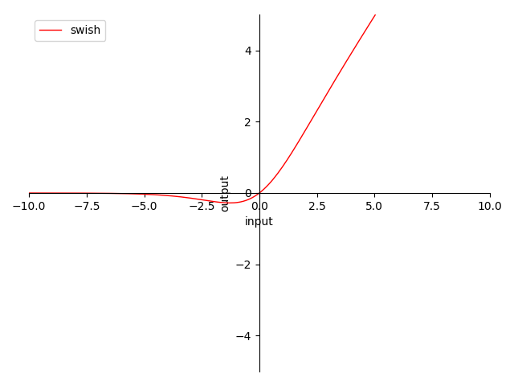
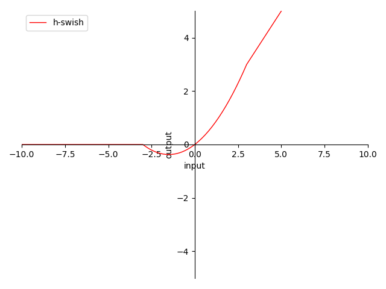

# 4.3.7 Swish

在本节开始时，我们曾提到过可以用 Swish 来代替 Sigmoid 在模型中的作用，以获取平滑非线性特征。那么 Swish 具体是什么样的呢？

## **Swish & Swish-β**

**迭代公式：**

$$
{\displaystyle 
 \begin{aligned}
   \delta(x)_i = x \cdot sigmoid(x)=\frac{x}{1+e^{-x}} \\
 \end{aligned}
}
$$
	
**迭代公式（参与训练动态参数版本，Swish-β ）：**

$$
{\displaystyle 
 \begin{aligned}
   \delta(x)_i = x \cdot sigmoid(\beta x)=\frac{x}{1+e^{-\beta x}} \\
 \end{aligned}
}
$$

**图像：**

<center>
<figure>
   
    <figcaption>
      <p>图 4.3.7-1 Swish 函数图</p>
   </figcaption>
</figure>
</center>

**特性：**

1. 0 为中心（zero-centered）
2. 输出范围在 $$[\approx 0.278,\ +\infty)$$ 之间，导数为 $$swish(x) + sigmoid(x) \cdot  ( 1-swish(x) )$$ 
3. 输出值域对称，降低在正向堆积风险，但负向变化慢
4. 当输入在 $$(0,\ +\infty)$$ 时，梯度 $$\ge 0.5$$ 
5. 当输入趋近 $$+\infty$$ 时，近似于 ReLU，梯度趋近 $$1$$ 
6. 当输入趋近 $$-\infty$$ 时，近似于 ReLU，梯度趋近 $$0$$ ，负向过输入大存在梯度消失风险
6. Swish-β 当 $$\beta \rightarrow +\infty$$ 时，趋近 ReLU 
7. 平滑不单调

Swish 是由谷歌实验室在 2017 年提出的，提出以后其实一直争议不断。Swish 被谷歌认为是一种可以完美替代 ReLU 的简单激活函数，在论文中的演示里，其使用同模型在 Mobile NASNet-A (Zoph et al., 2017) 和 Inception-ResNet-v2 (Szegedy et al., 2017) 数据集上分别带来了0.9% 和 0.6% 的准确度提升 [\[10\]][ref] 。不过业界普遍认为这个是因为数据集完善带来的。

Swish 作为一种平滑函数，它的特性和 SoftPlus 类似，优势都体现在优化函数的连续处理上。另外不单调，也能够提供更灵活的特性变化。兼容算力消耗，Swish-β 也不失为一种良好的选择。否则还是建议使用 ReLU 处理。

## **h-Swish**

**迭代公式：**

$$
{\displaystyle 
 \begin{aligned}
   \delta(x)_i =  x \cdot  h\text{-}sigmoid(x)= x \cdot \frac{ReLU6(x+3)}{6} \\
 \end{aligned}
}
$$

**图像：**

<center>
<figure>
   
    <figcaption>
      <p>图 4.3.7-2 h-Swish 函数图</p>
   </figcaption>
</figure>
</center>

**特性：**

1. 非 0 为中心（non-zero-centered）
2. 输出范围在 $$[ -0.375,\ +\infty)$$ 之间
3. 输出 $$\ge 0$$ ，反向传播（BP）权值正向堆积（梯度始终 $$\ge 0$$ ）
3. 当输入在 $$[ +3,\ +\infty)$$ 时 梯度为 $$1$$ ，完美解决梯度消失问题 及 梯度爆炸问题，等效 ReLU
4. 当输入在 $$(-\infty,\  -3]$$ 时 梯度为 $$0$$ ，面临神经元死亡问题，等效ReLU
5. 当输入在 $$(-3,\  +3)$$ 时 梯度为 $$cx+b$$ ，$$c = \tfrac{1}{6}$$ ，$$b = 0.5$$ ，梯度 $$\ge 0.5$$ 
6. 非指数处理便于计算
7. 非平滑不单调

h-Swish 是由谷歌实验室在 2019 年的 MobileNetV3 中提出的，用于作为两种 MobileNet 关键优化手段中的一种 [\[11\]][ref] 。h 表示 hard。h-Swish 与 Swish 最大的不同就在于，用近似 sigmoid 的 ReLU-6(x+3) / 6 代替了 Sigmoid，也被称为 h-Sigmoid。

h-Swish 保留了 Swish不单调的特性，能够更好的进行非线性特性的引入。但是 h-Swish 也保留了 Swish 的有效范围特性。且因为采用 h-Sigmoid 处理，在样本输入小于 -3，将会导致神经元死亡问题。但是 h-Swish 的优势也同样明显，因为单激活函数最高只用到二次幂，实际运算当中较 Swish 节约了相当的算力。因此，建议根据情况，选择特征缩放处理（或单边限定偏移）后使用。其本身还是很有潜力的新兴激活函数。

需要注意的是，考虑到计算便利性和 Tanh 与 Sigmoid 的函数趋势近似。在工程中，我们 **采用 Tanh 代替原论文的 Sigmoid** 进行 Swish 族的算子化。同理也适用于，采用 **log 代替 h-Sigmoid**。从而简化了计算过程。

## **Swish 族算子化**

利用 C 语言实现对算子的封装，有：

```C
#include <stdio.h>
#include <math.h>

double swish(double x) {
  return x * tanh(x);
}

double swish_beta(double x, double beta) {
  return x * tanh(beta * x);
}

double h_swish(double x) {
  return x * tanh(log(1 + exp(x)));
}

int main() {
  // Swish
  {
    double x = 0.5;
    double y = swish(x);
    printf("The swish of %f is %f\n", x, y);
  }

  // Swish-β
  {
    double x = 0.5;
    double beta = 1.0;
    double y = swish_beta(x, beta);
    printf("The swish-beta of %f with beta=%f is %f\n", x, beta, y);
  }

  // h-Swish
  {
    double x = 0.5;
    double y = h_swish(x);
    printf("The h-swish of %f is %f\n", x, y);
  }

  return 0;
}
```

运行验证可得到结果：

```C
The swish of 0.500000 is 0.462117
The swish-beta of 0.500000 with beta=1.000000 is 0.462117
The h-swish of 0.500000 is 0.462117
```


至此，常用激活函数基本梳理完毕。

其实，常用于中间层的激活函数，往往都是简单激活函数，这样能够在引入非线性特征的同时，相对较小或者几乎不怎么消耗算力资源。而在最终阶段，常常使用复杂的激活函数来做分类器，或结果控制的操作。相对来说，复杂激活函数的使用往往都放在最终阶段的原因，就是因为其过于复杂的特性，能够适应更严格的情况，但也相对更耗费算力资源，无法频繁使用。

至于如何更好的使用激活函数，建议结合激活函数的特性，将输入值进行适当的放缩，例如：如果使用Sigmoid，那么我们可以先行放缩上层输入到 ( -5, 5 ) 的范围内，这样一定程度的避免梯度消失问题。所以，如何根据选用的激活函数，适当的调整上层输入，将会对结果大有裨益。

另外，个人理解 **光滑（smooth）** 函数类型的激活函数，其优势在于 **能够更好的配合优化方法**，而且能够 **解离** 不同分类之间的差异性（连续非离散，差异细化），使得模型具有更好的鲁棒性。但是因为算力上不占优势，建议用在 last stage 部分。
除此之外，非单调性也是近期激活函数新的关注点，业界的研究显示，适当的引入非单调性，能够很好的增强激活函数将源数据，输出为非线性数据的信息保存水平。

综合而言，建议现阶段使用激活函数，优先考虑：ReLU、LReLU、ReLU-N、h-Swish，根据是否需要配合优化算法（利用 smooth 特性），进一步选择是否采用：Softplus、Swish。结合现有硬件水平，适度的考虑含有指数计算的激活函数。


[ref]: References_4.md