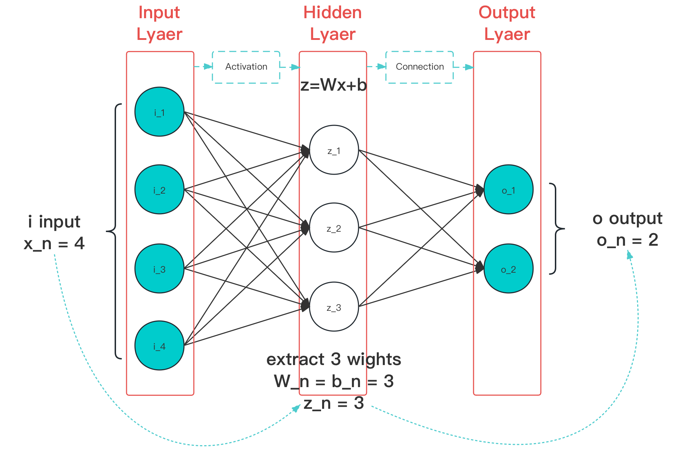

# 4.4 连接函数/衰减函数（Connection/Attenuation Function）

**连接函数（Connection Function）** 是一种被设计用来，在模型训练的每个单元数据输入位置，为输入进行筛选收减的特殊辅助函数。常被用在诸如：**全链接层（Full Connected Layer）** 、 **自注意力层（Self-Attention Layer）** 等 **输出层（Output Layer）** 或 **部分特殊隐藏层（Hidden Layer）** 单元设计中。用来对经过激活（或纯输入）的当前层输入进行 **特征提炼（Feature Extraction）**。由于在当下占据主流的 Transformer 模型中，以自注意力层的注意力衰减机制存在，因而也被称为 **衰减函数（Attenuation Function）**。

<figure>
   
    <figcaption>
      
图 4-18 连接函数作用阶段（图中蓝色线条）示意图

   </figcaption>
</figure>

连接函数，基本满足：单一输入输出、多层参数处理、可参与训练参数 > 1，的特点。其中，较为经典的主要有 3 个，分别是 Dropout 、Maxout 、Softmax 。

由于链接函数作用于层中各节点的串联，因此，为了便于说明。

**统一的：**

多个前置常为向量形式输入，这里我们统一记输入为 $$\vec{x}$$ ，各分量值都以 $$x$$ 代替。
以 $$i$$ 代表对应层输入通道，输入层输入设置为 $$n$$ ，则 $$i$$ 顺序取值 $$[ 1,\ n]$$ 。
以 $$j$$ 代表对应层激活节点，激活层节点设置为 $$k$$ ，则 $$j$$ 顺序取值 $$[ 1,\ k]$$ 。
以 $$W$$ 代表对应层激活节点权重，对应输入 $$i$$ 的激活节点 $$j$$ 的权重就为 $$W_{ij}$$ 。
以 $$b$$ 代表对应层激活节点偏移，对应输入 $$i$$ 的激活节点 $$j$$ 的偏移就为 $$b_{ij}$$ 。
以 $$z$$ 代表对应层计算后值，对应激活节点 $$j$$ 的算后值就为 $$z_j$$ 。
以 $$h_j(x)$$ 代表对应层，各节点计算值 $$z_j$$ 经过函数 $$f(z_j)$$ 处理后输出，对应下一层的输入。

则，未经过链接函数处理前后的网络情况，可以用 **公式表示** 为：

$$
{\displaystyle 
 \begin{aligned}
   z_j &= {w_{ij}}^T \cdot x+b_{ij} \\
   h_j(x) &= f(z)
 \end{aligned}
}
$$

其中，函数 $$f(x)$$ 的选择非常广泛，既可以是一些激活函数，如 ReLU，也可以是链接函数。而链接函数的作用位置往往有一些差异，部分作用于 $$z_j$$ 的计算过程，另一些则直接作用于结果的筛选。介于作用在多个节点范围，我们用 $$\Sigma(\vec{x})$$ 来代指整个 **链接函数生效过程**，它的输出即是下一层（即后一级，如果有）的输入向量。

则，经过链接函数处理前后的网络情况，就可以用公式表示，有：

$$
{\displaystyle 
 \begin{aligned}
   \Sigma(\vec{x}) =\sum h_j(x) 
 \end{aligned}
}
$$

在这些前提下，我们来看这三个经典链接函数。

[ref]: References_4.md