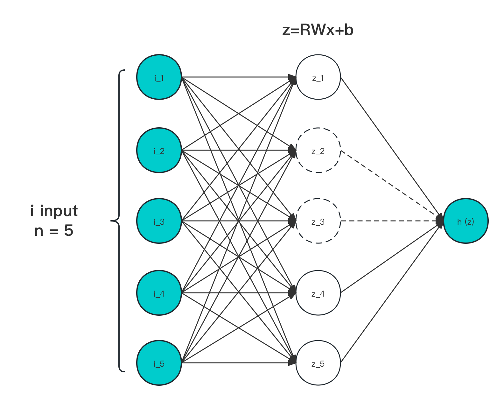

# 4.4.1 Dropout

**迭代公式：**

$$
{\displaystyle 
 \begin{aligned}
   \Sigma(\vec{x}) =\sum h_j(x) \in 
    \begin{cases}
       f(z) &\in Activation \ Function\\
       R_j &= 0 \ \text{or} \ 1 \in Bernoulli(p) \\
       z_j &= R_j \cdot {W_{ij}}^T \cdot x+b_{ij} \\
       h_j(x) &= f\ (z_{ij})
    \end{cases} \\
 \end{aligned}
}
$$

**图像：**

<center>
<figure>
   
    <figcaption>
      <p>图 4.4.2-1 Dropout 输入输出作用示意图</p>
   </figcaption>
</figure>
</center>

**特性：**

1. Dropout 采用了根据采用者需要的任意设定激活函数，来作为 $$f(z_j)$$ 功效
2. Dropout 对每一个激活节点输出 $$z_j$$ 都赋予了根据伯努利分布的随机 $$0$$ 或 $$1$$ 附加筛选值
3. 伯努利分布（Bernoulli Distribution）参数 $$p$$ 的值，越大越容易取 $$1$$ ，越小则易取 $$0$$ 
4. 被证明，当 $$p=0.5$$ 时，能够带来最好的 **类正则效果**
5. 每次触发层计算，伯努利结果 $$R_{ij}$$ 都会根据 $$p$$ 重新获取
6. 变相取平均，能够减少同层内，神经元间的公适性
7. 辅助链接层处理，作用于节点选择，0 丢弃，1 通过

Dropout 是由 Hinton 于 2012 年提出的一种，针对容易过拟合小数据集训练的，过拟合防治手段 [\[11\]][ref] 。其本身通过阻塞当前层计算中的生效节点，来实现对当次参与计算权重的随机过滤，从而降低各个训练参数间的关联性。

这个方法随后就被用在了于同年发表的 AlexNet 上，并随着 AlexNet 飞跃式的高准确度（在发表时间点），一起被人们熟知。而随着后续多篇相关 Dropout 数学特征和统计研究的文献中，证明了 Dropout 不止可以被运用于小样本情况，更是相当有效的正则化和模型鲁棒性处理方式。

直到今日，仍然被运用于大量模型的训练中。

## **Dropout 算子化**

利用 C 语言实现对算子的封装，有：

```C
#include <stdio.h>
#include <stdlib.h>
#include <time.h>

double dropout(double x, double p) {
  if (drand48() < p) {
    return 0;
  } else {
    return x;
  }
}

int main() {
  double x = 0.5;
  double p = 0.5;
  double y_1 = dropout(x, p);
  double y_2 = dropout(x, p);
  printf("The dropout of %f with p=%f is %f\n", x, p, y_1);
  printf("The dropout of %f with p=%f is %f\n", x, p, y_2);
  return 0;
}
```

运行验证可得到结果：

```C
The dropout of 0.500000 with p=0.500000 is 0.000000
The dropout of 0.500000 with p=0.500000 is 1.000000
```

和理论表现一致。


[ref]: References_4.md