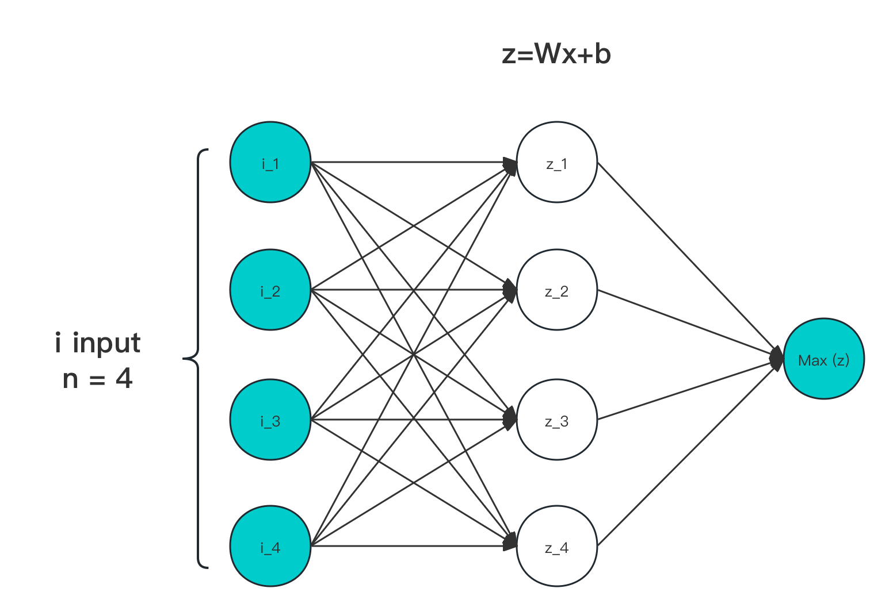
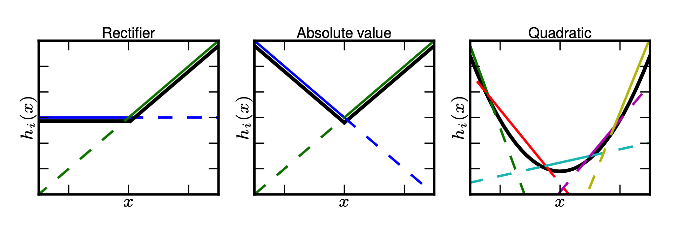

# 4.4.2 Maxout

**迭代公式：**

$$
{\displaystyle 
 \begin{aligned}
   \Sigma(\vec{x}) =\sum h_j(x) \in 
    \begin{cases}
       z_j &= {W_{ij}}^T \cdot x+b_{ij} \\
       h_j(x) &= \max_{j \in [1, k]}\ (z_j)
    \end{cases} \\
 \end{aligned}
}
$$

**图像：**

<center>
<figure>
   
    <figcaption>
      <p>图 4-20 Maxout 输入输出作用示意图</p>
   </figcaption>
</figure>
</center>

**特性：**

1. Maxout 对输入，走激活层进行线性处理，一个节点即一次线性拟合，参数激增 ≥ k 倍
2. 最终是由经由激活层映射后的数据，计算 Max 取极大值
3. 本身不面对梯度消失导致和梯度爆炸问题
4. 适合配套 Dropout ，作为后级或位于同层一起使用
5. 无法用于求导，Maxout 不可微
6. 整体处理线性，且非饱和

在 Goodfellow 提出的 Maxout Networks 中指出 Dropout 在层数更多的框架中，能有更好的性能 [\[13\]][ref] 。因此，应该有与之匹配的激活函数，来以一种通用的手段将原有模型抽象非线性特征过程，进行层化处理。

Maxout 的设计目的，就是为了更好的使用 Hinton 提出的 Dropout 的性能，提供此类操作。其需要学习的参数就是k个神经元中的权值和偏置，这就相当于常规的激活函数一层，而 Maxout 是两层，而且参数个数增加了 K 倍。

Maxout 能够有效的原理是，任何 ReLU 及其变体等激活函数都可以看成分段的线性函数，而 Maxout 加入的一层神经元正是一个可以学习参数的分段线性函数。所以，理论是可以拟合（无限分割）所有凸函数的。

如下图展示的 k 为 1、2、4 时的情况：

<center>
<figure>
   
    <figcaption>
      <p>图 4-21 Maxout 凸函数拟合示意图<a href="References_4.md">[13]</a></p>
   </figcaption>
</figure>
</center>

但是，由于 Maxout 会导致参数激增，从而造成运算量增加，因此不常使用。且由于本身的 **不可微** 特性，大部分情况下 Maxout **仅能** 被用于末尾层中，来对此时已经经过提炼，参数相对较少的特征，进行连接拟合。

## **Maxout 算子化**

利用 C 语言实现对算子的封装，有：

```C
#include <stdio.h>
#include <stdlib.h>

double maxout(double *x, int size) {
  double max_value = x[0];
  for (int i = 1; i < size; i++) {
    if (x[i] > max_value) {
      max_value = x[i];
    }
  }
  return max_value;
}

int main() {
  int size = 3;
  double vecx[] = {0.5, 0.75, 1.0};
  double w = maxout(vecx, size);
  printf("The maxout of the input vector is %f\n", w);
  return 0;
}
```

运行验证可得到结果：

```C
The maxout of the input vector is 1.000000
```

和理论表现一致。


[ref]: References_4.md