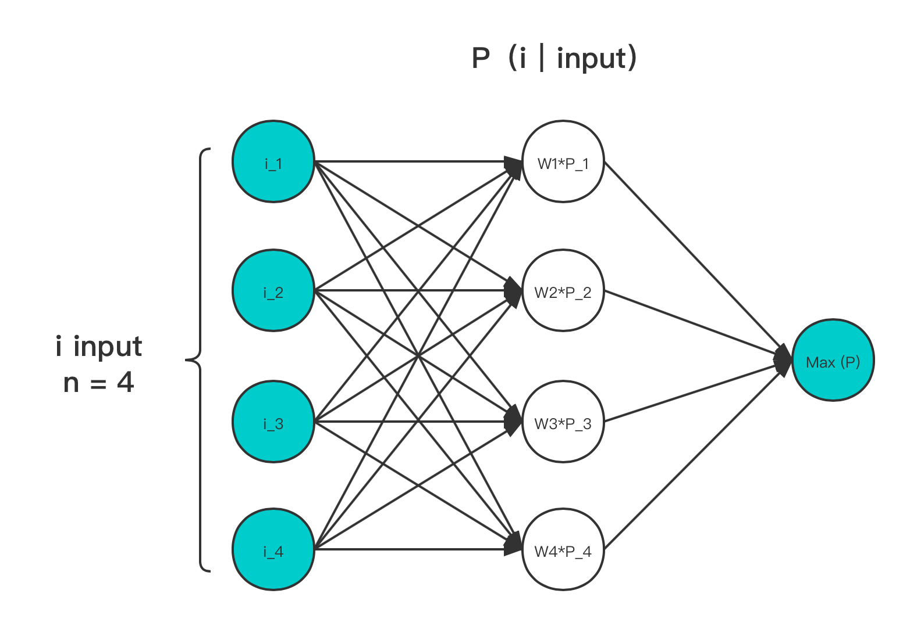

# 4.4.3 Softmax

**迭代公式：**

$$
{\displaystyle 
 \begin{aligned}
   \Sigma(\vec{x}) =\sum h_j(x) \in 
    \begin{cases}
       z_j &= {W_{ij}}^T \cdot x+b_{ij} \\
       h_j(x) &= \frac{e^{z_j}}{\sum{e^{z_j}}}
    \end{cases} \\
 \end{aligned}
}
$$

**迭代公式（ log 版本，log-Softmax）：**

$$
{\displaystyle 
 \begin{aligned}
   \Sigma(\vec{x}) =\sum h_j(x) \in 
    \begin{cases}
       z_j &= {W_{ij}}^T \cdot x+b_{ij} \\
       h_j(x) &= log(\frac{e^{z_j}}{\sum{e^{z_j}}})=z_j-log(\sum_{j=1}^k{e^{z_j}})   
    \end{cases} \\
 \end{aligned}
}
$$

**迭代公式（ stable 版本，stable-Softmax）：**

$$
{\displaystyle 
 \begin{aligned}
   \Sigma(\vec{x}) =\sum h_j(x) \in 
    \begin{cases}
       z_j &= {W_{ij}}^T \cdot x+b_{ij} \\
       D &= log(C)=-max(z_1, z_2,...,z_k) \\
       h_j(x) &= \frac{C\cdot e^{z_j}}{C\cdot \sum{e^{z_j}}} = \frac{e^{z_j+log(C)}}{\sum {e^{z_j+log(C)}}}=\frac{e^{z_j+D}}{\sum {e^{z_j+D}}} 
    \end{cases} \\
 \end{aligned}
}
$$

**迭代公式（ stable-log 结合版本，stable-log-Softmax）：**

$$
{\displaystyle 
 \begin{aligned}
   \Sigma(\vec{x}) =\sum h_j(x) \in 
    \begin{cases}
       z_j &= {W_{ij}}^T \cdot x+b_{ij} \\
       D &= log(C)=-max(z_1, z_2,...,z_k) \\
       h_j(x) &= log(\frac{C\cdot e^{z_j}}{C\cdot \sum{e^{z_j}}}) = (z_j-D)-log(\sum_{j=1}^k{e^{(z_j-D)}})  
    \end{cases} \\
 \end{aligned}
}
$$

**图像：**

<center>
<figure>
   
    <figcaption>
      <p>图 4-22 Softmax 输入输出作用示意图</p>
   </figcaption>
</figure>
</center>

**特性：**

1. Softmax 能够起到归一化作用，将输入变换到输出范围在 [ 0, 1 ] 之间
2. 输出满足概率累和为 1
3. 求最大值过程非稀疏化
4. 只增加了一层用于概率映射的隐藏层，增加了 input 个参数
5. Softmax 存在大指数输入导致的数值稳定性问题
6. log-Softmax 少了除法，相对数值更加稳定
7. stable-Softmax 对指数做了差值限定，但因为除法，可能会导致除零问题
8. stable-log-Softmax 有 stable 和 log 两者的优点，且无除零问题，但略微增加消耗

Softmax 常用于多目标分类、目标预测、NLP领域。能够将数字特征映射到概率范围内。常用在全联接层后，并配合 Cross-Entropy 损失函数使用。

目前 Softmax 的多种变体中，被使用最多的还是 stable-log-Softmax ，且涵盖了 log-Softmax 的相关情况。因此，一般将 stable-log-Softmax 和  log-Softmax ，统一称为  log-Softmax。

Softmax 被广泛使用的原因，还是在于它自带归一化，且能够稳定神经元的功能。这使得用 Softmax 做链接层算子，能够在分类场景上，更快的达到期望结果。是提升训练速率的有效手段。

## **Softmax 算子化**

利用 C 语言实现对算子的封装，有：

```C
#include <math.h>
#include <stdio.h>

double ori_softmax(double *x, int size) {
  double sum = 0;
  for (int i = 0; i < size; i++) {
    sum += exp(x[i]);
  }

  double y = exp(x[0]) / sum;
  for (int i = 1; i < size; i++) {
    y += exp(x[i]) / sum;
  }

  return y;
}

double ori_log_softmax(double *x, int size) {
  double sum = 0;
  for (int i = 0; i < size; i++) {
    sum += exp(x[i]);
  }

  double y = x[0] - log(sum);
  for (int i = 1; i < size; i++) {
    y += x[i] - log(sum);
  }

  return y;
}

double softmax(double *x, int size) {
  double max_value = x[0];
  for (int i = 1; i < size; i++) {
    if (x[i] > max_value) {
      max_value = x[i];
    }
  }

  double sum = 0;
  for (int i = 0; i < size; i++) {
    sum += exp(x[i] - max_value);
  }

  double y = exp(x[0] - max_value) / (sum);
  for (int i = 1; i < size; i++) {
    y += exp(x[i] - max_value) / (sum);
  }

  return y;
}

double log_softmax(double *x, int size) {
  double max_value = x[0];
  for (int i = 1; i < size; i++) {
    if (x[i] > max_value) {
      max_value = x[i];
    }
  }

  double sum = 0;
  for (int i = 0; i < size; i++) {
    sum += exp(x[i] - max_value);
  }

  double y = (x[0] - max_value) - log(sum);
  for (int i = 1; i < size; i++) {
    y += (x[i] - max_value) - log(sum);
  }

  return y;
}

int main() {
  // Softmax
  {
    int size = 3;
    double vecx[] = {0.5, 0.75, 1.0};
    double w = ori_softmax(vecx, size);
    printf("The softmax of the input vector is %f\n", w);
  }

  // log-Softmax
  {
    int size = 3;
    double vecx[] = {0.5, 0.75, 1.0};
    double w = ori_log_softmax(vecx, size);
    printf("The log-softmax of the input vector is %f\n", w);
  }

  // stable-Softmax, which we use most as Softmax
  {
    int size = 3;
    double vecx[] = {0.5, 0.75, 1.0};
    double w = softmax(vecx, size);
    printf("The stable-softmax of the input vector is %f\n", w);
  }

  // log-stable-Softmax, which we use most as log-Softmax
  {
    int size = 3;
    double vecx[] = {0.5, 0.75, 1.0};
    double w = log_softmax(vecx, size);
    printf("The log-stable-softmax of the input vector is %f\n", w);
  }

  return 0;
}
```

运行验证可得到结果：

```C
The softmax of the input vector is 0.244728
The log-softmax of the input vector is -1.401880
The stable-softmax of the input vector is 0.244728
The log-stable-softmax of the input vector is -1.401880
```

和理论表现一致。

当然，连接函数并不只有列出的这三种类型。每年都有大量有关此方面的研究，给出新的样式。但从上我们也能够发现，**若非足够泛化，连接函数鲜有脱离模型而存在的独立类型**。这在上文中列出的 Maxout 与 Dropout、Softmax 的对比中有明显体现。因此，需要在训练中注意这一点。

目前，我们已经掌握了基本的样本提炼手段， 接下来就需要考虑权重迭代了。


[ref]: References_4.md