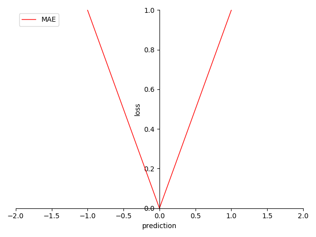

# 4.5.1 回归项-平均绝对误差（MAE [Mean Absolute Error]）

**迭代公式：**

$$
{\displaystyle 
 \begin{aligned}
   Loss = \frac{1}{N} \sum_{i = 1}^{N}|y_i-prediction_i| \\
 \end{aligned}
}
$$

**图像：**

<center>
<figure>
   
    <figcaption>
      <p>图 4-24 MAE 函数图</p>
   </figcaption>
</figure>
</center>

**特性：**

1. 契合拉普拉斯分布（Laplace distribution）样本
2. 通过样本投影平面的距离向量绝对值，来衡量预测结果
3. 导数为常数，梯度迭代线形
4. 非光滑（non-smooth）
5. 线性处理便于计算

**MAE 也被称为 L-1 损失（$$L_1$$ Loss）**。虽然 MAE 常用于机器学习，但它既不是唯一实用的损失函数，也不是适用于所有情形的最佳损失函数。MAE 以样本分布满足拉普拉斯分布的情况为假设，因此对于样本分布满足拉普拉斯分布的样本集，会有更好的效果。MAE 的梯度变换是刚性的，但也因此不容易受到离群值的影响。相应的，MAE 的收敛速度也会更慢一些。

## **MAE 算子化**

利用 C 语言实现对算子的封装，有：

```C
#include <math.h>
#include <stdio.h>

double mae(double *y_true, double *y_pred, int size) {
  double sum = 0;
  for (int i = 0; i < size; i++) {
    sum += fabs(y_true[i] - y_pred[i]);
  }
  return sum / size;
}

int main() {
  int size = 3;
  double y_true[] = {0.5, 0.75, 1.0};
  double y_pred[] = {0.6, 0.8, 0.9};
  double mae_value = mae(y_true, y_pred, size);
  printf("The MAE is %f\n", mae_value);
  return 0;
}
```

运行验证可得到结果：

```C
The MAE is 0.100000
```


[ref]: References_4.md