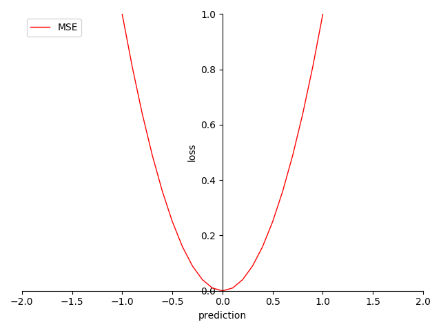

# 4.5.2 回归项-均方误差（MSE [Mean Squared Error]）

**迭代公式：**

$$
{\displaystyle 
 \begin{aligned}
   Loss = \frac{1}{N} \sum_{i = 1}^{N}(y_i-prediction_i)^2 \\
 \end{aligned}
}
$$

**图像：**

<center>
<figure>
   
    <figcaption>
      <p>图 4.5.2-1 MSE 函数图</p>
   </figcaption>
</figure>
</center>

**特性：**

1. 契合正态分布（Normal distribution）样本
2. 通过投影平面上的欧式距离，来衡量预测结果
3. 导数非常数，梯度迭代非线形
4. 光滑（smooth），适合优化算法
5. 非指数计算，算力消耗相对较低

**MSE 也被称为 L-2 损失（$$L_2$$ Loss）**，它相当于 MAE 的光滑版。虽然 MSE 常用于机器学习，但它既不是唯一实用的损失函数，也不是适用于所有情形的最佳损失函数。 MSE 从本质上是以极大似然估计，拟合正态分布。对于满足正态分布特性的样本数据，MSE 能相对得到满意的结果。但是对于非正态分布的问题，如：二分类，或更进一步的聚类分析，MSE 不能满足需求。MSE 常被用来做多对一正态分布样本集结果预测的损失函数使用。

MSE 和 MAE 对应差异主要是在于 **鲁棒性** 和 **收敛速度** 的权衡上，在使用条件上是类似的，根据情况选择使用。

## **MSE 算子化**

利用 C 语言实现对算子的封装，有：

```C
#include <math.h>
#include <stdio.h>

double mse(double *y_true, double *y_pred, int size) {
  double sum = 0;
  for (int i = 0; i < size; i++) {
    sum += pow(y_true[i] - y_pred[i], 2);
  }
  return sum / size;
}

int main() {
  int size = 3;
  double y_true[] = {0.5, 0.75, 1.0};
  double y_pred[] = {0.6, 0.8, 0.9};
  double mse_value = mse(y_true, y_pred, size);
  printf("The MSE is %f\n", mse_value);
  return 0;
}
```

运行验证可得到结果：

```C
The MSE is 0.033333
```


[ref]: References_4.md