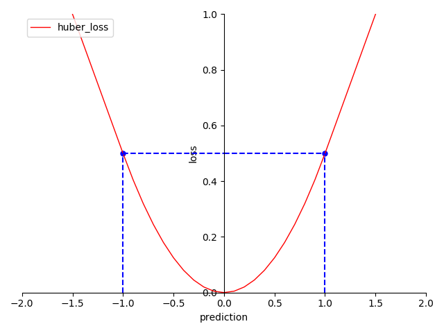

# 4.5.3 回归项-休伯损失（Huber Loss）

**迭代公式：**

$$
{\displaystyle 
 \begin{aligned}
   Loss = 
   \begin{cases}
     \frac{1}{N} \sum_{i = 1}^{N} [\frac{1}{2} \cdot (y_i-prediction_i)^2] \quad &  |y_i-prediction_i| \leq \delta \\
     \frac{1}{N} \sum_{i = 1}^{N}[\delta \cdot (|y_i-prediction_i| -\frac{1}{2}\delta) ] \quad &  |y_i-prediction_i| > \delta
   \end{cases} \\
 \end{aligned}
}
$$

**图像：**

<center>
<figure>
   
    <figcaption>
      <p>图 4.5.3-1 Huber Loss 函数图</p>
   </figcaption>
</figure>
</center>

**特性：**

1. 当绝对误差在 $$[ 0,\ \delta]$$ 时，契合正态分布（Normal distribution）
2. 当绝对误差在 $$( \delta,\ +\infty)$$ 时，契合拉普拉斯分布（Laplace distribution）
3. 当绝对误差小于 $$\delta$$ 时，它采用平方误差，导数非常数
4. 当绝对误差大于 $$\delta$$ 时，采用的线性误差，导数常数 $$\tfrac{\delta}{2}$$ 。
5. 光滑（smooth），适合优化算法
6. 非指数计算，算力消耗相对较低

**休伯损失（Huber Loss）** 实际上是基于 MAE 和 MSE 基础上，提出的一种兼容 MAE 与 MSE 各自优点的损失函数设计。

相比于 MSE 和 MAE，Huber Loss 的算力消耗没有太多的提升。相比于 MSE，Huber Loss 降低了 $$\delta$$ 半径外对离群值的惩罚；相比于 MAE，Huber Loss 提高了 $$\delta$$ 半径内回归的收敛速度。可以看出，Huber Loss 的效果首 $$\delta$$ 的选择影响较大。因此，使用它的时候，需要注意 $$\delta$$ 调参问题。

## **Huber Loss 算子化**

利用 C 语言实现对算子的封装，有：

```C
#include <math.h>
#include <stdio.h>

double huber_loss(double *y_true, double *y_pred, int size, double delta) {
  double sum = 0;
  for (int i = 0; i < size; i++) {
    double error = y_true[i] - y_pred[i];
    if (fabs(error) <= delta) {
      sum += 0.5 * pow(error, 2);
    } else {
      sum += delta * (fabs(error) - 0.5 * delta);
    }
  }
  return sum / size;
}

int main() {
  int size = 3;
  double y_true[] = {0.5, 0.75, 1.0};
  double y_pred[] = {0.6, 0.8, 0.9};
  double delta = 1.0;
  double huber_loss_value = huber_loss(y_true, y_pred, size, delta);
  printf("The Huber loss is %f\n", huber_loss_value);
  return 0;
}
```

运行验证可得到结果：

```C
The Huber loss is 0.033333
```


[ref]: References_4.md