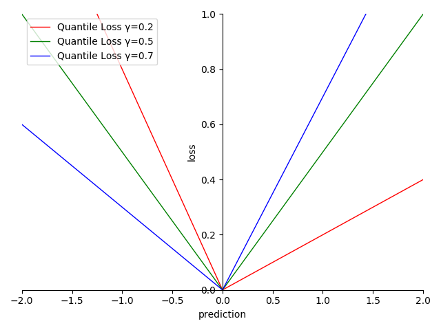
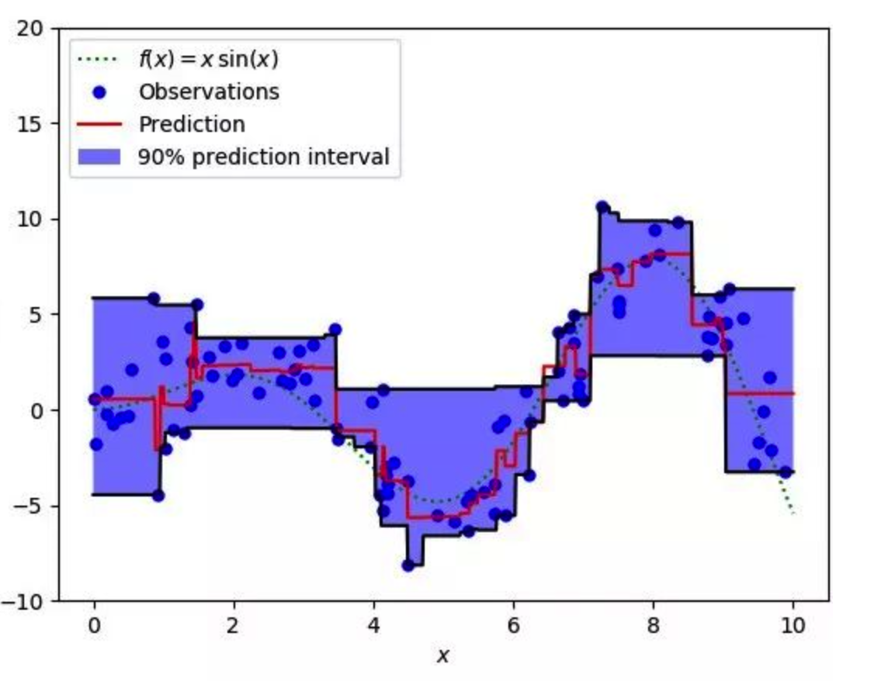

# 4.5.4 回归项-分位数损失（Quantile Loss）

**迭代公式：**

$$
{\displaystyle 
 \begin{aligned}
   Loss = 
   \begin{cases}
     \frac{1}{N} \sum_{i = 1}^{N} (1-\gamma) \cdot |y_i-prediction_i| \quad &  y_i < prediction_i \\
     \frac{1}{N} \sum_{i = 1}^{N} \gamma \cdot |y_i-prediction_i| \quad &  y_i \geq prediction_i
   \end{cases}\\
 \end{aligned}
}
$$

**图像：**

<center>
<figure>
   
    <figcaption>
      <p>图 4.5.4-1 Quantile Loss 函数图</p>
   </figcaption>
</figure>
</center>

<center>
<figure>
   
    <figcaption>
      <p>图 4.5.4-2 Quantile Loss 样本拟合示意图</p>
   </figcaption>
</figure>
</center>

**特性：**

1. 当预测值残差在 $$[ 0,\ +\infty)$$ 时，梯度为设定值 $$\gamma$$ 
2. 当预测值残差在 $$(-\infty ,\ 0)$$ 时，梯度为设定值 $$1- \gamma$$
3. 可通过 $$\gamma$$ 的设定，来有指向的调整模型结果，$$\gamma$$ 的可范围在 $$[ 0,\ 1]$$
4. 适用于区间预测，通过调整 $$\gamma$$ 范围覆盖预测区间
5. 非光滑（non-smooth）
6. 非指数计算，算力消耗相对较低

**分位数损失（Quantile Loss）** 是一种用于区间预测的损失函数。MAE、MSE、Huber 等损失函数，基于的是最小二乘法，默认预测实际值残差方差保持不变且相对独立。而以分位数损失作为损失函数的回归模型，对于具有变化方差或非正态分布的残差，也能给出合理的预测区间。

分位损失函数中，$$\gamma$$ 值代表对预测结果的预判程度：$$\gamma$$ 值 **越大**，对结果被低估的惩罚程度越高，即越容易被 **高估** ；$$\gamma$$ 值 **越小**，对结果被高估的惩罚程度越高，即越容易被 **低估**。在区间预测过程中，通过调整 $$\gamma$$ 取值范围，来实现对样本的覆盖，得到预测区间。

因为 Quantile Loss 的这种特性，常被用来做商业评估类型的回归模型。

## **Quantile Loss 算子化**

利用 C 语言实现对算子的封装，有：

```C
#include <math.h>
#include <stdio.h>

double quantile_loss(double *y_true, double *y_pred, int size, double q) {
  double sum = 0;
  for (int i = 0; i < size; i++) {
    double error = y_true[i] - y_pred[i];
    if (error > 0) {
      sum += q * error;
    } else {
      sum += (1 - q) * error;
    }
  }
  return sum / size;
}

int main() {
  int size = 3;
  double y_true[] = {0.5, 0.75, 1.0};
  double y_pred[] = {0.6, 0.8, 0.9};
  double q = 0.5;
  double quantile_loss_value = quantile_loss(y_true, y_pred, size, q);
  printf("The quantile loss is %f\n", quantile_loss_value);
  return 0;
}
```

运行验证可得到结果：

```C
The quantile loss is 0.083333
```


[ref]: References_4.md