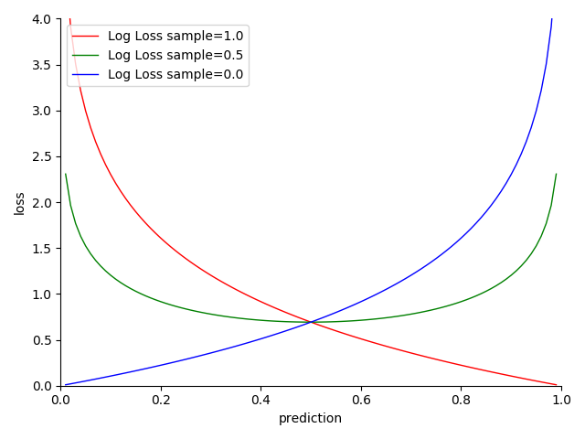

# 4.5.5 分类项-对数损失（Log Loss）

**迭代公式：**

$$
{\displaystyle 
 \begin{aligned}
   Loss = \frac{1}{N} \sum_{i=1}^N -y_i \cdot log(prediction_i)-(1-y_i) \cdot log(1-prediction_i) \\
 \end{aligned}
}
$$

**图像：**

<center>
<figure>
   
    <figcaption>
      <p>图 4-29 Log Loss 函数图</p>
   </figcaption>
</figure>
</center>

**特性：**

1. 契合逻辑分布（Logistic distribution）样本，拟合 Sigmoid 模型
2. 二分类下的交叉熵损失表现，二者本质等价 
3. 越接近目标，损失越小
4. 越趋近两极，结果越准确
5. 基于贝叶斯统计（Bayesian statistics），采用交叉熵估计
6. 光滑（smooth），适合优化算法
7. 对数计算，算力消耗相对较高

**对数损失（Log Loss）** 是一种利用最小化负对数似然，即交叉熵最小化，来进行逻辑回归的损失函数。实际上，Log Loss 相当于 **只包含两种分类** 情况下的交叉熵损失函数。其所适应逻辑分布样本集，我们认为只存在 **“是/否”两种情况** 的 **独热向量（one-hot vector）** 集合。对于此类样本集，我们一般采用 Sigmoid 将输出压缩到 $$[ 0,\ 1]$$ 范围内，以便于输出百分比估计结果，作为预测结果的置信水平。而从 Log Loss，我们不难看出，最小化交叉熵函数本质就是对数似然函数的最大化。

**注意，对数损失只能用来区分 “是/否” 为某个物体。** 

这一点在初学者首次接触时，容易与交叉熵损失搞混，从而选错分类项（比如目标是多分类检测）需要小心。

## **Log Loss 算子化**

利用 C 语言实现对算子的封装，有：

```C
#include <math.h>
#include <stdio.h>

double log_loss(double *y_true, double *y_pred, int size) {
  double sum =0;
  for (int i =0; i < size; i++) {
    sum += y_true[i] * log(y_pred[i]) + (1 - y_true[i]) * log(1 - y_pred[i]);
  }
  return -sum / size;
}

int main() {
  int size = 3;
  double y_true[] = {0.5, 0.75, 1.0};
  double y_pred[] = {0.6, 0.8, 0.9};
  double log_loss_value = log_loss(y_true, y_pred, size);
  printf("The log loss is %f, for object class 'apple'", log_loss_value);
  return 0;
}
```

运行验证可得到结果：

```C
The log loss is -0.056644, for object class 'apple'
```


[ref]: References_4.md