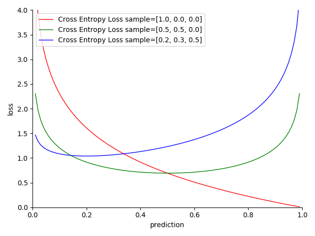

# 4.5.6 分类项-交叉熵损失（Cross Entropy Loss）

**迭代公式：**

$$
{\displaystyle 
 \begin{aligned}
   Loss = \frac{1}{N} \sum_{i=1}^N [\sum_{j=1}^k -y_j \cdot log(prediction_j)]_i \\
 \end{aligned}
}
$$

**图像：**

<center>
<figure>
   
    <figcaption>
      <p>图 4.5.6-1 Cross Entropy Loss 函数图</p>
   </figcaption>
</figure>
</center>

**特性：**

1. 契合逻辑分布（Logistic distribution）样本，拟合 Softmax 模型
2. 二分类下的交叉熵损失表现，二者本质等价 
3. 越接近目标，损失越小
4. 越趋近两极，结果越准确
5. 基于贝叶斯统计（Bayesian statistics），采用交叉熵估计
6. 光滑（smooth），适合优化算法
7. 对数计算，算力消耗相对较高

**交叉熵损失（CEL [Cross Entropy Loss]）** 是一种处理分布于高维同平面（K-Space）下独热向量（one-hot vector）样本集的聚类分析手段。交叉熵损失函数是一种为了 **配合 Softmax 激活函数** 的损失函数设计，**输出满足概率累和为 1**。这是因为交叉熵的本质，是试图用预测值来表示某个事件发生所需要的平均概率，从概念上，将事物可能发生的几率，和事物不可能发生的几率做了二元分割，即 Log Loss 实际上是 CEL 的最简表示形式。

所以，在使用交叉熵损失前，**最好** 先对参与交叉熵运算的所有同样本，**进行一次 Softmax 处理，以求尽可能保证估计值之和为 1**。

但是需要注意的是，**交叉熵损失本身，并不依赖于是否对输入概率进行了归一化**。也就是说，虽然可以进行估值之和大于 1 的输入处理，但本身会相对失去意义。因为，CEL 的结果越小，越说明分类估值准确性。非归一化输入只会干扰结果，从而影响模型准确。

## **Cross Entropy Loss 算子化**

利用 C 语言实现对算子的封装，有：

```C
#include <math.h>
#include <stdio.h>

double cross_entropy_loss(double *y_true, double *y_pred, int size, int num_classes) {
  double sum = 0;
  for (int i = 0; i < size; i++) {
    for (int j = 0; j < num_classes; j++) {
      sum += y_true[i * num_classes + j] * log(y_pred[i * num_classes + j]);
    }
  }
  return -sum / size;
}

int main() {
  int size = 3;
  double y_true[] = {0.5, 0.75, 1.0}; // single sample base 'cat' 'puppy' 'dog'
  double y_pred[] = {0.6, 0.8, 0.9};  // single sample pred 'cat' 'puppy' 'dog'
  int num_classes = 3;
  double loss_value = cross_entropy_loss(y_true, y_pred, size, num_classes);
  printf("The cross entropy loss is %f, for 'cat' 'puppy' 'dog' ", loss_value);
  return 0;
}
```

运行验证可得到结果：

```C
The cross entropy loss is 0.1982671, for 'cat' 'puppy' 'dog'
```

上面的代码中，展示了存在三类分类情况下，样本的输入分类和预测特征向量，皆未归一化会产生的结果。交叉熵损失仍然能使用，但不精确。


[ref]: References_4.md