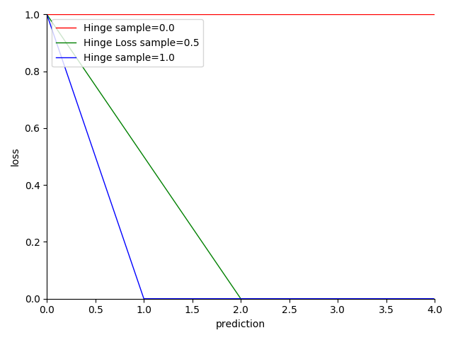

# 4.5.7 分类项-合页损失（Hinge Loss）

**迭代公式：**

$$
{\displaystyle 
 \begin{aligned}
   Loss = \frac{1}{N} \sum_{i=1}^N \max(0, 1-y_i \cdot prediction_i) \\
 \end{aligned}
}
$$

**图像：**

<center>
<figure>
   
    <figcaption>
      <p>图 4-31 Hinge Loss 函数图</p>
   </figcaption>
</figure>
</center>

**特性：**

1. 缺乏统计学理论支持，没有太好的概率解释
2. 样本值为 -1 或 1，预测值区间范围限定 $$[ -1,\ +1]$$ 之间
3. 一般情况下，会限定排除 $$|prediction| > 1$$ 的取值，因此对离群值有较好的健壮性
4. 越趋近于 0，结果越准确
5. 依赖决策边界驱动，通过决策边界移动分割样本集
6. 非光滑（non-smooth）
7. 线性处理便于计算

**合页损失（Hinge Loss）** 通常与 L-2 正则项一起使用，这正是 SVM 支持向量机模型采用的损失函数。Hinge Loss 对非超出驱动边界的满足条件预测给予偏离度惩罚，而对于离散值则直接进行忽略。因此，Hinge Loss 的健壮性比较强。

然而 Hinge Loss 所依赖的决策边界的处理方式更类似于经验划分。对于样本量不足的情况，Hinge Loss（实际上是对应的 SVM）常常会过拟合（Over-fitting）。所以，这种边界限定的方式，在深度学习中常被衍生为一种样本集的裁剪方式的小技巧（trick）来使用。

此外，在概率，尤其是贝叶斯学派看来，Hinge Loss 并不足够合理。贝叶斯学派认为，概率应该用来量化不确定性，而 Hinge Loss 则是一种确定性的损失函数。因此，Hinge Loss 并不完全符合贝叶斯学派的观点。

不过，因果推断方面的领军人物 **朱迪亚·珀尔（Judea Pearl）** 在其著作《Causality》中阐述了他早期作为贝叶斯学派支持者对于 SVM 的看法。他认为，SVM 是一种经验风险最小化（ERM）方法，它并不依赖于概率模型。因此，Hinge Loss 虽然不完全符合概率，但也并不违背贝叶斯学派的基本原则。

## **Hinge Loss 算子化**

利用 C 语言实现对算子的封装，有：

```C
#include <math.h>
#include <stdio.h>

double hinge_loss(double *y_true, double *y_pred, int size) {
  double sum = 0;
  for (int i = 0; i < size; i++) {
    double margin = 1 - y_true[i] * y_pred[i];
    sum += fmax(0, margin);
  }
  return sum / size;
}

int main() {
  int size = 4;
  double y_true[] = {0.5, 0.75, 1.0, 1.0};
  double y_pred[] = {0.6, 0.8, 0.9, 0.3};
  double hinge_loss_value = hinge_loss(y_true, y_pred, size);
  printf("The hinge loss is %f\n", hinge_loss_value);
  return 0;
}
```

运行验证可得到结果：

```C
The hinge loss is 0.250000
```


[ref]: References_4.md